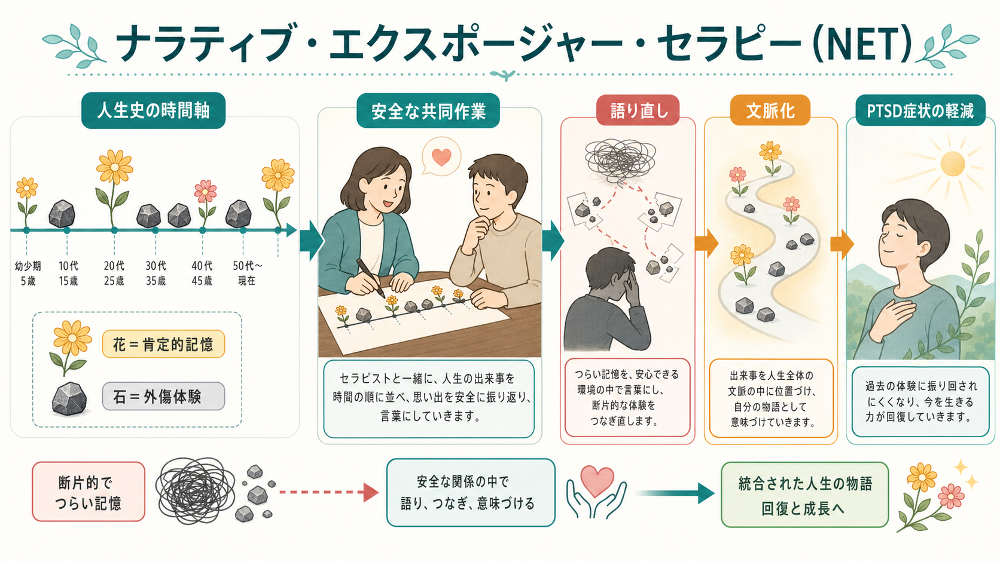
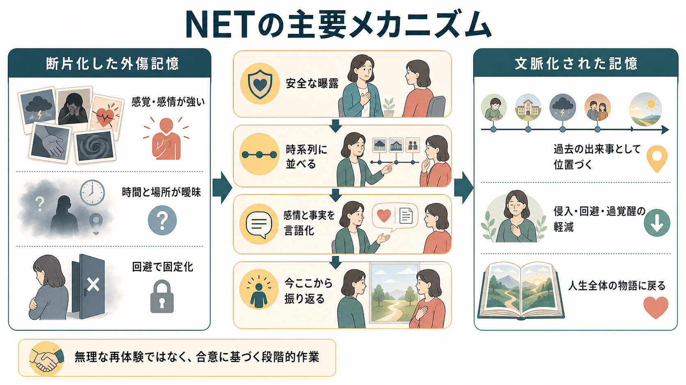
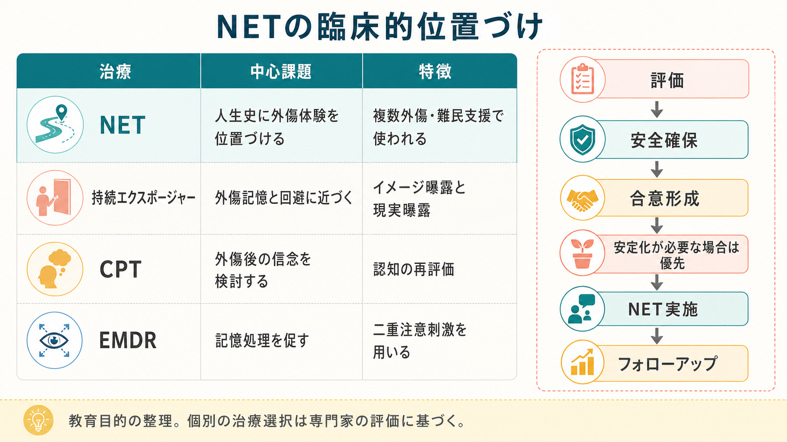

# ナラティブ・エクスポージャー・セラピーとは何か

## 要点

- ナラティブ・エクスポージャー・セラピー（Narrative Exposure Therapy: NET）は、外傷体験を人生史の時間軸の中に位置づけ、断片化しやすい外傷記憶を「過去の出来事」として文脈化していく、短期のトラウマ焦点化心理療法である[1]。
- NETは、[[曝露療法とは何か|曝露]]、証言療法、人生史の再構成を組み合わせる。単一の外傷だけを切り出すのではなく、生まれてから現在までのライフライン上に肯定的出来事と外傷体験を並べ、各外傷体験を安全な治療関係の中で詳しく語る[1][2]。
- 難民、戦争、拷問、組織的暴力、複数外傷を経験した人々を対象に発展し、成人版 NET、子ども・青年向け KIDNET、加害経験を含む FORNET などが検討されている[3][4]。
- 研究では、PTSD症状の軽減に有望な結果が示されているが、研究の異質性、比較対象、地域・文化・実装条件の違いには注意が必要である[4][5]。
- このノートは教育・研究目的の整理であり、個別の診断や治療選択は、訓練を受けた専門家による評価、同意、安全確保、スーパービジョンに基づいて行う必要がある[6][7]。

## この記事で答える問い

1. NETは、どのような心理療法なのか。
2. なぜ「人生史」と「語り」がPTSD症状の治療に関わるのか。
3. NETは、持続エクスポージャー、CPT、EMDRなどのPTSD治療と何が違うのか。
4. 研究では、NETの効果はどこまで示されているのか。
5. 臨床で使うとき、どのような安全上・倫理上の注意が必要なのか。

## まず結論

NETは、「外傷を忘れさせる治療」ではない。むしろ、外傷体験を避け続けることで現在にも侵入してくる記憶を、本人の人生全体の文脈の中に置き直す治療である。治療者と本人は、人生の時間軸を作り、肯定的な出来事を「花」、外傷的な出来事を「石」として配置しながら、外傷体験を順に語っていく[1]。

PTSDでは、外傷記憶が「いつ、どこで終わった出来事なのか」と結びつきにくく、感覚、身体反応、恐怖、恥、怒り、罪悪感が現在の脅威のように再活性化することがある。NETは、外傷記憶を避けずに、しかし安全と同意を保ちながら、時間・場所・感情・身体反応・意味づけを言葉にしていく。これにより、記憶そのものを消すのではなく、「過去に起きた出来事として取り出せる」状態を目指す[1][6]。

## 背景

NETは、戦争、拷問、迫害、難民化、組織的暴力のように、外傷体験が一回ではなく複数回・長期間にわたる文脈で発展した。こうした状況では、通常の専門医療資源が乏しく、治療者、通訳、支援者、地域スタッフが限られることも多い。NETは、そのような現場でも使えるよう、短期で構造化され、トレーニングとスーパービジョンのもとで実施しやすい治療として設計された[1][2]。

初期のランダム化比較試験では、ウガンダの難民居住地に暮らすスーダン難民を対象に、4セッションのNET、支持的カウンセリング、心理教育が比較された。1年後にPTSD診断を満たしていた割合は、NET群で29%、支持的カウンセリング群で79%、心理教育群で80%と報告され、危険が残る環境でも短期介入が有望である可能性を示した[2]。

ただし、ここから「NETはあらゆるPTSDに常に最善」と結論するのは早い。PTSD治療では、トラウマ焦点化CBT、持続エクスポージャー、認知処理療法、EMDRなど、複数のエビデンスに基づく選択肢がある。NICEは成人PTSDに対して、トラウマ焦点化CBTの一形態としてNETを含め、マニュアル化、訓練、スーパービジョン、安全計画、外傷記憶の精緻化、回避の克服、生活機能の回復を重視している[6]。

## 基本概念

### ライフライン

NETの中心道具はライフラインである。本人の人生を出生から現在までの時間軸として並べ、肯定的・資源的な出来事を花、外傷的な出来事を石として置く。これは単なる年表ではない。外傷だけが人生全体を代表してしまう状態から、外傷も含めた人生の連続性を回復するための作業である[1]。

### 語りと証言

NETでは、外傷体験を避けるのではなく、出来事の前後、時間、場所、感覚、身体反応、思考、感情、意味づけを、治療者の支えのもとで詳細に語る。治療者は語りを記録し、セッションを重ねて一貫した人生史の文書を作ることがある[1]。この文書は、臨床的には記憶の文脈化を助け、社会的・人権的文脈では証言としての意味を持つ場合もある。

### 外傷記憶の文脈化

NETの理論的発想では、PTSDでは外傷体験の感覚的・情動的記憶が強く残る一方で、時間、場所、前後関係、言語的意味づけとの結合が弱くなりやすい。結果として、匂い、音、身体感覚、対人場面などが手がかりになり、過去の記憶が現在の危険のように再活性化する[1]。この点は、[[PTSDでは恐怖記憶ネットワークに何が起きているのか]]や[[扁桃体過活動は不安症やPTSDにどう関わるのか]]と接続して理解しやすい。

### 複数外傷への焦点

持続エクスポージャーでは、主要な外傷記憶を選んでイメージ曝露を行うことが多い。一方、NETは人生史全体の中に複数の外傷体験を置くため、戦争、難民化、家庭内暴力、幼少期虐待、迫害などが重なった人にも適用しやすい構造を持つ[1][4]。これは[[複雑性PTSDとは何か]]や[[精神疾患とトラウマ反応はどう関係するのか]]で扱う、長期・反復的な外傷反応の理解とも関係する。

## 仕組み

NETの仕組みは、少なくとも三つの層で考えられる。

第一に、曝露である。本人は、外傷記憶に関連する感覚、身体反応、感情、思考に近づく。これは苦痛を増やすためではなく、回避によって固定された「語れない記憶」を、安全な治療関係の中で扱える記憶へ変えていくためである[1][6]。

第二に、時間軸への配置である。外傷体験は「今も続いている脅威」として体験されやすい。NETでは、出来事がいつ始まり、何が起き、どこで終わり、現在はどこにいるのかを繰り返し確認する。これにより、記憶が現在から切り離され、過去の出来事として位置づきやすくなる[1]。

第三に、人生全体の物語への統合である。外傷は本人の人生を深く変えるが、人生の全体が外傷だけで構成されるわけではない。NETでは、外傷体験だけでなく、家族、移動、喪失、学び、支援、希望、価値、回復の出来事も同じ時間軸に置く。これは「前向きに考える」ことを求めるのではなく、外傷が人生全体を独占しないようにする作業である[1]。

## 図解

図1は、NETを「ライフライン」「花と石」「安全な共同作業」「文脈化」という全体像で整理している。図2は、断片化した外傷記憶が、曝露、時系列化、言語化、現在からの振り返りを通して、文脈化された記憶へ移行する流れを示している。

図3は、NETをPTSD心理療法の中で位置づけるための比較である。NETは外傷記憶に近づく点で[[曝露療法とは何か]]やトラウマ焦点化CBTと重なるが、人生史全体を扱う点に特徴がある。CPTは外傷後の信念や意味づけの検討を強く扱い、EMDRは二重注意刺激を用いた記憶処理を重視する。どれか一つが常に優れているというより、症状、外傷歴、希望、文化的背景、治療資源、リスクに応じて選択する[6][7]。

## 臨床・研究との接続

### 成人の研究

NETの研究は、難民、戦争被害、拷問、地域紛争、暴力被害など、重い外傷曝露を持つ集団で多く行われてきた。初期RCTは、少数例ながらNETが支持的カウンセリングや心理教育よりPTSD診断の残存を減らす可能性を示した[2]。その後のメタ分析では、RCTを含む複数研究を統合し、NET群でPTSD症状や抑うつ症状の改善がみられる一方、研究の質や異質性に注意が必要だとされた[4]。

別の系統的レビュー・メタ分析では、30か国56研究、NETを受けた1370名と対照1055名が含まれ、PTSD症状の軽減についてNETに有利な効果が報告された。RCTかつ能動的対照との比較では、短期効果は小から中程度、長期効果は大きい可能性が示されたが、高所得国の標準的医療システムで他のエビデンスに基づくトラウマ焦点化治療と直接比較する研究はなお必要だとされている[5]。

### 子ども・青年へのKIDNET

子ども・青年向けのKIDNETでは、難民の子どもを対象にしたRCTが報告されている。7〜16歳の難民児童26名をKIDNETと待機群に割り付けた研究では、KIDNET群でPTSD関連指標と機能の改善がみられ、12か月後にも維持されたと報告された[3]。ただし、対象数は小さく、発達段階、保護者支援、学校・地域資源、安全状況を含めた検討が不可欠である。

### ガイドライン上の位置づけ

NICEのPTSDガイドラインは、成人PTSDに対する個人トラウマ焦点化CBTの選択肢として、認知処理療法、PTSDに対する認知療法、NET、持続エクスポージャーを挙げている[6]。WHOのストレス関連状態ガイドラインも、PTSDや急性外傷ストレス症状に対し、心理的応急処置、トラウマ焦点化CBT、EMDRなどを文脈に応じて検討する枠組みを示している[7]。

ここで重要なのは、NETが「誰にでもすぐ外傷を語らせる方法」ではないことである。現在も暴力が続いている、住居・法的保護・医療アクセスが不安定である、自殺リスクや重い解離がある、物質使用や精神病症状が急性に悪化している、といった場合は、安全確保、安定化、危機対応、支援資源への接続が優先されることがある[6][7]。これは[[トラウマ歴はどのように聞くべきか]]や[[ケースフォーミュレーションとは何か]]の実践と切り離せない。

## よくある誤解

### 誤解1: NETは「つらい記憶を何度も話させるだけ」の治療である

NETでは外傷記憶を詳しく扱うが、それは罰や我慢ではない。治療者は、同意、ペース、安全、現在への定位、身体反応の観察、セッション後の安定化を支える。目的は、外傷記憶を現在の脅威として再体験し続ける状態から、過去の出来事として文脈化できる状態へ移すことである[1][6]。

### 誤解2: ライフラインを作れば自然に治療になる

ライフラインは道具であって、治療そのものではない。外傷記憶への曝露、情動処理、言語化、治療関係、安全計画、終結後の支援が組み合わさって初めて臨床的意味を持つ。専門的訓練なしに、外傷体験の詳細を急いで聞き出すことは再外傷化につながりうる[6][7]。

### 誤解3: NETは難民だけの治療である

NETは難民や戦争被害者を対象に発展したが、複数外傷を持つ成人、子ども、暴力被害者、加害経験を含む集団などにも研究が広がっている[4][5]。ただし、文化、言語、通訳、法的立場、家族関係、現在の安全状況によって実施条件は大きく変わる。

### 誤解4: 症状が重いほど、早く外傷記憶に入るべきである

症状の重さは、外傷処理を急ぐ理由にはならない。自殺リスク、解離、睡眠、物質使用、精神病症状、現在の暴力、医療・住居・法的安全の問題がある場合、まず安定化や危機対応を優先することがある[6][7]。NETを含むトラウマ焦点化治療は、本人と治療者が合意し、必要な支援体制を整えたうえで進める。

## 関連ノート

既存ノート:

- [[PTSDとは何か]]
- [[複雑性PTSDとは何か]]
- [[PTSDでは恐怖記憶ネットワークに何が起きているのか]]
- [[精神疾患とトラウマ反応はどう関係するのか]]
- [[トラウマ歴はどのように聞くべきか]]
- [[曝露療法とは何か]]
- [[認知行動療法CBTとは何か]]
- [[心理療法とは何か]]
- [[解離とは何か]]
- [[ケースフォーミュレーションとは何か]]
- [[共同意思決定とは何か]]

今後の作成候補:

- 持続エクスポージャー療法PEとは何か
- 認知処理療法CPTとは何か
- EMDRとは何か
- トラウマ焦点化CBTとは何か
- KIDNETとは何か

MOC更新候補:

- `content/00_MOC/MOC｜臨床実践・治療.md` の心理療法・トラウマ焦点化治療セクションに追加。
- `content/00_MOC/MOC｜精神医学.md` のPTSD・トラウマ関連ノート群に追加。

## 理解チェック

1. NETでライフラインを作る目的は、外傷体験をどのように位置づけ直すことか。
2. NETにおける「花」と「石」は、それぞれ何を表すか。
3. NETが単なる回想や雑談ではなく、トラウマ焦点化心理療法である理由は何か。
4. 持続エクスポージャー、CPT、EMDRと比べたとき、NETの特徴はどこにあるか。
5. NETを開始する前に、安全確保や安定化を優先すべき状況には何があるか。

## 未解決問題

- NETと他のエビデンスに基づくPTSD心理療法を、同じ医療システム内で直接比較した研究はまだ十分ではない[5]。
- どの患者群で、人生史全体を扱うNETが、単一外傷に焦点化する治療より適しているのかは、症状、外傷歴、文化的背景、治療資源を含めて検討が必要である。
- 通訳、非専門職支援者、遠隔支援、難民キャンプ、司法・人権支援との連携において、治療忠実性と安全性をどう保つかは実装上の重要課題である。
- 複雑性PTSD、強い解離、現在進行形の暴力、重い併存症を持つ人に対して、安定化と外傷処理をどの順序で組み合わせるかは、今後も研究と臨床判断が必要である。

## 参考文献

[1] Schauer, M., Neuner, F., & Elbert, T. (2011). *Narrative Exposure Therapy: A Short-Term Treatment for Traumatic Stress Disorders* (2nd rev. ed.). Hogrefe. https://books.google.com/books/about/Narrative_Exposure_Therapy.html?id=Eag_YgEACAAJ

[2] Neuner, F., Schauer, M., Klaschik, C., Karunakara, U., & Elbert, T. (2004). A comparison of narrative exposure therapy, supportive counseling, and psychoeducation for treating posttraumatic stress disorder in an African refugee settlement. *Journal of Consulting and Clinical Psychology, 72*(4), 579-587. https://doi.org/10.1037/0022-006X.72.4.579

[3] Ruf, M., Schauer, M., Neuner, F., Catani, C., Schauer, E., & Elbert, T. (2010). Narrative exposure therapy for 7- to 16-year-olds: A randomized controlled trial with traumatized refugee children. *Journal of Traumatic Stress, 23*(4), 437-445. https://doi.org/10.1002/jts.20548

[4] Raghuraman, S., Stuttard, N., & Hunt, N. (2021). Evaluating narrative exposure therapy for post-traumatic stress disorder and depression symptoms: A meta-analysis of the evidence base. *Clinical Psychology & Psychotherapy, 28*(1), 1-23. https://doi.org/10.1002/cpp.2486

[5] Siehl, S., Robjant, K., & Crombach, A. (2021). Systematic review and meta-analyses of the long-term efficacy of narrative exposure therapy for adults, children and perpetrators. *Psychotherapy Research, 31*(6), 695-710. https://doi.org/10.1080/10503307.2020.1847345

[6] National Institute for Health and Care Excellence. (2018). *Post-traumatic stress disorder* (NICE guideline NG116). https://www.nice.org.uk/guidance/ng116/chapter/1-Recommendations

[7] World Health Organization. (2013). *Guidelines for the management of conditions specifically related to stress*. https://www.who.int/publications/i/item/9789241505406

## 更新ログ

- 2026-04-28: 初版作成。NETの基本概念、仕組み、研究知見、臨床上の注意、関連ノート候補、画像リンクを整理。
