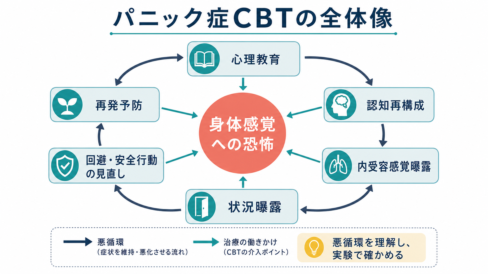
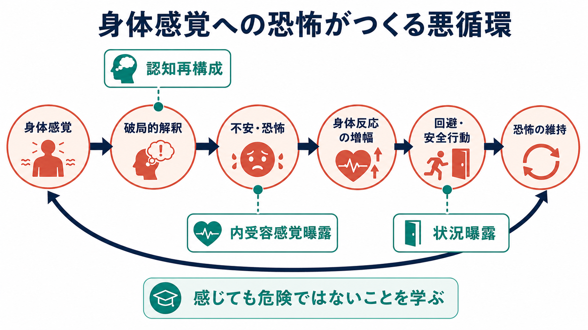
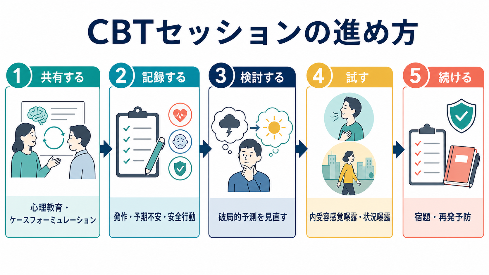

# パニック症のCBTでは何を行うのか

## 要点

- パニック症のCBTは、[[パニック発作とは何か|パニック発作]]を「危険な身体異常」ではなく、身体感覚、破局的解釈、恐怖反応、[[回避行動とは何か|回避行動]]がつくる悪循環として理解し直す治療である[1][3]。
- 中核作業は、心理教育、[[ケースフォーミュレーションとは何か|ケースフォーミュレーション]]、発作記録、認知再構成、内受容感覚曝露、状況曝露、安全行動の見直し、再発予防である[1][4]。
- 身体感覚そのものを消すことではなく、「動悸や息苦しさを感じても破局的な結果には直結しない」という新しい学習を増やすことが目標になる[3][5][6]。
- NICE は成人のパニック症に対してCBTを推奨し、通常は合計7-14時間、週1回1-2時間、4か月以内に行う形を示している[1]。
- 本稿は教育・研究目的の概説であり、個別の診断や治療指示ではない。胸痛、失神、強い呼吸困難など身体疾患が疑われる症状は、心理的説明だけで扱わず医学的評価を優先する。

## この記事で答える問い

1. パニック症のCBTは、セッションで具体的に何をするのか。
2. なぜ身体感覚への曝露や状況曝露が重要なのか。
3. 認知再構成は「気の持ちよう」や説得と何が違うのか。
4. 回避行動・安全行動をどのように扱うのか。
5. 臨床で注意すべき限界や誤解は何か。

## まず結論

パニック症のCBTでは、発作を直接「止める」練習だけをするわけではない。むしろ、発作への恐怖を維持している学習を調べ、身体感覚や避けている状況に安全な形で近づき、「予測した破局は起きなかった」「不安は上がっても下がる」「安全行動なしでも対処できる」という経験を積む。

そのため、CBTは説明、記録、検討、実験、宿題の組み合わせで進む。心理教育で悪循環を共有し、発作の前後に何を予測し、何を避け、どの安全行動でしのいでいるかを整理する。次に、動悸、息苦しさ、めまい、ふらつきなど恐れている身体感覚を、内受容感覚曝露によってあえて短時間つくり、安全に観察する。さらに、電車、会議、運転、外出、人混みなど避けてきた状況へ段階的に近づく[1][5]。

## 背景

[[パニック症とは何か|パニック症]]では、突然の強い恐怖や身体症状だけでなく、「また起きるのではないか」という[[予期不安とは何か|予期不安]]、発作の結果への恐怖、外出や移動の制限が問題になる。発作そのものは短時間でおさまっても、発作を恐れて生活範囲が狭くなると、仕事、学業、家庭、受診行動、対人関係への影響が大きくなる。

CBTが焦点を当てるのは、この二次的な悪循環である。Clark の認知モデルでは、パニック発作は身体感覚の破局的誤解釈によって増幅されると考える。たとえば動悸を「心臓発作の前兆」、息苦しさを「窒息する」、ふらつきを「倒れてしまう」と読むと、不安と自律神経反応がさらに強くなり、その身体反応がまた危険の証拠に見えてしまう[3]。

心理療法のエビデンスでは、パニック症に対する心理療法のなかでCBTは最も研究数が多い。Cochrane のネットワークメタ解析では、CBTは他の心理療法よりしばしば良好な結果を示すが、治療間の優劣を断定できるほど一貫して高精度な証拠ではないとも整理されている[2]。したがって、CBTを「唯一の正解」としてではなく、患者の希望、併存症、治療アクセス、薬物療法との関係を含めて位置づける必要がある。

## 基本概念

### 心理教育

心理教育では、パニック発作を「本当に危険な出来事」ではなく「身体の警報システムが過敏に作動した状態」として説明する。ただし、身体疾患の可能性を無視するという意味ではない。医学的評価が必要な症状を確認したうえで、通常の不安反応としての動悸、発汗、息苦しさ、めまい、しびれ、非現実感などが、どのように恐怖と結びつくかを共有する[1][7]。

この段階では、本人の体験を否定しないことが重要である。「危険ではないから気にしないでよい」ではなく、「強く感じられる身体感覚が、どのような予測と結びつくと発作として増幅するのか」を一緒に観察する。

### ケースフォーミュレーション

ケースフォーミュレーションでは、個人ごとの悪循環を図式化する。たとえば次のように整理する。

| 観点 | 確認する内容 | 例 |
|---|---|---|
| きっかけ | 発作が起きやすい状況、身体状態、ストレス | 睡眠不足、電車、会議、運動後 |
| 身体感覚 | 恐怖の対象になる感覚 | 動悸、息苦しさ、ふらつき |
| 解釈 | その感覚をどう読むか | 心臓発作、窒息、失神、発狂 |
| 行動 | 何を避け、何をしてしのぐか | 途中下車、水を持つ、出口近くに座る |
| 結果 | 短期的な安心と長期的な維持 | 安心するが、次回も怖くなる |

ここで重要なのは、「発作を起こす性格」ではなく「維持されている学習」を扱うことである。悪循環が見えると、CBTの各技法が単なる課題ではなく、仮説を確かめる行動実験として意味づけられる。

### 認知再構成

認知再構成では、「考え方を前向きにする」のではなく、発作時の予測を検証可能な仮説として扱う。たとえば「息苦しさが出たら窒息する」という予測について、過去の発作で何分続いたか、実際に酸素不足の証拠があったか、医療機関で何を確認したか、同じ感覚が運動や階段で起きたときはどうだったかを検討する。

認知再構成は曝露と切り離されない。紙の上で納得しても、身体感覚が出た瞬間には旧い予測が戻ることがある。そこで、認知再構成で作った仮説を、内受容感覚曝露や状況曝露で試す。

### 内受容感覚曝露

内受容感覚曝露は、動悸、息切れ、めまい、熱感、ふらつきなど、恐れている身体感覚を安全な範囲で意図的につくり、観察し直す方法である。代表例には、短時間のその場足踏み、階段昇降、過呼吸に近い呼吸課題、椅子での回転、息止めなどがある。ただし、身体疾患、妊娠、てんかん、心肺機能、薬物・物質使用、摂食状態などによって適否が変わるため、臨床では安全確認が不可欠である[5]。

目的は「慣れる」だけではない。むしろ「動悸が出ても心臓発作ではなかった」「ふらついても倒れなかった」「不快だが耐えられ、自然に下がった」という新しい情報を増やすことにある。これは曝露療法を抑制学習として捉える見方とも合う[6]。

### 状況曝露

状況曝露では、避けている場所や活動に段階的に近づく。電車、バス、高速道路、映画館、美容室、会議、店の行列、ひとりでの外出など、本人にとって「逃げにくい」「助けが得にくい」と感じられる状況が対象になりやすい。

曝露課題は、単に難しい場所に行くことではない。事前に「何が起きると予測しているのか」「どの安全行動を使わずに試すのか」「結果をどう記録するのか」を決める。これにより、状況曝露は苦行ではなく、予測と結果のずれを学ぶ実験になる。

## 仕組み

### 悪循環を止めるのではなく、別の学習を足す

CBTの作用は、「恐怖を完全に消す」というより、「恐怖があっても別の意味づけと行動が可能になる」こととして理解しやすい。発作時には、身体感覚への注意が高まり、危険解釈が強まり、確認や回避が増える。これを直接止めようとすると、かえって身体感覚の監視が強くなることがある。

そこでCBTでは、身体感覚や状況を避けずに観察し、予測を確かめる。予測した破局が起きない経験を反復すると、「感覚がある = 危険」という結びつきが弱まり、「感覚があっても行動を続けられる」という学習が増える[3][6]。

### 安全行動を少しずつ外す

安全行動とは、不安を下げるために行うが、長期的には恐怖を維持しうる行動である。たとえば、出口の近くに座る、水や薬を過剰に確認する、常に同伴者を求める、脈を測る、呼吸を過度に制御する、いつでも逃げられる予定だけを組む、といった行動がある。

安全行動は本人を守ってきた面もあるため、いきなり「やめるべき」と扱うと治療同盟を損なう。CBTでは、その行動が何を可能にし、何を学びにくくしているかを一緒に検討し、段階的に外す。たとえば「水を持たずに電車に乗る」ではなく、まず「水を持つが飲まずに10分乗る」「出口近くではない席で1駅乗る」のように調整する。

## 図解

上の3枚の図は、それぞれ次の役割を持つ。

| 図 | 読み方 |
|---|---|
| 1枚目 | パニック症CBTの全体像。心理教育、認知再構成、曝露、回避・安全行動の見直し、再発予防が連動する。 |
| 2枚目 | 身体感覚への恐怖が悪循環をつくる仕組み。CBTは「身体感覚」「解釈」「回避」の複数地点に介入する。 |
| 3枚目 | セッションの流れ。共有、記録、検討、試行、継続という順序で、面接内作業と宿題を接続する。 |

## 臨床・研究との接続

### セッションでの進め方

典型的な流れは、初期に評価と心理教育を行い、中期に認知再構成と曝露を組み合わせ、終盤に再発予防を扱う形である。NICE は、成人のパニック症でCBTを用いる場合、経験的に裏づけられた治療プロトコルに沿い、適切な訓練とスーパービジョンを受けた治療者が行うことを求めている[1]。

実践では、毎回のセッションでホームワークを確認し、発作・予期不安・回避・安全行動の記録をもとに次の行動実験を設計する。宿題は補助課題ではなく、治療の中心である。パニック症の恐怖は日常場面で維持されているため、面接室内の理解だけでは変化が限定されやすい。

### どの要素が重要か

CBTの構成要素を分解して検討したレビューでは、心理教育、認知再構成、曝露、呼吸法・リラクセーション、宿題などの組み合わせが検討されている。Pompoli らの成分ネットワークメタ解析は、CBTが単一技法ではなく複数要素の組み合わせであること、また各要素の相対的寄与にはまだ不確実性が残ることを示している[4]。

そのため、臨床では「内受容感覚曝露だけ」「認知再構成だけ」と固定的に考えるより、個人の維持因子に合わせて要素を組み合わせる。身体感覚への恐怖が中心なら内受容感覚曝露、逃げにくい状況の回避が中心なら状況曝露、破局的予測が強いなら認知再構成と行動実験を厚くする。

### 薬物療法や他の支援との関係

CBTは薬物療法と競合するものではない。症状の重さ、併存するうつ病や他の不安症、本人の希望、過去の治療歴、利用可能な資源によって、薬物療法、自助、家族支援、職場・学校調整と組み合わせることがある。重要なのは、どの介入を選ぶ場合でも、発作への恐怖と回避が生活をどのように狭めているかを評価し続けることである[1][2]。

## よくある誤解

### 誤解1: CBTは「気のせい」と説明する治療である

違う。CBTは身体感覚が実在することを前提にする。動悸、息苦しさ、めまい、発汗は本人にとって現実の体験である。焦点は、その感覚をどのように危険と解釈し、どの行動で維持しているかにある。

### 誤解2: 曝露は怖いことを無理にやらせる技法である

適切な曝露は、同意、説明、安全確認、段階づけ、振り返りを伴う。いきなり強い課題を課すことではなく、本人が何を予測し、何を確かめたいのかを明確にして実験する。

### 誤解3: 呼吸法で発作を止めることがCBTの中心である

呼吸法やリラクセーションが役立つ場面はあるが、それだけに依存すると「呼吸を制御できないと危険」という安全行動になることがある。パニック症CBTの中心は、身体感覚を完全に制御することではなく、身体感覚があっても危険ではないと学ぶことである。

### 誤解4: 発作が完全に消えないと回復ではない

回復の重要な指標は、発作の有無だけではない。予期不安が下がる、回避が減る、外出や仕事が戻る、身体感覚への注意が柔軟になる、安全行動なしで過ごせる範囲が増える、といった変化も重要である。

## 関連ノート

- [[パニック症とは何か]]
- [[パニック発作とは何か]]
- [[予期不安とは何か]]
- [[回避行動とは何か]]
- [[ケースフォーミュレーションとは何か]]
- [[不安症群とは何か]]
- [[不安とは何か]]
- [[回避学習とは何か]]
- [[感情は身体感覚の予測なのか]]
- [[身体と感情はどのようにつながるのか]]
- [[MOC｜臨床実践・治療]]
- [[MOC｜精神医学]]

MOC更新候補: `content/00_MOC/MOC｜臨床実践・治療.md`、`content/00_MOC/MOC｜精神医学.md`。並列生成ジョブとの競合を避けるため、本稿ではMOC本体は更新しない。

## 理解チェック

1. パニック症のCBTで、身体感覚を「消す」ことよりも「危険ではないと学ぶ」ことが重視される理由を説明できるか。
2. 内受容感覚曝露と状況曝露の違いを、具体例で説明できるか。
3. 安全行動が短期的には助けになり、長期的には恐怖を維持しうる理由を説明できるか。
4. 認知再構成が単なる励ましや説得ではなく、行動実験と結びつく理由を説明できるか。
5. 身体疾患の評価を軽視してはいけない場面を挙げられるか。

## 参考文献

[1] National Institute for Health and Care Excellence. (2011, last reviewed 2024). *Generalised anxiety disorder and panic disorder in adults: management* (Clinical guideline CG113). https://www.nice.org.uk/guidance/cg113

[2] Pompoli, A., Furukawa, T. A., Imai, H., Tajika, A., Efthimiou, O., & Salanti, G. (2016). Psychological therapies for panic disorder with or without agoraphobia in adults: a network meta-analysis. *Cochrane Database of Systematic Reviews*, 2016(4), CD011004. https://doi.org/10.1002/14651858.CD011004.pub2

[3] Clark, D. M. (1986). A cognitive approach to panic. *Behaviour Research and Therapy, 24*(4), 461-470. https://doi.org/10.1016/0005-7967(86)90011-2

[4] Pompoli, A., Furukawa, T. A., Efthimiou, O., Imai, H., Tajika, A., & Salanti, G. (2018). Dismantling cognitive-behaviour therapy for panic disorder: a systematic review and component network meta-analysis. *Psychological Medicine, 48*(12), 1945-1953. https://doi.org/10.1017/S0033291717003919

[5] Lee, K., Noda, Y., Nakano, Y., Ogawa, S., Kinoshita, Y., Funayama, T., & Furukawa, T. A. (2006). Interoceptive hypersensitivity and interoceptive exposure in patients with panic disorder: specificity and effectiveness. *BMC Psychiatry, 6*, 32. https://doi.org/10.1186/1471-244X-6-32

[6] Craske, M. G., Treanor, M., Conway, C. C., Zbozinek, T., & Vervliet, B. (2014). Maximizing exposure therapy: an inhibitory learning approach. *Behaviour Research and Therapy, 58*, 10-23. https://doi.org/10.1016/j.brat.2014.04.006

[7] Craske, M. G., Stein, M. B., Eley, T. C., Milad, M. R., Holmes, A., Rapee, R. M., & Wittchen, H.-U. (2017). Anxiety disorders. *Nature Reviews Disease Primers, 3*, 17024. https://doi.org/10.1038/nrdp.2017.24
