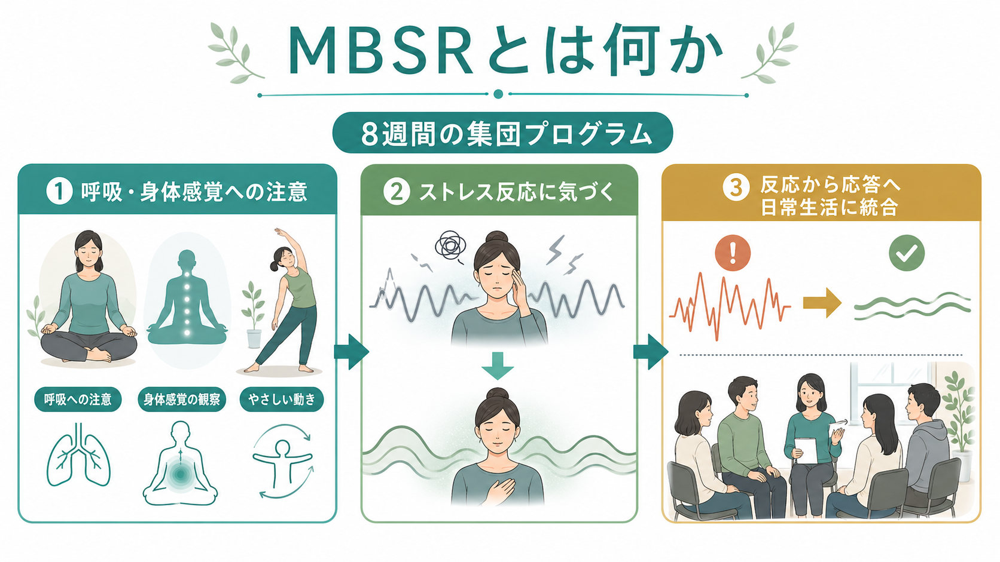
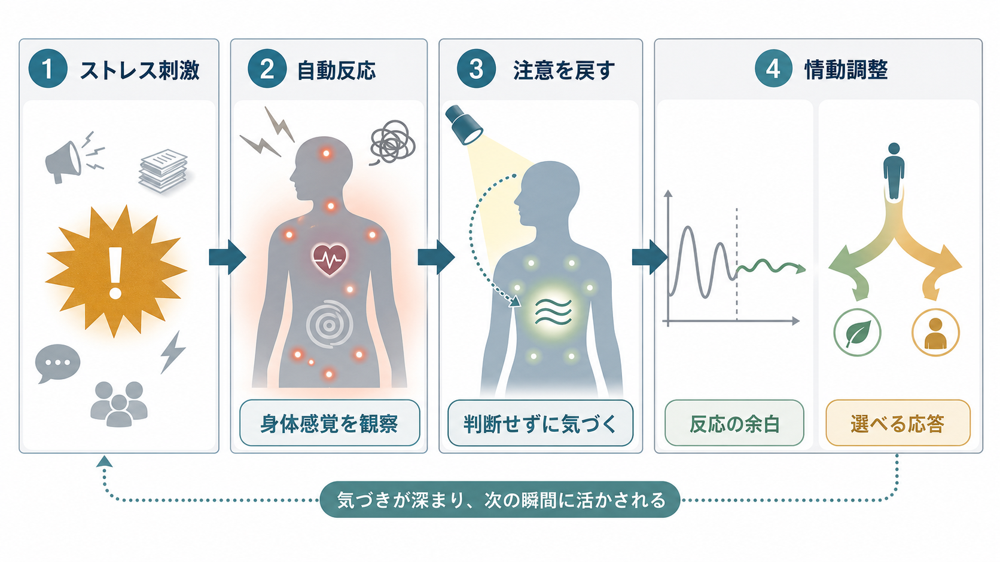
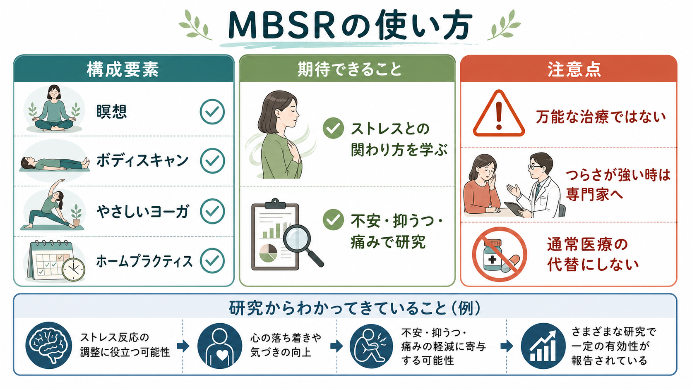

# マインドフルネスストレス低減法MBSRとは何か

## 要点

- MBSR は、瞑想、ボディスキャン、やさしいヨーガ、日常での気づきの練習を組み合わせ、ストレス刺激そのものを消すよりも「ストレス反応との関わり方」を学ぶ教育的プログラムである。
- 標準的には8週間、集団形式、ホームプラクティス、終日実習を含む構造化プログラムとして実施される[2]。
- 研究では、不安、抑うつ、ストレス、慢性疼痛などで一定の効果が報告されているが、効果量、対象、比較条件、継続性にはばらつきがある[3][5][6]。
- 医療や心理療法の代替ではなく、通常医療や心理支援と組み合わせて使う補完的な介入として理解するのが安全である[6]。

## この記事で答える問い

- MBSR は単なるリラクゼーションや瞑想法と何が違うのか。
- 身体感覚への注意は、なぜストレス反応の扱いに関係するのか。
- 臨床や研究では、どの程度まで有効性が示され、どこに注意が必要なのか。

## まず結論

マインドフルネスストレス低減法、すなわち MBSR は、ストレスを「なくす」技法というより、ストレスが生じた瞬間に身体、感情、思考、行動の連鎖に気づき、自動反応から少し距離を取るための訓練である。中心にあるのは、呼吸、身体感覚、痛み、不快感、思考、感情を、できるだけ判断せずに観察する練習である。

この意味で MBSR は、症状を直接説得する認知療法でも、薬物療法でも、単なる休息法でもない。むしろ、[[ストレス脆弱性モデルとは何か]]で問題になる「負荷に対する反応のしやすさ」を、注意と身体感覚のレベルから扱う実践的な学習プログラムである。

## 背景

MBSR は、Jon Kabat-Zinn が慢性疼痛患者に対する行動医学的プログラムとして発展させた。初期研究では、従来治療で十分に改善しなかった慢性疼痛患者に対し、マインドフルネス瞑想を用いたストレス低減プログラムが導入され、痛みの感覚面と情動的な警戒反応を切り離して観察する可能性が論じられた[1]。これは、痛みやストレスを「消す」よりも、それらに巻き込まれる二次的苦痛を減らすという発想である。

その後、MBSR は慢性疼痛だけでなく、不安、抑うつ、がん、医療者ストレス、教育、職場など多様な文脈で研究されるようになった。もっとも、対象や介入形式が広がるほど、研究結果の解釈には注意が必要になる。MBSR と一口に言っても、教師の訓練、参加者の動機、ホームプラクティス量、比較群の質によって結果は変わりうる。

## 基本概念

MBSR の「マインドフルネス」は、現在の経験に注意を向け、思考、感情、身体感覚をただちに評価・回避・制御しようとせず観察する態度を指す。ここで重要なのは、注意の対象だけではなく、注意の向け方である。たとえば、呼吸に注意を向けても、「うまくできていない」と評価し続ければ、それは新しい自己批判になりうる。

標準的な MBSR では、次のような構成要素が組み合わされる[2]。

| 要素 | 目的 |
|---|---|
| ボディスキャン | 足先から頭部まで身体感覚を順に観察し、身体への気づきを高める |
| 座る瞑想 | 呼吸、身体感覚、音、思考、感情への注意を練習する |
| やさしいヨーガ・マインドフルムーブメント | 動きの中で感覚、限界、緊張、反応に気づく |
| 日常生活のマインドフルネス | 食事、歩行、会話、仕事の中で反応パターンを観察する |
| グループでの振り返り | 体験を言語化し、自分の自動反応を理解する |

MBSR は宗教的実践をそのまま臨床に移植するものではなく、現代の医療・心理教育の文脈で用いられる世俗的なプログラムとして設計されている。ただし、内面への注意を集中的に練習するため、誰にでも同じように楽に進むわけではない。

## 仕組み

ストレス刺激が生じると、身体は覚醒し、思考は脅威や失敗の予測に向かい、感情は不安や怒りとして立ち上がる。この反応は、[[HPA軸は精神疾患にどう関わるのか]]で扱われるような身体のストレスシステムとも関係する。MBSR は、この反応を頭で否定するのではなく、身体感覚、呼吸、筋緊張、心拍、思考の出現として観察する。

この観察によって期待される変化は、少なくとも三つに分けられる。第一に、注意の安定化である。呼吸や身体感覚に注意を戻す練習は、反すうや心配に巻き込まれた注意を現在の経験へ戻す訓練になる。第二に、脱中心化である。「私はだめだ」という思考を事実として扱うのではなく、「そのような思考が出ている」と気づく余地が生まれる。第三に、情動調整である。不快な身体感覚をただちに避けずに観察することで、刺激から反応までの間に小さな余白が生まれる。

ただし、これらは単一のメカニズムではない。Creswell のレビューは、マインドフルネス介入が健康、認知、感情、対人関係に影響しうる一方で、心理学的・神経生物学的メカニズムはまだ検討中であり、用量、対象、潜在的リスクも含めた精密な研究が必要だと整理している[4]。

## 図解

MBSR を臨床的に位置づけるときは、「向いている場面」と「注意が必要な場面」を分けると理解しやすい。

実践の基本は、次のような小さな循環である。

1. ストレス刺激や不快感に気づく。
2. 呼吸、足裏、胸部、腹部など、いま観察できる身体感覚に注意を戻す。
3. 思考や感情を「事実」ではなく「経験として現れているもの」として眺める。
4. すぐ反応する前に、行動を選ぶ余地を作る。
5. 日常場面で同じプロセスを繰り返す。

この循環は、[[DBTのマインドフルネススキルとは何か]]で扱われる「観察する、記述する、参加する」とも親和性がある。ただし、DBT は境界性パーソナリティ症や感情調整困難に焦点を当てた包括的治療体系であり、MBSR はより教育的・ストレス低減的な集団プログラムとして発展した点が異なる。

## 臨床・研究との接続

系統的レビューとメタ解析では、瞑想プログラムは成人臨床集団の不安、抑うつ、痛みなどに小から中程度の改善を示す可能性が報告されている[3]。健康成人を対象にした MBSR のメタ解析でも、ストレス、不安、抑うつ、心理的苦痛、生活の質に中程度の改善が示唆されたが、研究デザインやプロトコルの違いによる異質性が大きい[7]。

不安症に関しては、MBSR とエスシタロプラムを比較したランダム化臨床試験で、8週間の MBSR が不安症状の改善においてエスシタロプラムに非劣性であったと報告された[5]。これは MBSR が[[不安症群とは何か]]の治療選択肢として研究されうることを示す重要な結果である。ただし、単一試験の結果を「薬と完全に同じ」「誰にでも第一選択」と読むのは過剰である。参加負担、教師の質、継続練習、重症度、併存症、急性リスクの有無を考える必要がある。

慢性疼痛では、MBSR は痛みの強度そのものよりも、痛みに伴う苦痛、回避、生活制限、自己効力感に関わる可能性がある。これは[[慢性疼痛と精神疾患はどう関係するのか]]で重要になる、感覚、情動、認知、行動の相互作用とつながる。ただし、急性痛や器質的疾患の評価を置き換えるものではない。

## よくある誤解

**誤解1: MBSR はリラックスするための技法である。**  
リラックスが副次的に起こることはあるが、中心は快適になることではなく、快・不快を含む経験に気づくことである。不快感に近づく練習を含むため、単なるリラクゼーションよりも負荷が高い場合がある。

**誤解2: 何も考えない状態を作るのが目的である。**  
思考を消すのではなく、思考が出ていることに気づく。注意がそれたら戻す、という反復が訓練の本体である。

**誤解3: 万能な治療である。**  
MBSR は有望な研究領域だが、すべての疾患・症状に同じ効果があるわけではない。NCCIH も、瞑想やマインドフルネスを通常医療の代替にしたり、医療相談を遅らせる理由にしたりしないよう注意している[6]。

**誤解4: つらい人ほど深く瞑想すればよい。**  
強いトラウマ反応、急性期の重いうつ、不安発作、自傷リスク、精神病症状がある場合、身体感覚や内面への注意が苦痛を増幅することがある。実践する場合は、専門家と相談し、短時間・安定化重視・中断可能な形で進める。

## 関連ノート

- [[ストレス脆弱性モデルとは何か]]
- [[HPA軸は精神疾患にどう関わるのか]]
- [[不安症群とは何か]]
- [[慢性疼痛と精神疾患はどう関係するのか]]
- [[DBTのマインドフルネススキルとは何か]]

MOC更新候補: `content/00_MOC/` 配下の臨床実践・心理療法関連 MOC がある場合、本記事を「心理療法」「マインドフルネス」「ストレス介入」の節に追加する。

## 理解チェック

1. MBSR が「ストレスを消す技法」ではなく「ストレス反応との関わり方を学ぶプログラム」と言える理由は何か。
2. ボディスキャンや呼吸への注意は、反すうや自動反応にどのように関係するか。
3. MBSR を通常医療の代替として扱うことに、どのようなリスクがあるか。

## 参考文献

[1] Kabat-Zinn, J. (1982). An outpatient program in behavioral medicine for chronic pain patients based on the practice of mindfulness meditation: Theoretical considerations and preliminary results. *General Hospital Psychiatry, 4*(1), 33-47. https://doi.org/10.1016/0163-8343(82)90026-3

[2] Center for Mindfulness in Medicine, Health Care, and Society, University of Massachusetts Medical School. (2017). *Mindfulness-Based Stress Reduction (MBSR) Authorized Curriculum Guide*. https://mbsr.website/sites/default/files/docs/mbsr-curriculum-guide-2017.pdf

[3] Goyal, M., Singh, S., Sibinga, E. M. S., et al. (2014). Meditation programs for psychological stress and well-being: A systematic review and meta-analysis. *JAMA Internal Medicine, 174*(3), 357-368. https://doi.org/10.1001/jamainternmed.2013.13018

[4] Creswell, J. D. (2017). Mindfulness interventions. *Annual Review of Psychology, 68*, 491-516. https://doi.org/10.1146/annurev-psych-042716-051139

[5] Hoge, E. A., Bui, E., Mete, M., Dutton, M. A., Baker, A. W., & Simon, N. M. (2023). Mindfulness-Based Stress Reduction vs escitalopram for the treatment of adults with anxiety disorders: A randomized clinical trial. *JAMA Psychiatry, 80*(1), 13-21. https://doi.org/10.1001/jamapsychiatry.2022.3679

[6] National Center for Complementary and Integrative Health. (2022). *Meditation and Mindfulness: Effectiveness and Safety*. https://www.nccih.nih.gov/health/meditation/overview.htm

[7] Khoury, B., Sharma, M., Rush, S. E., & Fournier, C. (2015). Mindfulness-based stress reduction for healthy individuals: A meta-analysis. *Journal of Psychosomatic Research, 78*(6), 519-528. https://doi.org/10.1016/j.jpsychores.2015.03.009

## 未解決問題

- MBSR の効果が、注意訓練、身体感覚への曝露、集団支持、期待効果、教師要因のどれにどの程度由来するかは、まだ完全には分離されていない。
- どの患者・参加者に向き、どの状態では修正プロトコルや別介入を優先すべきかについて、より精密な適応判断が必要である。
- ホームプラクティス量、長期継続、デジタル版 MBSR、対面版との比較については、今後も検証が必要である。
