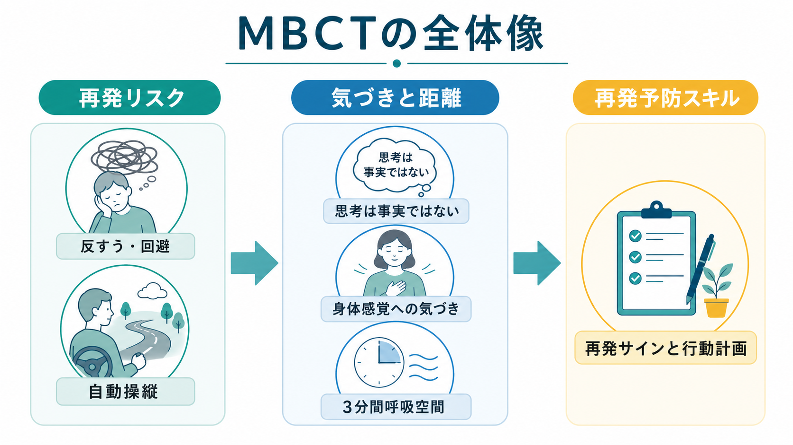
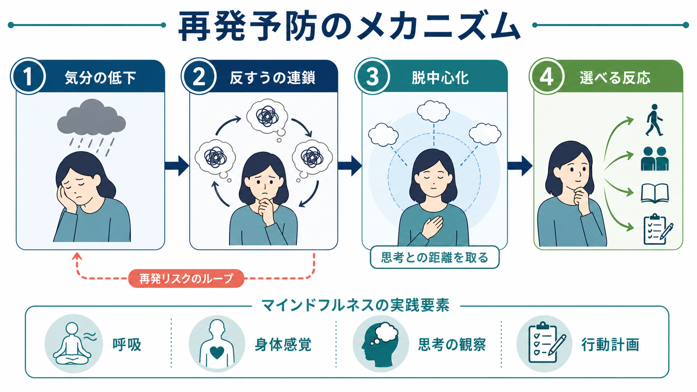
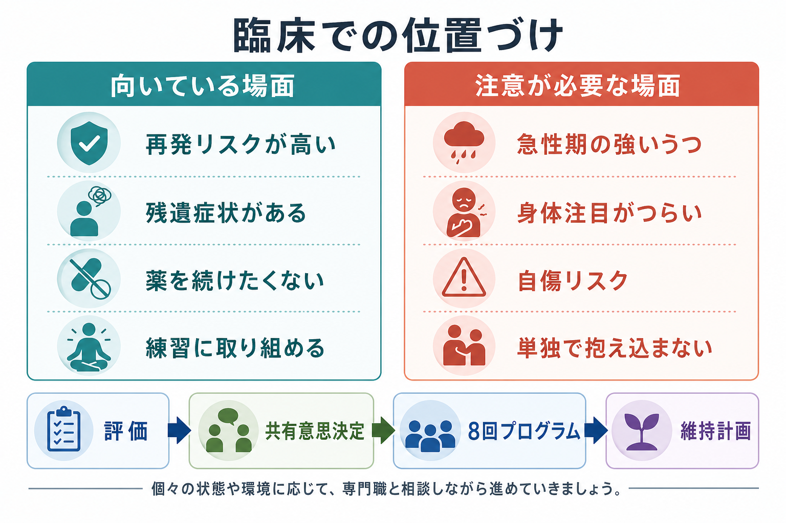

# マインドフルネス認知療法MBCTとは何か

## 要点

- マインドフルネス認知療法（mindfulness-based cognitive therapy; MBCT）は、[[うつ病とは何か]]の再発・再燃を防ぐために、マインドフルネス訓練と認知療法の発想を組み合わせた、通常8回程度の集団プログラムである[1][2]。
- 中心目標は「つらい思考を消すこと」ではなく、気分低下時に自動的に始まる反すうや回避に気づき、思考を事実そのものとして扱わない距離を育てることである[1][3]。
- エビデンスは、再発性うつ病、とくに再発リスクが高い人や残遺症状が目立つ人で、再発予防の選択肢になりうることを示している[4][5]。
- 薬物療法の代替として単純に置き換えるものではなく、維持抗うつ薬、CBT、臨床的リスク評価、本人の希望を含めた共有意思決定の中で位置づける[2][6]。

## この記事で答える問い

MBCTは、瞑想法の紹介ではなく、再発性うつ病の「なぜよくなった後にまた落ち込むのか」という問いに対する心理療法的な答えとして開発された。この記事では、MBCTの基本構造、作用機序、臨床での使いどころ、誤解されやすい点を整理する。

## まず結論

MBCTは、気分が下がったときに「また悪くなった」「自分はだめだ」といった思考へ巻き込まれ、反すうが連鎖して再発へ進む過程を早めに見つける訓練である。治療者は、参加者に特定の考えを論破させるというより、呼吸、身体感覚、感情、思考を観察する練習を通じて、「思考は心に現れる出来事であり、必ずしも事実や命令ではない」と体験的に学べるよう支援する[1][7]。

## 背景

うつ病は一回のエピソードで完結するとは限らず、再発・再燃を繰り返しうる疾患である。NICEの成人うつ病ガイドラインは、再発リスクを高める要因として、反復エピソード、残遺症状、不完全な治療反応、回避や反すうなどの対処スタイル、慢性の身体・精神疾患、持続する社会的ストレスを挙げている[2]。

MBCTは、このうち特に「気分低下が反すう的思考を再活性化し、さらに気分を下げる」という循環に焦点を当てる。Teasdaleらの初期研究は、回復期の再発性うつ病患者を対象に、気分に誘発される抑うつ的思考から離れる技能を訓練する介入としてMBCTを検討した[3]。

## 基本概念

MBCTは、マインドフルネスストレス低減法（MBSR）の形式を受け継ぎながら、うつ病再発に関わる認知的脆弱性を扱うよう設計された。標準的には、事前面接、週1回のセッション、ホームプラクティス、必要に応じた終日実践、終了後の維持計画からなる[1]。

重要な概念は次の3つである。

| 概念 | MBCTでの意味 | 臨床的な狙い |
|---|---|---|
| 自動操縦 | 気分・身体感覚・思考に気づかないまま反応する状態 | 再発サインを早めに捉える |
| 反すう | 原因や意味を考え続けるが、解決に進まない思考の反復 | 思考の連鎖に巻き込まれにくくする |
| 脱中心化 | 思考を「事実」ではなく「心に現れた出来事」として見る態度 | 気分低下と自己批判の結合を弱める |

[[DBTのマインドフルネススキルとは何か]]と同じく「気づく」訓練を含むが、MBCTは再発性うつ病の再発予防に焦点化され、反すう、残遺症状、再発サイン、維持計画を一連のプログラムとして扱う点に特徴がある。

## 仕組み

MBCTの機序は、単一の成分で説明するより、複数の学習が積み重なる過程として理解しやすい。

1. 気分低下や疲労などの微細な変化に気づく。
2. その変化が「自分はまた悪くなる」という記憶・思考を呼び出す。
3. 思考内容を検討する前に、呼吸や身体感覚へ注意を戻し、思考を観察対象として扱う。
4. 反すう、回避、過活動ではなく、休む、相談する、活動を調整するなどの反応を選ぶ。
5. 再発サインと対処行動を、終了後も続けられる維持計画として具体化する。

この過程で重要なのが脱中心化である。脱中心化は、思考を消す技能ではなく、思考と自己を密着させすぎない認知的姿勢である。脱中心化の変化が再発・再燃低下と関連することを検討したRCTもあり、作用機序を考える上で重要な候補になっている[7]。

## 図解

MBCTを図式化すると、「症状を直接消す技法」ではなく、「再発へ向かう自動反応を早く見つけ、別の反応を選ぶ訓練」として整理できる。

| 再発リスクの場面 | いつもの自動反応 | MBCTで育てる反応 |
|---|---|---|
| 眠れない日が続く | 「またうつになる」と考え続ける | 身体感覚と気分を確認し、早めに生活負荷を下げる |
| 小さな失敗をする | 自己批判と反すうに入る | 思考をラベルづけし、必要な行動だけを選ぶ |
| 疲れて人を避ける | 回避が増えて活動が狭まる | 休息、相談、段階的活動を計画する |

## 臨床・研究との接続

初期のRCTは、MBCTが再発性うつ病の再発・再燃予防に有望であることを示した[3]。その後の系統的レビューとメタ解析でも、通常ケアと比較して再発予防効果が示され、特に複数回のうつ病エピソードを経験した人で検討されてきた[4]。

より厳密な個人患者データメタ解析では、9つのRCT、1258人のデータを用いて、MBCTが通常ケアや他の能動的治療と比べて60週以内の再発リスクを下げる可能性が示された。また、ベースラインの抑うつ症状が強い人ほど利益が大きい可能性が示唆された[5]。一方、維持抗うつ薬との比較では、MBCTが明確に優越するというより、本人の希望やリスクに応じた選択肢として考えるのが妥当である[6]。

NICE NG222は、寛解後で再発リスクが高い人に対して、抗うつ薬継続、集団CBT、MBCT、またはそれらの組み合わせを共有意思決定の中で検討するよう勧めている。また、MBCTや集団CBTを再発予防として行う場合、8回程度、2〜3か月のコースを基本とし、必要に応じてその後12か月以内の追加セッションを選択肢に含めるとしている[2]。

臨床的には、急性期の重いうつ、自傷・自殺リスクが高い状態、躁状態・精神病症状、トラウマ関連症状が強く身体感覚への注意が苦痛を増す場合には、MBCT単独で抱え込まない。包括的評価、危機対応、薬物療法、個別心理療法、家族・地域支援を含めて判断する。

## よくある誤解

**誤解1: MBCTはリラックス法である。**  
リラックスが副次的に起こることはあるが、主目的は快適になることではない。不快な感情や思考に気づき、巻き込まれ方を変える訓練である[1]。

**誤解2: 思考を止める訓練である。**  
MBCTは思考停止を目指さない。むしろ「考えていることに気づく」ことを練習し、反すうへ自動的に入る前に選択肢を作る。

**誤解3: 薬をやめるための治療である。**  
維持抗うつ薬を続けるか、心理療法を加えるか、減薬を検討するかは、既往、再発回数、残遺症状、副作用、本人の価値観を踏まえた共有意思決定で扱う。MBCTは薬物療法を一律に置き換えるものではない[2][6]。

**誤解4: マインドフルネスならすべて同じである。**  
MBCT、[[DBTのマインドフルネススキルとは何か]]、[[ACTとは何か]]はいずれも気づきや受容を扱うが、治療標的、構造、適応、エビデンスの焦点が異なる。

## 関連ノート

- [[うつ病とは何か]]
- [[治療抵抗性うつ病とは何か]]
- [[DBTのマインドフルネススキルとは何か]]
- [[ACTとは何か]]

MOC更新候補: `content/00_MOC/` 配下の臨床実践・心理療法・うつ病関連MOCに、本記事へのリンクを追加する。

今後の作成候補: 「認知行動療法CBTとは何か」「反すうとは何か」「脱中心化とは何か」「MBSRとは何か」。

## 理解チェック

1. MBCTが主に対象とする臨床課題は、急性期症状の即時軽減か、寛解後の再発予防か。
2. MBCTでいう「思考は事実ではない」とは、思考を否定することか、思考との関係を変えることか。
3. 再発リスク評価で確認すべき要因を3つ挙げられるか。
4. 維持抗うつ薬とMBCTの関係を、「代替」だけでなく「選択肢」「併用」「共有意思決定」として説明できるか。

## 参考文献

[1] Segal, Z. V., Williams, J. M. G., & Teasdale, J. D. (2013). *Mindfulness-Based Cognitive Therapy for Depression* (2nd ed.). Guilford Press. https://www.guilford.com/books/Mindfulness-Based-Cognitive-Therapy-for-Depression/Segal-Williams-Teasdale/9781462537037

[2] National Institute for Health and Care Excellence. (2022). *Depression in adults: treatment and management* (NICE guideline NG222). Published 29 June 2022; evidence page includes January 2026 exceptional surveillance. https://www.nice.org.uk/guidance/ng222

[3] Teasdale, J. D., Segal, Z. V., Williams, J. M. G., Ridgeway, V. A., Soulsby, J. M., & Lau, M. A. (2000). Prevention of relapse/recurrence in major depression by mindfulness-based cognitive therapy. *Journal of Consulting and Clinical Psychology, 68*(4), 615-623. https://doi.org/10.1037/0022-006X.68.4.615

[4] Piet, J., & Hougaard, E. (2011). The effect of mindfulness-based cognitive therapy for prevention of relapse in recurrent major depressive disorder: A systematic review and meta-analysis. *Clinical Psychology Review, 31*(6), 1032-1040. https://doi.org/10.1016/j.cpr.2011.05.002

[5] Kuyken, W., Warren, F. C., Taylor, R. S., Whalley, B., Crane, C., Bondolfi, G., et al. (2016). Efficacy of mindfulness-based cognitive therapy in prevention of depressive relapse: An individual patient data meta-analysis from randomized trials. *JAMA Psychiatry, 73*(6), 565-574. https://doi.org/10.1001/jamapsychiatry.2016.0076

[6] Kuyken, W., Hayes, R., Barrett, B., Byng, R., Dalgleish, T., Kessler, D., et al. (2015). Effectiveness and cost-effectiveness of mindfulness-based cognitive therapy compared with maintenance antidepressant treatment in the prevention of depressive relapse or recurrence (PREVENT): A randomised controlled trial. *The Lancet, 386*(9988), 63-73. https://doi.org/10.1016/S0140-6736(14)62222-4

[7] Moore, M. T., Lau, M. A., Haigh, E. A. P., Willett, B. R., Bosma, C. M., & Fresco, D. M. (2022). Association between decentering and reductions in relapse/recurrence in mindfulness-based cognitive therapy for depression in adults: A randomized controlled trial. *Journal of Consulting and Clinical Psychology, 90*(2), 137-147. https://doi.org/10.1037/ccp0000718
