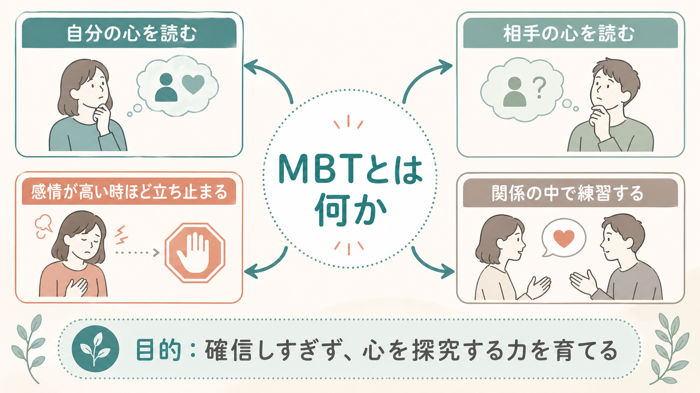
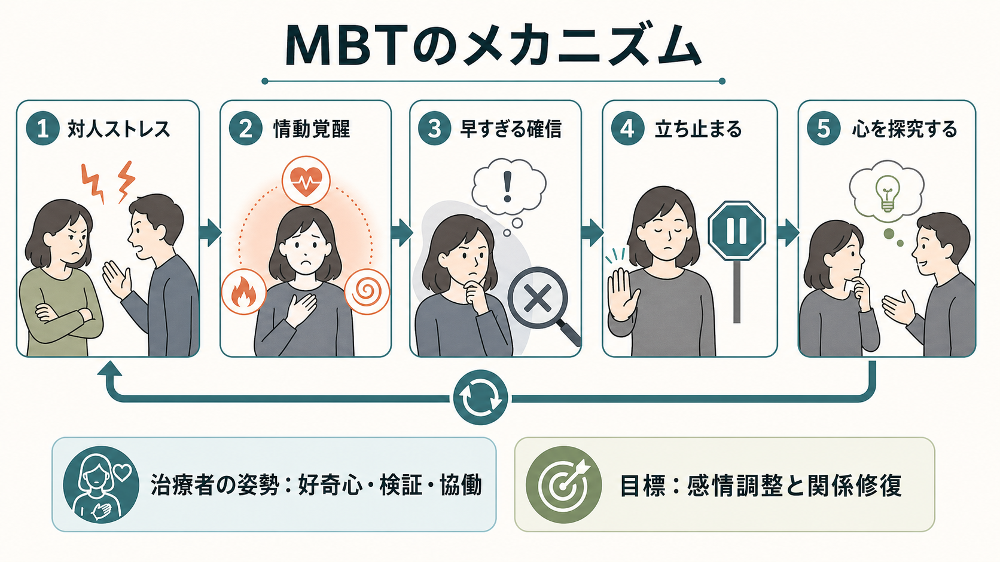
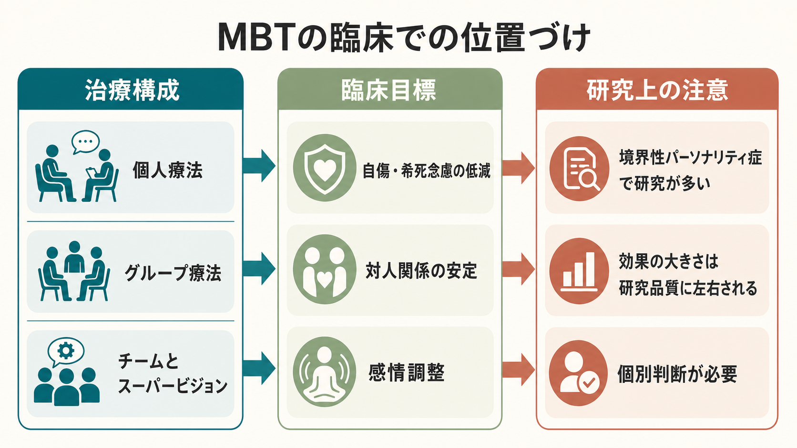

# メンタライゼーションに基づく治療MBTとは何か

## 要点

- MBT は、行動の背後にある感情、欲求、信念、意図を「自分にも相手にもあるが、直接は見えないもの」として扱い直す心理療法である。
- 中心目標は、対人ストレスでメンタライジングが崩れたときに、早すぎる確信や衝動反応へ進む前に立ち止まり、心的状態を共同で探究できるようにすることである[1][2]。
- 境界性パーソナリティ症に対する研究が最も多く、初期 RCT、外来版 MBT、長期追跡研究で有望な結果が示された[4][5][6]。
- ただし、MBT は「相手の本音を当てる技術」ではない。むしろ「わからなさを保ちながら、複数の可能性を検討する」治療姿勢である。
- 個別の診断、適応、危機対応、治療選択は専門的評価に基づく必要があり、本記事は教育・研究目的の整理である。

## この記事で答える問い

1. メンタライゼーションとは何か。
2. MBT はどのような問題を、どのような仕組みで扱うのか。
3. MBT の治療者は、通常の助言や解釈と何が違う関わりをするのか。
4. 境界性パーソナリティ症の研究では、どこまで有効性が示されているのか。
5. MBT を理解するとき、どのような誤解を避けるべきか。

## まず結論

MBT は、メンタライゼーション、すなわち「自分や他者の行動を、感情、信念、欲求、意図などの心的状態と結びつけて理解する力」を育てる治療である[1][3]。この力は、[[心の理論とは何か|心の理論]]、[[社会的認知とは何か|社会的認知]]、[[メタ認知とは何か|メタ認知]]、[[共感は認知機能としてどう理解できるのか|共感]]と重なる部分をもつが、MBT ではとくに「対人関係の中で、感情が高まったときにも心を考え続けられるか」が重視される。

MBT が扱う典型的な場面は、対人関係で強い不安、怒り、恥、見捨てられ感が生じ、相手の意図を「絶対にこうだ」と決めつけたり、自分の状態を言葉にできずに衝動行動へ進んだりする場面である。治療者は正解を教えるよりも、「いま何が起きたのか」「別の可能性はあるか」「その時点で自分や相手は何を感じていたのか」を、本人と共同で確かめる[2][3]。

## 背景

メンタライゼーションという考え方は、[[愛着とは何か|愛着]]研究、精神分析的発達理論、社会的認知研究を背景にもつ。Fonagy は、メンタライゼーションまたは reflective function を「自分と他者の心的状態について考える能力」として整理し、この能力が安全な愛着関係の中で発達しやすいことを論じた[1]。養育者が子どもを「心をもつ主体」として扱い、子どもの感情を過不足なく映し返す経験は、[[安全基地とは何か|安全基地]]や[[内的作業モデルとは何か|内的作業モデル]]の形成とも接続する。

境界性パーソナリティ症では、対人関係、自己像、感情、衝動性の不安定さ、自傷や自殺関連行動が臨床上の焦点になりやすい。NICE ガイドラインは、心理療法を検討する際に本人の希望、重症度、治療関係の境界を保つ力、支援体制を考慮し、構造化された治療、明示的な理論、スーパービジョンを重視するよう勧めている[7]。MBT はこの文脈で、境界性パーソナリティ症に特化した構造化心理療法として発展した。

## 基本概念

### メンタライゼーション

メンタライゼーションは、行動を単なる刺激反応ではなく、「見えない心的状態が関わるもの」として理解する働きである。たとえば、相手が返信しないときに「嫌われた」と即断する代わりに、「忙しいのかもしれない」「返し方に迷っているのかもしれない」「自分が不安になっているのかもしれない」と複数の可能性を保つ。これは相手を甘く見ることではなく、直接観察できる行動と、推測される心的状態を区別することである。

MBT で重要なのは、メンタライゼーションが固定的な能力ではなく、状態依存的に変動する点である。落ち着いているときには相手の立場を考えられても、見捨てられ不安、怒り、恥、恐怖が高まると、急に「相手は敵だ」「自分には価値がない」「もう終わりだ」といった硬い確信に移りやすくなる[2][3]。この崩れ方を、MBT では治療の中心標的として扱う。

### MBT の治療目標

MBT の目標は、洞察を増やすことだけではない。むしろ、感情が高い場面で次のような小さな行動変化が起きることを重視する。

| 領域 | 目標 |
|---|---|
| 自己理解 | 「自分はいま何を感じ、何を恐れているのか」を言葉にする |
| 他者理解 | 相手の意図を一つに決めつけず、複数の仮説を保つ |
| 感情調整 | 衝動行動の前に、身体感覚・感情・考えを区別する |
| 対人関係 | 断絶、攻撃、回避ではなく、確認や修復の選択肢を増やす |
| 治療関係 | 治療者とのすれ違いも、心を探究する材料として扱う |

この点で MBT は、[[自己とは何か|自己]]、[[自己と他者はどのように区別されるのか|自己と他者の区別]]、[[情動と認知は分けられるのか|情動と認知]]を、臨床実践の中で扱う方法でもある。

## 仕組み

MBT の実践では、治療者は「知らない姿勢」を保つ。これは専門性を放棄するという意味ではない。治療者が本人の心を本人以上に知っているかのように断定せず、本人と一緒に出来事をスローダウンし、感情、身体感覚、考え、行動、対人文脈を確かめるという意味である[2][3]。

典型的な流れは次のように整理できる。

1. 対人ストレスが起きる。
2. 情動覚醒が高まる。
3. 相手の心や自分の価値について、早すぎる確信が生じる。
4. 治療者が出来事を止め、どの時点で何が起きたかを一緒に確認する。
5. 本人が、自己・他者・関係について別の理解可能性をもてるようになる。

MBT は、解釈を深く入れる治療というより、メンタライジングが失われた瞬間を見つけ、そこへ戻る治療である。治療者は、長い説明よりも短く具体的な質問を使う。「そのとき、相手の表情をどう受け取ったか」「その前に何が起きていたか」「怒りの下に不安はあったか」「いま私が言ったことをどう感じたか」といった問いが使われる。治療者との関係で起きた誤解や不信も、避けるべき失敗ではなく、メンタライジングを回復する練習場になる。

## 図解

MBT を一枚で理解するなら、「対人ストレスで心を読む力が狭まり、確信が硬くなったところで、治療者と一緒に立ち止まり、心的状態の仮説を複数に戻す治療」と考えるとよい。

| MBT で起きやすい焦点 | 治療での扱い |
|---|---|
| 「相手は絶対に自分を見捨てる」 | 確信の根拠、感情、別の可能性を一緒に確認する |
| 「自分の感情がわからない」 | 身体感覚、出来事、言葉、行動を分けて整理する |
| 「治療者も自分を責めている」 | 治療関係の中で起きた受け取り方を検討する |
| 「もう行動するしかない」 | 衝動の直前に何が起きたかを振り返り、次の選択肢を増やす |

## 臨床・研究との接続

MBT の初期研究では、Bateman と Fonagy が、境界性パーソナリティ症の患者を対象に、精神分析的志向の部分入院プログラムと標準的精神科ケアを比較した RCT を報告した[4]。その後の長期追跡では、MBT 群で自殺関連行動、サービス利用、機能面の改善が持続したことが報告され、MBT が単なる短期的な危機低減にとどまらない可能性が示された[5]。

外来版 MBT と structured clinical management を比較した RCT では、両群とも改善したが、MBT 群では自殺企図や入院を含む臨床的問題の低下がより急であったと報告された[6]。この結果は、専門的心理療法だけでなく、構造化されたケアそのものが重要であることも示している。つまり、MBT の効果を考えるときは、理論だけでなく、治療期間、個人療法とグループ療法、チーム体制、危機計画、スーパービジョンを含む実装条件を見る必要がある。

Cochrane レビューは、境界性パーソナリティ症に対する心理療法全体について、通常治療より症状重症度、自傷、自殺関連アウトカム、抑うつ、心理社会的機能に有益な可能性を示しつつ、MBT の自傷・自殺関連アウトカムへの効果は低品質エビデンスに基づくため不確実性が残ると整理している[8]。したがって、MBT は有望な治療法だが、「決定的に万能」とは言えない。対象者、併存症、治療者訓練、比較条件、アウトカムの選び方によって解釈が変わる。

臨床では、MBT は [[DBTのマインドフルネススキルとは何か|DBT のマインドフルネススキル]] と比較されることがある。DBT がスキル訓練、行動分析、弁証法的姿勢を前面に出すのに対し、MBT は対人関係の中でメンタライジングを回復する過程を中心に置く。ただし、どちらも危機対応、構造、治療関係、感情調整を重視する点では重なる。

## よくある誤解

### 誤解1: MBT は相手の本音を当てる技術である

MBT は読心術ではない。むしろ「心は直接見えない」「自分の推測は間違いうる」という前提を保つ治療である。相手の意図を一つに決めるより、行動、文脈、自分の感情反応を材料に、複数の仮説を検討する。

### 誤解2: メンタライゼーションが高ければ感情的にならない

感情がなくなるわけではない。重要なのは、強い感情があっても、その感情に完全に飲み込まれず、「いま何が起きているのか」を少しだけ考えられる余地をつくることである。これは[[内受容感覚とは何か|内受容感覚]]や[[自己制御とは何か|自己制御]]とも関わる。

### 誤解3: MBT は境界性パーソナリティ症だけの治療である

研究蓄積は境界性パーソナリティ症で最も多いが、メンタライジングの観点は、家族支援、青年期、自傷、摂食症、物質使用、精神病性障害などにも応用が検討されている。ただし、応用範囲が広いことと、各領域で十分な有効性が確立していることは別である。

### 誤解4: 治療者が深い解釈をすればするほどよい

MBT では、本人の情動覚醒が高いときに複雑な解釈を入れると、かえってメンタライジングが崩れることがある。治療者は深く説明するより、短く、具体的に、現在の相互作用に近いところから確かめる。

## 関連ノート

- [[心の理論とは何か]]
- [[社会的認知とは何か]]
- [[メタ認知とは何か]]
- [[共感は認知機能としてどう理解できるのか]]
- [[愛着とは何か]]
- [[安全基地とは何か]]
- [[内的作業モデルとは何か]]
- [[自己とは何か]]
- [[自己と他者はどのように区別されるのか]]
- [[DBTのマインドフルネススキルとは何か]]

MOC 更新候補: `content/00_MOC/` 配下の臨床実践・心理療法系 MOC に、本記事 `[[メンタライゼーションに基づく治療MBTとは何か]]` を追加する候補。並列ジョブとの競合を避けるため、本記事作成時点では MOC ファイルを更新しない。

## 理解チェック

1. メンタライゼーションを「相手の本音を当てる力」と説明すると、何が抜け落ちるか。
2. 対人ストレスと情動覚醒は、なぜメンタライジングを崩しやすいのか。
3. MBT の「知らない姿勢」は、治療者の無知や受け身とはどう違うか。
4. MBT の研究知見を読むとき、比較条件や治療構造を確認する必要があるのはなぜか。

## 未解決問題

- MBT のどの要素が、どの患者群・どの治療段階で最も重要なのか。
- メンタライゼーションの改善を、臨床面接、自己報告、行動課題、神経指標でどの程度一致して測れるのか。
- DBT、TFP、スキーマ療法、一般精神科管理などと比べ、どの条件で MBT が特に適するのか。
- グループ療法、短期版、青年期版、オンライン実装で、どの程度治療効果と安全性を保てるのか。

## 参考文献

[1] Fonagy, P. (2000). Attachment and borderline personality disorder. *Journal of the American Psychoanalytic Association, 48*(4), 1129-1146. https://doi.org/10.1177/00030651000480040701

[2] Bateman, A. W., & Fonagy, P. (2004). Mentalization-based treatment of BPD. *Journal of Personality Disorders, 18*(1), 36-51. https://doi.org/10.1521/pedi.18.1.36.32772

[3] Bateman, A., & Fonagy, P. (2010). Mentalization based treatment for borderline personality disorder. *World Psychiatry, 9*(1), 11-15. https://doi.org/10.1002/j.2051-5545.2010.tb00255.x

[4] Bateman, A., & Fonagy, P. (1999). Effectiveness of partial hospitalization in the treatment of borderline personality disorder: A randomized controlled trial. *American Journal of Psychiatry, 156*(10), 1563-1569. https://doi.org/10.1176/ajp.156.10.1563

[5] Bateman, A., & Fonagy, P. (2008). 8-year follow-up of patients treated for borderline personality disorder: Mentalization-based treatment versus treatment as usual. *American Journal of Psychiatry, 165*(5), 631-638. https://doi.org/10.1176/appi.ajp.2007.07040636

[6] Bateman, A., & Fonagy, P. (2009). Randomized controlled trial of outpatient mentalization-based treatment versus structured clinical management for borderline personality disorder. *American Journal of Psychiatry, 166*(12), 1355-1364. https://doi.org/10.1176/appi.ajp.2009.09040539

[7] National Institute for Health and Care Excellence. (2009, last reviewed 2024). *Borderline personality disorder: recognition and management* (Clinical guideline CG78). https://www.nice.org.uk/guidance/cg78

[8] Storebø, O. J., Stoffers-Winterling, J. M., Völlm, B. A., Kongerslev, M. T., Mattivi, J. T., Jørgensen, M. S., Faltinsen, E., Todorovac, A., Sales, C. P., Callesen, H. E., Lieb, K., & Simonsen, E. (2020). Psychological therapies for people with borderline personality disorder. *Cochrane Database of Systematic Reviews, 2020*(5), CD012955. https://doi.org/10.1002/14651858.CD012955.pub2
