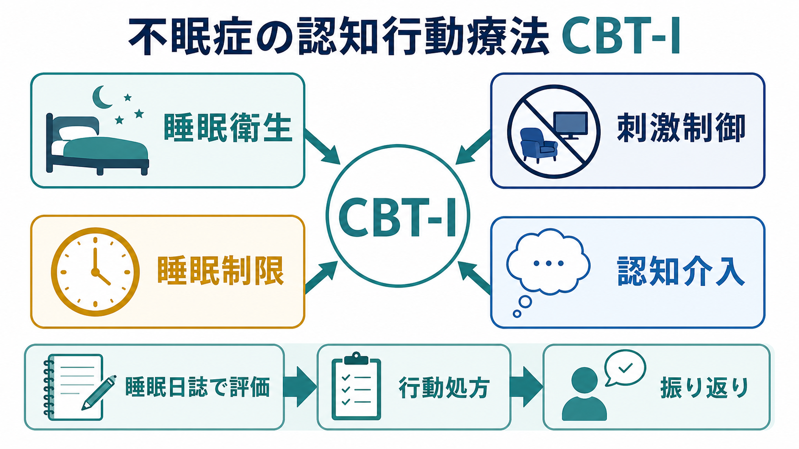
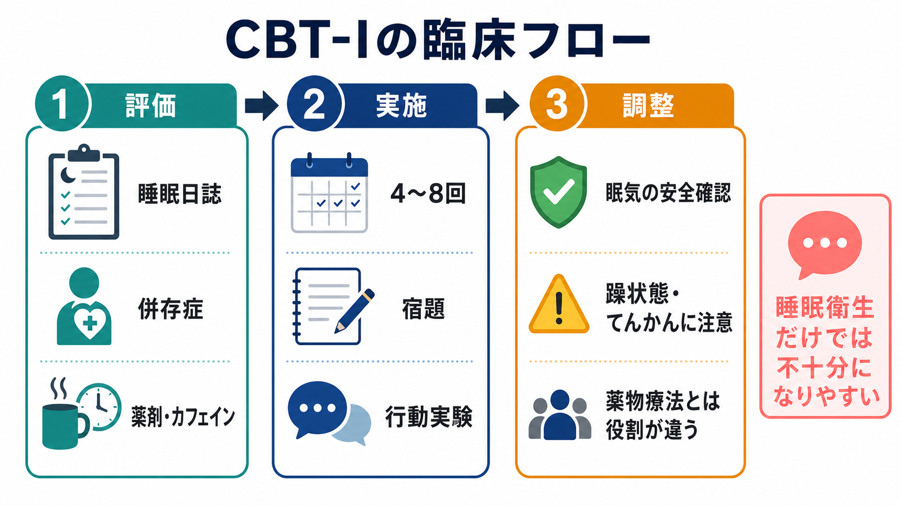

# 不眠症の認知行動療法CBT-Iとは何か

## 要点

- CBT-I（cognitive behavioral therapy for insomnia）は、慢性不眠を「眠れない夜」だけでなく、眠れなさを維持する行動、寝床との学習、睡眠への不安、生活リズムの問題として扱う心理療法である。
- 中核は、睡眠衛生、刺激制御、睡眠制限、認知介入、リラクセーション、睡眠日誌にもとづく振り返りを組み合わせる点にある[1][2]。
- AASM 2021 ガイドラインは、成人の慢性不眠障害に対して多要素 CBT-I を強く推奨している。一方、睡眠衛生だけを単独治療として使うことは条件付きで推奨しない[1]。
- CBT-I は薬物療法と敵対するものではない。ACP 2016 は慢性不眠の初期治療として CBT-I を推奨し、薬物療法を加える場合は利益、害、費用を共有意思決定で検討するとした[3]。
- 本稿は教育・研究目的の整理であり、個別の診断や治療指示ではない。強い日中眠気、運転リスク、躁状態、てんかん、睡眠時無呼吸、レストレスレッグス症候群、薬剤・物質使用などが疑われる場合は専門的評価が必要である。

## この記事で答える問い

1. CBT-I は、通常の[[認知行動療法CBTとは何か|認知行動療法CBT]]と何が同じで、何が不眠に特化しているのか。
2. 睡眠衛生、刺激制御、睡眠制限、認知介入はそれぞれ何を変えようとしているのか。
3. なぜ「早く寝る」「長く寝床にいる」「眠る努力をする」が、かえって不眠を維持することがあるのか。
4. 臨床・研究では、CBT-I を薬物療法、併存症、デジタル介入とどう接続して考えるのか。

## まず結論

CBT-I は、不眠を「睡眠時間が足りない」という量の問題だけに還元しない。むしろ、寝床で長く覚醒する、眠れないことを監視し続ける、日中に長く仮眠する、起床時刻が不規則になる、眠れなければならないという思考が強まる、といった維持要因を、睡眠日誌にもとづいて少しずつ組み替える治療である[1][2]。

重要なのは、CBT-I が「睡眠衛生指導の丁寧版」ではない点である。睡眠衛生は、カフェイン、飲酒、寝室環境、運動、光、生活リズムなどを整える教育として有用だが、それだけでは慢性不眠の中核的な維持ループを十分に変えにくい。刺激制御は「寝床＝覚醒・心配」の学習を弱め、睡眠制限は「寝床にいる時間」と「実際に眠っている時間」のずれを調整し、認知介入は睡眠への破局的解釈や過度な努力を検討可能にする[1][4]。

## 背景

[[不眠障害とは何か|不眠障害]]では、入眠困難、中途覚醒、早朝覚醒、睡眠の質への不満が、日中の疲労、注意集中困難、気分の不調、生活機能の低下と結びつく。慢性不眠は、十分な睡眠機会があるにもかかわらず症状が持続する点が重要であり、[[睡眠障害とは何か|睡眠障害]]一般や短期的な寝不足とは区別して評価する必要がある。

不眠の理解では、しばしば 3P モデルが使われる。これは、もともとの脆弱性である「準備因子」、ストレスや身体疾患などの「誘発因子」、そして寝床での覚醒、過度な睡眠努力、仮眠、長すぎる床上時間などの「維持因子」を分ける考え方である[5]。急性の不眠では誘発因子が目立つが、慢性化すると維持因子が治療標的になりやすい。CBT-I はこの維持因子を、行動、認知、環境、リズムの水準で扱う。

## 基本概念

### 睡眠衛生

睡眠衛生は、眠りを邪魔しにくい生活条件を整える教育である。代表例には、就寝前のカフェインや大量飲酒を避ける、寝室を暗く静かに保つ、規則的な起床時刻を保つ、日中の光曝露や運動を調整する、といった内容が含まれる。

ただし、睡眠衛生は「土台」であって、慢性不眠の十分な治療そのものではない。AASM 2021 は、睡眠衛生を単独治療として用いることを条件付きで推奨しないとした[1]。これは、睡眠衛生が無意味ということではなく、刺激制御や睡眠制限などの行動処方と組み合わせて意味を持つ、という理解が近い。

### 刺激制御

刺激制御は、寝床や寝室を「眠る場所」として再学習するための介入である。不眠が続くと、寝床は休息の合図ではなく、時計を見る、考え込む、焦る、眠れなさを確認する場所になりやすい。刺激制御では、眠気がある時に寝床へ入る、眠れないまま長く寝床に留まらない、寝床を睡眠と性的活動以外に使わない、起床時刻を一定にする、といった原則を用いる[1][5]。

ここでの狙いは、本人を罰することではない。寝床で覚醒している時間を減らし、寝床に入ることが「努力して眠る課題」ではなく「眠気に従って眠る合図」になるように、条件づけを組み替えることである。

### 睡眠制限

睡眠制限は、名前だけ見ると「睡眠を削る治療」に見えるが、実際には床上時間を実際の睡眠時間に近づけ、睡眠効率を上げる方法である。Spielman らの古典的研究では、慢性不眠では長すぎる床上時間が不眠を維持する要因になりうると考え、まず床上時間を制限し、睡眠効率が改善したら段階的に延長する方法が検討された[6]。

臨床的には、睡眠日誌から平均睡眠時間を見積もり、下限を設けたうえで床上時間を設定し、数日から 1 週間単位で調整する。日中の眠気や安全リスクを伴うことがあるため、運転、機械作業、転倒リスク、躁状態、てんかん、重い身体疾患などには注意が必要である。

### 認知介入

認知介入は、「眠れなければ明日は完全に終わる」「8時間眠れないと健康を壊す」「今すぐ眠らなければならない」といった睡眠への破局的解釈、過度な安全行動、眠りの監視を扱う。目標は、単に「前向きに考える」ことではない。睡眠に関する信念を、証拠、代替解釈、行動実験、日中機能の実際と照らして検討することである。

不眠では、眠ろうとする努力そのものが覚醒を高めることがある。認知介入は、眠れなさへの反応を柔らかくし、睡眠を直接制御しようとするほど目が冴えるという逆説を扱う。

## 仕組み

CBT-I の仕組みは、睡眠の恒常性、概日リズム、条件づけ、認知的覚醒の 4 つに分けると理解しやすい。

第一に、睡眠制限は睡眠圧を整える。長すぎる床上時間や日中の長い仮眠は、夜間の睡眠圧を分散させる。床上時間を実睡眠に近づけると、短期的には眠気が増えることがあるが、寝床での覚醒時間が減り、睡眠効率が上がりやすくなる[4][6]。

第二に、刺激制御は寝床への条件づけを変える。寝床でスマートフォンを見る、仕事をする、悩み続ける、時計を確認することが続くと、寝床が覚醒の手がかりになる。刺激制御は、寝床と睡眠の結びつきを再形成する。

第三に、規則的な起床時刻と光・活動の調整は、[[概日リズム睡眠覚醒障害とは何か|概日リズム]]との接続点になる。不眠がある人では、寝る時刻を早める努力より、起床時刻、朝の光、日中活動を安定させるほうが有効なことがある。

第四に、認知介入は過覚醒を下げる。眠れないことへの監視、破局化、反すうは、交感神経系の覚醒や情動的覚醒と結びつき、[[不眠とは何か|不眠]]を維持する。CBT-I は、こうした維持ループを「意志の弱さ」ではなく、学習された反応として扱う。

## 図解

上の 2 枚の図は、CBT-I の読み方を補助するためのものである。

| 図 | 読み方 |
|---|---|
| 全体像 | 睡眠衛生、刺激制御、睡眠制限、認知介入が並列の部品ではなく、睡眠日誌にもとづく評価、行動処方、振り返りの中で組み合わされることを示す。 |
| 中核メカニズム | 長すぎる床上時間と寝床での考え込みが、睡眠制限と刺激制御によってどう修正されるかを示す。 |
| 臨床フロー | 評価、実施、調整の流れを示す。特に、安全確認と併存症評価は、手技の説明より前に必要である。 |

## 臨床・研究との接続

### ガイドライン上の位置づけ

AASM 2021 は、成人の慢性不眠障害に対して多要素 CBT-I を強く推奨した。単一要素では、刺激制御、睡眠制限、リラクセーションなどが条件付き推奨として整理されている[1]。同じ根拠文献群を扱った AASM の系統的レビューでは、CBT-I、短期療法、刺激制御、睡眠制限、リラクセーション、睡眠衛生などの効果と確実性が GRADE で評価された[2]。

ACP 2016 は、成人の慢性不眠障害に対して CBT-I を初期治療として推奨した。薬物療法を考える場合も、CBT-I で学んだ技能が長期管理に役立つ可能性を踏まえ、薬の利益、害、費用を共有意思決定で検討する立場である[3]。

### 効果研究

Trauer らのメタ解析では、対面の多要素 CBT-I が成人慢性不眠の入眠潜時、入眠後覚醒、睡眠効率を改善し、変化が後続時点でも保たれる傾向が示された[4]。ただし、この解析では併存する医学的・精神医学的問題をもつ不眠が除外されており、実臨床への一般化には注意が必要である。

併存不眠については、Edinger らのランダム化比較試験が参考になる。この研究では、原発性不眠と、主に精神疾患を伴う不眠の成人に対し、睡眠衛生教育より CBT のほうが多くの指標で優れ、4回の固定セッションでも両群に類似した利益がみられた[7]。ただし、単一施設研究であり、対象者構成や実施者の技能による制約がある。

### 薬物療法との関係

薬物療法は、急性の苦痛や重い睡眠障害に対して検討されることがあるが、CBT-I と同じ役割ではない。2026 年に公表された AASM の併用治療ガイドラインは、CBT-I と不眠症薬を同時に開始する併用治療について、薬物療法単独より併用を条件付きで支持する一方、CBT-I 単独より併用を上回るものとしては条件付きで支持しないとした[8]。これは、薬を使ってはいけないという意味ではなく、早期の総睡眠時間増加を重視するか、日中症状や長期的な自己管理をどう評価するかによって判断が変わる、という整理である。

### 評価との接続

CBT-I では、[[精神科診察で睡眠をどう評価するか|睡眠評価]]が治療そのものの一部になる。睡眠日誌、日中眠気、生活リズム、併存するうつ病・不安症・PTSD・慢性疼痛、薬剤、アルコール、カフェイン、睡眠時無呼吸の可能性を確認する。[[睡眠障害は脳機能にどのような影響を与えるのか|睡眠障害と脳機能]]の観点からも、不眠は気分、注意、記憶、身体状態と相互作用するため、夜だけを切り出して扱うと見落としが生じる。

## よくある誤解

### CBT-I は睡眠衛生指導のことだ

違う。睡眠衛生は構成要素の一つだが、単独では慢性不眠の維持要因を十分に扱いにくい。CBT-I の中核は、睡眠日誌にもとづく刺激制御、睡眠制限、認知介入、振り返りを組み合わせる点にある[1][2]。

### 睡眠制限は睡眠を削って悪化させるだけだ

睡眠制限は、むやみに睡眠時間を減らす方法ではない。床上時間を実睡眠に近づけ、睡眠効率を上げたうえで、改善に応じて段階的に床上時間を延ばす方法である[6]。ただし、日中眠気や安全リスクがあるため、適応と調整が重要である。

### 眠れないなら、早く布団に入ればよい

慢性不眠では、早く寝床に入るほど、寝床で覚醒して考え込む時間が増えることがある。その場合、寝床は眠る合図ではなく覚醒の合図になる。刺激制御は、この学習を修正するための方法である。

### 薬物療法を使うなら CBT-I は不要だ

必ずしもそうではない。CBT-I は、睡眠を維持する行動と認知のパターンに働きかける。2026 年の AASM 併用治療ガイドラインでも、薬物療法単独より CBT-I と薬物療法の併用が有利になりうる場面が条件付きで示されている[8]。

### CBT-I は精神疾患がある人には使えない

併存症がある場合は評価と調整が必要だが、併存不眠を一律に除外する必要はない。精神疾患、慢性疼痛、身体疾患があるときは、眠りだけでなく症状全体、安全性、薬剤、生活機能を合わせて考える[7]。

## 関連ノート

- [[不眠とは何か]]
- [[不眠障害とは何か]]
- [[睡眠障害とは何か]]
- [[睡眠障害は脳機能にどのような影響を与えるのか]]
- [[精神科診察で睡眠をどう評価するか]]
- [[認知行動療法CBTとは何か]]
- [[概日リズム睡眠覚醒障害とは何か]]

## MOC更新候補

- `content/00_MOC/MOC｜臨床実践・治療.md` の「心理療法」または「認知行動療法」周辺に追加候補。
- `content/00_MOC/MOC｜疾患・症候群.md` の睡眠関連項目から治療記事として参照候補。
- 並列ジョブとの競合を避けるため、本作業では MOC 本体は更新しない。

## 理解チェック

1. CBT-I が睡眠衛生単独と異なる点を、刺激制御と睡眠制限の観点から説明できるか。
2. 「眠れないから長く寝床にいる」が、慢性不眠ではなぜ維持要因になりうるか。
3. 睡眠制限を行うときに、安全確認が必要になる理由を説明できるか。
4. 薬物療法と CBT-I を「どちらが正しいか」ではなく、役割の違いとして説明できるか。

## 未解決問題

- CBT-I のどの構成要素が、どの患者群に最も効くのかは、まだ完全には分かっていない。
- デジタル CBT-I、短期 CBT-I、集団 CBT-I、プライマリケアでの実装を、専門家による対面 CBT-I とどう組み合わせるかは実装上の課題である。
- 併存するうつ病、不安症、PTSD、慢性疼痛、睡眠時無呼吸、概日リズム障害をもつ人に対して、どの順序で評価・介入するのが最もよいかは、個別化研究が必要である。
- 睡眠制限に伴う一時的眠気を、治療効果を保ちながらどのように安全に管理するかは、臨床上の重要課題である。

## 参考文献

[1] Edinger, J. D., Arnedt, J. T., Bertisch, S. M., Carney, C. E., Harrington, J. J., Lichstein, K. L., Sateia, M. J., Troxel, W. M., Zhou, E. S., Kazmi, U., Heald, J. L., & Martin, J. L. (2021). Behavioral and psychological treatments for chronic insomnia disorder in adults: an American Academy of Sleep Medicine clinical practice guideline. *Journal of Clinical Sleep Medicine, 17*(2), 255-262. https://doi.org/10.5664/jcsm.8986

[2] Edinger, J. D., Arnedt, J. T., Bertisch, S. M., et al. (2021). Behavioral and psychological treatments for chronic insomnia disorder in adults: an American Academy of Sleep Medicine systematic review, meta-analysis, and GRADE assessment. *Journal of Clinical Sleep Medicine, 17*(2), 263-298. https://doi.org/10.5664/jcsm.8988

[3] Qaseem, A., Kansagara, D., Forciea, M. A., Cooke, M., & Denberg, T. D. (2016). Management of chronic insomnia disorder in adults: a clinical practice guideline from the American College of Physicians. *Annals of Internal Medicine, 165*(2), 125-133. https://doi.org/10.7326/M15-2175

[4] Trauer, J. M., Qian, M. Y., Doyle, J. S., Rajaratnam, S. M. W., & Cunnington, D. (2015). Cognitive behavioral therapy for chronic insomnia: a systematic review and meta-analysis. *Annals of Internal Medicine, 163*(3), 191-204. https://doi.org/10.7326/M14-2841

[5] Morin, C. M., Bootzin, R. R., Buysse, D. J., Edinger, J. D., Espie, C. A., & Lichstein, K. L. (2006). Psychological and behavioral treatment of insomnia: update of the recent evidence (1998-2004). *Sleep, 29*(11), 1398-1414. https://doi.org/10.1093/sleep/29.11.1398

[6] Spielman, A. J., Saskin, P., & Thorpy, M. J. (1987). Treatment of chronic insomnia by restriction of time in bed. *Sleep, 10*(1), 45-56. https://doi.org/10.1093/sleep/10.1.45

[7] Edinger, J. D., Olsen, M. K., Stechuchak, K. M., Means, M. K., Lineberger, M. D., Kirby, A., & Carney, C. E. (2009). Cognitive behavioral therapy for patients with primary insomnia or insomnia associated predominantly with mixed psychiatric disorders: a randomized clinical trial. *Sleep, 32*(4), 499-510. https://doi.org/10.1093/sleep/32.4.499

[8] Buysse, D. J., Arnedt, J. T., Buenaver, L., Chang, J. L., Fernandez-Mendoza, J., Patel, S. I., Zhou, E. S., Falck-Ytter, Y., Hyer, S., Kazmi, U., Singh, M., & Wickwire, E. M. (2026). Combination treatment for chronic insomnia disorder in adults: an American Academy of Sleep Medicine clinical practice guideline. *Journal of Clinical Sleep Medicine, 22*, Article 56. https://doi.org/10.1007/s44470-025-00038-8
