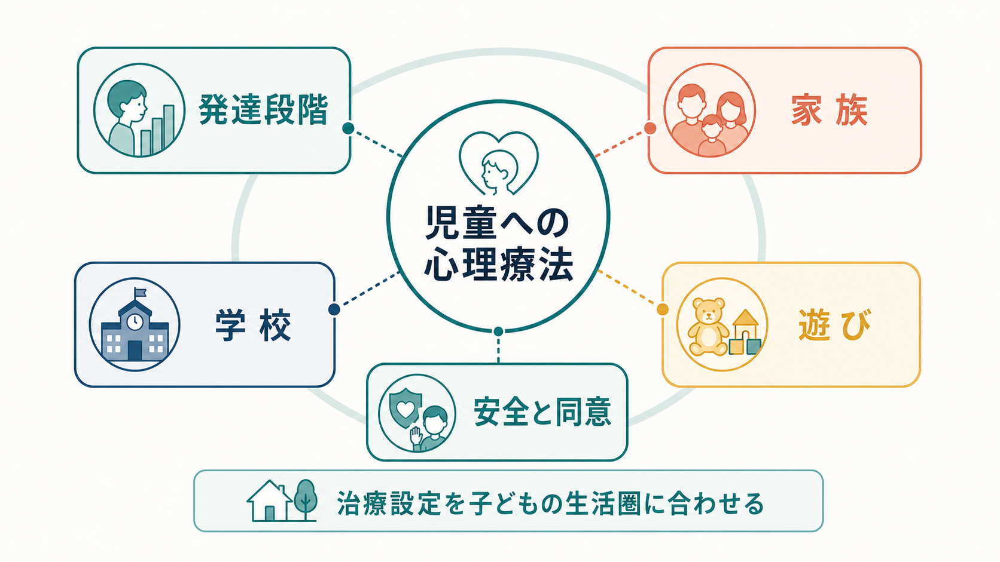
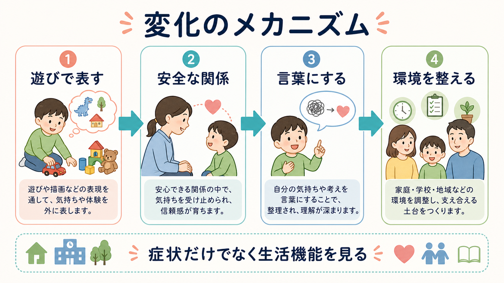
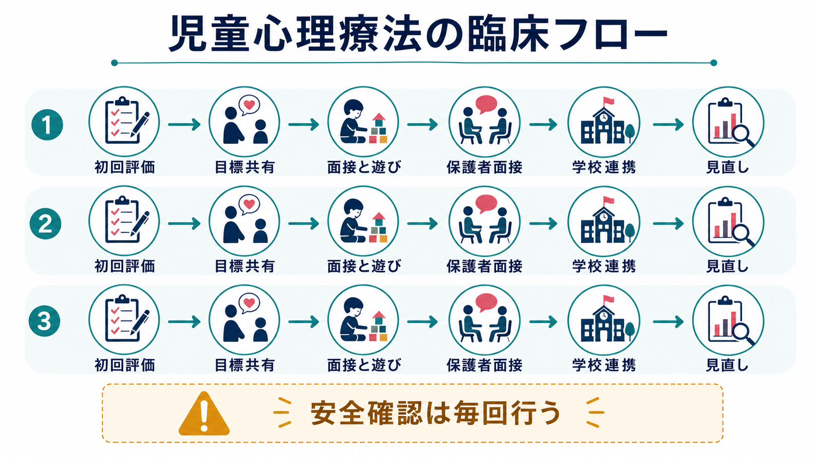

# 児童への心理療法では何に注意するのか

## 要点

- 児童への心理療法では、症状だけでなく、発達段階、家族、学校、遊び、身体状態、安全、文化的背景を同時に見る。
- 子どもは大人のように内省を言葉で整理できるとは限らない。遊び、行動、沈黙、身体症状、学校での変化も重要な表現である。
- 治療者は、子ども本人との治療同盟だけでなく、保護者、学校、医療・福祉機関との協働関係を設計する必要がある。
- 同意、守秘、危機対応、保護者への共有範囲は、初回から発達水準に合わせて説明し、必要に応じて更新する。
- 本記事は教育・研究目的の整理であり、個別の診断や治療指示ではない。

## この記事で答える問い

1. 児童への心理療法は成人の心理療法と何が違うのか。
2. 発達段階、家族、学校、遊びは治療設定にどう関わるのか。
3. 保護者面接、守秘、安全確認、学校連携では何に注意するのか。
4. どのような誤解が臨床判断を乱しやすいのか。

## まず結論

児童への心理療法は、子ども本人だけを面接室で扱う技法ではない。子どもは、家庭、学校、友人関係、身体発達、睡眠、遊び、デジタル環境の中で症状を示すため、治療設定もその生活圏に合わせて組む必要がある。WHO は、子どもと青年期を脳・認知・社会情緒的発達が急速に進む時期とし、家庭、学校、デジタル空間などの環境がメンタルヘルスに影響すると整理している[1]。

したがって、児童心理療法で最初に問うべきことは「どの技法を使うか」だけではない。「この子は何をどの発達水準で理解できるか」「保護者は何を期待し、何に困っているか」「学校では何が維持因になっているか」「遊びや行動は何を伝えているか」「安全上のリスクはあるか」を並行して評価する。AACAP や NICE の臨床ガイドライン群も、子どもの不安、うつ、自閉スペクトラム症などに対して、症状評価だけでなく、機能障害、家族、ケアの調整、エビデンスに基づく介入を重視している[3][4][5]。

## 背景

成人の[[心理療法とは何か]]では、言語化、自己理解、治療契約、症状モニタリングが中心に置かれやすい。児童でもこれらは重要だが、同じ形では成立しない。低年齢の子どもは、時間軸、因果関係、感情語、他者視点、抽象的な目標をまだ十分に扱えないことがある。そのため、治療者は質問を簡単にするだけでなく、絵、遊び、行動観察、親子相互作用、学校情報を組み合わせて理解する。

エビデンスの面では、児童青年期の心理療法は疾患や問題領域ごとに支持の強さが異なる。不安症では[[認知行動療法CBTとは何か]]が有効な選択肢として推奨され、必要に応じて薬物療法との併用も検討される[3]。うつ病では、年齢、重症度、リスク、希望に応じて個人CBT、集団CBT、対人関係療法、家族療法などが段階的に検討される[4]。一方で、自閉スペクトラム症など神経発達特性がある場合は、面接室内の言語的解釈だけでなく、感覚過敏、予測可能性、視覚的支援、保護者・教師を含む介入調整が必要になる[5]。

## 基本概念

### 発達段階に合わせる

児童心理療法では、暦年齢だけでなく、言語理解、注意、実行機能、感情調整、愛着、社会的理解、身体発達を評価する。たとえば小学校低学年の不安では、「不安を0から10で評定して認知を検討する」よりも、怖さを色や絵で表す、勇気階段を作る、保護者と練習場面を設計する方が理解しやすいことがある。思春期に近づくほど、本人のプライバシー、主体性、治療目標の合意がより重要になる。

### 家族を治療設定に含める

子どもの問題は、保護者のせいと単純化してはいけない。しかし保護者の理解、対応、疲弊、夫婦・家族関係、経済的困難、きょうだいへの影響は、治療の持続性とアウトカムに関わる。子ども単独の心理療法に親参加を加えた研究をまとめたメタ分析では、親を含む介入が子ども単独介入より追加的な利益を示したと報告されている[6]。保護者面接は、責める場ではなく、観察を共有し、対応を整え、家庭で再現できる支援を増やす場である。

### 学校と生活機能を見る

児童では、症状の改善だけでなく、登校、授業参加、友人関係、給食、睡眠、宿題、部活動、余暇などの生活機能を見る。学校はストレス源にも保護因子にもなる。いじめ、不登校、学習困難、発達特性への不適合、教師との関係、クラス替え、受験などは、治療計画に入る。学校連携では、本人と保護者の同意、共有情報の最小化、支援目標の明確化を守る。

### 遊びを臨床情報として扱う

遊びは、単なる気分転換ではない。子どもは遊びの中で、恐れ、怒り、支配、無力感、願望、関係パターンを表すことがある。子ども中心の遊戯療法に関するメタ分析では、中等度の効果が報告され、年齢、親の関与、治療忠実性などが効果に関わると示されている[7]。ただし、遊びを何でも象徴解釈するのは危険である。治療者は、遊びの内容、反復、感情の強さ、現実生活との対応、子ども本人の意味づけを慎重に統合する。

## 仕組み

児童心理療法の変化は、ひとつの経路だけで起きるわけではない。第一に、子どもが遊びや言葉で体験を表せるようになることで、混乱した感情が扱いやすくなる。第二に、治療者との安全な関係が、拒絶や失敗への予測を修正する。第三に、考え方、身体反応、行動、対人場面を少しずつ練習することで、回避や衝動的行動の維持サイクルが変わる。第四に、保護者や学校の対応が変わることで、家庭・学校での再発しやすい条件が減る。

この仕組みを支えるのが治療同盟である。児童青年期の心理療法における治療同盟のメタ分析では、子ども・治療者同盟や親・治療者同盟とアウトカムの関連は小から中程度だが一貫して重要であると報告されている[8]。児童の場合、治療同盟は「子どもと治療者」だけで完結しない。子ども、保護者、学校、紹介元がそれぞれ異なる期待を持つため、治療者は複数の同盟を調整する。

## 図解

初回から継続支援までの基本フローは、評価、目標共有、面接・遊び、保護者面接、学校連携、見直しの反復である。毎回の安全確認は、希死念慮、自傷、虐待、暴力、深刻なネグレクト、急激な機能低下、薬物・アルコール、オンライン被害などを含む。守秘は重要だが、危険が高い場合は子ども本人に説明しながら必要な大人へ共有する。

## 臨床・研究との接続

臨床では、技法選択を診断名だけで決めない。たとえば不安が主訴なら[[曝露療法とは何か]]やCBTが候補になるが、保護者の巻き込まれ、学校での回避、発達特性、睡眠不足、いじめが強ければ、同じCBTでも設計は変わる。気分の落ち込みが主訴なら[[対人関係療法IPTとは何か]]、行動活性化、家族面接、学校調整が必要になることがある。トラウマや関係性の問題が中心なら、安定化、安全確保、親子関係、必要に応じた専門的トラウマ治療を検討する。

研究では、症状尺度だけでなく、学校出席、家族負担、親子関係、生活の質、機能回復、脱落率、有害事象を追う必要がある。児童心理療法は、短期的な症状軽減だけでなく、発達の軌道を支える介入でもある。そのため、成人研究の結果をそのまま移すのではなく、年齢、発達水準、保護者参加、学校環境、文化的背景を明示して読むことが重要である。

## よくある誤解

### 誤解1: 子どもは自分のことを話せないので心理療法は向かない

言葉だけに頼るなら限界はある。しかし、遊び、描画、身体反応、行動、親子相互作用、学校での変化を通して評価と介入はできる。むしろ、言語化できない体験を安全に表現できる形に変えることが児童心理療法の中心になる。

### 誤解2: 保護者が同席すれば守秘は不要になる

保護者の関与は重要だが、子ども本人の信頼とプライバシーも重要である。初回に「何を保護者へ共有するか」「危険があるときはどうするか」「学校へ何を伝えるか」を発達水準に合わせて説明する。APA の倫理規定は、守秘の限界と情報利用について、同意能力が限られる人と法的代理人にも可能な範囲で説明することを求めている[2]。

### 誤解3: 遊びは専門性の低い介入である

遊びは雑談や気晴らしではなく、発達水準に合った評価・関係形成・感情調整の媒体になりうる。ただし、遊戯療法にも適応、治療構造、限界設定、保護者との連携、治療忠実性が必要である[7]。

### 誤解4: 学校連携は治療者が学校を説得することだ

学校連携の目的は、学校を責めることでも、治療者が教育判断を代行することでもない。本人の同意と保護者の了解を前提に、困難が起きる場面、合理的配慮、支援目標、役割分担、情報共有範囲を整理することである。

## 関連ノート

- [[心理療法とは何か]]
- [[認知行動療法CBTとは何か]]
- [[精神力動的精神療法とは何か]]
- [[対人関係療法IPTとは何か]]
- [[曝露療法とは何か]]
- [[支持的精神療法とは何か]]
- [[認知再構成法とは何か]]

## MOC更新候補

- `content/00_MOC/` 配下の臨床実践・心理療法・児童青年精神医学関連 MOC に追加候補。
- 並列記事生成との競合を避けるため、本ジョブでは MOC ファイルを更新しない。

## 理解チェック

1. 児童心理療法で、成人心理療法よりも保護者・学校連携が重要になりやすい理由は何か。
2. 遊びを臨床情報として扱うとき、過剰解釈を避けるには何を確認する必要があるか。
3. 守秘と安全確認が衝突する場面では、治療者はどのように説明すべきか。
4. 症状尺度だけでなく生活機能を追うべき理由は何か。

## 未解決問題

- 児童心理療法では、子ども本人、保護者、学校のどのアウトカムを主要評価項目にするかが研究ごとに異なりやすい。
- 文化、家庭構造、学校制度、経済的条件によって、同じ治療モデルの実装可能性が変わる。
- デジタル環境、SNS、オンラインゲーム、サイバー被害を治療設定にどう組み込むかは、今後さらに整理が必要である。

## 参考文献

[1] World Health Organization. Child and adolescent mental and brain health. https://www.who.int/mental_health/maternal-child/child_adolescent/en/

[2] American Psychological Association. Ethical principles of psychologists and code of conduct: Standards on informed consent and confidentiality. https://www.apa.org/ethics/code/manual-updates.html

[3] Walter, H. J., Bukstein, O. G., Abright, A. R., Keable, H., Ramtekkar, U., Ripperger-Suhler, J., & Rockhill, C. (2020). Clinical Practice Guideline for the Assessment and Treatment of Children and Adolescents With Anxiety Disorders. *Journal of the American Academy of Child & Adolescent Psychiatry, 59*(10), 1107-1124. https://doi.org/10.1016/j.jaac.2020.05.005

[4] National Institute for Health and Care Excellence. (2019). Depression in children and young people: identification and management. NICE guideline NG134. https://www.nice.org.uk/guidance/NG134

[5] National Institute for Health and Care Excellence. (2013, updated 2021). Autism spectrum disorder in under 19s: support and management. NICE guideline CG170. https://www.nice.org.uk/guidance/CG170

[6] Dowell, K. A., & Ogles, B. M. (2010). The effects of parent participation on child psychotherapy outcome: a meta-analytic review. *Journal of Clinical Child & Adolescent Psychology, 39*(2), 151-162. https://doi.org/10.1080/15374410903532585

[7] Lin, Y.-W., & Bratton, S. C. (2015). A meta-analytic review of child-centered play therapy approaches. *Journal of Counseling & Development, 93*(1), 45-58. https://doi.org/10.1002/j.1556-6676.2015.00180.x

[8] Karver, M. S., De Nadai, A. S., Monahan, M., & Shirk, S. R. (2018). Meta-analysis of the prospective relation between alliance and outcome in child and adolescent psychotherapy. *Psychotherapy, 55*(4), 341-355. https://doi.org/10.1037/pst0000176
