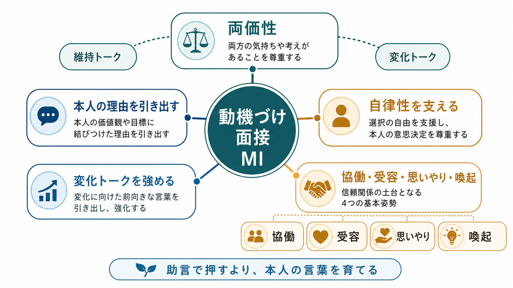
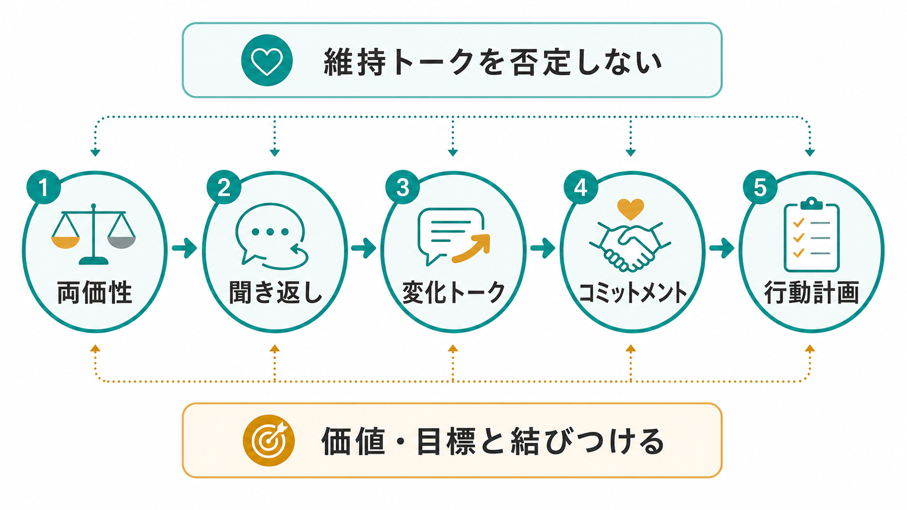
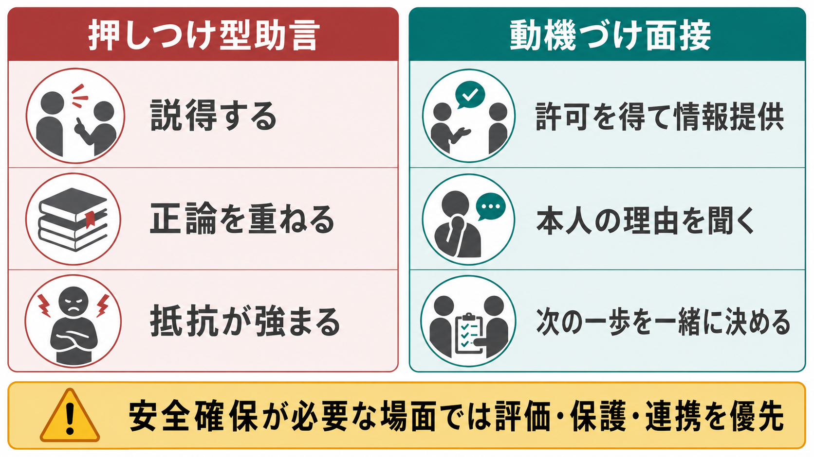

# 動機づけ面接とは何か

## 要点

- 動機づけ面接（motivational interviewing: MI）は、変化を説得で押し込む技法ではなく、本人の価値・目標・理由を引き出し、変化への動機とコミットメントを強める会話法である[1]。
- 中心にあるのは「両価性」である。変わりたい気持ちと、今のままでいたい気持ちの両方を尊重しながら、本人が自分の言葉で変化の意味を検討できる場をつくる[2][3]。
- 実践は、協働、受容、思いやり、喚起という姿勢に支えられ、開かれた質問、是認、聞き返し、要約などの基本スキルを使う[1][3]。
- 作用機序としては、治療者の共感的で自律性を支える応答が、本人の「変化トーク」と「維持トーク」の比率に影響し、行動変容につながるという仮説が重視される[4][5]。
- 効果研究では、健康行動、物質使用、プライマリケアなどで有用性が示されているが、効果量や持続性は対象、訓練、忠実度、アウトカムによって変わる[6][7][8]。

## この記事で答える問い

1. 動機づけ面接は、通常の助言や説得と何が違うのか。
2. 両価性、変化トーク、維持トークはどう関係するのか。
3. 臨床で使うとき、どこまでが MI で、どこからが別の評価・治療・危機対応なのか。
4. MI の研究を読むとき、効果と限界をどう見ればよいのか。

## まず結論

動機づけ面接は、「変わるべき理由」を専門家が与える面接ではない。むしろ、本人がすでに持っている価値、関心、困りごと、希望、迷いを丁寧に聞き、本人自身の言葉として変化の理由が出てくるように支える方法である[1][2]。

そのため MI では、抵抗を「非協力的な態度」として扱わない。変化しないことにも、しばしば短期的な安心、所属、痛みの軽減、習慣、恐怖の回避などの意味がある。ここを無視して正論を重ねると、本人は自分を守るために維持トークを強めやすい。MI はこの防衛的なやり取りを弱め、本人が「それでも変わりたい」と言える余地を広げる。

## 背景

動機づけ面接は、もともとアルコール問題への臨床実践から発展し、その後、物質使用、喫煙、服薬アドヒアランス、生活習慣、慢性疾患管理、司法・教育・福祉領域へ広がった[2][3]。背景には、単に情報を与えるだけでは行動が変わらないという臨床的事実がある。

人は「知っているのに変えられない」ことが多い。飲酒、喫煙、過食、運動不足、服薬中断、回避行動、対人パターンなどでは、本人もリスクを理解していることが少なくない。それでも行動が続くのは、行動が何らかの機能を持っているからである。MI はこの点で [[心理療法とは何か]] や [[認知行動療法CBTとは何か]] と接続するが、中心に置くのは技能訓練や認知修正そのものではなく、変化に向かう会話の質である。

## 基本概念

### 両価性

両価性とは、同じ対象に対して相反する動機が同時に存在することである。「飲酒を減らしたいが、飲むと楽になる」「薬は続けたいが、副作用がつらい」「人前に出たいが、失敗が怖い」といった形で現れる。

MI では、この両価性を矛盾や弱さとして裁かない。むしろ両価性は、変化が本人にとって重要だからこそ生じる自然な状態である。本人が維持側の理由も変化側の理由も話せると、面接は説得の場ではなく、選択の意味を検討する場になる[3]。

### MI の精神

MI の土台は、協働、受容、思いやり、喚起である[1]。

| 要素 | 意味 | 面接での現れ |
|---|---|---|
| 協働 | 専門家と本人が対等な作業同盟をつくる | 「一緒に整理する」姿勢 |
| 受容 | 本人の自律性、価値、経験を尊重する | 変わる・変わらない権利を認める |
| 思いやり | 面接者の都合ではなく本人の利益を優先する | 操作的な誘導を避ける |
| 喚起 | 本人の中にある理由・力・知恵を引き出す | 本人の言葉を聞き返し、深める |

### 変化トークと維持トーク

変化トークとは、本人が変化を望む、変化できる、変化する理由がある、変化する必要がある、すでに一歩動いている、という方向の発言である。維持トークとは、今の行動を続ける理由や、変えない理由を語る発言である。

重要なのは、維持トークを論破しないことである。論破されるほど、本人は維持側の理由をさらに説明しやすい。MI では維持トークを聞き取りつつ、変化トークが出た場面を丁寧に聞き返し、本人の価値や目標とのつながりを明確にする[4][5]。

## 仕組み

MI のプロセスは、しばしば「関係づくり」「焦点化」「喚起」「計画」の4段階で整理される[1][3]。これは直線的な手順というより、面接の中で行き来する作業である。

| プロセス | 中心課題 | 典型的な問い |
|---|---|---|
| 関係づくり | 安全に話せる関係をつくる | 「何から話すのがよさそうですか」 |
| 焦点化 | 何について変化を考えるかを共有する | 「今日は飲酒と睡眠のどちらを整理しますか」 |
| 喚起 | 本人の変化理由を引き出す | 「変えたいと思う理由があるとすれば何ですか」 |
| 計画 | 次の小さな行動を具体化する | 「今週できそうな一歩は何ですか」 |

研究上は、MI には関係的要素と技術的要素があると考えられる。関係的要素は、共感、受容、作業同盟、自律性支援である。技術的要素は、変化目標に焦点を合わせ、変化トークを選択的に聞き返し、維持トークを強化しすぎないように進めることである[4]。

ただし、変化トークが常に単純に良いアウトカムを予測するわけではない。メタ分析では、変化トークの頻度だけよりも、維持トークの少なさや、変化トークが全体の動機づけ発言に占める比率のほうがアウトカムと安定して関係する可能性が示されている[5]。臨床的には、「変化トークを増やせばよい」と単純化せず、本人の迷い全体を丁寧に扱う必要がある。

## 図解

MI を一枚の流れとして見ると、次のようになる。

| 段階 | 面接者が避けること | 面接者が行うこと |
|---|---|---|
| 両価性の把握 | すぐ説得する | 両方の気持ちを聞く |
| 聞き返し | 正誤判定を急ぐ | 本人の言葉の意味を返す |
| 変化トーク | 変化理由を教える | 本人の理由を引き出す |
| コミットメント | 約束を強要する | 本人の準備度を確認する |
| 行動計画 | 大きすぎる目標を置く | 小さく具体的な一歩にする |

MI は「やさしく聞くだけ」ではない。変化目標に焦点を合わせながらも、本人の自律性を損なわないように進む、方向性のある会話である[1][3]。

## 臨床・研究との接続

臨床では、MI は単独の心理療法としても、他の治療に入る前の準備としても使われる。たとえば、[[認知行動療法CBTとは何か]] のホームワークに取り組む前、生活習慣の変更を相談するとき、物質使用の治療参加を検討するとき、本人が治療目標をまだ決めきれていないときに有用である。

一方で、MI は危機対応の代替ではない。自殺リスク、虐待、重度の離脱、急性精神病症状、生命に関わる身体リスクがある場合は、動機づけを待つよりも、評価、安全確保、保護、医療連携を優先する。MI の自律性尊重は、必要な安全介入を放棄することではない。

効果研究では、初期のメタ分析で、MI が多様な行動問題や疾患に対して従来型助言より良好な結果を示す研究が多いと報告された[6]。プライマリケアを対象としたメタ分析でも、全体として小さいが有意な効果が示され、体重、血圧、物質使用などで相対的に大きな効果が報告されている[7]。ただし、研究間のばらつきは大きく、短時間介入、訓練水準、面接の忠実度、アウトカムの種類によって結果は変わる。

このため、研究や研修では MI が実際に行われたかを測定する必要がある。MITI などの忠実度評価は、治療者が変化トークを育てているか、自律性を支えているか、説得や対立を過度に使っていないかを評価するために用いられる[8]。

## よくある誤解

### 誤解1: MI は説得をやわらかく言い換えたものだ

MI は相手を望ましい方向に操作するための話術ではない。本人の価値と選択を尊重し、変化の理由を本人の言葉として扱う点が本質である[1]。

### 誤解2: MI は受容するだけで、方向性がない

MI は非指示的な傾聴だけではない。変化目標に焦点を合わせ、変化トークを引き出し、必要に応じて計画化する。方向性はあるが、押しつけではない。

### 誤解3: 正しい情報を伝えてはいけない

情報提供は可能である。ただし、許可を得る、本人がすでに知っていることを確認する、複数の選択肢として伝える、本人がどう受け取ったかを聞く、という形が望ましい[3]。

### 誤解4: MI を使えば誰でも必ず変わる

MI は万能ではない。本人の状況、社会的資源、症状の重さ、治療者の熟練、面接の忠実度、環境制約によって効果は変わる。臨床では、MI を単独で使うか、CBT、薬物療法、家族支援、ケースマネジメントなどと組み合わせるかを判断する。

## 関連ノート

- [[心理療法とは何か]]
- [[認知行動療法CBTとは何か]]
- [[アクセプタンス&コミットメント・セラピーACTとは何か]]

MOC 更新候補:

- `content/00_MOC/` 配下の心理療法・臨床実践系 MOC に、本記事へのリンクを追加する候補。

今後の作成候補:

- `変化トークとは何か`
- `維持トークとは何か`
- `行動変容とは何か`
- `治療同盟とは何か`
- `物質使用障害の心理社会的支援とは何か`

## 理解チェック

1. MI で「両価性」を尊重するとは、変化しない理由を肯定することではなく、変化しない理由が持つ機能を理解し、本人が選択を検討できるようにすることである。
2. 変化トークは、面接者が作った正解を言わせることではなく、本人の価値や目標から出てくる変化の言葉である。
3. 維持トークが出たとき、反射的に論破すると維持側の理由が強まりやすい。
4. MI の効果を評価するには、介入名だけでなく、忠実度、対象、アウトカム、比較条件を確認する必要がある。
5. 安全確保が必要な急性場面では、MI よりも評価・保護・連携が優先される。

## 参考文献

[1] Motivational Interviewing Network of Trainers. Understanding Motivational Interviewing. https://motivationalinterviewing.org/understanding-motivational-interviewing

[2] Rollnick, S., & Miller, W. R. (1995). What is motivational interviewing? *Behavioural and Cognitive Psychotherapy*, 23(4), 325-334. https://doi.org/10.1017/S135246580001643X

[3] Substance Abuse and Mental Health Services Administration. (2019). *Enhancing Motivation for Change in Substance Use Disorder Treatment*. Treatment Improvement Protocol (TIP) Series No. 35. https://www.ncbi.nlm.nih.gov/books/NBK571071/

[4] Apodaca, T. R., & Longabaugh, R. (2009). Mechanisms of change in motivational interviewing: A review and preliminary evaluation of the evidence. *Addiction*, 104(5), 705-715. https://pmc.ncbi.nlm.nih.gov/articles/PMC2756738/

[5] Magill, M., Bernstein, M. H., Hoadley, A., Borsari, B., Apodaca, T. R., Gaume, J., & Moyers, T. (2018). Do what you say and say what you are going to do: A preliminary meta-analysis of client change and sustain talk subtypes in motivational interviewing. *Psychotherapy*, 55(4), 484-493. https://pmc.ncbi.nlm.nih.gov/articles/PMC6310665/

[6] Rubak, S., Sandbaek, A., Lauritzen, T., & Christensen, B. (2005). Motivational interviewing: A systematic review and meta-analysis. *British Journal of General Practice*, 55(513), 305-312. https://pubmed.ncbi.nlm.nih.gov/15826439/

[7] VanBuskirk, K. A., & Wetherell, J. L. (2014). Motivational interviewing used in primary care: A systematic review and meta-analysis. *Journal of Behavioral Medicine*, 37(4), 768-780. https://pmc.ncbi.nlm.nih.gov/articles/PMC4118674/

[8] Moyers, T. B., Rowell, L. N., Manuel, J. K., Ernst, D., & Houck, J. M. (2016). The Motivational Interviewing Treatment Integrity Code (MITI 4): Rationale, preliminary reliability and validity. *Journal of Substance Abuse Treatment*, 65, 36-42. https://doi.org/10.1016/j.jsat.2016.01.001
