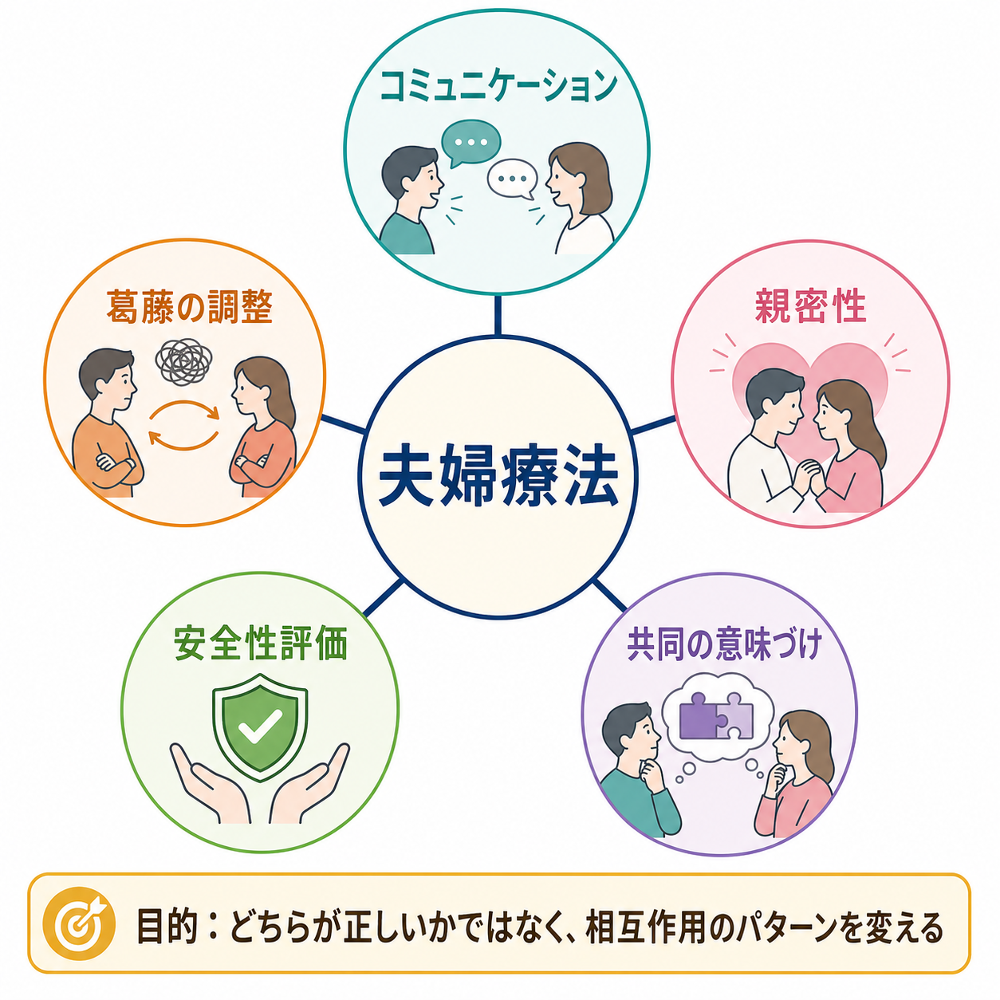
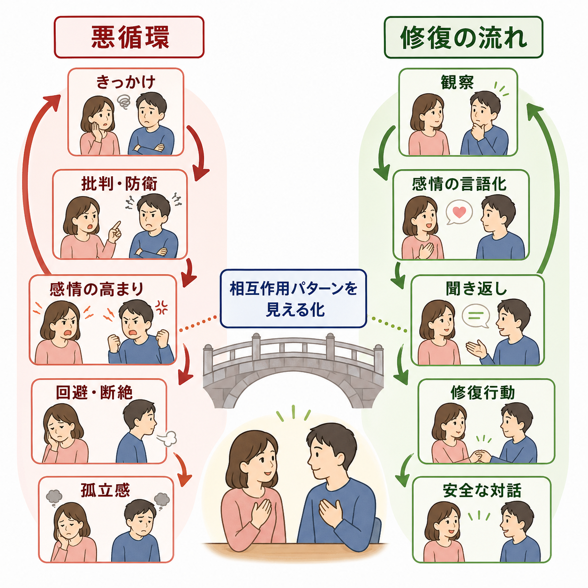
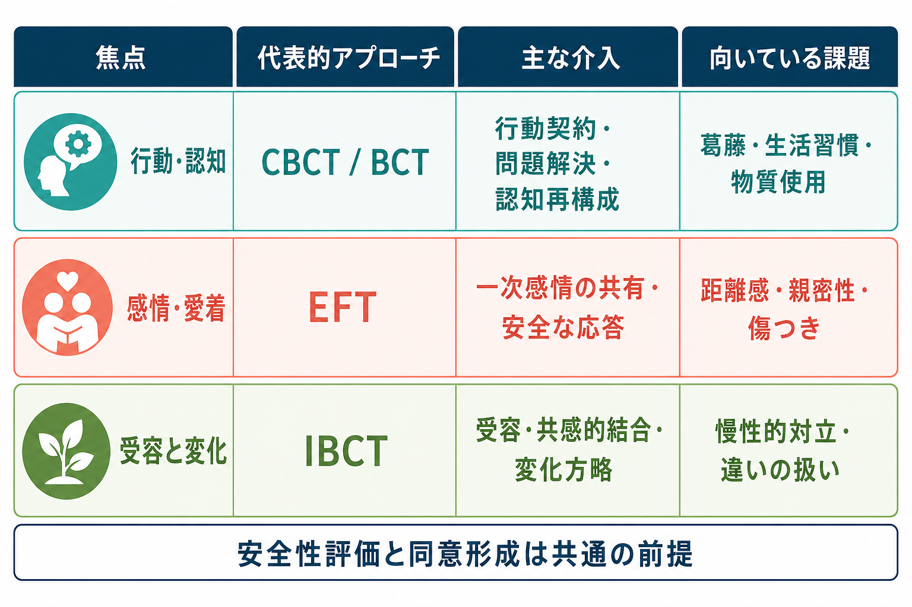

# 夫婦療法とは何か

## 要点

- 夫婦療法は、片方を「問題の原因」と決める治療ではなく、二人のあいだで反復される相互作用パターンを理解し、より安全で柔軟な関わり方を増やす[[心理療法とは何か|心理療法]]である。
- 主な対象は、コミュニケーション不全、慢性的な葛藤、親密性の低下、信頼の揺らぎ、子育て・家事・金銭・性・家族関係をめぐる対立である。
- 認知行動療法系、情動焦点化療法、統合的行動的夫婦療法など、複数のエビデンスに基づくアプローチがある。
- メタ分析では、夫婦療法は関係満足、コミュニケーション、情緒的親密性、パートナー行動などに改善効果を示すが、長期維持や対象集団には限界もある[1][2]。
- 暴力、強制的支配、深刻な恐怖がある場合は、通常の合同面接を当然の選択肢にせず、安全性評価、個別支援、危機対応を優先する[8]。

## この記事で答える問い

1. 夫婦療法は、一般的なカウンセリングや個人療法と何が違うのか。
2. 夫婦療法では、コミュニケーション、葛藤、親密性をどのように扱うのか。
3. 代表的なアプローチには何があり、研究上どこまで有効性が示されているのか。
4. どのような場合に慎重な安全性評価が必要なのか。

## まず結論

夫婦療法とは、パートナー二者の「性格」や「正しさ」を裁く場ではなく、二人の関係の中で繰り返される反応の連鎖を、面接室の中で観察し、言葉にし、試しに変えていく心理療法である。たとえば、一方が不安から強く追及し、もう一方が防衛的に黙り、その沈黙がさらに不安を高める、という循環がある。この循環を「どちらが悪いか」ではなく「何が二人を同じ場所に戻しているのか」として扱う。

夫婦療法の効果研究は、関係満足やコミュニケーション指標で一定の改善を示している。58研究、40サンプル、2,092組を扱ったメタ分析では、夫婦療法群の関係満足は治療前後で大きく改善し、観察されたコミュニケーション、情緒的親密性、パートナー行動にも有意な変化が報告された[1]。ただし、全ての夫婦に同じ方法が同じように効くわけではない。暴力、恐怖、支配、重い物質使用、急性の自殺リスクなどがある場合には、関係改善よりも安全確保とリスク管理が先に来る。

## 背景

親密な関係は、支え合いの資源になる一方で、心理的苦痛を維持する環境にもなりうる。夫婦やパートナー関係の葛藤は、抑うつ、不安、物質使用、睡眠、育児ストレス、職場機能、身体健康と相互に影響しやすい。そのため臨床では、個人の症状だけでなく、その症状がどのような対人環境の中で悪化し、どのような関係資源で緩和されるのかを見立てる必要がある。

夫婦療法は、この「関係の中で問題が維持される仕組み」を扱う。近接領域としては、[[対人関係療法IPTとは何か|対人関係療法]]、[[認知行動療法CBTとは何か|認知行動療法]]、[[メンタライゼーションに基づく治療MBTとは何か|メンタライゼーションに基づく治療]]、家族療法、性療法、物質使用治療、周産期・子育て支援などがある。夫婦療法はそれらと排他的ではなく、個人療法、薬物療法、家族支援、社会資源と併用されることも多い。

## 基本概念

### 関係を「相互作用」として見る

夫婦療法の基本単位は、個人の内面だけではなく、二人のあいだで繰り返される相互作用である。典型的には、批判、弁明、皮肉、沈黙、回避、過剰な譲歩、爆発、修復の失敗といった反応が連鎖する。治療者は、どちらか一方の味方になるのではなく、その連鎖がどのように始まり、強まり、終わり、翌日以降に持ち越されるのかを一緒に整理する。

### コミュニケーションを「スキル」だけに還元しない

聞き返し、要約、感情の言語化、問題解決、交渉、境界設定は重要である。しかし夫婦療法では、単に「上手な話し方」を教えるだけでは不十分なことが多い。なぜなら、同じ言葉でも、恐怖、恥、見捨てられ不安、怒り、諦め、支配感、過去の傷つきによって受け取られ方が変わるからである。したがって、スキル練習と同時に、感情、認知、身体反応、愛着欲求、生活上の文脈を扱う。

### 変化と受容の両方を扱う

夫婦療法では、行動を変えることと、すぐには変わらない違いを扱えるようにすることの両方が重要である。統合的行動的夫婦療法では、問題を相手の欠陥としてではなく、二人がもつ感受性、歴史、生活条件の組み合わせとして理解し、受容と変化方略を併用する。慢性的に苦痛の高い夫婦を対象にしたRCTでは、伝統的行動的夫婦療法と統合的行動的夫婦療法の双方で関係満足とコミュニケーションの改善が示された[4]。

## 仕組み

夫婦療法の変化メカニズムは一つではない。代表的には、次の経路が重なって働く。

第一に、悪循環の可視化である。治療者は、出来事そのものよりも、その後に起きる反応の連鎖に注目する。「言い方が強くなる」「黙る」「確認が増える」「距離を取る」「さらに孤立する」といった流れを図式化し、二人が同じ循環を外から見られるようにする。

第二に、感情の再組織化である。怒りや批判の背後にある寂しさ、怖さ、恥、重要に扱われたい欲求を言葉にできると、相手は攻撃としてではなく脆弱性として受け取りやすくなる。情動焦点化療法は、このような一次感情と愛着欲求の共有を重視する。EFTのシステマティックレビューでは、関係満足の改善とフォローアップでの維持を示す研究があるが、研究数や方法上の限界もある[3]。

第三に、行動レパートリーの拡張である。問題解決、行動契約、ポジティブな交流、時間の使い方、家事分担、金銭管理、子育て方針、性的親密性について、具体的な試行を行う。これは[[DBTの対人関係スキルとは何か|DBTの対人関係スキル]]や認知行動療法的技法とも接続しやすい。

第四に、修復行動の学習である。関係の質は、葛藤が全くないことではなく、傷つけた後にどう戻れるかに大きく左右される。謝罪、説明、確認、休止、再開、境界の明確化、再発予防は、夫婦療法の重要な実践課題である。

## 図解

夫婦療法を一枚の臨床地図として見るなら、中心には「相互作用パターン」がある。その周囲に、コミュニケーション、葛藤調整、親密性、安全性評価、共同の意味づけが配置される。治療者は、二人の語りを単に公平に聞くだけではなく、パターンがどこで強まり、どこに修復可能性があり、どこにリスクがあるのかを見立てる。

主要アプローチは、焦点の置き方によって整理できる。CBCT/BCTは行動、問題解決、認知再構成を扱いやすい。EFTは愛着、一次感情、安全な応答を重視する。IBCTは受容、共感的結合、変化方略を組み合わせる。RCTだけに絞ったメタ分析では、BCTとEFTはいずれも治療後の関係満足に中等度の効果を示し、6か月後にも小から中等度の効果が残る一方、12か月以降の維持については慎重な解釈が必要とされた[2]。

## 臨床・研究との接続

臨床実践では、最初に「二人で話せばよい」と決めつけないことが重要である。初回から、安全性、同意、守秘、治療目標、暴力や威圧の有無、物質使用、急性の精神症状、子どもの安全、別居・離婚・法的手続きの状況を確認する。特に親密なパートナー間暴力では、合同面接が安全とは限らない。レビューでは、夫婦合同の介入は一部の状況で有用な可能性がある一方、慎重なスクリーニング、継続的な安全評価、危機時の代替計画、地域資源との連携が不可欠とされる[8]。

研究面では、夫婦療法は関係満足だけでなく、抑うつ、物質使用、暴力、慢性疾患、育児、トラウマ、性的問題などと接続している。抑うつ治療としての夫婦療法を扱ったメタ分析では、抑うつ症状について個人療法との差は明確ではなかったが、関係苦痛の低減では夫婦療法群が有利だった[7]。物質使用障害に対する行動的夫婦療法のメタ分析では、使用頻度、使用に伴う問題、関係満足で対照条件より良い結果が示された[6]。

長期経過にも注意が必要である。行動的夫婦療法を受けた134組を5年追跡した研究では、治療反応の予測因子としてコミットメントや婚姻期間などが検討され、治療後の変化が単純に一様ではないことが示された[5]。これは、夫婦療法を「技法パッケージ」としてだけでなく、関係の歴史、生活条件、動機づけ、社会的文脈の中で理解する必要があることを示している。

## よくある誤解

### 誤解1: 夫婦療法は、どちらが正しいかを決める場である

実際には、夫婦療法は裁判や説得の場ではない。治療者は、事実確認が必要な点と主観的経験を区別しながら、二人が同じ悪循環にどう巻き込まれているかを見る。もちろん、暴力、脅迫、虐待、強制的支配は「単なる意見の違い」として中立化してはいけない。

### 誤解2: 話し合えば必ず良くなる

話し合いは、条件が整えば有効である。しかし、恐怖、支配、深い回避、急性の危機、重い酩酊、睡眠不足、強い羞恥があると、話し合いはむしろ悪循環を強める。夫婦療法では、話す内容だけでなく、話す順序、時間、身体反応、休止の合図、安全な中断方法を設計する。

### 誤解3: 愛情が残っていれば治療はうまくいく

愛情は重要な資源だが、それだけで変化は起きない。具体的な行動、責任の取り方、境界設定、再発予防、必要な外部支援が伴わなければ、関係は同じ場所に戻る。逆に、強い愛情表現が少なくても、相互尊重と行動変化が積み上がることで関係が改善することもある。

### 誤解4: 夫婦療法は離婚を防ぐための治療である

夫婦療法の目的は、必ず関係を継続させることではない。継続、修復、距離の取り方、別居、別れ方、共同養育などを、より安全で現実的に選べるようにすることも臨床的な目標になりうる。特に子どもがいる場合には、関係を続けるかどうかとは別に、共同養育のコミュニケーションを整えることが課題になる。

## 関連ノート

- [[心理療法とは何か]]
- [[認知行動療法CBTとは何か]]
- [[対人関係療法IPTとは何か]]
- [[支持的精神療法とは何か]]
- [[メンタライゼーションに基づく治療MBTとは何か]]
- [[DBTの対人関係スキルとは何か]]

### 関連ノート候補

- 家族療法とは何か
- 情動焦点化療法EFTとは何か
- 統合的行動的夫婦療法IBCTとは何か
- 親密なパートナー間暴力IPVとは何か
- 共同養育と心理療法

### MOC更新候補

- `content/00_MOC/` 配下の心理療法・臨床実践系 MOC に、バッチ統合時に `[[夫婦療法とは何か]]` を追加する。

## 理解チェック

1. 夫婦療法が「相互作用パターン」を重視するのはなぜか。
2. コミュニケーション・スキルだけでは不十分になりやすい場面はどのような場面か。
3. BCT、EFT、IBCTは、それぞれ何に焦点を置きやすいか。
4. 親密なパートナー間暴力が疑われる場合、通常の合同面接を急いではいけない理由は何か。

## 参考文献

[1] Roddy, M. K., Nowlan, K. M., Doss, B. D., & Christensen, A. (2020). Meta-analysis of couple therapy: Effects across outcomes, designs, timeframes, and other moderators. *Journal of Consulting and Clinical Psychology, 88*(7), 583-596. https://doi.org/10.1037/ccp0000514

[2] Rathgeber, M., Bürkner, P. C., Schiller, E. M., & Holling, H. (2019). The efficacy of emotionally focused couples therapy and behavioral couples therapy: A meta-analysis. *Journal of Marital and Family Therapy, 45*(3), 447-463. https://doi.org/10.1111/jmft.12336

[3] Beasley, C. C., & Ager, R. (2019). Emotionally focused couples therapy: A systematic review of its effectiveness over the past 19 years. *Journal of Evidence-Based Social Work, 16*(2), 144-159. https://doi.org/10.1080/23761407.2018.1563013

[4] Christensen, A., Atkins, D. C., Berns, S., Wheeler, J., Baucom, D. H., & Simpson, L. E. (2004). Traditional versus integrative behavioral couple therapy for significantly and chronically distressed married couples. *Journal of Consulting and Clinical Psychology, 72*(2), 176-191. https://doi.org/10.1037/0022-006X.72.2.176

[5] Baucom, B. R., Atkins, D. C., Simpson Rowe, L., Doss, B. D., & Christensen, A. (2015). Prediction of treatment response at 5-year follow-up in a randomized clinical trial of behaviorally based couple therapies. *Journal of Consulting and Clinical Psychology, 83*(1), 103-114. https://doi.org/10.1037/a0038005

[6] Song, Y., Li, D., Zhang, S., Wang, L., Zhen, Y., Su, Y., Zhang, M., Lu, L., Xue, X., Luo, J., & Liang, M. (2023). The effect of behavior couples therapy on alcohol and drug use disorder: A systematic review and meta-analysis. *Alcohol and Alcoholism, 58*(1), 13-22. https://doi.org/10.1093/alcalc/agac053

[7] Barbato, A., & D'Avanzo, B. (2008). Efficacy of couple therapy as a treatment for depression: A meta-analysis. *Psychiatric Quarterly, 79*(2), 121-132. https://doi.org/10.1007/s11126-008-9068-0

[8] McCollum, E. E., & Stith, S. M. (2008). Couples treatment for interpersonal violence: A review of outcome research literature and current clinical practices. *Violence and Victims, 23*(2), 187-201. https://doi.org/10.1891/0886-6708.23.2.187

## 未解決問題

- どの夫婦に、どのアプローチを、どの順序で組み合わせるのが最も有効かは、まだ十分に個別化されていない。
- 長期維持、再発予防、文化差、同性カップル、非婚カップル、神経発達特性をもつカップルへの適用には、さらに研究が必要である。
- 暴力や強制的支配を含む関係に対して、どの条件なら合同介入が安全で、どの条件なら個別支援や保護を優先すべきかは、臨床倫理と研究の両面で継続的な検討が必要である。
