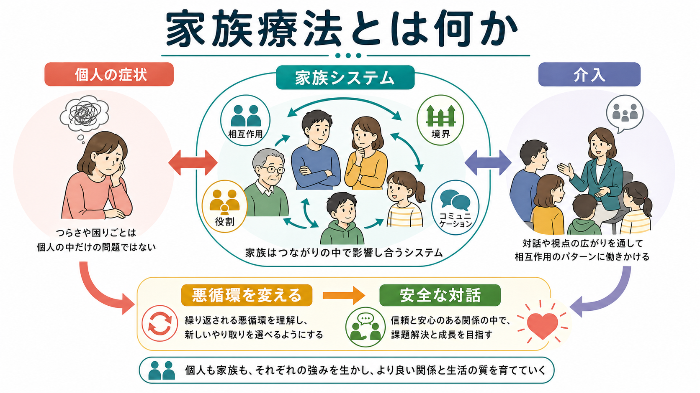
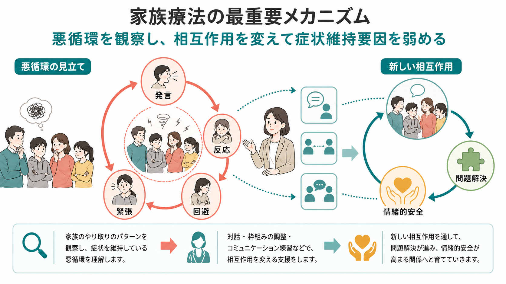

# 家族療法とは何か

## 要点

- 家族療法は、症状や困りごとを「本人だけの問題」として閉じず、家族内外の関係、役割、境界、コミュニケーション、生活文脈の中で理解する[[心理療法とは何か]]である[1]。
- 中心にあるのは、「誰が悪いか」ではなく、「どの相互作用パターンが問題を維持し、どの相互作用なら回復を助けるか」という問いである[2][4]。
- 代表的な見立てには、家族システム、循環的因果、三角関係、境界、役割、情緒的反応性、コミュニケーション・パターンがある[2][3][4]。
- エビデンスは問題領域によって異なる。統合失調症などの精神病圏では家族介入が再発や入院を減らす可能性が示され、児童青年の摂食障害では家族を含む治療がガイドライン上も重視される[6][7][8]。
- 医療・精神医学領域では、家族療法は教育・研究・臨床理解の枠組みとして扱うべきであり、個別の診断や治療方針は専門職との相談が必要である。

## この記事で答える問い

1. 家族療法は、個人療法やカウンセリングと何が違うのか。
2. 「家族システム」「相互作用」「循環的因果」とは何を意味するのか。
3. 家族療法では、どのように問題の維持パターンを見立て、介入するのか。
4. 臨床や研究では、どの領域で有用性が示されているのか。

## まず結論

家族療法とは、症状を抱える人を家族から切り離して見るのではなく、その人が生活している関係ネットワークの中で問題を理解し、相互作用の変化を通じて回復条件を広げる方法である。AAMFT は、たとえ面接に一人しか来ていない場合でも、治療単位は本人だけでなく、その人が埋め込まれている関係の集合だと説明している[1]。

ただし、これは「家族が原因である」と断定する考え方ではない。家族療法が問うのは、原因の犯人探しではなく、反復される会話、沈黙、回避、過干渉、孤立、役割固定、境界の曖昧さが、現在の困りごとをどう強めたり弱めたりしているかである[2][4]。そのため、家族療法は「責任追及」ではなく「関係の再設計」として理解すると分かりやすい。

## 背景

家族療法は、20世紀半ば以降、個人の内面だけでは説明しにくい臨床現象を、家族・コミュニケーション・社会的文脈の中で扱う流れとして発展した。構造的家族療法を展開した Minuchin は、家族の下位システム、境界、階層、連合、相互作用の構造に注目し、問題を維持する家族構造を治療場面で変化させることを重視した[2]。

Bowen の家族システム理論は、三角関係、自己分化、多世代伝達などを通じて、家族内の情緒的プロセスが個人の症状や対人関係に影響することを整理した[3]。また、Watzlawick らのコミュニケーション論は、発話内容だけでなく、関係性、文脈、相互作用のパターンとしてコミュニケーションを読む視点を広げた[4]。

この背景から、家族療法は一つの技法ではなく、複数のモデルを含む広い臨床領域である。構造派、戦略派、Bowen派、ミラノ派、ナラティヴ・アプローチ、解決志向アプローチ、機能的家族療法、家族心理教育、摂食障害に対する家族ベース治療など、目的や対象によって方法は異なる。

## 基本概念

### 家族システム

家族システムとは、家族を「個人の足し算」ではなく、互いに影響し合う関係のまとまりとして見る考え方である。たとえば、ある子どもの不登校を、その子の不安だけで説明するのではなく、親の心配、学校との連絡、兄弟姉妹の反応、家庭内の緊張、支援資源の有無を含めて見る。

### 循環的因果

循環的因果とは、A が B の原因で、B が C の原因で終わるという直線的な因果ではなく、互いの反応が次の反応を呼び、ループを作るという見方である。たとえば、親が心配して確認する、本人が責められたように感じて黙る、親がさらに不安になって確認を強める、本人がさらに回避する、という循環である。

### 境界と役割

境界とは、家族内の距離感や責任の分担である。近すぎる境界では過干渉や巻き込まれが起きやすく、遠すぎる境界では孤立や支援不足が起きやすい。役割とは、「問題を抱える人」「まとめ役」「調停役」「世話役」「反抗役」など、家族内で反復される位置取りである[2]。

### 三角関係

三角関係とは、二者関係の緊張が第三者を巻き込むことで一時的に安定するが、長期的には問題を維持することがある関係パターンである。Bowen 理論では、家族内の不安や緊張が三角関係を通じて分散・固定される点が重視される[3]。

## 仕組み

家族療法の実践は、典型的には次の流れで進む。

| 段階 | 何を見るか | 介入の例 |
|---|---|---|
| 見立て | 誰が、いつ、何に反応し、どのループが続いているか | 家族図、相互作用観察、循環質問 |
| 共有 | 問題を個人の欠陥ではなく相互作用パターンとして言語化する | リフレーミング、心理教育 |
| 実験 | いつもと違う反応を小さく試す | 会話手順、境界調整、役割変更 |
| 定着 | 変化した相互作用を生活場面に広げる | 宿題、再発予防、支援資源の整理 |

重要なのは、症状そのものを軽視しないことである。家族療法は、薬物療法、個人療法、学校・職場調整、福祉支援、危機介入と競合するものではない。むしろ、本人が治療や支援を受けやすくなる環境を整える補助線になる。

## 図解

上の 1 枚目は、家族療法の基本地図である。個人の症状を中心に置きつつ、それを家族システム、役割、境界、コミュニケーション、介入、回復条件へ接続している。

2 枚目は、家族療法でよく扱う悪循環の見立てである。発言、反応、回避、緊張がループを作ると、各メンバーは「自分なりに対処している」のに、全体として問題が維持されることがある。介入では、このループを観察可能にし、責める会話を減らし、感情を言語化し、境界や役割を調整し、新しい相互作用を試す。

## 臨床・研究との接続

家族療法の有効性は、対象となる問題によって強さが異なる。Carr によるレビューでは、成人領域では関係性の困難、気分・不安、アルコール問題、統合失調症、慢性身体疾患への適応などで、カップル療法・家族療法・システミック介入の有効性を支持する研究が整理されている[5]。児童青年領域でも、行動問題、情緒問題、摂食障害、身体疾患、初発精神病などで、家族を含むシステミック介入のエビデンスが検討されている[6]。

統合失調症に対する家族介入については、Cochrane レビューで再発や入院を減らす可能性が示された一方、研究の質や報告の不十分さによる限界も指摘されている[7]。つまり、家族介入は有望だが、「どの家族にも同じ形で効く万能法」ではない。

児童青年の摂食障害では、NICE ガイドラインが、神経性やせ症の子ども・若者に対して anorexia-nervosa-focused family therapy を検討すること、家族を責めず、回復を助ける役割を強調することを推奨している[8]。これは家族療法の重要な臨床原則、すなわち「家族を原因として責める」のではなく「回復を支える資源として協働する」ことをよく示している。

## よくある誤解

### 誤解1: 家族療法は家族を責める治療である

家族療法は、家族の責任を追及するための方法ではない。むしろ、各メンバーがそれぞれの不安や善意から行っている反応が、意図せず悪循環を作ることがあると考える。したがって、治療上の焦点は「悪い人」ではなく「変えられるパターン」である。

### 誤解2: 本人が来なければ家族療法はできない

本人が参加できる場合は望ましいことが多いが、常に必須ではない。家族の一部が相談し、関わり方や支援環境を変えることで、本人を取り巻く条件が変わることもある。ただし、本人の同意、プライバシー、危機リスク、虐待や暴力の有無には十分な配慮が必要である。

### 誤解3: 家族療法は個人療法より浅い

家族療法は、個人の内面を無視する方法ではない。感情、信念、身体反応、発達史を扱いつつ、それらが関係の中でどう表現され、維持され、変化するかを見る。[[対人関係療法IPTとは何か]]が現在の対人関係を治療焦点にするのと同じく、家族療法も関係性を症状理解の入口にする。

### 誤解4: 家族がそろえば自然に良くなる

家族を集めるだけでは十分ではない。安全な枠組み、目的の共有、発言機会の調整、暴力や支配の評価、子どもや弱い立場の人の保護、文化的背景への配慮が必要である。専門職には、家族の対話を促すだけでなく、危機や権力差を見落とさない責任がある。

## 関連ノート

既存ノートとしては、[[心理療法とは何か]]、[[認知行動療法CBTとは何か]]、[[対人関係療法IPTとは何か]]、[[メンタライゼーションに基づく治療MBTとは何か]]、[[支持的精神療法とは何か]]、[[DBTの対人関係スキルとは何か]]と接続できる。

MOC 更新候補: `content/00_MOC/` 配下の臨床実践・心理療法系 MOC がある場合、本記事を「心理療法」「家族・対人関係」「システミック介入」の項目に追加する。

関連ノート候補: 「家族システムとは何か」「循環的因果とは何か」「家族心理教育とは何か」「構造的家族療法とは何か」「Bowenの家族システム理論とは何か」「摂食障害に対する家族ベース治療とは何か」。

## 理解チェック

1. 家族療法が「個人の症状」ではなく「相互作用パターン」を見るとは、具体的に何を観察することか。
2. 循環的因果と直線的因果は、臨床の見立てにどのような違いをもたらすか。
3. 家族を責めずに、問題を維持するパターンを扱うためには、どのような言葉遣いが必要か。
4. 家族療法が有用でありうる領域と、慎重な評価が必要な状況を一つずつ挙げられるか。

## 参考文献

[1] American Association for Marriage and Family Therapy. About Marriage and Family Therapists. https://www.aamft.org/About_AAMFT/About_Marriage_and_Family_Therapists.aspx

[2] Minuchin, S. (1974). *Families and Family Therapy*. Harvard University Press. Google Books: https://books.google.com/books?id=3lRdLKNTEYcC

[3] Bowen, M. (1978). *Family Therapy in Clinical Practice*. Jason Aronson. Google Books: https://books.google.com/books/about/Family_Therapy_in_Clinical_Practice.html?id=m2Xs2fnEmWwC

[4] Watzlawick, P., Beavin Bavelas, J., & Jackson, D. D. (1967/2011). *Pragmatics of Human Communication: A Study of Interactional Patterns, Pathologies and Paradoxes*. W. W. Norton. Google Books: https://books.google.com/books/about/Pragmatics_of_Human_Communication.html?id=YcBUAgAAQBAJ

[5] Carr, A. (2014). The evidence-base for couple therapy, family therapy and systemic interventions for adult-focused problems. *Journal of Family Therapy*, 36(2), 158-194. https://doi.org/10.1111/1467-6427.12033

[6] Carr, A. (2018). Family therapy and systemic interventions for child-focused problems: The current evidence base. *Journal of Family Therapy*, 41(2), 153-213. https://doi.org/10.1111/1467-6427.12226

[7] Pharoah, F., Mari, J. J., Rathbone, J., & Wong, W. (2010). Family intervention for schizophrenia. *Cochrane Database of Systematic Reviews*, CD000088. https://doi.org/10.1002/14651858.CD000088.pub3

[8] National Institute for Health and Care Excellence. (2017, updated 2020). Eating disorders: recognition and treatment, NG69, recommendations 1.3.10-1.3.14. https://www.nice.org.uk/guidance/ng69/chapter/recommendations

## 未解決問題

- 家族療法の効果は、対象疾患、家族構成、文化、治療者訓練、介入強度によって変わるため、一般化には注意が必要である。
- 暴力、虐待、強い支配関係がある場合、家族面接がかえって危険を高める可能性がある。安全評価と個別支援の優先順位を明確にする必要がある。
- 「どの相互作用が、どの時点で、どのアウトカムを変えたのか」というメカニズム研究は、今後も重要である。
