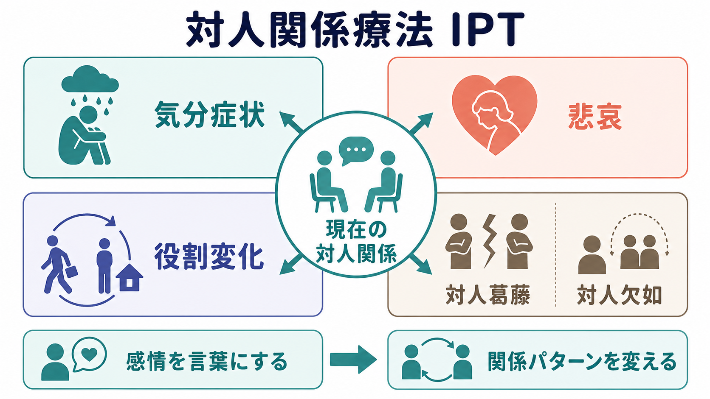
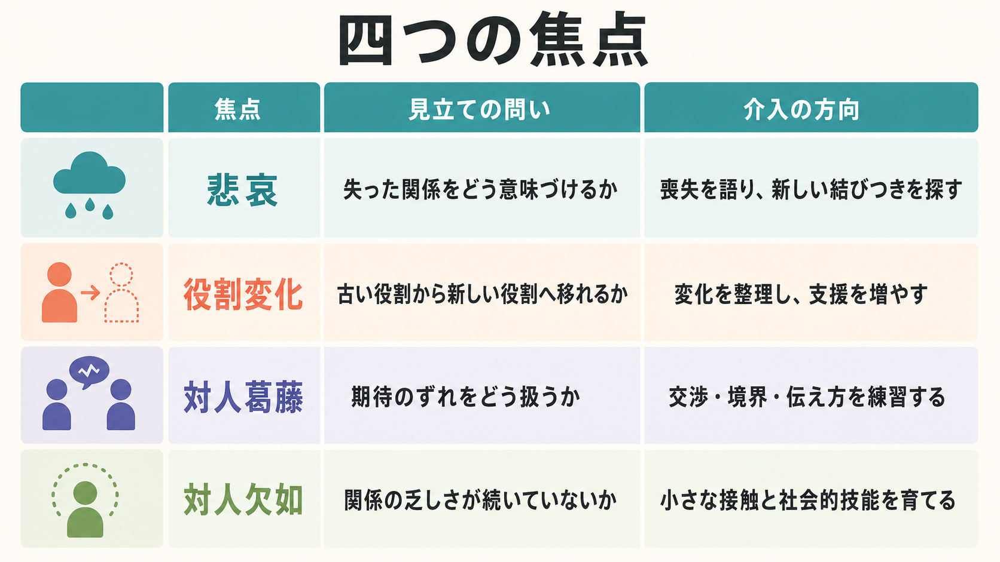
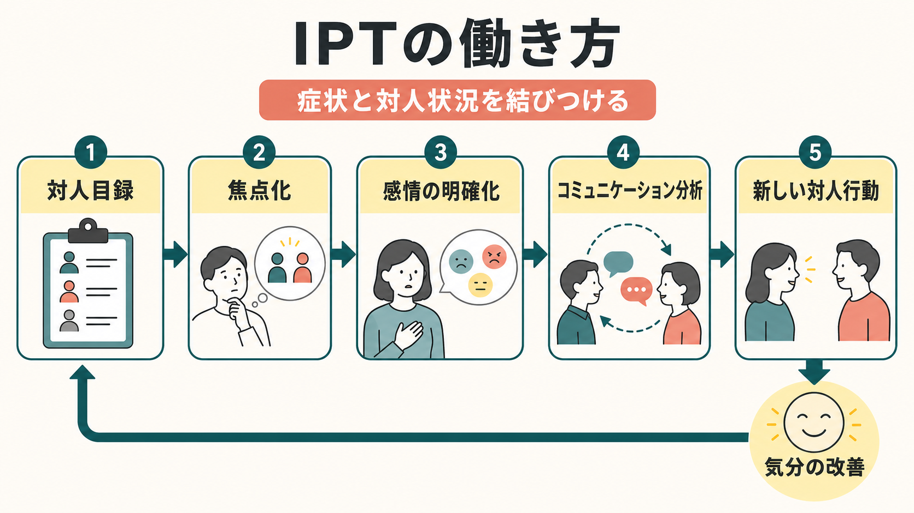

# 対人関係療法IPTとは何か

## 要点

- 対人関係療法IPT（interpersonal psychotherapy）は、気分症状を「現在の重要な対人関係」と結びつけて扱う、構造化された時間限定の心理療法である。
- 典型的には、悲哀、役割変化、対人葛藤、対人欠如のいずれかを主要焦点に置き、症状そのものだけでなく、症状を悪化・維持しやすい対人文脈を変える。
- IPTはもともと[[うつ病とは何か|うつ病]]治療として開発され、成人うつ病を中心に複数のランダム化比較試験とメタ分析で検討されてきた[1][2][3]。
- 本記事は教育・研究目的の整理であり、個別の診断や治療方針を指示するものではない。

## この記事で答える問い

- IPTは「人間関係の相談」と何が違うのか。
- 悲哀、役割変化、対人葛藤、対人欠如は、どのように見立てに使われるのか。
- IPTはどのような手順で症状と対人関係を結びつけるのか。
- 研究・臨床ガイドライン上、IPTはどの程度位置づけられているのか。

## まず結論

IPTの中核は、「症状が出ている人の内面だけを見る」のではなく、「症状が強まる時期に、重要な他者との関係、役割、喪失、孤立がどう変化していたか」を一緒に見立てる点にある。治療は、初期に診断・症状評価と対人目録を行い、中期に一つまたは二つの対人問題領域へ焦点化し、終結期に改善の維持と今後の対人課題への備えを扱う[1][4]。

そのため、IPTは単なる傾聴でも、助言中心の対人スキル訓練でもない。気分、対人出来事、感情表出、期待のずれ、役割の変化をつなげて扱う、焦点化された心理療法である。

## 背景

IPTは、Klerman、Weissmanらによって大うつ病の短期治療として開発され、研究用マニュアルに基づく介入として検証された[1][4]。その後、思春期、産後、老年期、摂食障害、PTSDなどへ応用範囲が広がったが、臨床的な原型は「うつ病症状と現在の対人関係を結びつけて扱う」点にある[2][4]。

IPTが重視するのは、うつ病の原因を人間関係だけに還元することではない。むしろ、[[ストレス脆弱性モデルとは何か|ストレス脆弱性]]、生物学的要因、ライフイベント、社会的支援の不足が重なるなかで、治療で具体的に変えやすい「現在の対人文脈」に焦点を絞る実践的な枠組みである。社会的支援と健康の関連を考えるときにも、IPTは[[社会的支援は健康にどう影響するのか|社会的支援]]を単なる量ではなく、実際の関係の質、役割期待、感情の伝達として扱う。

## 基本概念

### 現在の対人関係に焦点を置く

IPTでは、過去の生育史や人格を広く探索するよりも、現在の症状が始まった時期の対人出来事を丁寧にたどる。誰との関係が重要か、どの関係が支えになっているか、どの関係が苦痛や孤立を強めているかを、対人目録として整理する[1]。

### 四つの焦点

IPTの代表的な問題領域は、悲哀、役割変化、対人葛藤、対人欠如である[1][5]。

| 焦点 | 見立ての問い | 介入の方向 |
|---|---|---|
| 悲哀 | 重要な人や関係の喪失が、気分症状とどう結びついているか | 喪失を語り、残された感情を整理し、新しい関係や役割への接続を探す |
| 役割変化 | 離婚、就職、退職、出産、病気、介護などで役割が変わったか | 旧役割の喪失と新役割の負担を整理し、支援と技能を増やす |
| 対人葛藤 | 重要な他者との期待のずれが続いているか | 期待、怒り、失望、境界を明確にし、交渉や伝え方を試す |
| 対人欠如 | 親密な関係や支援関係が乏しく、孤立が続いているか | 小さな接触機会を増やし、関係を作る行動を段階的に試す |

悲哀は[[喪失反応と大うつ病はどう違うのか|喪失反応]]と重なるが、IPTでは「正常な悲しみか病的か」を単純に判定するよりも、喪失後に感情表出、支援、役割再編が止まっていないかを見る。役割変化は、本人が「前の自分」と「今の自分」の間で引き裂かれているときに重要になる。対人葛藤は、相手を変える技法というより、期待のずれを見える形にして、伝達・交渉・境界設定を検討する枠組みである。対人欠如は、孤立や関係形成の困難が前景にあるときに選ばれる。

## 仕組み

IPTの治療過程は、初期、中期、終結期に分けて理解しやすい[1][4]。

初期では、症状の評価、治療契約、心理教育、対人目録、問題領域の焦点化を行う。ここで重要なのは、「症状があるから何もできない」と見るだけでなく、「症状が強い時期に、どの関係で何が起きていたのか」を時間軸で結ぶことである。

中期では、選んだ焦点に応じて具体的な対人場面を扱う。感情の明確化、コミュニケーション分析、ロールプレイ、意思決定分析などを通じて、本人が自分の感情・期待・行動選択を言葉にできるようにする。ここでは、問題を「性格の欠陥」として固定せず、相互作用のパターンとして見直すことが治療的に重要である。

終結期では、症状の変化、対人関係の変化、残る課題、再発予防を扱う。治療関係の終わり自体も、一つの対人出来事として扱われる。終結に伴う不安や寂しさを回避せず、今後の支援資源や行動計画につなげる。

## 図解

上の三つの図は、IPTを次の三層で整理している。

1. 全体像: 気分症状と現在の対人関係を結びつけ、四つの焦点から見立てる。
2. メカニズム: 対人目録、焦点化、感情の明確化、コミュニケーション分析、新しい対人行動を通して、症状と対人状況の悪循環をほどく。
3. 焦点別整理: 悲哀、役割変化、対人葛藤、対人欠如ごとに、問いと介入の方向が異なる。

## 臨床・研究との接続

IPTは成人うつ病に対する心理療法として最も研究蓄積のある介入の一つである。2016年の包括的メタ分析では、90研究・11,434名を含み、急性期うつ病に対するIPTは対照群と比べて中等度から大きめの効果を示し、他の心理療法や薬物療法との差は小さいと報告された[3]。一方、効果量や比較結果は対象、実施形式、研究品質、比較条件に左右されるため、「誰にでも同じように効く」とは言えない。

WHOは、低・中所得国や専門家資源が限られる場面でも使えるよう、グループIPTのマニュアルを公開している。そこでは、IPTがmhGAPの心理社会的介入の一つとして位置づけられ、8セッションのグループ形式に簡略化されている[6]。NICEの成人うつ病ガイドラインでも、IPTはうつ病に対する心理療法の選択肢として説明されており、重要な関係やストレス状況における感情と反復パターンを扱う介入として位置づけられている[7]。

近年の個人参加者データ・メタ分析では、成人うつ病の急性期治療において、IPTと抗うつ薬の治療後抑うつ症状に有意な差は見られなかったと報告されている[8]。これは、IPTが薬物療法の代替にも併用にもなりうる可能性を示す一方で、実際の選択は重症度、希望、アクセス、併存症、リスク、過去の治療反応を踏まえて行う必要がある。

## よくある誤解

### 「IPTは対人スキル訓練である」

IPTでは伝え方や交渉を練習することがあるが、それだけではない。中心にあるのは、症状と対人文脈の関連を見立て、感情、期待、役割、喪失を整理することである。スキル練習は、その見立てに基づく手段の一つである。

### 「IPTは原因を家族や相手のせいにする」

IPTは責任追及ではなく、現在の関係パターンを変えられる単位として扱う。相手を診断したり、本人だけを責めたりするのではなく、「何が言えなかったのか」「どの期待が共有されていなかったのか」「どの支援が不足していたのか」を具体化する。

### 「深い過去を扱わないので浅い」

IPTは過去を無視するのではなく、現在の症状改善に直接関係する対人文脈へ焦点を絞る。これは治療を浅くするためではなく、限られた時間で変化可能な標的を明確にするためである。

### 「うつ病以外には使えない」

IPTはうつ病から始まった治療だが、思春期、産後、摂食障害、PTSDなどにも適応拡大が試みられている[2][3]。ただし、疾患や集団ごとにエビデンスの厚みは異なるため、適応を広げるときは対象に応じたマニュアル、訓練、スーパービジョンが重要になる。

## 関連ノート

- [[うつ病とは何か]]
- [[大うつ病性障害とは何か]]
- [[喪失反応と大うつ病はどう違うのか]]
- [[社会的支援は健康にどう影響するのか]]
- [[ストレス脆弱性モデルとは何か]]
- [[精神療法は脳を変えるのか]]
- [[弁証法的行動療法DBTとは何か]]
- [[DBTのマインドフルネススキルとは何か]]

MOC更新候補: `content/00_MOC/` 配下の臨床実践・治療系MOC、心理療法系MOCがある場合に本記事を追加する。並列ジョブとの競合を避けるため、本稿ではMOC本体は更新しない。

今後の作成候補: 「認知行動療法CBTとは何か」「行動活性化とは何か」「家族療法とは何か」「悲嘆焦点化心理療法とは何か」。

## 理解チェック

1. IPTが症状と結びつけて扱う「現在の対人関係」とは、単に友人の数を数えることではない。では、どのような情報を対人目録で整理するか。
2. 悲哀、役割変化、対人葛藤、対人欠如のうち、退職後に気分が落ち込み、以前の役割を失った感覚が強い例では、どの焦点が中心になりやすいか。
3. 対人葛藤を扱うとき、IPTが「相手を変える方法」ではなく「期待のずれと伝え方を扱う方法」と説明されるのはなぜか。
4. IPTを臨床で用いる際、研究で効果が示されていることと、個別の治療選択が必要であることはどのように両立するか。

## 参考文献

[1] Weissman, M. M., Markowitz, J. C., & Klerman, G. L. (2017). *The Guide to Interpersonal Psychotherapy: Updated and Expanded Edition*. Oxford University Press. https://academic.oup.com/book/1328

[2] Markowitz, J. C., & Weissman, M. M. (2012). Interpersonal psychotherapy: past, present and future. *Clinical Psychology & Psychotherapy, 19*(2), 99-105. https://doi.org/10.1002/cpp.1774

[3] Cuijpers, P., Donker, T., Weissman, M. M., Ravitz, P., & Cristea, I. A. (2016). Interpersonal Psychotherapy for Mental Health Problems: A Comprehensive Meta-Analysis. *American Journal of Psychiatry, 173*(7), 680-687. https://doi.org/10.1176/appi.ajp.2015.15091141

[4] Weissman, M. M., & Markowitz, J. C. (1994). Interpersonal Psychotherapy: Current Status. *Archives of General Psychiatry, 51*(8), 599-606. https://doi.org/10.1001/archpsyc.1994.03950080011002

[5] Lipsitz, J. D., & Markowitz, J. C. (2008). Comparative Outcomes among the Problem Areas of Interpersonal Psychotherapy for Depression. *Journal of Nervous and Mental Disease, 196*(11), 823-829. https://pmc.ncbi.nlm.nih.gov/articles/PMC4228685/

[6] World Health Organization. (2016). *Group interpersonal therapy (IPT) for depression*. World Health Organization. https://iris.who.int/handle/10665/250219

[7] National Institute for Health and Care Excellence. (2022). *Depression in adults: treatment and management (NICE guideline NG222)*. https://www.nice.org.uk/guidance/ng222

[8] Cohen, Z. D., et al. (2024). Comparative efficacy of interpersonal psychotherapy and antidepressant medication for adult depression: a systematic review and individual participant data meta-analysis. *Psychological Medicine*. https://doi.org/10.1017/S0033291724001788

