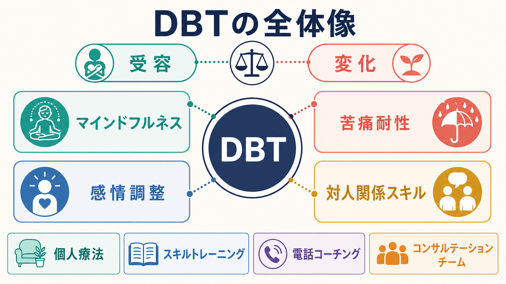
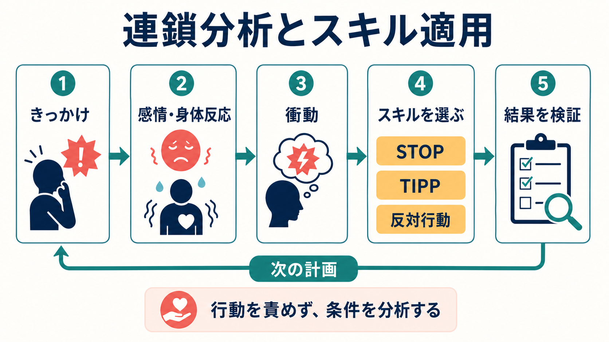

# 弁証法的行動療法DBTとは何か

## 要点

- 弁証法的行動療法、Dialectical Behavior Therapy: DBT は、慢性的な自殺関連行動・自傷行動・感情調整困難をもつ人、とくに[[境界性パーソナリティ障害とは何か]]の支援から発展した構造化心理療法である[1]。
- 中核は「いまの苦しみを妥当化して受け止めること」と「行動を変えるための技能を練習すること」を同時に扱う点にある[2]。
- 技能訓練では、マインドフルネス、苦痛耐性、感情調整、対人関係スキルを扱う[2]。
- DBTは自傷や衝動行動を単に禁止する治療ではなく、行動の前後関係を連鎖分析し、別の反応を選べる条件を増やす治療である[1][6]。
- 研究上は、BPDの重症度、自傷、心理社会的機能に一定の改善が示されているが、効果推定の確実性や長期効果には限界も残る[4][7]。

## この記事で答える問い

DBTは「感情を落ち着かせる技法集」だけではない。この記事では、DBTが何を標的にし、なぜ「受容」と「変化」を同時に扱うのか、どのような仕組みで自傷・衝動行動・対人困難に働きかけるのかを整理する。

## まず結論

DBTは、強い感情や対人ストレスのなかで「分かっているのに同じ行動を繰り返してしまう」状態に対して、行動療法の分析と技能訓練を、妥当化とマインドフルネスの姿勢で統合する治療である。治療者は問題行動を道徳的な失敗として扱わず、どの刺激、思考、身体反応、感情、対人文脈が行動を起こしやすくしたのかを調べる。そのうえで、次に似た場面が来たときに使える具体的スキルを練習する[2]。

医療・心理臨床では、DBTは個別診断や治療指示ではなく、訓練を受けた専門家がリスク評価、治療計画、危機対応、併存症評価を含めて実施する枠組みとして理解する必要がある[3][8]。

## 背景

DBTは Marsha M. Linehan によって、慢性的な自殺関連行動をもつ境界性パーソナリティ障害の女性を対象に開発・検証された。初期のランダム化比較試験では、通常治療と比べてパラ自殺行動の頻度・医学的重症度、入院日数、治療継続に改善が示された[1]。

その背景には、境界性パーソナリティ障害でみられる感情の急激な高まり、対人関係の不安定さ、自己像の揺らぎ、[[自傷と自殺企図はどう違うのか]]という臨床上の難しさがある。DBTは、こうした問題を「本人の意志の弱さ」としてではなく、感情脆弱性、無効化されやすい環境、学習された対処行動、現在の生活条件が組み合わさった行動パターンとして扱う。

## 基本概念

### 弁証法

DBTの「弁証法」は、対立するように見える二つの真実を同時に保持する考え方である。たとえば「その人の苦痛には理由がある」と「そのままの行動パターンでは生活が壊れてしまう」は両立する。治療では、受容だけに寄ると変化が起きにくくなり、変化だけを求めると本人が責められているように感じやすい。DBTはこの二極を行き来しながら、現実的な次の一手を探す[2]。

### 妥当化

妥当化とは、行動を肯定することではなく、その感情や反応がどの条件のもとで理解できるかを明確にすることである。たとえば自傷行動は望ましい対処ではないが、耐えがたい感情を短期的に下げる機能をもつ場合がある。機能を理解するからこそ、より害の少ない代替行動を設計できる。

### 4つの技能群

DBTの技能訓練は、生活のなかで使える反応レパートリーを増やすために構成される[2]。

| 技能群 | ねらい | 典型的に扱う問題 |
|---|---|---|
| [[DBTのマインドフルネススキルとは何か]] | いま起きている経験に気づき、判断を少し脇に置く | 感情に巻き込まれる、反すうする |
| DBTの苦痛耐性スキル | 危機を悪化させずに乗り切る | 自傷衝動、怒りの爆発、衝動的連絡 |
| DBTの感情調整スキル | 感情の波を理解し、起こりやすさを下げる | 感情の急上昇、長引く抑うつや怒り |
| DBTの対人関係スキル | 要求、断り、関係維持、自尊感情を調整する | 対人衝突、見捨てられ不安、境界設定 |

## 仕組み

DBTの典型的な包括プログラムは、個人療法、スキルトレーニング、電話コーチング、治療者コンサルテーションチームを組み合わせる。個人療法では生活を脅かす行動、治療を妨げる行動、生活の質を下げる行動を優先順位づけして扱う。スキルトレーニングでは、感情が高まる前から使える技能を反復練習する[2][6]。

重要なのは、危機が起きたあとに「なぜまた起きたのか」を責めるのではなく、行動連鎖として分解する点である。きっかけ、脆弱性要因、解釈、感情、身体反応、衝動、実際の行動、短期的結果、長期的結果をたどると、介入できる地点が複数見えてくる。

たとえば、自傷衝動がある場面では、まず安全確保とリスク評価が優先される。そのうえで、苦痛耐性スキルによってピークを乗り切り、感情調整スキルで睡眠・食事・身体状態などの脆弱性要因を整え、対人関係スキルで衝突や孤立を減らす、というように複数の層で働きかける。

## 図解

上の1枚目は、DBTを「受容」と「変化」のバランス、4技能群、包括的治療モードから見た概念地図である。2枚目は、問題行動を「きっかけから結果までの連鎖」として読み、次回の計画へ戻す仕組みを示している。

図で誤解しやすい点は、スキルが危機場面だけの応急処置ではないことである。DBTでは危機を乗り切る技能と、危機が起きにくい生活条件を作る技能の両方を扱う。

## 臨床・研究との接続

NICEの境界性パーソナリティ障害ガイドラインは、心理療法を検討するときに本人の希望、重症度、治療への参加可能性、治療関係の境界、支援資源を考慮することを求め、反復的自傷の低減が優先課題である女性のBPDには包括的DBTプログラムを考慮するとしている[3]。

Cochraneレビューでは、BPDに対する心理療法全体が通常治療より症状や自傷、心理社会的機能を改善しうる一方、DBTを含む効果推定の多くは低確実性で、試験間の差や有害事象報告の不足が残ると整理されている[4]。焦点化メタ分析でも、DBTは自傷と心理社会的機能に有意な効果を示したが、全体として確実性は低いとされた[5]。

DBTの構成要素については、高自殺リスクのBPD患者を対象にした研究で、技能訓練を含む条件が重要であることが示唆されている[6]。また、1年以上の追跡研究をまとめたレビューでは、治療後の改善が1-2年程度維持される可能性が示されたが、長期ランダム化比較試験の不足から長期有効性はなお不確実である[7]。

2024年のAPA境界性パーソナリティ障害ガイドラインは、初期評価で自殺・自傷・攻撃行動リスク、併存症、身体健康、心理社会・文化的要因、本人の治療目標を含めて評価し、文書化された包括的・本人中心の治療計画を立てることを重視している[8]。これは、DBTを単独のテクニックとして切り出すのではなく、リスク管理と治療計画のなかに位置づける必要があることを示している。

## よくある誤解

### DBTは境界性パーソナリティ障害だけの治療である

DBTはBPDと自殺関連行動への治療として発展したが、感情調整困難、摂食障害、物質使用、思春期の自傷などに応用・改変されてきた。ただし、対象が広がったからといって、どの問題にも同じ強度のエビデンスがあるわけではない。適応は症状、リスク、利用可能な治療資源、本人の希望に沿って判断される。

### マインドフルネスで落ち着けばよい治療である

DBTのマインドフルネスは重要な基礎だが、それだけではない。自傷衝動の危機には苦痛耐性、慢性的な感情の高まりには感情調整、対人衝突には対人関係スキルが必要になる。DBTは「気づく」「耐える」「変える」「伝える」を組み合わせる治療である。

### 自傷をしたら治療失敗である

DBTでは自傷や自殺関連行動を最優先に扱うが、発生したこと自体を治療失敗として終わらせない。行動が起きた場合は、危機対応と安全確認を行ったうえで連鎖分析を行い、どの時点で別のスキルを使えたかを検討する。これは[[非自殺性自傷とは何か]]や[[自傷行為を伴う疾患には何があるのか]]を理解するうえでも重要である。

## 関連ノート

- [[境界性パーソナリティ障害とは何か]]
- [[自傷を伴う境界性パーソナリティ障害とは何か]]
- [[自傷と自殺企図はどう違うのか]]
- [[非自殺性自傷とは何か]]
- [[DBTのマインドフルネススキルとは何か]]

MOC更新候補: `content/00_MOC/` 配下の臨床実践・治療、精神医学、心理療法関連MOC。並列生成ジョブとの競合を避けるため、本記事からはMOC本体を更新しない。

今後の作成候補: DBTの苦痛耐性スキルとは何か、DBTの感情調整スキルとは何か、DBTの対人関係スキルとは何か。

## 理解チェック

1. DBTで「受容」と「変化」を同時に扱う理由は何か。
2. 4つの技能群は、それぞれどのような問題に対応するか。
3. 連鎖分析では、問題行動そのもの以外に何を調べるか。
4. DBTを自傷リスクのある人に用いるとき、なぜ単なるセルフヘルプ技法として扱えないのか。

## 未解決問題

- DBTのどの構成要素が、どの患者群・年齢層・併存症に対して最も効いているのかは、なお分解して検証する必要がある。
- 長期追跡のランダム化比較試験は限られ、改善の維持、再発予防、サービス実装の質に関する研究が必要である[7]。
- 文化差、医療資源の少ない地域、短期・低強度版DBT、デジタル支援との統合については、効果と安全性を分けて評価する必要がある。

## 参考文献

[1] Linehan, M. M., Armstrong, H. E., Suarez, A., Allmon, D., & Heard, H. L. (1991). Cognitive-behavioral treatment of chronically parasuicidal borderline patients. *Archives of General Psychiatry, 48*(12), 1060-1064. https://doi.org/10.1001/archpsyc.1991.01810360024003

[2] Linehan, M. M. (2015). *DBT Skills Training Manual* (2nd ed.). Guilford Press. Linehan Institute book page: https://www.linehaninstitute.org/publications-books/dbt-skills-training-manual

[3] National Institute for Health and Care Excellence. (2009). *Borderline personality disorder: recognition and management* (CG78), recommendations. https://www.nice.org.uk/guidance/cg78/chapter/1-Guidance

[4] Storebø, O. J., Stoffers-Winterling, J. M., Völlm, B. A., et al. (2020). Psychological therapies for people with borderline personality disorder. *Cochrane Database of Systematic Reviews*, CD012955. https://www.cochrane.org/evidence/CD012955_psychological-therapies-people-borderline-personality-disorder

[5] Oud, M., Arntz, A., Hermens, M. L. M., Verhoef, R., & Kendall, T. (2018). Specialized psychotherapies for adults with borderline personality disorder: A systematic review and meta-analysis. *Australian & New Zealand Journal of Psychiatry, 52*(10), 949-961. https://doi.org/10.1177/0004867418791257

[6] Linehan, M. M., Korslund, K. E., Harned, M. S., et al. (2015). Dialectical behavior therapy for high suicide risk in individuals with borderline personality disorder: A randomized clinical trial and component analysis. *JAMA Psychiatry, 72*(5), 475-482. https://doi.org/10.1001/jamapsychiatry.2014.3039

[7] Gillespie, C., Murphy, M., & Joyce, M. (2022). Dialectical behavior therapy for individuals with borderline personality disorder: A systematic review of outcomes after one year of follow-up. *Journal of Personality Disorders, 36*(4), 431-454. https://doi.org/10.1521/pedi.2022.36.4.431

[8] Keepers, G. A., Fochtmann, L. J., Anzia, J. M., et al. (2024). The American Psychiatric Association practice guideline for the treatment of patients with borderline personality disorder. *American Journal of Psychiatry, 181*(11), 1024-1028. https://doi.org/10.1176/appi.ajp.24181010
