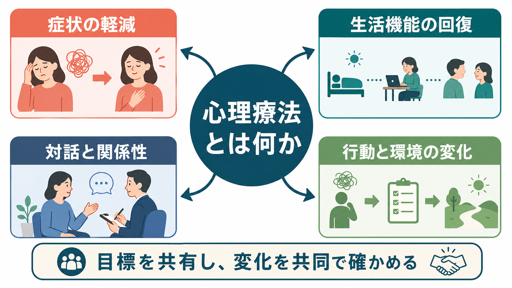
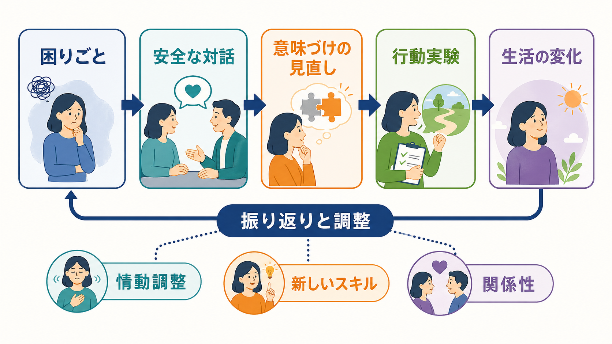
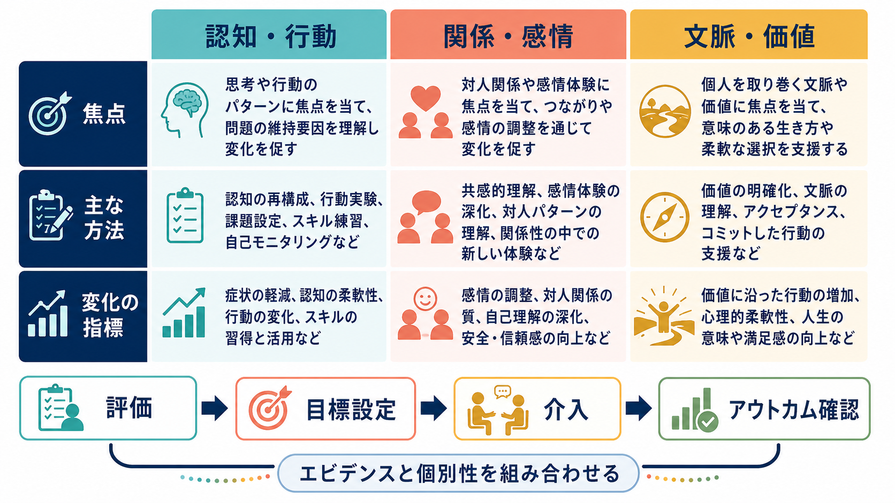

# 心理療法とは何か

## 要点

- 心理療法は、症状、感情、思考、行動、対人関係、生活機能の困難に対して、対話・行動練習・関係性・環境調整を用いて変化を支える治療である。
- 「話を聞いてもらうこと」だけではなく、評価、目標設定、介入、振り返り、再調整を含む共同作業である。
- 効果は治療法ごとの技法だけでなく、治療関係、目標の合意、本人の文脈、臨床家の専門性、アウトカム確認にも左右される。
- エビデンスは重要だが、心理療法は薬剤のように単一成分を投与する治療ではない。研究知見、臨床的専門性、本人の価値観と状況を組み合わせて選ぶ必要がある。
- 医療・臨床場面では、心理療法は教育・研究上の知識として理解しつつ、個別の診断や治療指示は担当専門職と相談して決める。

## この記事で答える問い

1. 心理療法は、カウンセリングや精神療法と何が重なるのか。
2. 心理療法では、何を変えることで症状や生活機能に影響するのか。
3. エビデンスに基づく心理療法とは、単にマニュアル通りに行うことなのか。
4. 心理療法について、どのような誤解が臨床判断を曇らせやすいのか。

## まず結論

心理療法とは、困りごとを抱える人と専門職が、評価と対話を通じて問題の成り立ちを整理し、考え方・感情調整・行動・対人関係・生活環境への働きかけを組み合わせて変化を促す治療である。NIMH は、心理療法を「困難な感情・思考・行動を同定し変えることを助ける多様な治療」と説明し、症状軽減、日常機能、生活の質の改善を目的に含めている[1]。

したがって心理療法は、単なる助言、雑談、気晴らし、説得ではない。[[治療関係とは何か|治療関係]]の中で、安全に話せる場を作り、本人の目標と文脈を明確にし、変化の手がかりを試し、結果を確認して調整していく実践である。エビデンスに基づく実践では、研究知見だけでなく、臨床家の専門性と本人の特徴・文化・価値観も統合する[2]。

## 背景

心理療法は、精神疾患の治療、ストレスや喪失への対処、対人関係の困難、慢性疾患との生活、再発予防、行動変容支援など、幅広い場面で用いられる。医療では薬物療法、生活支援、リハビリテーション、家族支援、社会資源と併用されることも多い。NICE の成人うつ病ガイドラインでも、重症度や本人の希望に応じて、心理的介入、薬物療法、社会的支援を段階的に検討する構造が示されている[3]。

名称は文脈によって揺れる。「心理療法」は心理学的理論と技法に基づく治療全般を指し、「精神療法」は精神医学領域で使われることが多い。「カウンセリング」は相談支援や心理的援助を広く含む語で、必ずしも疾患治療に限定されない。ただし実際の現場では重なりが大きく、重要なのは名称よりも、誰が、何を目標に、どの根拠と訓練に基づき、どのように効果と安全性を確認するかである。

心理療法の研究は、ランダム化比較試験、メタ分析、プロセス研究、質的研究、実装研究などから成る。うつ病への心理療法については、年齢群をまたぐシステマティックレビューで有効性が示されている一方、効果の大きさや持続性は対象、比較条件、治療法、研究の質によって変わる[4]。このため「効くか効かないか」という単純な問いよりも、「誰に、何を、どの強度で、どの文脈で、どのアウトカムに対して行うか」が臨床的には重要になる。

## 基本概念

### 問題の見立て

心理療法は、まず困りごとを「性格の弱さ」や「気合い不足」として扱わない。症状、生活史、現在の環境、身体状態、睡眠、薬物・アルコール、対人関係、危機リスク、強み、価値観を含めて、問題がどのように維持されているかを整理する。これは[[精神科治療計画はどのように立てるのか|治療計画]]の出発点でもある。

たとえば不安がある場合、「不安を消す」だけを目標にすると、回避行動が強まり生活範囲が狭くなることがある。そこで、恐怖刺激、予測、身体感覚、回避、安心行動、短期的 relief と長期的維持の連鎖を整理し、必要に応じて行動実験や曝露を計画する。これは[[回避行動とは何か|回避行動]]や[[行動変容はどのように起こるのか|行動変容]]の理解と接続する。

### 目標の合意

心理療法では、専門職が一方的に「正しい生き方」を指示するのではなく、本人にとって意味のある目標を共有する。症状尺度の改善だけでなく、睡眠、仕事・学業、家族関係、外出、趣味、セルフケア、再発予防、危機対応など、生活の中で観察できる変化を目標に含める。[[目標設定は行動をどう変えるのか|目標設定]]は、抽象的な願望を具体的な行動に落とすための中核技術である。

### 技法と共通要因

心理療法には、認知行動療法、対人関係療法、精神力動的心理療法、家族療法、マインドフルネスに基づく介入、弁証法的行動療法、アクセプタンス&コミットメント・セラピーなど多様な系譜がある。うつ病に対する複数のエビデンス支持療法を比較したメタ分析では、さまざまな心理療法に有効性が示されているが、研究条件や対象による差も大きい[5]。

一方で、特定技法だけでは説明できない要素もある。治療同盟、共感、目標の合意、協働、フィードバックは治療関係の重要な要素として扱われ、関係性そのものも心理療法の有効成分になりうる[6]。つまり心理療法は、「技法」か「関係」かの二択ではなく、関係性を土台にして技法を適切に使う実践である。

## 仕組み

心理療法の変化メカニズムは、単一ではない。大きく分けると、次のような経路が重なって働く。

1つ目は、認知と意味づけの変化である。自動思考、破局的予測、自己評価、対人解釈を言語化し、証拠を検討し、別の見方を試す。これは[[認知バイアスとは何か|認知バイアス]]や[[メタ認知とは何か|メタ認知]]の修正と関係する。

2つ目は、行動と環境の変化である。活動記録、行動活性化、問題解決、スキル練習、曝露、睡眠・生活リズム調整などを通じて、避けていた状況に少しずつ近づき、報酬や達成感を回復する。[[行動活性化とは何か|行動活性化]]や[[モチベーション面接は行動変容をどう支えるのか|モチベーション面接]]はこの経路を理解する入口になる。

3つ目は、情動調整と身体感覚への関わりである。感情に名前をつける、強度を評価する、呼吸や注意の向け方を調整する、衝動と行動を分ける、つらい感情を消さずに扱う、といった練習が含まれる。[[DBTのマインドフルネススキルとは何か|DBTのマインドフルネススキル]]は、感情と行動の間に余地を作る代表例である。

4つ目は、対人関係の変化である。安全な治療関係の中で、伝え方、境界設定、依頼、拒否、葛藤の扱い、孤立の減少を練習する。治療者との関係で起きる期待、警戒、失望、信頼の揺れも、本人の対人パターンを理解する材料になる。

ただし、どの経路が「本当に効いたのか」を厳密に示すことは簡単ではない。Kazdin は、心理療法研究では媒介変数とメカニズムを区別し、変化の時間順序、操作可能性、代替説明の排除を満たす必要があると論じている[7]。臨床では、この限界を踏まえつつ、仮説として見立てを立て、変化を測りながら調整する姿勢が必要である。

## 図解

心理療法を一枚の流れとして見ると、「評価」「目標設定」「介入」「アウトカム確認」の循環である。評価では、症状だけでなく生活機能、リスク、強み、本人の価値観を整理する。目標設定では、何が変われば生活が少し良くなるのかを共有する。介入では、対話、認知の検討、行動実験、スキル練習、関係性の調整を行う。アウトカム確認では、尺度、面接、生活上の変化、本人の実感を使って、続ける・変える・終える・別の支援につなぐ判断をする。

## 臨床・研究との接続

臨床では、心理療法の選択は診断名だけで決まらない。症状の重症度、急性リスク、併存症、認知機能、トラウマ歴、文化的背景、家族・職場・学校の環境、費用、アクセス、本人の希望を含めて判断する。重い自殺リスク、躁状態、精神病症状、重度の物質使用、虐待や暴力の現在進行形のリスクがある場合には、心理療法単独で抱え込まず、医療的評価、安全計画、多職種連携が必要になる。

研究では、心理療法の有効性を平均効果として推定するだけでなく、脱落、悪化、望ましくない効果も見る必要がある。心理療法は一般に有益な介入だが、成人うつ病の研究でも一部に症状悪化が報告されており、経過観察とフィードバックを組み込むことが重要である[8]。心理療法を「害がない会話」とみなすのではなく、適応、禁忌、同意、境界、守秘、危機対応を備えた専門的介入として扱う必要がある。

また、[[精神療法は脳を変えるのか|精神療法と脳]]の接続を考えるときも注意がいる。心理療法に伴う脳活動やネットワーク変化を示す研究はあるが、個人の治療効果を脳画像だけで判定できるわけではない。臨床的には、本人が何をできるようになったか、苦痛がどう変わったか、生活がどう広がったかを、研究指標と生活指標の両方から見る。

## よくある誤解

### 誤解1: 心理療法は「話を聞くだけ」である

傾聴は重要だが、それだけでは心理療法全体を説明できない。心理療法では、見立て、目標設定、介入計画、行動課題、スキル練習、振り返り、終結や再発予防が含まれる。話すことは、問題の構造を見えるようにし、別の行動を試すための足場である。

### 誤解2: つらい原因を全部思い出せば治る

過去の経験を理解することが役立つ場合はある。しかし、心理療法の目的は記憶を掘り起こすこと自体ではない。現在の症状や生活困難がどのように維持されているかを理解し、今の生活の中で変えられる点を増やすことが重要である。

### 誤解3: エビデンスに基づく心理療法はマニュアル通りに行うだけである

エビデンスは平均的に有効な方法を教えてくれるが、本人の価値観、文化、発達段階、併存症、治療歴に合わせた調整が必要である。APA の EBPP は、最良の研究証拠、臨床的専門性、患者の特徴・文化・希望を統合する枠組みである[2]。

### 誤解4: 心理療法を受ければ必ずよくなる

心理療法は多くの人に有益だが、すべての人に同じ速度・同じ方法で効くわけではない。改善が乏しい、悪化する、通院が負担になる、治療関係が合わない、別の疾患や環境要因が強い、といった場合は、方法の変更、頻度の調整、別職種との連携、薬物療法や福祉支援の併用を検討する。

## 関連ノート

- [[治療関係とは何か]]
- [[精神科治療計画はどのように立てるのか]]
- [[精神療法は脳を変えるのか]]
- [[行動変容はどのように起こるのか]]
- [[行動活性化とは何か]]
- [[モチベーション面接は行動変容をどう支えるのか]]
- [[DBTのマインドフルネススキルとは何か]]
- [[心理測定と臨床判断はどう組み合わせるべきか]]

## 関連ノート候補

- 「認知行動療法とは何か」
- 「アクセプタンス&コミットメント・セラピーとは何か」
- 「曝露療法とは何か」
- 「対人関係療法とは何か」
- 「心理療法の有害事象とは何か」

## MOC更新候補

- `content/00_MOC/MOC｜臨床実践・治療.md`

## 理解チェック

1. 心理療法が「話を聞くこと」だけではない理由を、評価・目標・介入・振り返りの語を使って説明できるか。
2. 認知、行動、情動調整、対人関係のどれが、今扱っている困りごとの維持に関係していそうかを区別できるか。
3. エビデンスに基づく実践が、研究証拠だけでなく本人の価値観や文脈も含む理由を説明できるか。
4. 心理療法の効果を、症状尺度だけでなく生活機能や安全性からも見る理由を説明できるか。

## 参考文献

[1] National Institute of Mental Health. Psychotherapies. https://www.nimh.nih.gov/health/topics/psychotherapies

[2] APA Presidential Task Force on Evidence-Based Practice. (2006). Evidence-based practice in psychology. *American Psychologist*, 61(4), 271-285. https://doi.org/10.1037/0003-066X.61.4.271

[3] National Institute for Health and Care Excellence. (2022). *Depression in adults: treatment and management* (NICE Guideline No. 222). https://www.ncbi.nlm.nih.gov/books/NBK583074/

[4] Cuijpers, P., Karyotaki, E., Eckshtain, D., Ng, M. Y., Corteselli, K. A., Noma, H., Quero, S., & Weisz, J. R. (2020). Psychotherapy for depression across different age groups: A systematic review and meta-analysis. *JAMA Psychiatry*, 77(7), 694-702. https://doi.org/10.1001/jamapsychiatry.2020.0164

[5] Cuijpers, P., Karyotaki, E., de Wit, L., & Ebert, D. D. (2020). The effects of fifteen evidence-supported therapies for adult depression: A meta-analytic review. *Psychotherapy Research*, 30(3), 279-293. https://doi.org/10.1080/10503307.2019.1649732

[6] Norcross, J. C., & Wampold, B. E. (2011). Evidence-based therapy relationships: Research conclusions and clinical practices. *Psychotherapy*, 48(1), 98-102. https://doi.org/10.1037/a0022161

[7] Kazdin, A. E. (2007). Mediators and mechanisms of change in psychotherapy research. *Annual Review of Clinical Psychology*, 3, 1-27. https://doi.org/10.1146/annurev.clinpsy.3.022806.091432

[8] Cuijpers, P., Reijnders, M., Karyotaki, E., de Wit, L., & Ebert, D. D. (2018). Negative effects of psychotherapies for adult depression: A meta-analysis of deterioration rates. *Journal of Affective Disorders*, 239, 138-145. https://doi.org/10.1016/j.jad.2018.05.050

## 未解決問題

- 心理療法の変化メカニズムを、診断横断的にどこまで共通化できるか。
- 個人ごとに「どの治療法が合うか」を事前に予測する指標をどこまで実用化できるか。
- 効果だけでなく、悪化、脱落、依存、境界問題などの望ましくない影響をどのように標準的に記録するか。
- 対面、オンライン、アプリ、集団、家族・地域支援をどのように組み合わせると、アクセスと質を両立できるか。
