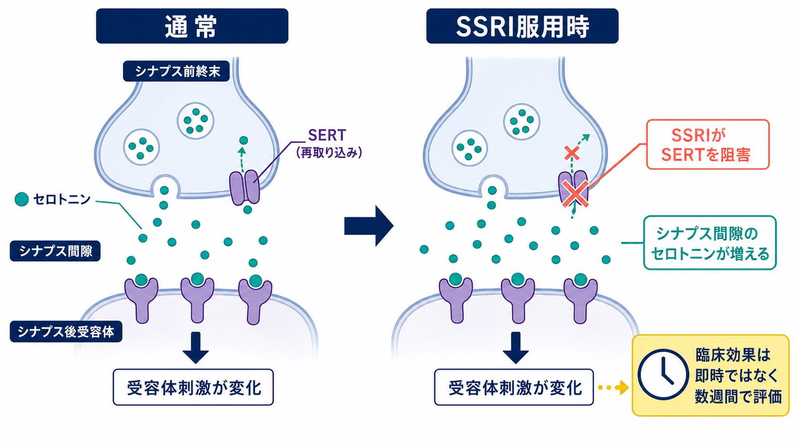
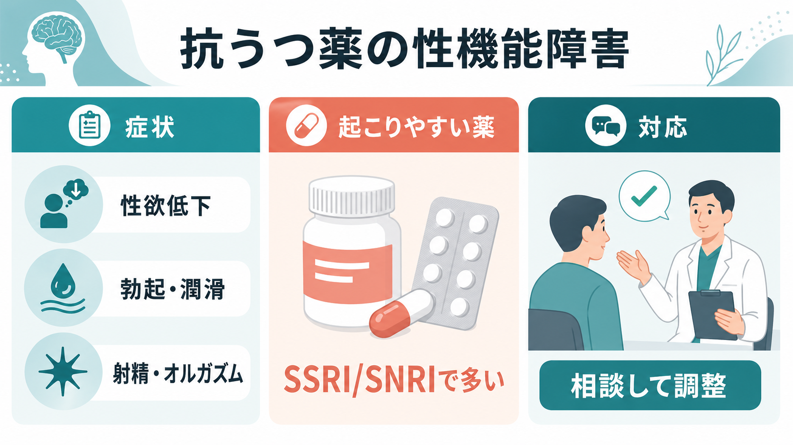

# 心理療法と薬物療法はどう組み合わせるのか

## 要点

- 心理療法と薬物療法の併用は、「薬で症状を消し、面接で原因を解決する」という単純な分業ではない。薬物療法は睡眠、不安、抑うつ、衝動性などの負荷を下げ、心理療法は回避、反すう、対人パターン、生活習慣を変えるための学習環境を作る。
- うつ病では、成人の初期治療として心理療法または第二世代抗うつ薬のいずれも選択肢になり、併用を検討する場合はCBTまたはIPTと抗うつ薬の組み合わせが推奨されることがある[1]。NICEは、より重いうつ病では個人CBTと抗うつ薬の組み合わせを第一選択肢の一つとして扱う[2]。
- パニック症では、急性期には併用が単独療法より有利な場合があるが、薬を終了した後の長期効果では心理療法単独と大きく差がないというレビューもある[5]。
- PTSDでは、トラウマ焦点化心理療法が第一選択として強く位置づけられ、薬物療法との併用を一般に優先する根拠は限定的である[6][7]。
- 臨床では「診断名」だけでなく、重症度、リスク、併存症、過去の反応、本人の希望、副作用、アクセス可能性、治療継続のしやすさを測定しながら組み合わせを調整する。

## この記事で答える問い

1. 心理療法と薬物療法は、どのような役割分担で考えるとよいのか。
2. どのような場合に併用が有用で、どのような場合に単独療法を優先するのか。
3. 統合治療を進めるとき、どの時点で効果判定や方針変更を行うのか。
4. 併用をめぐる典型的な誤解は何か。

## まず結論

心理療法と薬物療法は、同じ症状を別々の入口から扱う。薬物療法は、気分、不安、睡眠、覚醒、衝動性、身体症状などの「現在の負荷」を下げる。心理療法は、回避、反すう、自己批判、対人関係、問題解決、感情調整、生活リズムなどの「維持要因」を扱う。したがって併用の基本は、薬で面接を受けやすくし、面接で日常行動を変えやすくし、その結果を症状尺度と生活機能で確認して薬や面接計画を調整することである。

ただし、併用は常に最良という意味ではない。軽症のうつ病では、抗うつ薬を routine に第一選択にしない方針が示されている[2]。一方、より重いうつ病、慢性化、再発、強い不眠や不安、心理療法に取り組む余力の低下がある場合には、併用の利点が大きくなることがある[2][3][4]。PTSDのように、心理療法がより強く推奨される領域では、薬物療法は第一選択心理療法が利用できない、本人が希望しない、併存症状が強い、といった条件で慎重に位置づける[6][7]。

このノートは教育・研究目的の概説であり、個別の診断、服薬開始、中止、用量調整、治療選択を指示するものではない。実際の治療方針は、主治医や担当専門職と相談して決める。

## 背景

精神科・心療内科・心理臨床では、心理療法と薬物療法はしばしば別々の専門職、別々の時間枠、別々の言葉で語られる。そのため「薬を使うなら心理療法はいらない」「心理療法をするなら薬に頼ってはいけない」という二分法が生まれやすい。しかし、多くの症状は生物学的過程、学習、環境、対人関係、意味づけが重なって維持される。[[心理療法とは何か]]が扱う変化と、薬物療法が扱う神経生物学的負荷は、競合するというより異なる時間スケールで相補的に働く。

研究上も、成人うつ病では薬物療法に心理療法を加えることで、抗うつ薬単独より転帰がよくなるというメタ分析がある[3][4]。ただし効果は疾患、重症度、治療内容、アウトカム、時期によって変わる。したがって、統合治療の要点は「併用すれば安心」ではなく、「何を改善したいのか」「何を測るのか」「どちらの介入が今の阻害要因を下げるのか」を明確にすることである。

## 基本概念

### 薬物療法が主に扱うもの

薬物療法は、抑うつ気分、不安、睡眠障害、焦燥、パニック発作、強迫症状、精神病症状、衝動性、注意困難など、症状の強度や頻度を下げる目的で用いられる。重要なのは、薬が「問題の意味」を直接書き換えるわけではなく、学習や行動変容を行える状態を作る場合があるという点である。たとえば不眠と不安が強すぎると、[[認知行動療法CBTとは何か]]で扱う課題の記録、認知再構成、曝露、行動実験を継続しにくい。薬物療法で負荷が下がると、心理療法で扱う練習に参加しやすくなることがある。

### 心理療法が主に扱うもの

心理療法は、症状を維持する行動、認知、感情調整、対人関係、生活文脈を扱う。[[行動活性化とは何か]]では活動と報酬の回復、[[曝露療法とは何か]]では回避と恐怖学習、[[認知再構成法とは何か]]では自動思考や解釈、[[対人関係療法IPTとは何か]]では役割移行や対人葛藤を扱う。これらは、薬物療法だけでは直接置き換わりにくい「日常での選び方」と「繰り返しの学習」に関わる。

### 統合治療の3つの形式

統合治療には少なくとも3つの形式がある。

1. 同時併用: 初期から薬物療法と心理療法を並行する。重症度が高い、機能低下が大きい、再発リスクが高い、過去に単独療法で不十分だった場合に検討されやすい。
2. 段階的追加: まず一方を開始し、効果が不十分なら他方を追加する。副作用や本人の希望を見ながら進めやすい。
3. 役割分担型: 薬物療法で急性症状を安定させ、心理療法で再発予防、生活再建、対人関係、セルフマネジメントを重点的に扱う。

## 仕組み

統合治療のメカニズムは、「薬が脳を治し、心理療法が心を治す」という分割では説明しにくい。より実用的には、次の循環として考える。

1. 薬物療法で症状負荷を下げる。
   不眠、不安、抑うつ、焦燥が少し下がると、予定を立てる、外出する、記録をつける、面接に通う、対人場面を試すといった行動のコストが下がる。

2. 心理療法で回避と維持要因を変える。
   症状が少し軽くなった段階で、回避を減らす、反すうを扱う、環境を整える、価値に沿った行動を増やす、恐怖予測を検証する。ここで得られる小さな成功体験が、次の行動を支える。

3. 結果を測定して計画を調整する。
   NICEは、うつ病治療では開始後2-4週で効果、治療継続、副作用、自殺念慮、尺度によるアウトカムを確認することを勧めている[2]。この確認は、薬を増減するためだけではなく、心理療法の課題量、焦点、頻度、危機対応を調整するためにも必要である。

4. 再発予防へ移行する。
   寛解後も、薬物療法の継続、心理療法での再発サインの同定、生活リズム、対人支援、危機計画を組み合わせる。再発予防では、症状が消えたかだけでなく「再び悪化しそうなときに何をするか」を明文化する。

## 図解

上のフローは、個別治療の指示ではなく、統合治療を考えるための一般的な枠組みである。

| 段階 | 見ること | 統合治療での問い |
|---|---|---|
| 評価 | 診断、重症度、リスク、併存症、生活機能 | いま最も治療参加を妨げている要因は何か |
| 共有意思決定 | 希望、過去の反応、副作用への懸念、アクセス | 本人が続けられる選択肢は何か |
| 統合計画 | 薬、心理療法、生活支援、危機対応 | 薬と面接はそれぞれ何を目標にするのか |
| 効果判定 | 症状尺度、副作用、行動変化、生活機能 | 継続、切替、追加、減量相談のどれが妥当か |

## 臨床・研究との接続

### うつ病

成人うつ病では、APAのガイドラインが、初期治療で心理療法または第二世代抗うつ薬を共有意思決定の文脈で提示し、併用を検討する場合にはCBTまたはIPTと第二世代抗うつ薬の組み合わせを推奨している[1]。NICEは、より重いうつ病の新規エピソードで、個人CBTと抗うつ薬の組み合わせを治療選択肢に含めている[2]。メタ分析でも、抗うつ薬単独に心理療法を加えることは、うつ病・不安症の成人において追加効果を持つことが示されている[3]。

ただし、軽症の抑うつでは、抗うつ薬を routine に第一選択としない方針が示されている[2]。この場合、[[心理教育とは何か]]、行動活性化、ガイド付きセルフヘルプ、生活リズム調整、社会的支援などを優先し、薬物療法は本人の希望、既往、悪化リスク、機能障害を踏まえて検討する。

### 不安症・パニック症

パニック症では、心理療法と抗うつ薬の併用が急性期には単独療法より有利だった一方、薬を終了した後には心理療法単独と同程度だったというCochraneレビューがある[5]。これは、「薬を足せば常に長期予後がよい」というより、急性期の症状軽減と長期の学習維持を分けて見る必要があることを示す。[[パニック症のCBTでは何を行うのか]]のように、身体感覚への恐怖、回避、安全行動を扱う心理療法は、薬物療法終了後にも使えるセルフマネジメントの技能を残す。

### PTSD

PTSDでは、VA/DoD 2023ガイドラインに基づく解説が、PE、CPT、EMDRなどの個人トラウマ焦点化心理療法を薬物療法より優先して推奨している[6]。また、PTSD治療において、推奨薬と推奨心理療法を組み合わせることを支持する十分な根拠はないとされる[7]。したがって、[[トラウマ焦点化認知行動療法とは何か]]や[[EMDRとは何か]]が適応になる場合、薬物療法は補助的役割、併存する抑うつ・不眠・不安への対応、または心理療法が利用できない場合の選択肢として位置づける。

### 慢性化・再発・複雑な併存

慢性化、再発、身体疾患、物質使用、発達特性、社会的困難が重なる場合、単一の治療技法だけで十分に説明できないことが多い。薬物療法で症状の波を下げ、心理療法で生活文脈を整え、ケースマネジメントや家族支援で環境を調整する必要がある。このとき重要なのは、各介入の責任範囲を明確にし、担当者間で「何を観察して、いつ方針を変えるか」を共有することである。

## よくある誤解

### 「薬を使うと心理療法の効果が弱くなる」

一部の文脈では、薬物療法が恐怖学習や曝露の学習過程にどう影響するかという研究上の論点はある。しかし臨床一般では、症状が強すぎて練習に参加できない状態を下げることが、心理療法への参加を助けることも多い。重要なのは、薬の有無ではなく、心理療法で必要な行動練習が実際に行われているかである。

### 「心理療法を受ければ薬は不要になる」

心理療法は薬物療法の代替になる場合もあるが、重症度、再発歴、精神病症状、双極性障害、強い自殺リスク、身体疾患、生活環境によっては薬物療法や多職種支援が不可欠になる。心理療法は「薬を使わないための方法」ではなく、変化を作るための治療法の一つである。

### 「併用すれば必ず最強の治療になる」

併用は負担も増やす。通院回数、費用、時間、副作用、情報共有の難しさ、治療目標の混乱が生じうる。併用が有用かどうかは、症状だけでなく、継続可能性と本人の価値に合っているかで判断する。

### 「薬物療法は症状、心理療法は原因を扱う」

この区別はわかりやすいが不正確である。薬物療法も再発予防や生活機能に影響し、心理療法も症状を下げる。よりよい区別は、薬物療法が現在の生理的・情動的負荷を下げやすく、心理療法が症状を維持する学習と生活パターンを変えやすい、という機能的な見方である。

## 関連ノート

- [[心理療法とは何か]]
- [[認知行動療法CBTとは何か]]
- [[行動活性化とは何か]]
- [[認知再構成法とは何か]]
- [[曝露療法とは何か]]
- [[パニック症のCBTでは何を行うのか]]
- [[対人関係療法IPTとは何か]]
- [[心理教育とは何か]]
- [[トラウマ焦点化認知行動療法とは何か]]
- [[EMDRとは何か]]

## MOC更新候補

- `content/00_MOC/MOC｜臨床実践・治療.md` に本記事へのリンクを追加する候補。
- 心理療法カテゴリ内の統合治療・薬物療法接続ノートとして配置する候補。

## 理解チェック

1. 心理療法と薬物療法を「原因」と「症状」に単純分割すると、どのような問題が起きるか。
2. うつ病、不安症、PTSDでは、併用治療の根拠や優先順位がどのように異なるか。
3. 統合治療の効果判定では、症状尺度以外に何を確認すべきか。
4. 薬物療法が心理療法への参加を助ける場合、どのようなメカニズムが考えられるか。

## 未解決問題

- どの患者特性が「最初から併用すべき群」と「段階的追加でよい群」を予測するのかは、診断横断的にはまだ十分に整理されていない。
- 薬物療法が心理療法中の学習、曝露、記憶再固定化、報酬学習に与える影響は、薬剤、疾患、タイミングによって異なる可能性がある。
- 統合治療の実装では、処方医、心理職、看護師、ケースワーカー、家族支援者の情報共有をどのように行うかが大きな課題である。

## 参考文献

[1] American Psychological Association. (2019). *Clinical Practice Guideline for the Treatment of Depression Across Three Age Cohorts*. https://www.apa.org/depression-guideline

[2] National Institute for Health and Care Excellence. (2022). *Depression in adults: treatment and management* (NICE Guideline NG222). https://www.nice.org.uk/guidance/ng222/chapter/Recommendations

[3] Cuijpers, P., Sijbrandij, M., Koole, S. L., Andersson, G., Beekman, A. T., & Reynolds, C. F. (2014). Adding psychotherapy to antidepressant medication in depression and anxiety disorders: a meta-analysis. *World Psychiatry, 13*(1), 56-67. https://doi.org/10.1002/wps.20089

[4] Pampallona, S., Bollini, P., Tibaldi, G., Kupelnick, B., & Munizza, C. (2004). Combined pharmacotherapy and psychological treatment for depression: a systematic review. *Archives of General Psychiatry, 61*(7), 714-719. https://doi.org/10.1001/archpsyc.61.7.714

[5] Furukawa, T. A., Watanabe, N., & Churchill, R. (2007). Combined psychotherapy plus antidepressants for panic disorder with or without agoraphobia. *Cochrane Database of Systematic Reviews*, CD004364. https://doi.org/10.1002/14651858.CD004364.pub2

[6] U.S. Department of Veterans Affairs, National Center for PTSD. (2025). *Overview of Psychotherapy for PTSD*. https://ptsd.va.gov/PTSD/professional/treat/txessentials/overview_therapy.asp

[7] U.S. Department of Veterans Affairs, National Center for PTSD. (2025). *Clinician's Guide to Medications for PTSD*. https://ptsd.va.gov/PTSD/professional/treat/txessentials/clinician_guide_meds.asp

[8] Merz, J., Schwarzer, G., & Gerger, H. (2019). Comparative efficacy and acceptability of pharmacological, psychotherapeutic, and combination treatments in adults with posttraumatic stress disorder: a network meta-analysis. *JAMA Psychiatry, 76*(9), 904-913. https://doi.org/10.1001/jamapsychiatry.2019.0951
