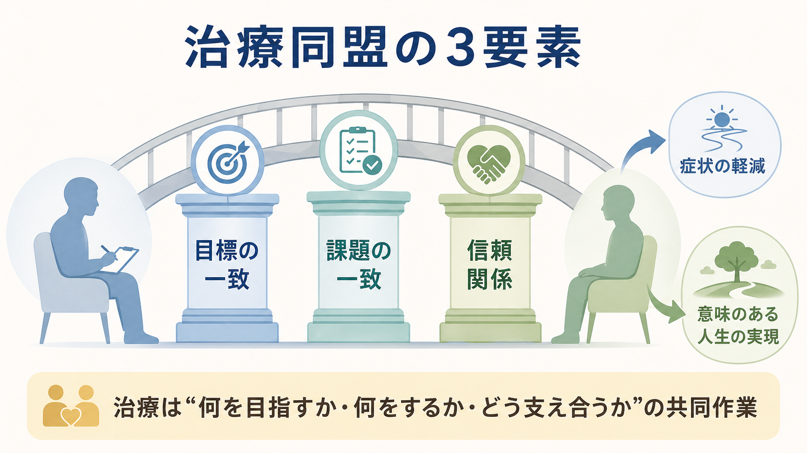
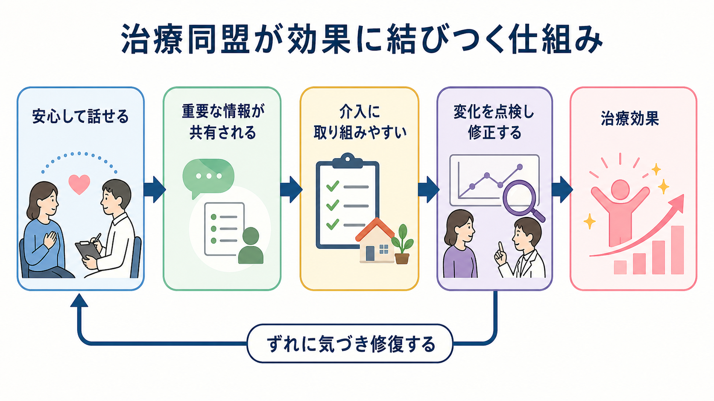
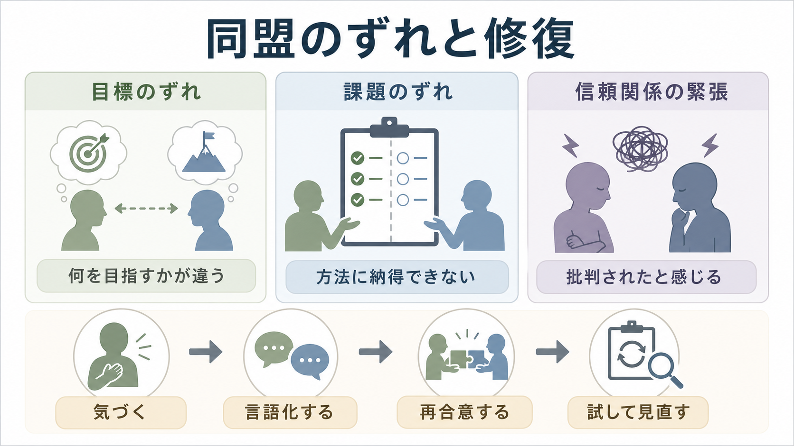

# 心理療法における治療同盟とは何か

## 要点

- 治療同盟とは、治療者とクライエントが「何を目指すか」「何を行うか」「どのような信頼関係で進めるか」を共有する協働関係である。
- Bordin の古典的整理では、治療同盟は目標の一致、課題の一致、情緒的な絆の3要素からなる[1]。
- 成人心理療法のメタ分析では、治療同盟と治療アウトカムの関連は一貫して中程度に認められ、技法や学派を超えて重要なプロセス変数とされる[2]。
- ただし、治療同盟は「感じのよい関係」だけではない。難しい課題に取り組む合意、ずれを言語化して修復する力、治療の進め方を見直す構造を含む。
- 臨床では、同盟を固定的な性格特徴としてではなく、毎回の面接で変化し、点検し、修復できる関係プロセスとして扱う。

## この記事で答える問い

1. 心理療法における治療同盟とは何か。
2. 目標・課題・信頼関係の一致は、どのように治療効果に関わるのか。
3. 同盟がずれたとき、臨床では何を観察し、どう修復するのか。
4. 研究で治療同盟を測るとき、どのような注意点があるのか。

## まず結論

治療同盟は、[[心理療法とは何か]]を「専門家が技法を与える場」ではなく、「治療者とクライエントが変化のための作業を共同で組み立てる場」として理解するための中心概念である。Bordin は、治療同盟を特定の学派に閉じた概念ではなく、多くの心理療法に一般化できる作業関係として整理した。その中核は、目標への合意、課題への合意、関係の絆である[1]。

治療同盟が強いと、クライエントは重要な情報を話しやすくなり、治療者は介入の焦点を合わせやすくなる。さらに、ホームワーク、曝露、感情への接近、対人パターンの検討など、不安や抵抗を伴う作業にも取り組みやすくなる。成人心理療法の大規模メタ分析では、治療同盟とアウトカムの関連は安定しており、対面療法だけでなくインターネットを介した心理療法でも同程度の関連が報告されている[2]。

## 背景

心理療法では、技法そのものだけでなく、技法がどのような関係の中で使われるかが重要になる。たとえば[[認知行動療法CBTとは何か]]では認知再構成や行動実験、[[曝露療法とは何か]]では恐怖刺激への接近、[[DBTの対人関係スキルとは何か]]では対人場面の練習が扱われる。これらは方法としては異なるが、いずれも「この作業が何のために必要なのか」「どの程度の負荷で進めるのか」「失敗や抵抗が出たときにどう扱うのか」を共有できなければ、治療からの離脱や表面的な実施に終わりやすい。

このため治療同盟は、単なる好意や相性ではなく、治療の構造そのものに関わる。クライエントが治療者を信頼していても、目標が曖昧なら介入は散漫になる。目標が明確でも、課題に納得できなければ実践は続きにくい。課題に同意していても、関係の安全感が損なわれると、重要な感情や対人パターンを扱いにくくなる。

## 基本概念

### 目標の一致

目標の一致とは、治療で何を変えたいのかについて、治療者とクライエントが実用的な合意を作ることである。ここでいう目標は、症状の軽減だけではない。日常生活の回復、対人関係の改善、再発予防、価値に沿った行動、自己理解、危機対応なども含まれる。

目標の一致は「治療者が正しい目標を提示し、クライエントが従う」という意味ではない。治療者は臨床知識を用いて見立てを示すが、クライエントの価値観、生活条件、優先順位と照合しながら目標を調整する必要がある。とくに[[対人関係療法IPTとは何か]]や[[メンタライゼーションに基づく治療MBTとは何か]]のように対人関係を扱う治療では、本人にとって何が困難で、どの変化が現実的かを共有する過程が同盟の基盤になる。

### 課題の一致

課題の一致とは、目標に向かうために面接内外で何を行うかについて合意することである。課題には、症状や生活の記録、行動実験、感情の探索、対人場面の振り返り、家族との調整、服薬や医療連携に関する相談などが含まれる。

課題の一致が弱いと、クライエントは治療者の提案を「押しつけ」と感じたり、逆に治療者はクライエントを「やる気がない」と誤解したりする。実際には、課題の難度が高すぎる、説明が不足している、文化的背景や生活資源に合っていない、治療者の仮説がずれている、という可能性がある。

### 信頼関係

信頼関係は、治療者の温かさや受容だけでなく、境界、守秘、説明責任、予測可能性、専門性、誠実な修正可能性から成り立つ。信頼できる治療関係では、クライエントは同意できないこと、怖いこと、治療者への不満、治療をやめたい気持ちも話題にしやすくなる。

Working Alliance Inventory は、Bordin の3要素をもとに治療同盟を測定する代表的尺度として開発された[3]。その後、短縮版や改訂版も作られ、測定特性の検討が続いている[4]。ただし尺度得点は関係の一側面であり、面接中の沈黙、回避、過剰な同意、宿題の未実施、突然のキャンセルなど、臨床的なサインと合わせて読む必要がある。

## 仕組み

治療同盟が治療効果に結びつく仕組みは、単一の経路ではない。少なくとも、情報共有、介入への参加、フィードバック、修復可能性という複数の経路がある。

第一に、安心して話せる関係は情報共有を増やす。症状、恥、怒り、依存、回避、自傷リスク、家庭や職場の状況などは、信頼がなければ表面化しにくい。第二に、課題への納得は介入への参加を高める。CBT のホームワーク、曝露、対人練習、マインドフルネス練習は、説明と合意がなければ継続しにくい。第三に、同盟があると、治療者とクライエントは変化の有無を一緒に点検し、必要なら仮説や方法を修正できる。

注意すべきなのは、治療同盟とアウトカムの相関だけでは因果方向が確定しない点である。よい同盟が改善を促す可能性もあれば、早期の改善が同盟評価を高める可能性もある。患者特性や治療プロセスを統制したメタ分析でも同盟とアウトカムの関連は検討されているが、研究デザイン、測定時点、評価者、治療者効果を区別することが重要である[5]。したがって臨床では、治療同盟を「効果の証拠」と断定するより、「治療を進めるために継続的に観察するプロセス変数」として扱うのがよい。

## 図解

| 図 | 読み方 |
|---|---|
| 治療同盟の3要素 | 目標、課題、信頼関係が橋の柱として働く。どれか1つが弱いと、治療作業全体の安定性が下がる。 |
| 効果に結びつく仕組み | 安心、情報共有、介入への参加、点検と修正が連鎖し、必要に応じて同盟の修復に戻る。 |
| 同盟のずれと修復 | 目標、課題、信頼関係のどこにずれがあるかを分けて観察し、言語化と再合意を行う。 |

## 臨床・研究との接続

### 同盟のずれを臨床的に読む

同盟のずれは、治療が失敗している証拠とは限らない。むしろ、重要なテーマが治療関係の中に現れている場合がある。たとえば、目標のずれは「本当は何を変えたいのか」がまだ共有されていないことを示す。課題のずれは、介入の説明不足、負荷の高さ、生活条件との不一致を示す。信頼関係の緊張は、批判された感覚、見捨てられる不安、過去の対人経験の再現、治療者の不用意な応答を示すことがある。

Safran らは、同盟の破綻を、クライエントと治療者の協働関係に緊張や断絶が生じるエピソードとして扱い、その修復を治療の重要な契機と位置づけた[6]。また同盟破綻修復のメタ分析では、修復エピソードの解決と良好なアウトカムとの間に中程度の関連が報告されている[7]。

### 修復の基本手順

修復では、まず治療者が違和感に気づく必要がある。クライエントが急に黙る、話題を変える、過剰に同意する、宿題を避ける、治療者を試すような発言をする、予約が不安定になる、といった変化は手がかりになる。

次に、責めずに言語化する。たとえば「いま私の提案が少し急だったかもしれません」「この方法が本当に役に立つのか、納得しきれていない部分があるでしょうか」のように、関係の中で起きていることを共同検討の対象にする。さらに、目標や課題を再合意し、次回までの実験として小さく試し、結果を見直す。これは[[支持的精神療法とは何か]]のような支えを重視する実践でも、構造化された CBT でも共通して重要である。

### 研究での注意

研究では、治療同盟の測定時点が重要である。終盤の同盟評価は、すでに改善したことの影響を強く受ける可能性がある。早期同盟、治療中盤の同盟、同盟の変化量、破綻と修復の有無を分けると、臨床的な意味が読みやすくなる。

また、患者評価、治療者評価、観察者評価は同じものを測っているとは限らない。患者にとっての安心感、治療者にとっての協働感、第三者から見た課題合意はずれることがある。さらに、治療者ごとに同盟を作る力が異なる可能性も検討されており、治療者効果を考慮した分析が進められている[8]。

## よくある誤解

### 誤解1: 治療同盟は「仲がよいこと」である

仲のよさや温かさは一部にすぎない。治療同盟には、目標と課題についての合意が含まれる。ときには不快なテーマ、避けてきた行動、治療者への不満を扱うことも、同盟の一部である。

### 誤解2: 治療同盟がよければ技法は何でもよい

治療同盟は重要だが、技法や見立ての代替物ではない。むしろ、適切な技法を本人に合わせて使うための条件である。技法の選択、説明、実施、修正を共同で行うために同盟が必要になる。

### 誤解3: 同盟の破綻は避けるべき失敗である

破綻を放置することはリスクだが、破綻そのものは治療の失敗とは限らない。違和感を言語化し、関係を修復できる経験は、対人関係の新しい学習になることがある[6][7]。

### 誤解4: クライエントの抵抗はやる気の問題である

課題が進まないときは、意欲だけでなく、目標の不一致、課題の負荷、説明不足、生活資源、文化的背景、治療者への不信感、症状の重さを検討する必要がある。抵抗を個人の欠点として扱うより、同盟のどこにずれがあるかを見直す方が臨床的である。

## 関連ノート

- [[心理療法とは何か]]
- [[認知行動療法CBTとは何か]]
- [[支持的精神療法とは何か]]
- [[対人関係療法IPTとは何か]]
- [[メンタライゼーションに基づく治療MBTとは何か]]
- [[DBTの対人関係スキルとは何か]]
- [[ACTにおける心理的柔軟性とは何か]]

MOC 更新候補: `content/00_MOC/MOC｜臨床実践・治療.md` に、本記事へのリンクを追加する候補。

## 理解チェック

1. 治療同盟の3要素は何か。
2. 「信頼関係がある」だけでは、なぜ十分な治療同盟とは言えないのか。
3. 課題への合意が弱いとき、臨床ではどのようなサインが出やすいか。
4. 同盟の破綻を修復することは、どのように治療的に意味を持ちうるか。
5. 治療同盟とアウトカムの相関を読むとき、なぜ測定時点や評価者を考える必要があるか。

## 参考文献

[1] Bordin, E. S. (1979). The generalizability of the psychoanalytic concept of the working alliance. *Psychotherapy: Theory, Research & Practice, 16*(3), 252-260. https://doi.org/10.1037/h0085885

[2] Flückiger, C., Del Re, A. C., Wampold, B. E., & Horvath, A. O. (2018). The alliance in adult psychotherapy: A meta-analytic synthesis. *Psychotherapy, 55*(4), 316-340. https://doi.org/10.1037/pst0000172

[3] Horvath, A. O., & Greenberg, L. S. (1989). Development and validation of the Working Alliance Inventory. *Journal of Counseling Psychology, 36*(2), 223-233. https://doi.org/10.1037/0022-0167.36.2.223

[4] Hatcher, R. L., & Gillaspy, J. A. (2006). Development and validation of a revised short version of the Working Alliance Inventory. *Psychotherapy Research, 16*(1), 12-25. https://doi.org/10.1080/10503300500352500

[5] Flückiger, C., Del Re, A. C., Wlodasch, D., Horvath, A. O., Solomonov, N., & Wampold, B. E. (2020). Assessing the alliance-outcome association adjusted for patient characteristics and treatment processes: A meta-analytic summary of direct comparisons. *Journal of Counseling Psychology, 67*(6), 706-711. https://doi.org/10.1037/cou0000424

[6] Safran, J. D., Muran, J. C., & Eubanks-Carter, C. (2011). Repairing alliance ruptures. *Psychotherapy, 48*(1), 80-87. https://doi.org/10.1037/a0022140

[7] Eubanks, C. F., Muran, J. C., & Safran, J. D. (2018). Alliance rupture repair: A meta-analysis. *Psychotherapy, 55*(4), 508-519. https://doi.org/10.1037/pst0000185

[8] Del Re, A. C., Flückiger, C., Horvath, A. O., & Wampold, B. E. (2021). Examining therapist effects in the alliance-outcome relationship: A multilevel meta-analysis. *Journal of Consulting and Clinical Psychology, 89*(5), 371-378. https://doi.org/10.1037/ccp0000637

## 未解決問題

- 治療同盟がアウトカムを改善する因果経路と、早期改善が同盟評価を高める経路をどのように分離するか。
- 文化、年齢、診断、治療形式に応じて、同盟のどの要素が特に重要になるか。
- オンライン心理療法、デジタル介入、AI 支援ツールにおいて、治療同盟に相当する協働関係をどのように測定するか。
