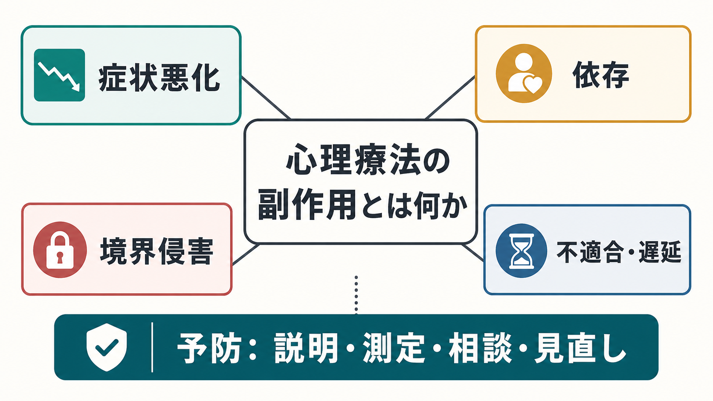
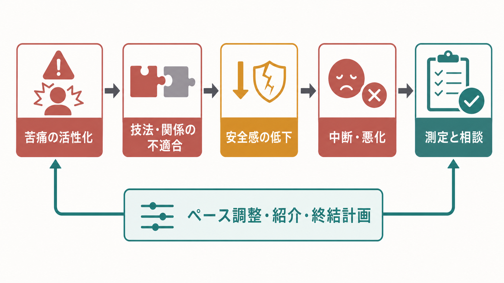
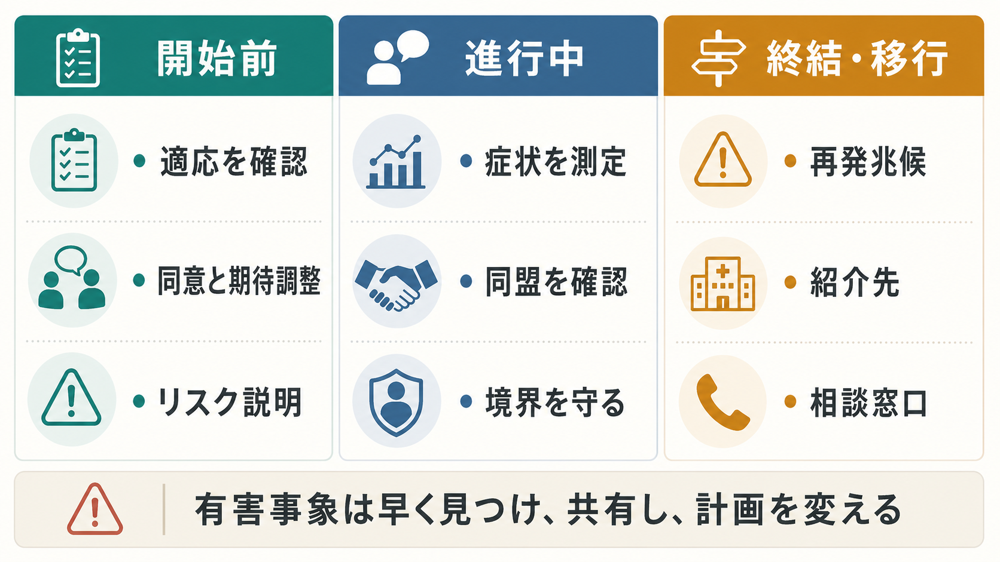

# 心理療法の副作用とは何か

## 要点

- 心理療法の副作用とは、治療過程と関連して生じる望ましくない変化であり、症状悪化、治療依存、境界侵害、スティグマ化、治療機会の遅延、対人関係や生活上の悪化を含みうる。
- 「つらくなること」そのものは常に副作用ではない。曝露や感情処理のように一時的苦痛が治療過程の一部になる場合もあるため、苦痛の意味、程度、持続、機能低下、同意の有無を分けて評価する必要がある。
- 有害事象を見つけることは、治療者や治療法の失敗を意味しない。むしろ、適応を確認し、アウトカムを測定し、治療同盟を点検し、必要なら方法・頻度・担当・紹介先を変えるための安全管理である[1][2]。
- 境界侵害、搾取、性的関係、多重関係、危機対応の不備は、単なる「相性の悪さ」ではなく、倫理・安全上の問題として扱う必要がある[3][7]。
- 本記事は教育・研究目的の整理であり、個別の診断や治療指示ではない。現在の治療で危険を感じる場合は、担当者以外の専門職、所属機関、地域の相談窓口、緊急支援につなげる判断が優先される。

## この記事で答える問い

1. 心理療法の「副作用」や「有害事象」は、どのように定義できるのか。
2. 症状悪化、依存、境界侵害、不適合は、どのような仕組みで起こるのか。
3. 臨床現場では、どのように予防し、早期発見し、対応を変えるべきか。
4. 研究では、心理療法の harms をどのように測定し、報告すべきか。

## まず結論

心理療法の副作用とは、「治療を受けた後に悪くなった」という単純な出来事ではなく、治療過程と時間的・内容的に関連し、本人の苦痛や生活機能を悪化させる可能性のある望ましくない変化である。Linden は、望ましくない出来事、治療に伴って生じた反応、有害な治療反応、マルプラクティス反応、非反応、病状悪化、治療リスク、禁忌を区別する枠組みを提案した[1]。この区別が重要なのは、同じ「悪化」でも、自然経過、疾患の波、生活上の出来事、治療技法の不適合、治療者の逸脱行為では対応が異なるからである。

したがって、心理療法の安全性は「何も悪いことが起きない」と仮定するのではなく、「起きうる望ましくない変化を予測し、測り、話し合い、計画を変える」実践として考える。[[心理療法とは何か]]、[[認知行動療法CBTとは何か]]、[[曝露療法とは何か]]、[[支持的精神療法とは何か]]などの方法は有効性の根拠をもつが、有効な介入であるほど、適応を外したときや不適切に実施されたときに害をもたらしうる[3]。

## 背景

薬物療法では副作用や有害事象の説明・記録が当然視される一方、心理療法では「話すだけだから安全」という前提が残りやすい。Berk と Parker は、この非対称性を批判し、不適切な心理療法、治療者行動、治療機会の遅延、依存、境界侵害などを「心理療法の負の側面」として検討すべきだと論じた[3]。

研究面でも問題は残る。心理療法研究では有効性のアウトカムが中心になり、有害事象の定義、測定、報告が研究ごとにばらつきやすい。Klatte らのシステマティックレビューは、心理療法試験のプロトコルで harms が扱われる頻度や定義が不十分で一貫しないことを示し、標準化された安全性評価の必要性を指摘している[5]。

臨床では、治療者が有害事象を尋ねなければ、クライエントは「治療に合わない自分が悪い」「治療者を傷つけたくない」「専門家に逆らえない」と感じ、悪化や不信を言い出せないことがある。したがって、副作用を話題にできる構造そのものが、心理療法の安全性の一部である。

## 基本概念

### 望ましくない出来事と有害な治療反応

心理療法中に起こる悪い出来事のすべてが、治療による害ではない。たとえば失職、家族葛藤、身体疾患の発症、症状の自然変動は、治療とは独立して起こりうる。まず「望ましくない出来事」として把握し、次に治療との因果関係、予見可能性、回避可能性、標準的な実施からの逸脱を評価する[1]。

有害な治療反応とは、治療の内容、方法、治療関係、設定、説明不足などが悪化に寄与したと考えられる反応である。たとえば、準備のないトラウマ想起、過度に対決的な面接、本人の資源を超えた課題、生活上の安全を損なう助言、症状悪化を無視した継続などが含まれる。

### 副作用、非反応、悪化、マルプラクティス

心理療法の harms は、少なくとも次のように分けると臨床判断がしやすい。

| 種類 | 例 | 主な対応 |
|---|---|---|
| 一時的負荷 | 曝露中の不安上昇、感情処理後の疲労 | 事前説明、ペース調整、回復時間の確保 |
| 非反応 | 十分な期間行っても改善しない | ケースフォーミュレーションの見直し、方法変更 |
| 症状悪化 | 抑うつ、不安、怒り、解離、希死念慮の増加 | 安全評価、頻度・技法の調整、連携 |
| 関係上の害 | 依存、服従、治療者への過剰適応 | 目標再確認、境界設定、終結計画 |
| 倫理的害 | 搾取、多重関係、性的境界侵害 | 相談窓口、所属機関、倫理手続き、保護 |
| 治療機会の遅延 | 必要な薬物療法・危機介入・社会資源につながらない | 鑑別、紹介、共同治療 |

### 測定できる負の効果

Rozental らは、心理療法の負の効果を測定する Negative Effects Questionnaire（NEQ）を開発し、症状、治療の質、依存、スティグマ、絶望感、失敗感などの因子を報告した[4]。これは、悪化を症状尺度だけで捉えるのではなく、「治療を受けたことで何が悪くなったと感じるか」を多面的に尋ねる必要を示している。

## 仕組み

心理療法の有害事象は、単一の原因ではなく、クライエント要因、治療者要因、技法要因、制度要因が重なって起こる。

### 1. 苦痛の活性化が処理能力を超える

心理療法では、避けてきた記憶、感情、身体感覚、対人パターンに近づくことがある。これは治療的に必要な場合もあるが、準備、説明、同意、安定化、危機対応が不十分だと、感情処理ではなく圧倒、解離、自己批判、回避の強化につながる。

[[曝露療法とは何か]]や[[曝露反応妨害法ERPとは何か]]では、不安を下げるだけでなく、安全行動を減らし、新しい学習を作ることが重要になる。しかし、曝露の強度、頻度、文脈が本人の理解と資源を超えると、治療への恐怖や中断を招きうる。

### 2. 技法と問題の不適合

治療法には適応と限界がある。たとえば、現在進行形の危機、重い自殺リスク、急性精神病症状、深刻な物質使用、暴力や搾取が続く環境では、通常の個人心理療法だけで十分とは限らない。必要な医学的評価、危機介入、社会的保護、家族・学校・職場との連携を遅らせると、それ自体が害になる。

逆に、構造化が強すぎる治療が本人に服従や失敗感を生じさせる場合もあれば、支持だけが続いて依存や停滞を強める場合もある。[[認知再構成法とは何か]]、[[行動活性化とは何か]]、[[対人関係療法IPTとは何か]]、[[弁証法的行動療法DBTとは何か]]などは、それぞれ異なる仮説と適応をもつため、「有名な方法だから安全」とは言えない。

### 3. 治療関係が依存や服従を強める

心理療法では、治療者への信頼が変化の土台になる。しかし、信頼が一方向的な服従や理想化になり、本人が自分の判断を常に治療者に預けるようになると、自己効力感が低下する。長期化した治療で終結の見通しが共有されない場合、治療が生活を支える足場ではなく、生活を狭める中心になってしまうこともある[3]。

依存そのものを悪とみなす必要はない。危機の時期には一時的な支えが必要である。ただし、治療の目標が「治療者なしでは判断できない状態」を固定していないか、本人の選択、関係、活動、社会資源が広がっているかを定期的に点検する必要がある。

### 4. 境界侵害と搾取

治療関係には権力差がある。治療者が親密さ、救済者役割、秘密の共有、身体接触、金銭・贈与、私的連絡、性的関係を曖昧に扱うと、クライエントは拒否しにくい。APA の倫理規程は、危害の回避、多重関係、搾取的関係、現在のクライエントとの性的関係の禁止、終結と中断への配慮を明記している[7]。

境界侵害は「相性」や「治療者の個性」として片づけない。治療者がクライエントに過度な特別扱いを求める、私的関係を持ち込む、秘密保持を盾に外部相談を妨げる、性的・身体的接触を治療として正当化する場合は、第三者への相談が必要である。

## 図解

心理療法の副作用を防ぐ実践は、開始前、進行中、終結・移行の各段階で異なる。開始前には適応、リスク、同意、期待を確認する。進行中には症状と治療同盟を測り、境界を守り、悪化を言える場を作る。終結・移行では、再発兆候、紹介先、相談窓口を明確にする。

## 臨床・研究との接続

### 臨床実践

臨床で重要なのは、有害事象を「最後に発覚する事故」ではなく、「毎回少しずつ点検できる情報」として扱うことである。具体的には、開始時に治療の目的、方法、期待できる利益、ありうる負荷、代替手段、中断や紹介の可能性を説明する。進行中は、症状尺度、生活機能、睡眠、希死念慮、自己傷害、物質使用、対人関係、治療同盟、本人の違和感を継続的に確認する。

Lambert らのメタ分析では、ルーチンアウトカム測定とフィードバックは、治療者が不良経過を認識し、クライエントと協働して対応する助けになり、悪化率の低下や臨床的改善の増加と関連することが示された[6]。これは、心理療法の安全性が「治療者の勘」だけでなく、測定と対話によって高まることを示している。

### 研究

研究では、有効性だけでなく harms をあらかじめ定義し、測定し、報告する必要がある。症状悪化、重篤な有害事象、中断、非反応、新規症状、対人・生活上の悪化、治療満足度の低下、倫理的問題を区別しなければ、何が安全で何が危険なのかを比較できない[5][8]。

また、負の効果は治療法の種類だけでなく、治療者の訓練、スーパービジョン、治療同盟、設定、参加者の重症度、併存症、社会的資源によって変わる。したがって、研究の結論を臨床に移すときは、「この治療法は有効か」だけでなく、「どの条件で、誰に、どのように実施され、悪化をどう検出したか」を読む必要がある。

## よくある誤解

### 誤解1: 心理療法は薬ではないので副作用はない

心理療法は身体に薬理作用を及ぼすわけではないが、感情、記憶、行動、対人関係、意思決定、自己理解に働きかける。したがって、不適切に行われれば、症状悪化、依存、羞恥や失敗感、対人関係の悪化、必要な治療の遅延を起こしうる[2][3]。

### 誤解2: 治療中につらくなったら、その治療は有害である

一時的な不安や悲しみは、治療的作業の一部である場合がある。重要なのは、事前説明と同意があるか、本人が目的を理解しているか、苦痛が耐えられる範囲か、生活機能が大きく崩れていないか、悪化時に調整できるかである。つらさを言えない治療関係のほうが危険である。

### 誤解3: 悪化を報告すると治療者を責めることになる

悪化の報告は、責任追及だけを意味しない。自然経過かもしれないし、生活上の出来事かもしれないし、治療のペースや技法が合っていないのかもしれない。いずれの場合も、情報がなければ調整できない。悪化を話題にすることは、治療を続けるためにも、変えるためにも、終えるためにも必要である。

### 誤解4: 有害事象はまれなので、特別なケースだけ考えればよい

深刻な倫理違反は頻繁ではないとしても、非反応、一時的悪化、中断、治療同盟の破綻、依存、期待外れ、生活上の悪化は臨床で十分に起こりうる。Rozental らは、負の効果を研究と臨床の両方でより体系的に扱う必要を提案している[8]。

## 関連ノート

- [[心理療法とは何か]]
- [[認知行動療法CBTとは何か]]
- [[曝露療法とは何か]]
- [[曝露反応妨害法ERPとは何か]]
- [[支持的精神療法とは何か]]
- [[対人関係療法IPTとは何か]]
- [[弁証法的行動療法DBTとは何か]]
- [[DBTのマインドフルネススキルとは何か]]

## 関連ノート候補

- 「治療同盟とは何か」
- 「ルーチンアウトカム測定とは何か」
- 「心理療法におけるインフォームドコンセントとは何か」
- 「心理療法における境界侵害とは何か」
- 「心理療法の終結計画とは何か」

## MOC更新候補

- `content/00_MOC/MOC・臨床実践・治療.md`
- `content/00_MOC/MOC・心理療法.md`

## 理解チェック

1. 心理療法中の「望ましくない出来事」と「有害な治療反応」は、どの点で区別されるか。
2. 曝露や感情処理に伴う一時的苦痛と、治療による有害事象を分ける観点を3つ挙げられるか。
3. 治療依存や境界侵害が、なぜ症状尺度だけでは見逃されやすいか説明できるか。
4. ルーチンアウトカム測定とフィードバックが、有害事象の予防にどう役立つか説明できるか。

## 参考文献

[1] Linden, M. (2013). How to define, find and classify side effects in psychotherapy: From unwanted events to adverse treatment reactions. *Clinical Psychology & Psychotherapy*, 20(4), 286-296. https://doi.org/10.1002/cpp.1765

[2] Linden, M., & Schermuly-Haupt, M. L. (2014). Definition, assessment and rate of psychotherapy side effects. *World Psychiatry*, 13(3), 306-309. https://doi.org/10.1002/wps.20153

[3] Berk, M., & Parker, G. (2009). The elephant on the couch: Side-effects of psychotherapy. *Australian & New Zealand Journal of Psychiatry*, 43(9), 787-794. https://doi.org/10.1080/00048670903107559

[4] Rozental, A., Kottorp, A., Boettcher, J., Andersson, G., & Carlbring, P. (2016). Negative effects of psychological treatments: An exploratory factor analysis of the Negative Effects Questionnaire for monitoring and reporting adverse and unwanted events. *PLOS ONE*, 11(6), e0157503. https://doi.org/10.1371/journal.pone.0157503

[5] Klatte, R., Strauss, B., Flückiger, C., Färber, F., & Rosendahl, J. (2023). Defining and assessing adverse events and harmful effects in psychotherapy study protocols: A systematic review. *Psychotherapy*, 60(1), 130-148. https://doi.org/10.1037/pst0000359

[6] Lambert, M. J., Whipple, J. L., & Kleinstäuber, M. (2018). Collecting and delivering progress feedback: A meta-analysis of routine outcome monitoring. *Psychotherapy*, 55(4), 520-537. https://doi.org/10.1037/pst0000167

[7] American Psychological Association. (2017). *Ethical principles of psychologists and code of conduct*. https://www.apa.org/ethics/code

[8] Rozental, A., Castonguay, L., Dimidjian, S., Lambert, M., Shafran, R., Andersson, G., & Carlbring, P. (2018). Negative effects in psychotherapy: Commentary and recommendations for future research and clinical practice. *BJPsych Open*, 4(4), 307-312. https://doi.org/10.1192/bjo.2018.42

## 未解決問題

- 心理療法の有害事象を、薬物療法の有害事象と同じ枠組みでどこまで比較できるか。
- 症状悪化、非反応、生活上の悪化、依存、境界侵害を、日常臨床で過度な負担なく測定する方法は何か。
- オンライン心理療法、アプリ介入、集団療法、家族介入では、有害事象の種類と検出方法がどう変わるか。
- 「治療者に言いにくい悪化」を、クライエントが安全に報告できる制度設計はどうあるべきか。
