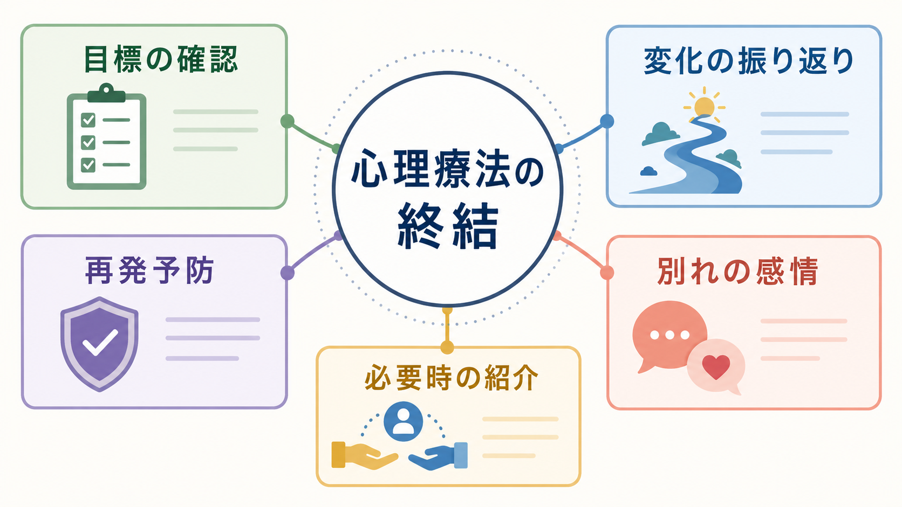
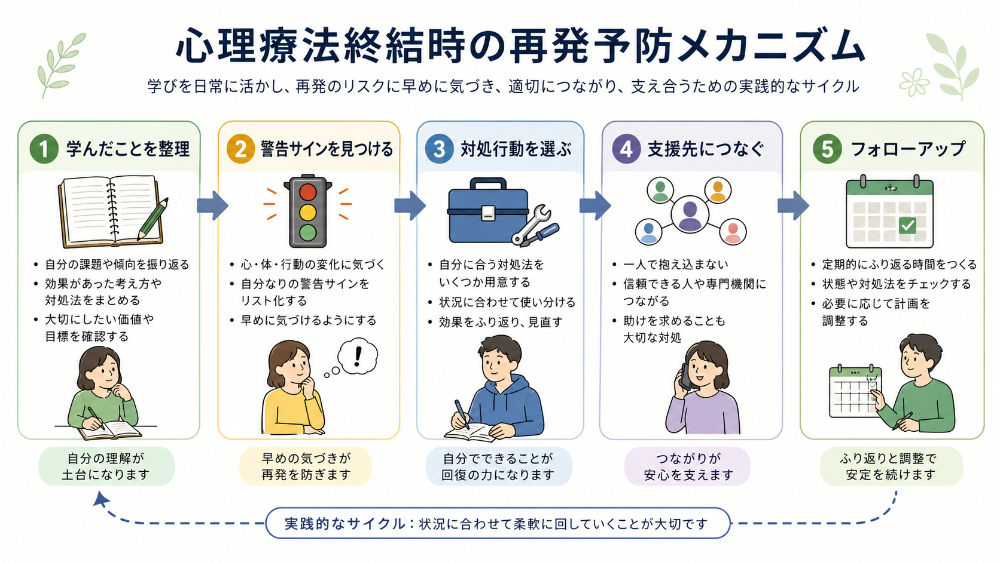
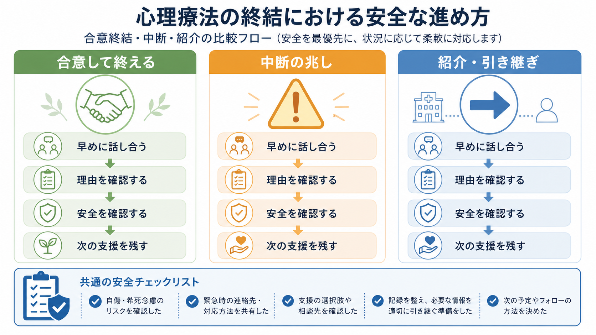

# 心理療法の終結はどう行うのか

## 要点

- 心理療法の終結は、単に予約を止めることではなく、治療目標、変化、残る課題、再発予防、別れの感情、必要時の紹介を扱う治療過程の一部である。
- 終結の判断は、症状の軽減だけでなく、本人が何を学び、どのように日常で使えているか、支援がなくなった後のリスクにどう備えるかで見る。
- 計画的な終結では、成果の振り返り、警告サインの同定、対処行動、支援先、フォローアップ可能性を明文化する。
- 終結には誇り、安心、寂しさ、怒り、不安、見捨てられ感などが混在しうる。これを避けずに扱うことが、安全な別れの一部になる。
- 継続が有益でない、害がある、治療者の専門性を超える、または安全上の問題がある場合は、終結や紹介を検討する。ただし可能な範囲で事前面接と代替支援を残す。

## この記事で答える問い

このノートでは、[[心理療法とは何か]]を前提に、心理療法をどのように終えるかを扱う。中心となる問いは次の通りである。

- いつ終結を検討するのか。
- 終結前に何を確認するのか。
- 再発予防はどのように計画するのか。
- 別れの感情や治療関係をどう扱うのか。
- 中断、転院、紹介と、合意された終結は何が違うのか。

## まず結論

安全な終結は、「よくなったので終わり」ではなく、「何が変わり、何が残り、今後どう支えるか」を共同で確認するプロセスである。具体的には、1. 当初の主訴と目標を見直す、2. 治療で役立った理解やスキルを言語化する、3. 再発や悪化の警告サインを確認する、4. 対処行動と支援先を決める、5. 終結に伴う感情を扱う、6. 必要なら紹介・フォローアップ・再相談の条件を明確にする、という流れになる。

終結は、治療者が一方的に「終了を告げる」場面でも、クライエントが「もう来ません」とだけ伝える場面でもない。理想的には、治療初期から「どのような状態になれば終えられるか」を共有し、終盤でその合意を更新していく。治療同盟、目標合意、協働、フィードバックは心理療法の効果と関連するため、終結も同じく協働的に扱う必要がある[1]。

## 背景

心理療法の終結は、心理療法研究の中では介入技法や治療効果ほど多く研究されてこなかった領域である。しかし、近年の系統的レビューでは、成人個人心理療法の終結に関する実証研究が、終結理由、終結タイプ、誰が切り出すか、終結期の長さ、患者と治療者の感情、終結後接触などの多様な主題を扱っていることが整理されている[2]。

終結の理由は一つではない。目標達成、症状改善、生活環境の変化、費用や時間の制約、治療関係の不一致、治療者の異動、専門性の限界、安全上の問題などがある。合意された終結は、治療者とクライエントが治療の目的、成果、今後の支援を共有できるため、満足度や成果の振り返りと結びつきやすい。一方、突然の中断や片側だけの終結は、未完了感、怒り、見捨てられ感、治療不信を残すことがある[2]。

早期中断も重要である。成人心理療法のメタ分析では、約5人に1人が治療を早期に中断していると推定され、若年者、一部の診断、治療者の経験、治療環境などが中断率に関連していた[3]。したがって、終結を語ることは、終盤だけの作業ではなく、初期から中断リスクを下げるための[[共同意思決定とは何か]]でもある。

## 基本概念

### 合意された終結

合意された終結とは、クライエントと治療者が、現在の治療目標、達成度、残る課題、終結後の支援を話し合い、一定の納得をもって治療を終えることである。ここで大切なのは、完全に問題が消えることではない。本人が問題を理解し、必要な対処を選び、支援を使いながら生活を続けられる見通しを持てることが中心になる。

たとえば[[認知行動療法CBTとは何か]]では、症状を減らすだけでなく、考え方、行動、感情、身体反応のつながりを本人が扱えるようにすることが重要になる。終結時には、「治療者と一緒ならできる」から「一人でも、あるいは周囲の支援を使いながらできる」へ移行できているかを確認する。

### 中断、転院、紹介

中断は、予定された終結とは異なる。クライエントが来談しなくなる、治療者への不満を言語化できないまま離れる、生活上の事情で通えなくなるなどが含まれる。中断は失敗と決めつけるべきではないが、治療関係の破綻、説明不足、目標の不一致、症状悪化、経済的負担などのサインであることがある。

転院や紹介は、治療者の異動、専門性の限界、より適した治療への移行などで生じる。APA の倫理規定では、クライエントがサービスを必要としなくなった、利益が見込めない、継続により害がある場合に終結を行い、可能な範囲で終結前の面接と代替サービスを提案することが求められている[4]。これは「抱え続けること」ではなく、本人の利益に沿った支援へつなぐ責任を意味する。

### 終結期の感情

終結では、達成感、誇り、感謝、安心だけでなく、寂しさ、怒り、不安、見捨てられ感、後悔が出ることがある。特に喪失体験、愛着の傷つき、対人関係の不安が主題になっていた場合、終結そのものが治療テーマを再活性化する。これは避けるべき副作用ではなく、扱うべき臨床材料である。

終結期の治療関係に関する研究では、作業同盟、現実関係、転移的側面が終結評価や治療者から見た治療成果と関連していることが示されている[5]。したがって、終結時の感情は「最後だから軽く流す」のではなく、[[転移とは何か]]や[[逆転移とは何か]]も含めて検討される。

## 仕組み

### 1. 治療目標を再確認する

終結の第一歩は、最初に何を目指していたかを確認することである。主訴、治療目標、困っていた状況、回避していた行動、対人関係上の問題、症状の頻度や強度を振り返る。ここでは「症状が何点下がったか」だけでは不十分で、本人が日常生活の中で何を取り戻したかを確認する。

確認する問いの例は次の通りである。

| 観点 | 問い |
|---|---|
| 目標 | 最初に何を変えたいと思っていたか |
| 変化 | いま何が以前と違うか |
| 有効成分 | どの理解、練習、関係性が役立ったか |
| 残る課題 | まだ苦手な場面は何か |
| 自立性 | 治療外で使える対処は何か |
| 支援 | 誰に、いつ、どのように助けを求めるか |

この作業は、[[ケースフォーミュレーションとは何か]]の更新でもある。終結時のケース理解は、「なぜ困っていたか」だけでなく、「なぜ今は維持できているか」を説明できる必要がある。

### 2. 変化を本人の言葉に戻す

終結では、治療者が成果を評価するだけでなく、クライエント自身が変化を言語化することが重要である。たとえば、「不安がなくなった」ではなく、「不安が出ても、呼吸を整え、考えを検討し、必要な行動を選べるようになった」と表現できれば、再発予防にもつながる。

治療者は、治療記録やセッションの節目を振り返りながら、本人の努力、獲得したスキル、価値に沿った行動、関係性の変化を整理する。これは称賛だけでなく、学習内容の再固定化である。

### 3. 再発予防を計画する

終結時の最重要課題の一つは、再発予防である。NICE のうつ病ガイドラインでは、再発予防の心理的介入に、治療で学んだことのレビュー、進歩を維持する具体的計画、警告サイン、ストレス状況、回避や反すうなどの悪化パターン、今後12か月の困難な出来事への計画を含めることが推奨されている[6]。

これはうつ病に限らず、心理療法終結全般に応用しやすい。[[再発予防計画とは何か]]では、以下を具体化する。

| 項目 | 内容 |
|---|---|
| 警告サイン | 睡眠の乱れ、回避、反すう、孤立、過活動、食欲変化など |
| 早期対処 | 休息、行動活性化、認知再構成、相談、環境調整 |
| 維持練習 | セルフモニタリング、価値に沿った行動、マインドフルネス |
| 支援先 | 家族、友人、主治医、相談機関、職場・学校の支援 |
| 再相談条件 | 何が何日続いたら連絡するか |
| 危機対応 | 自傷他害、希死念慮、暴力、虐待、生活破綻がある場合の連絡先 |

### 4. 別れの感情を扱う

終結が近づくと、クライエントは「よくなったのに寂しい」「終わると言われて見捨てられた気がする」「自立できるか不安」「もっと早く本音を言えばよかった」と感じることがある。治療者側にも、達成感、寂しさ、心配、罪悪感、安堵が生じうる。

この感情を扱うには、終結を早めに話題にし、複数回にわたって戻ってよいテーマにすることが役立つ。終結直前の1回だけで処理しようとすると、感情が表面化する時間が足りない。治療関係そのものが主題になっている場合、[[ラポールはどのように形成されるのか]]、[[共感的理解とは何か]]、[[精神科医の自己理解はなぜ必要なのか]]とも関連する。

### 5. フォローアップと再相談の条件を決める

終結後に一切連絡しないことが常に最善とは限らない。一定期間後のフォローアップ、ブースターセッション、必要時の再相談条件を決めることがある。ただし、境界設定は明確にする必要がある。連絡手段、返信可能時間、緊急時の対応、再開の条件、別機関への相談が必要な場合を文書化しておく。

心理療法の効果を保つには、治療中から経過を測定し、悪化や停滞を早めに見つけることも重要である。ルーチンアウトカムモニタリングのメタ分析では、進捗フィードバックが通常治療より有利に働き、悪化率を減らし、臨床的に意味のある改善を増やす可能性が示されている[7]。終結判断も、主観的印象だけでなく、本人の語り、生活機能、尺度、治療目標の達成度を組み合わせて行う。

## 図解

終結は、直線的な「終了手続き」ではなく、成果の統合と将来への橋渡しである。図のように、合意して終える場合、中断の兆しがある場合、紹介・引き継ぎが必要な場合では、焦点が少し異なる。

## 臨床・研究との接続

### 治療初期から終結を見通す

終結は終盤に急に出す話題ではない。初回から、治療の目的、期間の見通し、評価方法、終結条件、紹介の可能性を説明しておくと、終結は「拒絶」ではなく「治療計画の一部」として理解されやすい。APA の臨床向け解説でも、治療の経過を定期的に見直し、必要なら紹介や引き継ぎを含めて終結を扱うことが強調されている[8]。これは[[インフォームドコンセントは精神科でどう行うのか]]とも関係する。

### 治療中断を失敗だけで見ない

中断はリスクであるが、クライエントの主体性や生活事情の表れでもある。治療者は「来なくなった人」とだけ見ず、治療目標の不一致、治療同盟の破綻、文化的・経済的障壁、症状悪化、恥や怒りがなかったかを検討する。中断を減らすには、早期から希望、懸念、治療への違和感を尋ねる必要がある[3]。

### 危機対応は終結より優先される

希死念慮、自傷他害リスク、虐待、DV、重度の精神病症状、薬物過量服薬リスク、生活上の重大な危機がある場合、通常の終結手続きより安全確保が優先される。必要に応じて[[自殺リスク評価では何を聞くべきか]]、[[クライシスプランとは何か]]、[[精神科救急では何を優先するべきか]]に接続する。

### 研究上の未解決問題

終結研究は、治療法、治療期間、設定、診断、文化的背景によって異質性が大きい。系統的レビューでも、終結期の実証研究はまだ限られ、メタ分析が困難なほど方法が多様であるとされる[2]。今後は、終結の質をどう測るか、どの終結手続きが再発や再相談に影響するか、オンライン心理療法や短期療法で終結をどう設計するかが課題になる。

## よくある誤解

### 誤解1: 症状が消えたらすぐ終わってよい

症状軽減は重要だが、終結の条件はそれだけではない。症状が再燃したときの警告サイン、対処行動、支援先が明確でなければ、終結後に孤立しやすい。

### 誤解2: 終結を話すとクライエントが傷つく

終結の話題は傷つきを呼ぶことがある。しかし、早めに丁寧に扱えば、見捨てられ感や不意打ちを減らせる。むしろ話題にしないまま終わる方が、未完了感を残しやすい。

### 誤解3: 終結後に再相談するのは後退である

再相談は失敗ではない。心理療法で学んだことを使ったうえで、必要なタイミングで支援を求めることは、むしろ回復維持の一部である。

### 誤解4: 治療者が寂しさや不安を感じてはいけない

治療者にも感情は生じる。重要なのは、それをクライエントに処理させないこと、終結判断を治療者側の不安で遅らせないこと、必要に応じてスーパービジョンやコンサルテーションで扱うことである。

## 関連ノート

- [[心理療法とは何か]]
- [[認知行動療法CBTとは何か]]
- [[マインドフルネス認知療法MBCTとは何か]]
- [[再発予防計画とは何か]]
- [[精神疾患と治療中断はどう関係するのか]]
- [[共同意思決定とは何か]]
- [[ラポールはどのように形成されるのか]]
- [[転移とは何か]]
- [[逆転移とは何か]]
- [[クライシスプランとは何か]]

## MOC更新候補

- `content/00_MOC/` 配下の臨床実践・心理療法関連 MOC に追加候補。
- 並列編集回避のため、本ジョブでは MOC 本体は更新しない。

## 理解チェック

1. 心理療法の終結を、単なる予約終了ではなく治療過程の一部とみなす理由は何か。
2. 終結前に確認すべき「変化」と「残る課題」は、どのように区別できるか。
3. 再発予防計画に含めるべき警告サイン、対処行動、支援先、再相談条件を一つずつ挙げられるか。
4. 合意された終結、中断、紹介・引き継ぎでは、臨床的に何が異なるか。
5. 終結に伴う寂しさや怒りを、治療上どのように扱えるか。

## 参考文献

[1] Norcross, J. C., & Wampold, B. E. (2011). Evidence-based therapy relationships: Research conclusions and clinical practices. *Psychotherapy, 48*(1), 98-102. https://doi.org/10.1037/a0022161

[2] Rabinowitz, Y. L., Yim, B., & Muran, J. C. (2025). Termination of psychotherapy: A systematic review. *Journal of Clinical Psychology and Psychotherapy Research, 4*(1), 2535626. https://doi.org/10.1080/28324765.2025.2535626

[3] Swift, J. K., & Greenberg, R. P. (2012). Premature discontinuation in adult psychotherapy: A meta-analysis. *Journal of Consulting and Clinical Psychology, 80*(4), 547-559. https://doi.org/10.1037/a0028226

[4] American Psychological Association. (2002). *Ethical Principles of Psychologists and Code of Conduct*, Standard 10.10 Terminating Therapy. https://puc.edu/__data/assets/pdf_file/0020/31529/APA-Ethics-Code.pdf

[5] Bhatia, A., & Gelso, C. J. (2017). The termination phase: Therapists' perspective on the therapeutic relationship and outcome. *Psychotherapy, 54*(1), 76-87. https://doi.org/10.1037/pst0000100

[6] National Institute for Health and Care Excellence. (2022). *Depression in adults: treatment and management* (NICE guideline NG222), recommendations 1.8.6-1.8.8. https://www.nice.org.uk/guidance/ng222/chapter/Recommendations

[7] Lambert, M. J., Whipple, J. L., & Kleinstäuber, M. (2018). Collecting and delivering progress feedback: A meta-analysis of routine outcome monitoring. *Psychotherapy, 55*(4), 520-537. https://doi.org/10.1037/pst0000167

[8] American Psychological Association. (2026, April 22). Recognizing when therapy has run its course. https://www.apa.org/topics/psychotherapy/terminating-therapy

## 未解決問題

- 終結の質を、満足度、治療同盟、再発率、再相談率、生活機能のどれで評価するのが妥当か。
- 短期療法、長期療法、オンライン心理療法、集団療法で、終結期に必要な時間や手続きはどの程度異なるか。
- 文化的背景、愛着様式、喪失体験、経済的制約が終結体験に与える影響を、どのように個別化して扱うべきか。
