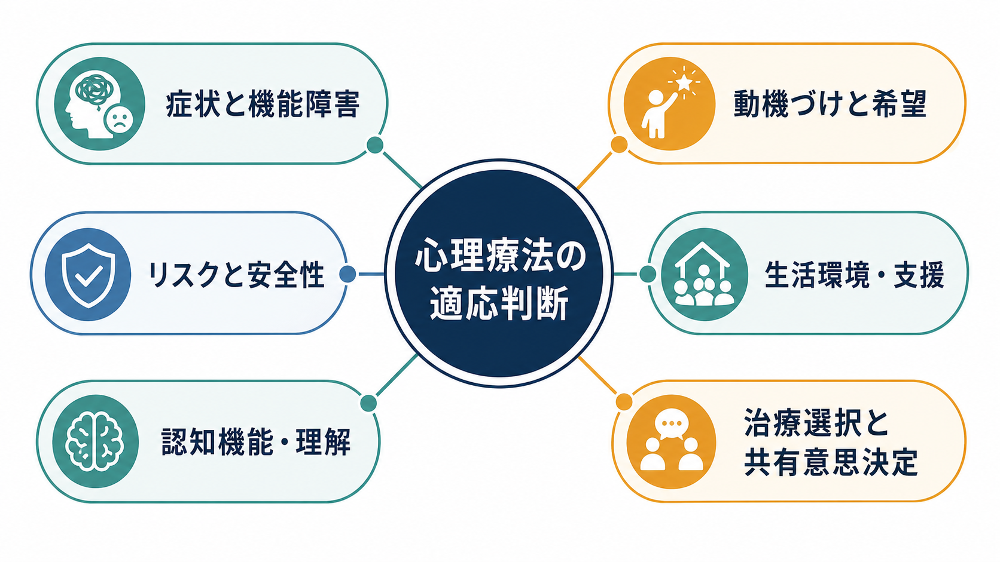
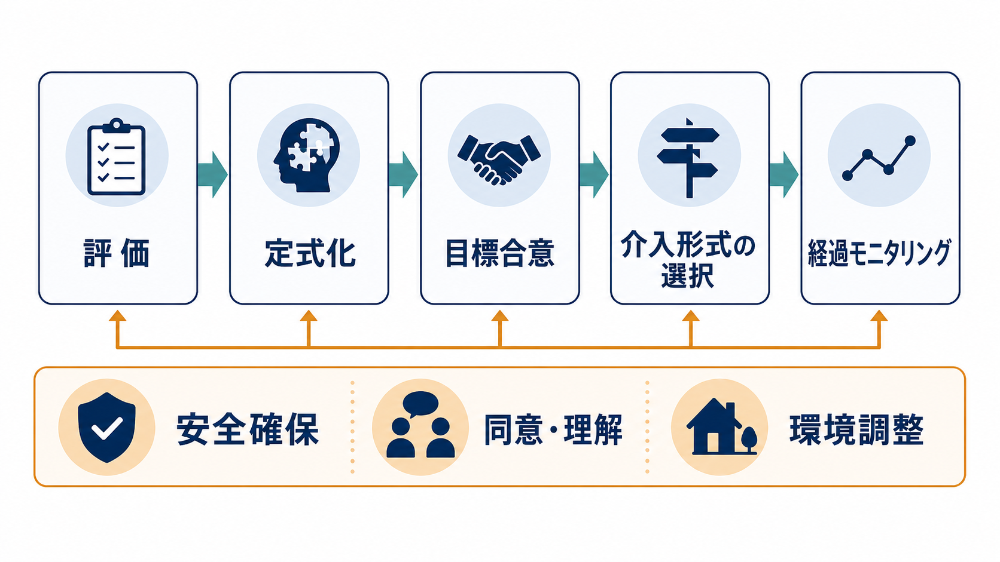
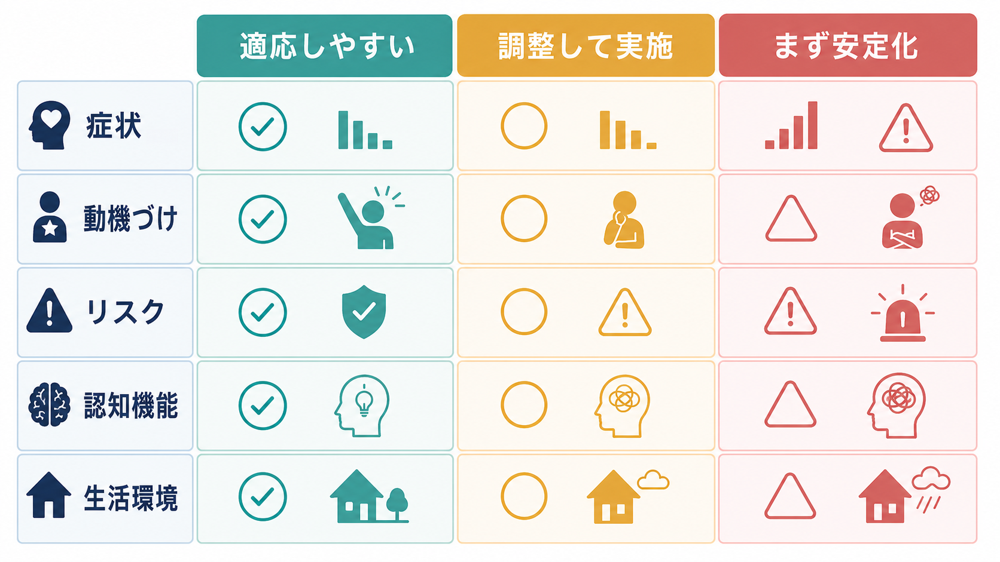

# 心理療法の適応はどう判断するのか

## 要点

- 心理療法の適応は、「この人に心理療法が向くか」という一回限りの判定ではなく、「いま、何を目標に、どの形式で、どの安全策と調整を入れて行うか」という臨床判断である。
- 判断軸は、症状と機能障害、本人の希望と動機づけ、急性リスク、認知機能と意思決定支援、生活環境、利用できる治療資源の6つに整理できる。
- 自殺・自傷、暴力、重いセルフネグレクト、急性精神病症状、躁状態、重い物質使用、虐待・DVなどが疑われるときは、通常の心理療法単独ではなく、安全確保、医学的評価、多職種連携を先に置く。
- 動機づけが低いことは、ただちに「不適応」を意味しない。治療同盟、目標のすり合わせ、心理教育、短い介入、環境調整によって、適応は変化する。
- 認知機能、言語、発達特性、文化、生活負担がある場合は、心理療法を除外するより、説明方法、頻度、課題量、家族・支援者の関与、測定方法を調整する。

## この記事で答える問い

1. 心理療法の適応判断では、何を評価するのか。
2. 「心理療法を始める」「調整して行う」「まず安定化する」はどう区別するのか。
3. 症状、動機づけ、リスク、認知機能、生活環境は、実際の判断にどう関わるのか。
4. 適応判断を、個別診断や治療指示としてではなく、研究・教育の知識としてどう整理できるのか。

## まず結論

心理療法の適応は、診断名だけでは決まらない。[[心理療法とは何か]]で扱うように、心理療法は対話、行動課題、関係性、意味づけ、スキル練習を通じて変化を支える実践である。そのため適応判断では、「症状が心理療法の対象になるか」だけでなく、「本人が目標を共有できるか」「安全に取り組めるか」「理解・記憶・実行の負荷を調整できるか」「生活環境が治療を支えるか」を同時に見る必要がある。

根拠に基づく心理実践は、最良の研究証拠、臨床的専門性、患者の特徴・文化・選好を統合するものと定義される[1]。したがって、適応判断は「エビデンスのある技法を当てはめる」だけではなく、本人の希望、価値観、リスク、支援資源を含めた共有意思決定である。NICEのうつ病ガイドラインも、重症度、既往、併存症、治療選好、リスク、機能障害を踏まえて介入を選ぶことを重視している[2]。

## 背景

心理療法には、[[認知行動療法CBTとは何か]]、[[支持的精神療法とは何か]]、[[対人関係療法IPTとは何か]]、[[弁証法的行動療法DBTとは何か]]、[[曝露療法とは何か]]、[[行動活性化とは何か]]など、多様な形式がある。研究上は、うつ病に対する心理療法ではCBTを中心に多くのランダム化比較試験があり、複数の心理療法が有効性を示す一方、効果量や継続率は対象、形式、比較条件、治療者、実装環境によって変わる[3]。

この事実は、心理療法を「効くか効かないか」の二分法で考えるより、「どの問題に、どの程度の強度で、どの支援条件なら実施可能か」と考える必要を示している。たとえば軽症から中等症の抑うつや不安では、心理教育、低強度介入、行動活性化、CBT、IPTなどが検討されやすい。一方、生命に関わるリスク、重いセルフネグレクト、急性精神病症状、重い物質使用、家庭内暴力などが前景にある場合は、心理療法の開始よりも安全計画、医学的評価、危機対応、社会的保護を優先する。

## 基本概念

### 適応は「資格」ではなく「条件つきの見立て」

心理療法の適応は、本人の性格や診断名で固定されるものではない。むしろ、いまの問題が心理的・行動的・対人関係的な介入で扱える形に定式化できるか、本人と治療者が目標を共有できるか、リスクを管理しながら継続できるかという条件つきの見立てである。

たとえば、強い不安がある人は[[曝露療法とは何か]]の候補になりうるが、急性の自殺リスクや家庭内での安全確保の問題が大きい場合は、曝露課題より先に安全確保と危機対応が必要になる。逆に、動機づけが弱い人でも、短い心理教育、生活上の困りごとの整理、本人が望む目標への翻訳によって、[[行動活性化とは何か]]や支持的介入に入れることがある。

### 共有意思決定

心理療法は、本人の参加を前提にする治療である。NICEの意思決定・判断能力ガイドラインは、意思決定を支える際に、身体・精神状態、コミュニケーション、過去の経験、周囲からの影響、社会的・文化的要因、認知・感情・行動要因を考慮することを求めている[4]。これは心理療法の適応判断にもそのまま関係する。

本人が治療内容を理解し、選択肢の利点と負担を比べ、自分の価値観に照らして選べるように支援することが重要である。理解が不十分な場合も、すぐに不適応とみなすのではなく、資料を短くする、視覚的に説明する、セッション内で要約する、支援者同席を検討するなど、意思決定支援を先に行う。

## 仕組み

心理療法の適応判断は、次の5段階で考えると整理しやすい。

1. 評価：症状、機能障害、生活史、併存症、リスク、強み、支援資源を把握する。
2. 定式化：困りごとがどのような認知、感情、行動、身体反応、対人関係、環境要因で維持されているかを仮説化する。
3. 目標合意：本人にとって意味のある短期・中期目標を、測定しやすい形で共有する。
4. 介入形式の選択：心理教育、支持的介入、CBT、IPT、DBT、家族支援、薬物療法や福祉支援との併用などを検討する。
5. 経過モニタリング：症状尺度、生活上の変化、本人の実感、リスク変化、治療同盟を定期的に確認し、方針を調整する。

### 症状と機能障害

症状は、心理療法の「対象」を示すが、それだけで適応を決めない。抑うつ、不安、強迫、パニック、トラウマ反応、対人関係困難、感情調整困難などは心理療法の対象になりうる。ただし、症状の重症度、急性度、併存症、生活機能への影響によって、個人療法、集団療法、低強度介入、薬物療法併用、危機対応のどれを優先するかは変わる。

NICEの段階的ケアでは、軽症から中等症では低強度心理社会的介入や心理療法が検討され、重症・複雑例や生命リスクがある場合には、多職種対応、薬物療法、高強度心理療法、危機サービスなどが必要になる[2]。つまり、心理療法は「症状が軽い人だけのもの」ではないが、重症例では単独実施ではなく、支援密度を上げる設計が必要になる。

### 動機づけと希望

動機づけは、「やる気があるかないか」ではなく、本人が何に困っており、何なら変えてみたいと思えるかを探す作業である。心理療法の初期には、症状軽減よりも、睡眠を整える、外出を少し増やす、衝動の前に一呼吸置く、家族との会話を減らして安全を保つなど、本人にとって意味のある小さな目標を置くことがある。

治療関係と個別化も重要である。治療同盟、共感、目標合意、フィードバック、患者の選好や文化への応答性は、心理療法の結果と関連する要素として整理されている[5]。したがって、動機づけが低い場合の問いは「心理療法に向かないか」ではなく、「何なら合意できるか」「どの形式なら負担が少ないか」「本人の言葉で目標を言い直せるか」である。

### リスクと安全性

自殺・自傷リスク、他害リスク、虐待・DV、急性精神病症状、躁状態、重い離脱や中毒、重度のセルフネグレクトがある場合、通常の心理療法をそのまま始めるのは不十分である。WHO mhGAPは、うつ病、双極性障害、統合失調症、物質使用、認知症、急性情動的苦痛などをもつ人に対して、自傷・自殺の考えや計画、過去の自傷行為を評価することを推奨している[6]。

この場合の心理療法は、「話を聞く」だけではなく、安全計画、手段へのアクセス制限、家族・支援者との連携、医療機関への紹介、危機サービス利用、薬物療法や入院の検討と接続する必要がある。安全が確保されてから、感情調整、問題解決、トラウマ焦点化介入、再発予防へ進むことが多い。

### 認知機能・理解

記憶、注意、遂行機能、言語理解、抽象化、メタ認知が弱いと、標準的な心理療法の課題は負荷が高くなる。これは不適応というより、治療形式を調整するサインである。

調整には、説明を短くする、1回の目標を少なくする、ワークシートを簡略化する、反復練習を増やす、セッション内で課題を一緒に行う、予定表やリマインダーを使う、家族・支援者の関与を検討するなどがある。[[心理教育とは何か]]や支持的介入は、複雑な内省を要求しすぎず、理解と自己管理の足場を作る役割をもつ。

### 生活環境・支援

心理療法は、セッション内だけで完結しない。宿題、行動実験、曝露、対人練習、睡眠・活動記録、感情調整スキルは、生活環境の中で実行される。住居不安、経済困難、家族葛藤、介護負担、職場・学校の問題、移動困難、予約の取りにくさがあると、心理療法の継続性は下がる。

この場合は、心理療法を諦めるのではなく、頻度を下げる、オンラインや電話を使う、短時間介入にする、福祉・地域支援につなぐ、家族面接を加える、医療・学校・職場との連携を検討する。慢性身体疾患が心理療法への参加を制限する場合、NICEは本人と相談し、代替形式や電話などの実施方法を検討することを示している[7]。

## 図解

心理療法の適応判断は、次の3分類で考えると臨床的に使いやすい。

| 判断 | 状態の目安 | 主な方針 |
|---|---|---|
| 適応しやすい | 問題が心理的・行動的に定式化でき、本人が目標を共有でき、急性リスクが管理可能 | 心理療法を開始し、目標と測定指標を決める |
| 調整して実施 | 動機づけ、認知機能、生活環境、併存症、文化・言語面に負荷がある | 形式、頻度、説明、課題量、支援者関与を調整する |
| まず安定化 | 生命リスク、急性精神病症状、躁状態、重い物質使用、虐待・DV、重いセルフネグレクト | 安全確保、医学的評価、多職種連携を優先する |

## 臨床・研究との接続

臨床では、心理療法の適応を「開始前の判定」で終わらせない。開始後も、症状、生活機能、治療同盟、課題実行、リスク、本人の納得感を定期的に見直す。ルーチン・アウトカム・モニタリングは、臨床的に重要な情報を得る、治療を調整する、コミュニケーションを促進する、治療関係を支える、個別化を進める方法として整理されている[8]。

研究では、平均的な治療効果と個別の適応判断を区別する必要がある。メタ分析は「ある介入が平均的に有効か」を示すが、個人にとっての実施可能性、好み、文化、認知機能、生活資源、安全性は別に評価する必要がある。この意味で、心理療法の適応判断は、エビデンス、定式化、共有意思決定、測定に基づく修正をつなぐ実践である。

## よくある誤解

### 誤解1: 心理療法は、話せる人だけが受けるもの

言語化の力は役立つが、心理療法は高度な内省だけで成り立つわけではない。行動活性化、スキル練習、心理教育、家族支援、環境調整など、言葉に頼りすぎない形式もある。話す力が弱い場合は、視覚資料、短い質問、具体的な行動目標を使って調整する。

### 誤解2: 動機づけが低い人は不適応である

動機づけは、治療前から完成しているものではない。本人が困っていること、避けたいこと、大切にしたいことを一緒に整理する過程で変化する。最初は「治したい」よりも、「眠れるようになりたい」「家族との衝突を減らしたい」「仕事を休む判断を整理したい」から始まることがある。

### 誤解3: リスクがある人には心理療法をしてはいけない

リスクがある場合、心理療法を完全に排除するのではなく、優先順位と支援密度を変える。急性リスクが高いときは安全確保と医学的評価を先に置くが、その後に感情調整、問題解決、再発予防、対人支援を心理療法的に扱うことは多い。

### 誤解4: エビデンスのある治療なら、そのまま実施すればよい

エビデンスは重要だが、治療はマニュアルの機械的適用ではない。本人の文化、選好、認知機能、生活環境、治療関係、併存症に応じて調整し、経過を測定しながら変更する必要がある。

## 関連ノート

- [[心理療法とは何か]]
- [[認知行動療法CBTとは何か]]
- [[支持的精神療法とは何か]]
- [[対人関係療法IPTとは何か]]
- [[弁証法的行動療法DBTとは何か]]
- [[曝露療法とは何か]]
- [[行動活性化とは何か]]
- [[心理教育とは何か]]

### MOC更新候補

- [[MOC｜臨床実践・治療]] に、心理療法の総論記事として追加候補。
- 並列ジョブとの競合を避けるため、この作業ではMOC本文は更新しない。

### 関連ノート候補

- 心理療法の初回評価
- 心理療法におけるリスクアセスメント
- 心理療法のアウトカムモニタリング
- 心理療法における共有意思決定
- 心理療法の中断とドロップアウト

## 理解チェック

1. 心理療法の適応判断を、診断名だけで決めてはいけない理由は何か。
2. 動機づけが低いとき、すぐに不適応とせずに確認すべきことは何か。
3. 急性リスクが高い場合、心理療法より先に何を整える必要があるか。
4. 認知機能や生活環境の制約がある場合、どのような調整が考えられるか。
5. 経過モニタリングは、適応判断をどのように更新するか。

## 参考文献

[1] APA Presidential Task Force on Evidence-Based Practice. (2006). Evidence-based practice in psychology. *American Psychologist, 61*(4), 271-285. https://doi.org/10.1037/0003-066X.61.4.271

[2] National Institute for Health and Care Excellence. (2022). *Depression in adults: treatment and management* (NICE Guideline NG222). https://www.nice.org.uk/guidance/ng222

[3] Cuijpers, P., Miguel, C., Harrer, M., Plessen, C. Y., Ciharova, M., Papola, D., Ebert, D., & Karyotaki, E. (2023). Psychological treatment of depression: A systematic overview of a "Meta-Analytic Research Domain". *Journal of Affective Disorders, 335*, 141-151. https://doi.org/10.1016/j.jad.2023.05.011

[4] National Institute for Health and Care Excellence. (2018). *Decision-making and mental capacity* (NICE Guideline NG108). https://www.nice.org.uk/guidance/ng108

[5] Norcross, J. C., & Wampold, B. E. (2011). Evidence-based therapy relationships: Research conclusions and clinical practices. *Psychotherapy, 48*(1), 98-102. https://doi.org/10.1037/a0022161

[6] World Health Organization. (2015). Assessment for self-harm/suicide in persons with priority mental, neurological and substance use disorders. WHO mhGAP Evidence Resource Centre. https://www.who.int/teams/mental-health-and-substance-use/treatment-care/mental-health-gap-action-programme/evidence-centre/self-harm-and-suicide/assessment-for-self-harm-suicide-in-persons-with-priority-mental-neurological-and-substance-use-disorders

[7] National Institute for Health and Care Excellence. (2009). *Depression in adults with a chronic physical health problem: recognition and management* (Clinical Guideline CG91). https://www.nice.org.uk/guidance/cg91

[8] Jonášová, K., Čevelíček, M., Doležal, P., & Řiháček, T. (2024). Psychotherapists' experience with in-session use of routine outcome monitoring: A qualitative meta-analysis. *Administration and Policy in Mental Health and Mental Health Services Research, 52*, 106-122. https://doi.org/10.1007/s10488-024-01348-4

## 未解決問題

- 心理療法の適応判断を、日本の保険診療、カウンセリング、学校・産業・地域支援の文脈でどう分けて記述するか。
- 急性リスクがある人への心理療法的介入を、安全計画、危機介入、通常の心理療法にどう整理して接続するか。
- 認知機能、発達特性、文化・言語、経済的制約をもつ人に対する心理療法の調整を、どこまで標準化できるか。
