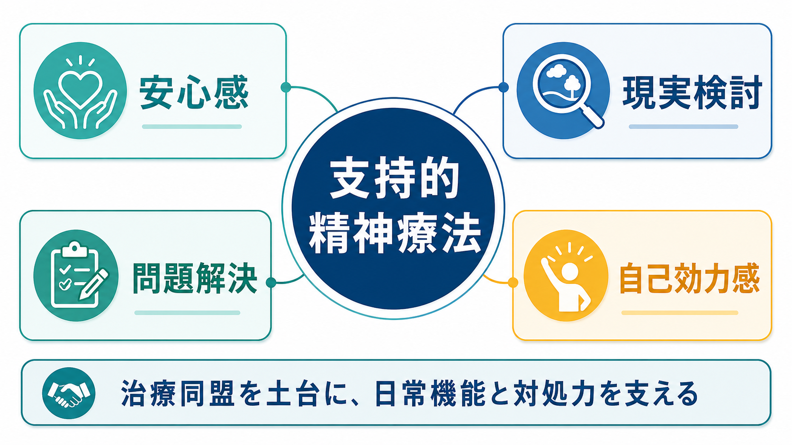
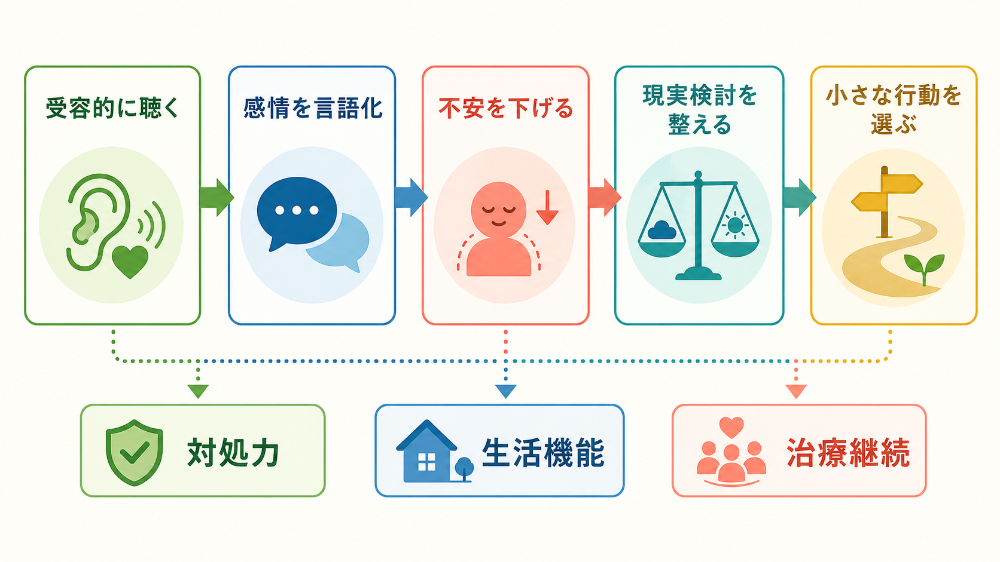
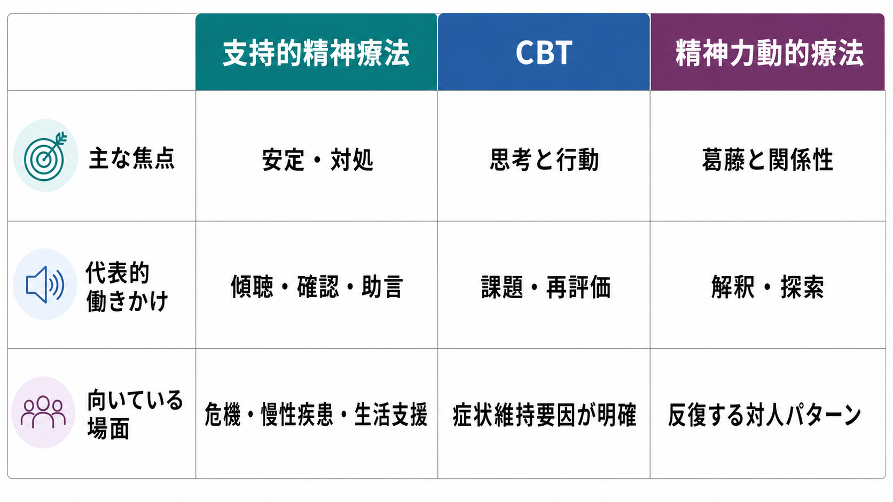

# 支持的精神療法とは何か

## 要点

- 支持的精神療法は、患者の人格や防衛を急いで変えるよりも、いま使える対処力、現実検討、生活機能、治療継続を支える心理療法である[1]。
- 中核は「安心して話せる関係」「感情の言語化」「現実検討」「問題解決」「自己効力感」の維持であり、単なる雑談や励ましではない[1][2]。
- うつ病、統合失調症、慢性疾患、危機状況、他の心理療法をまだ使いにくい場面などで、単独または他の治療の土台として使われる[1][3][5]。
- 研究上は、非指示的支持療法や短期支持的精神療法として検討され、一定の有効性が示される一方、疾患や比較対象によってエビデンスの強さは異なる[3][4][5]。
- 本稿は教育・研究目的の整理であり、個別の診断、治療選択、危機対応を指示するものではない。

## この記事で答える問い

1. 支持的精神療法は、ふつうの傾聴や助言と何が違うのか。
2. 安心感、現実検討、問題解決、自己効力感は、どのようにつながるのか。
3. 認知行動療法や精神力動的療法とは、焦点がどう異なるのか。
4. 臨床と研究では、どこまで効果を言えるのか。

## まず結論

支持的精神療法とは、患者が圧倒されすぎずに自分の状況を見つめ、次の小さな行動を選べるように支える心理療法である。治療者は、共感的に聴き、感情を言葉にし、現実との接点を一緒に確認し、生活上の問題を扱いやすい大きさに分ける。その過程で、患者は「自分は完全に無力ではない」「今できることがある」という感覚を少しずつ取り戻す。

この意味で、支持的精神療法は「深く分析しない簡易版」ではない。むしろ、患者の不安、混乱、孤立、現実検討の揺らぎ、治療中断リスクを見ながら、介入の強さを調整する臨床技法である。支持的精神療法の臨床ガイドラインでは、治療同盟、現実的な目標設定、非批判的態度、強みの同定、過度な議論や批判の回避、必要に応じた助言や予期的ガイダンスが重視される[1]。

## 背景

支持的精神療法は、精神科医療や心理臨床で広く使われてきたにもかかわらず、長いあいだ「理論的に弱い」「研究しにくい」「対照条件として置かれるだけ」と見られやすかった。Winston らの古典的レビューは、支持的技法が洞察志向的技法よりも広く使われるにもかかわらず、文献や訓練では十分に扱われてこなかったと指摘した[2]。近年は、短期支持的精神療法をマニュアル化し、臨床試験の能動的対照かつ治療介入として検討する試みも進んでいる[3]。

支持的精神療法が重要なのは、心理療法の入口でしばしば必要になるからである。患者は、初回から自分の認知の歪みを検討したり、強い感情を深く探索したり、宿題を継続したりできるとは限らない。睡眠不足、症状悪化、家族問題、身体疾患、生活困窮、孤立、薬物療法への不安、対人不信があると、まず面接そのものを安全に続けることが治療課題になる。

この点で、[[支持的面接とは何か]]は支持的精神療法の基本姿勢と重なる。面接レベルでは安全に話せる場を作り、精神療法レベルではそれを継続的な治療関係、目標設定、生活上の行動支援へ拡張する。

## 基本概念

### 安心感

安心感とは、「何を話しても無条件に肯定される」という意味ではない。支持的精神療法での安心感は、治療者が非批判的で、秘密保持と安全確認の限界を明確にし、患者が恥や恐怖に圧倒されずに話せる関係を作ることである[1]。

この安心感は、現実検討の前提になる。人は強く脅かされていると、否認、防衛、怒り、沈黙、過剰な同意に傾きやすい。支持的精神療法では、まず「ここでは急いで結論を出さなくてよい」「安全に関わることは一緒に確認する」という枠を作る。

### 現実検討

現実検討とは、患者の感じ方を否定することではない。むしろ、「事実として確認できること」「本人が強く感じていること」「まだ分からないこと」「いま決めなくてよいこと」を分ける作業である。

たとえば「もう全部終わりだ」と語る患者に対して、すぐに「そんなことはありません」と返すと、患者は理解されていないと感じやすい。支持的には、「終わったと感じるほど追い詰められているのですね。実際に今起きていることを、一つずつ分けて見てもよいですか」と扱う。これは[[離人感現実感消失症とは何か]]や[[解離症と精神病性障害はどう鑑別するのか]]で重視される現実検討の観点ともつながる。

### 問題解決

支持的精神療法の問題解決は、治療者が正解を与えることではない。患者の負担、資源、危険度、優先順位を見ながら、いま実行できる最小単位に落とす。問題解決療法のメタ分析でも、問題の明確化、現実的な選択肢、実行と振り返りは、うつ病治療で一定の効果をもつ要素として扱われている[7]。

支持的精神療法では、これをより広く日常診療のなかで使う。たとえば、家族に説明する、職場に連絡する、服薬の不安を整理する、睡眠を記録する、次回までの危機時連絡先を確認する、といった実用的課題が含まれる。

### 自己効力感

自己効力感は、「自信を持てばよい」という気分の問題ではなく、「自分はこの状況で何らかの行動を起こせる」という予期である。支持的精神療法では、患者ができていること、耐えていること、以前に役立った対処、周囲に頼れた経験を具体的に確認する。これは[[自己効力感とは何か]]や[[自己効力感は学習にどう影響するのか]]で扱う学習・行動の観点とも接続する。

重要なのは、空疎な賞賛を避けることである。「すごいですね」と一般的に褒めるより、「つらいなかで予約を取り直して来院できた」「混乱していたが、危険な行動を避けるために友人へ連絡できた」のように、患者の価値や目標に沿った具体的行動を言語化する。

## 仕組み

支持的精神療法は、次のような流れで機能する。

1. 受容的に聴く。  
   患者の語りを遮らず、しかし混乱が増える場合は穏やかに焦点を戻す。支持的姿勢は受け身ではなく、患者が話し続けられるように場を整える能動的な技法である[1]。

2. 感情を言語化する。  
   「怒り」「恥」「不安」「孤独」「疲労」「混乱」などを言葉にすると、体験が少し外在化される。感情を否定せず、感情と行動を分けて扱えるようになる。

3. 不安を下げる。  
   安全確認、見通し、次の約束、危機時の連絡手段、情報の整理によって、圧倒感を下げる。治療者がすべてを保証するのではなく、「確認できる範囲」を明確にする。

4. 現実検討を整える。  
   患者の意味づけを争わず、事実、推測、感情、選択肢を分ける。精神病症状、解離、身体症状、不安、抑うつでは、この分け方が治療同盟を守るうえで重要になる。

5. 小さな行動を選ぶ。  
   生活上の具体策を患者と一緒に選ぶ。行動は大きくなくてよい。むしろ、小さく実行可能で、次回振り返れるものがよい。

この過程を支える共通因子が治療同盟である。成人心理療法のメタ分析では、治療同盟と治療アウトカムの関連が、治療法や患者特性を超えて比較的一貫して示されている[6]。支持的精神療法は、この治療同盟を「治療の前提」としてだけでなく、「治療そのものの主要な働き」として扱う。

## 図解

支持的精神療法は、他の心理療法と競合するだけの技法ではない。認知行動療法、精神力動的療法、家族支援、薬物療法、リハビリテーション、ケースマネジメントが機能するための土台にもなる。

| 観点 | 支持的精神療法 | CBT | 精神力動的療法 |
|---|---|---|---|
| 主な焦点 | 安定、対処、生活機能 | 思考、行動、症状維持要因 | 葛藤、関係性、反復パターン |
| 働きかけ | 傾聴、確認、助言、現実検討 | 認知再評価、行動実験、課題 | 探索、解釈、転移の理解 |
| 使いやすい場面 | 危機、慢性疾患、治療導入、生活支援 | 症状維持要因が比較的明確な場面 | 反復する対人・感情パターンを深く扱う場面 |
| 注意点 | 励ましだけにしない | 課題が負担になりすぎないようにする | 探索が不安を高めすぎないようにする |

## 臨床・研究との接続

### うつ病

成人うつ病に対する非指示的支持療法のメタ分析では、待機リストや通常ケアに比べて有効性が示された一方、他の特定心理療法との比較では小さな差が報告され、その差は研究者 allegiance などの影響を受けうるとされた[4]。したがって、支持的精神療法を「効果がない対照条件」とみなすのは単純すぎる。症状、希望、認知的負荷、治療資源に応じて、支持的要素と構造化された技法を組み合わせることが実践的である。

### 統合失調症と重症精神障害

統合失調症に対する支持療法の Cochrane レビューでは、24 件、計 2126 名のランダム化研究が検討されたが、全体としてエビデンスの質は非常に低く、標準治療との差を明確に同定するには不十分とされた[5]。一部のアウトカムでは他の心理社会的治療が支持療法より有利に見えるが、少数の小規模研究に基づくため慎重に読む必要がある[5]。

臨床的には、これは支持的精神療法が不要という意味ではない。[[統合失調症とは何か]]、[[統合失調症の陽性症状とは何か]]、[[統合失調症の陰性症状とは何か]]で扱うような症状がある場合、服薬継続、睡眠、生活リズム、家族との関係、孤立、再発サイン、支援資源の確認は、治療継続の現実的な支えになる。

### 身体症状・慢性疾患・生活支援

支持的精神療法は、原因を心理に還元するための技法ではない。[[身体症状症とは何か]]で扱うように、身体症状がある患者では、身体疾患の評価、苦痛の承認、過剰検査の回避、生活機能の支援、治療同盟を同時に扱う必要がある。支持的姿勢は、身体症状を「気のせい」と扱わず、症状の現実性と治療方針の現実性を両立させる。

### 共同意思決定

支持的精神療法では、治療者の助言が必要になることがある。しかし助言は、患者の選択肢を狭める命令ではなく、患者が理解し、比較し、選べるようにする情報提供である。NICE の共同意思決定ガイドラインは、医療者と利用者が、エビデンスだけでなく本人の価値、信念、希望を含めて治療やケアを決めることを推奨している[8]。この姿勢は、支持的精神療法における「支えるが、代わりに決めない」という原則とよく合う。

## よくある誤解

### 誤解1: 支持的精神療法は、ただ優しくするだけである

支持的精神療法は、優しい態度だけでは成立しない。安全確認、治療目標、境界、現実検討、問題の優先順位づけ、リスク評価が必要である。非批判的であることは、危険な行動や治療中断リスクを見逃すことではない。

### 誤解2: 深い治療ではない

支持的精神療法は、洞察や解釈を中心にしないことが多い。しかし、患者が崩れずに自分の感情と現実を扱えるようにすることは、臨床的には深い仕事である。とくに危機、慢性疾患、重症精神障害、対人不信がある場合、安定した関係の継続そのものが治療的意味を持つ。

### 誤解3: 助言をすれば支持的になる

助言は、患者の状況、価値、リスク、実行可能性に合っていなければ支持にならない。支持的精神療法では、助言の前に、患者が何を困っているのか、何を望んでいるのか、どこまで自分で決めたいのかを確認する。

### 誤解4: CBTや薬物療法の代わりである

支持的精神療法は、他の治療の代替とは限らない。薬物療法、認知行動療法、家族支援、リハビリテーション、ケースワークと組み合わせられる。重症精神障害や明確な薬物療法適応がある場合、支持的精神療法だけで十分と決めつけてはならない[1]。

## 関連ノート

- [[支持的面接とは何か]]
- [[自己効力感とは何か]]
- [[自己効力感は学習にどう影響するのか]]
- [[モチベーション面接は行動変容をどう支えるのか]]
- [[身体症状症とは何か]]
- [[離人感現実感消失症とは何か]]
- [[解離症と精神病性障害はどう鑑別するのか]]
- [[統合失調症とは何か]]

### 関連ノート候補

- 治療同盟とは何か
- 精神療法の共通因子とは何か
- 問題解決療法とは何か
- 共同意思決定とは何か
- 精神療法における境界設定とは何か

### MOC更新候補

- `content/00_MOC/MOC｜臨床実践・治療.md`
- `content/00_MOC/MOC｜総論・診断・面接.md`

## 理解チェック

1. 支持的精神療法が「単なる励まし」ではない理由を、安心感、現実検討、問題解決の3語を使って説明する。
2. 患者が「全部終わりだ」と語ったとき、否定せずに現実検討へ進む応答を1つ考える。
3. 支持的精神療法とCBTの違いを、焦点と介入方法の面から説明する。
4. 支持的精神療法で助言を使うとき、患者の主体性を守るために何を確認する必要があるか。

## 参考文献

[1] Grover, S., Avasthi, A., & Jagiwala, M. (2020). Clinical Practice Guidelines for Practice of Supportive Psychotherapy. *Indian Journal of Psychiatry, 62*(Suppl 2), S173-S182. https://doi.org/10.4103/psychiatry.IndianJPsychiatry_768_19

[2] Winston, A., Pinsker, H., & McCullough, L. (1986). A review of supportive psychotherapy. *Hospital & Community Psychiatry, 37*(11), 1105-1114. https://doi.org/10.1176/ps.37.11.1105

[3] Markowitz, J. C. (2022). Supportive Evidence: Brief Supportive Psychotherapy as Active Control and Clinical Intervention. *American Journal of Psychotherapy, 75*(3), 122-128. https://doi.org/10.1176/appi.psychotherapy.2021.20210041

[4] Cuijpers, P., Driessen, E., Hollon, S. D., van Oppen, P., Barth, J., & Andersson, G. (2012). The efficacy of non-directive supportive therapy for adult depression: A meta-analysis. *Clinical Psychology Review, 32*(4), 280-291. https://doi.org/10.1016/j.cpr.2012.01.003

[5] Buckley, L. A., Maayan, N., Soares-Weiser, K., & Adams, C. E. (2015). Supportive therapy for schizophrenia. *Cochrane Database of Systematic Reviews*, 2015(4), CD004716. https://doi.org/10.1002/14651858.CD004716.pub4

[6] Flückiger, C., Del Re, A. C., Wampold, B. E., & Horvath, A. O. (2018). The alliance in adult psychotherapy: A meta-analytic synthesis. *Psychotherapy, 55*(4), 316-340. https://doi.org/10.1037/pst0000172

[7] Cuijpers, P., de Wit, L., Kleiboer, A., Karyotaki, E., & Ebert, D. D. (2018). Problem-solving therapy for adult depression: An updated meta-analysis. *European Psychiatry, 48*, 27-37. https://doi.org/10.1016/j.eurpsy.2017.11.006

[8] National Institute for Health and Care Excellence. (2021). *Shared decision making* (NICE guideline NG197). https://www.nice.org.uk/guidance/ng197

## 未解決問題

- 支持的精神療法を、対照条件ではなく主治療として検討する大規模試験はまだ限られている。
- 「支持的」と呼ばれる介入の範囲が広く、研究間で技法、治療者訓練、セッション数、対象患者が異なる。
- 効果が出やすい患者像、他の心理療法との最適な組み合わせ、治療同盟と自己効力感の媒介過程は、さらに整理が必要である。
