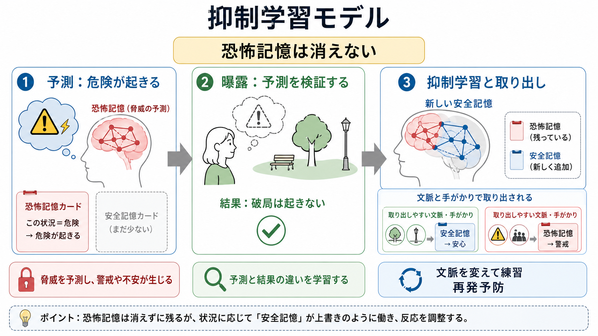
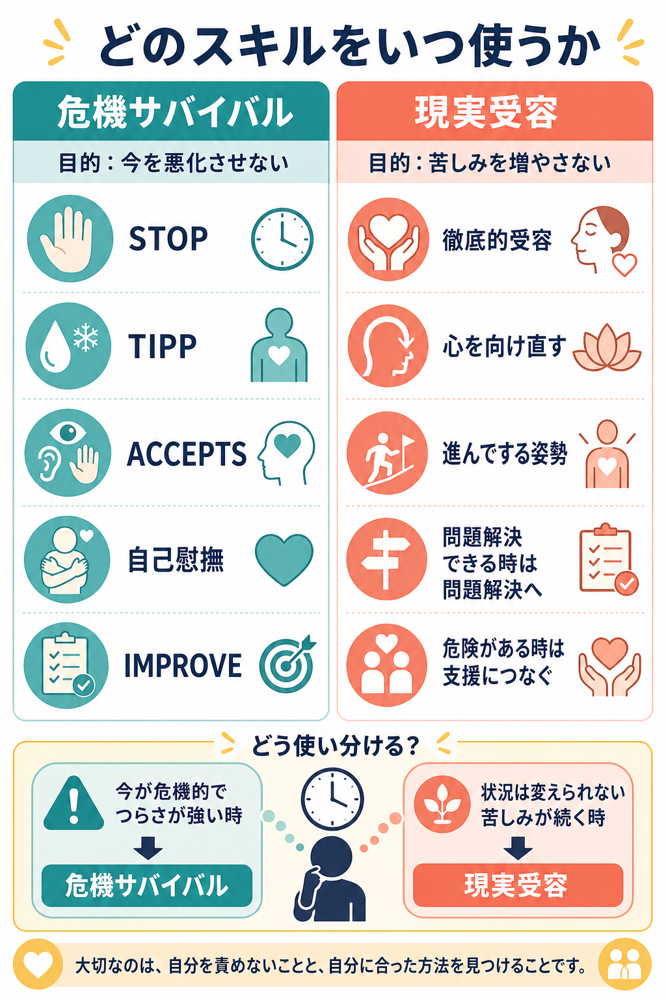
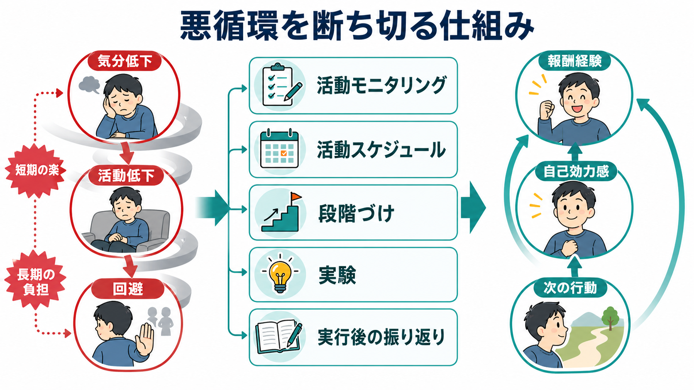

# 曝露反応妨害法ERPとは何か

## 要点

- 曝露反応妨害法（Exposure and Response Prevention; ERP）は、強迫症（OCD）で恐れられている刺激・思考・状況に段階的に近づきながら、確認、洗浄、祈り、安心確認、回避などの強迫行為を控える心理療法である。
- ERPは認知行動療法（CBT）の中核的技法として位置づけられ、成人では症状の重さに応じて低強度CBT、より集中的なCBT、SSRIとの併用が推奨される。児童青年では家族を含め、発達段階に合わせたCBTが重視される[1]。
- 目的は「不安をゼロにする」ことではなく、強迫行為なしでも恐怖予測・不確実性・身体感覚を扱えるという新しい学習を作ることである[2][3]。
- ERPは有効性が比較的よく検討されているが、実施には共同意思決定、リスク評価、治療同盟、課題の個別化、十分な説明が必要である。この記事は教育・研究目的の整理であり、個別の診断や治療指示ではない。

## この記事で答える問い

- ERPは何を「曝露」し、何を「妨害」する治療なのか。
- 強迫行為を控えることが、なぜ治療的な学習につながるのか。
- ERPはどの程度、ガイドラインや研究で支持されているのか。
- 臨床で使うときに、どのような誤解や注意点があるのか。

## まず結論

ERPは、強迫症の悪循環を「刺激を避ける」「儀式で安心する」という短期的な解決から切り離し、恐れられている状況に近づいたまま、強迫行為なしで結果を観察する訓練である。たとえば汚染恐怖であれば、合意された範囲で汚れに関連する刺激に触れ、すぐに過剰な洗浄をしない。確認強迫であれば、鍵や電気を一定の基準で確認した後、再確認に戻らない。

重要なのは、ERPが「我慢比べ」ではない点である。評価、心理教育、階層表、曝露課題、反応妨害、振り返りを通じて、本人が何を恐れているのか、どの儀式が不安を一時的に下げて症状を維持しているのかを具体化する。NICEはOCDに対してCBT（ERPを含む）を機能障害の程度に応じて推奨し、重度ではSSRIとCBTの併用を推奨している[1]。

## 背景

強迫症では、侵入的な思考、イメージ、衝動、感覚が「危険」「不完全」「許されない」と評価されることがある。その苦痛を下げるために、洗浄、確認、数える、並べ直す、頭の中で打ち消す、他者に安心を求めるといった行為が起きる。これらは短期的には安心をもたらすが、「儀式をしたから大丈夫だった」という学習を強め、次の不安場面で同じ行為を必要にしやすい。

ERPはこの維持サイクルに介入する。曝露は恐れられている刺激や思考に近づく部分であり、反応妨害は強迫行為、回避、安全行動、過剰な安心確認を控える部分である。NIMHが紹介した抗うつ薬治療に十分反応しないOCD患者を対象にした研究では、曝露と儀式妨害を用いたCBTの追加が、抗精神病薬追加やプラセボ追加より高い反応率を示したと報告されている[4]。

## 基本概念

### 曝露

曝露は、本人が恐れている外的刺激、内的感覚、思考イメージ、記憶、状況に、合意された形で近づくことである。曝露には、実際の場面に入る「現実曝露」と、恐れているシナリオを文章や音声で扱う「イメージ曝露」がある。どちらを使うかは、症状の内容、危険評価、治療目標、本人の同意によって決める。

### 反応妨害

反応妨害は、曝露で高まった不安や嫌悪感に対して、いつもの強迫行為を行わない練習である。ここでいう反応には、目に見える行為だけでなく、頭の中での中和、過剰な自己説得、検索、安心確認、避け方の工夫も含まれる。成人の「目に見える強迫行為が少ない強迫思考」に対しても、NICEは強迫思考への曝露と、精神的儀式・中和方略の反応妨害を含むCBTを検討するとしている[1]。

### 階層表

ERPでは多くの場合、不安や抵抗感の強さを段階化した階層表を作る。これは単に「軽いものから重いものへ進む表」ではなく、どの予測を検証するのか、どの儀式を控えるのか、どの生活機能を回復したいのかを明確にする道具である。課題は本人にとって意味があり、かつ安全性と倫理性が確認できる範囲に置く。

## 仕組み

ERPの古典的説明では、不安を喚起する刺激に十分接触し、逃避や儀式をしないことで恐怖構造が修正されると考えられてきた。FoaとKozakの情動処理理論は、恐怖記憶が活性化され、同時にそれと矛盾する情報が取り込まれることを重視した[2]。

近年は、単純な「慣れ」だけでなく、抑制学習や予測誤差の観点からERPを捉える説明が広く使われる。つまり、恐れられた結果がどの程度起きるのか、起きたとしてどの程度耐えられるのか、儀式なしで何が観察されるのかを学ぶ。Craskeらは、曝露療法の効果を高める方法として、期待違反、安全信号の除去、文脈の多様化、変動性、検索手がかりなどを挙げている[3]。これは[[予測処理とは何か]]や[[報酬予測誤差とは何か]]で扱う「予測と結果のずれ」とも接続しやすい。

反応妨害が重要なのは、儀式を行うと「危険が起きなかった」という観察が、儀式の効果として解釈されやすいからである。儀式を控えることで、「不安は高まっても変化する」「完全な安心なしでも行動できる」「予測した破局は必ずしも起きない」「不確実性を抱えたまま生活機能を回復できる」といった学習が可能になる。

## 図解

ERPの臨床的な流れは、次のように整理できる。

1. 評価: 強迫観念、強迫行為、回避、安全行動、家族の巻き込まれ、生活障害を具体化する。
2. 目標設定: 「不安を消す」ではなく、生活上の選択肢を広げる目標に変換する。
3. 階層表: 課題の難度、予測、控える反応、実施場所、振り返り項目を決める。
4. 曝露と反応妨害: 合意された課題に取り組み、儀式を減らし、結果を観察する。
5. 振り返り: 不安のピークだけでなく、予測、学習、次回の修正点を記録する。

## 臨床・研究との接続

心理療法研究では、ERPを含むCBTはOCDに対して大きな効果量を示すと報告されてきた。1993年から2014年のRCTを対象にしたメタ分析では、CBTは待機リストや心理学的プラセボ条件より大きな効果を示し、ERPと認知療法の直接比較では差は小さく有意ではなかった[5]。また、薬物療法にERPを組み合わせる研究のメタ分析では、薬物療法単独よりERP併用のほうがY-BOCS得点の改善が大きい一方、D-サイクロセリンによるERP増強は明確な優位性を示さなかった[6]。

古典的なRCTでは、曝露と儀式妨害、クロミプラミン、それらの併用、プラセボが比較され、ERP系介入がOCD治療の主要な選択肢として検討されてきた[7]。臨床実装の観点では、集中的に実施する形式だけでなく、週2回程度の形式でも効果が検討されており、治療スケジュールを現場に合わせる余地がある[8]。

神経科学的には、ERPは恐怖・脅威学習、認知制御、習慣、[[神経可塑性は発達と学習をどう支えるのか]]、[[強迫症では皮質線条体視床回路に何が起きているのか]]と関係する。強迫行為は単なる「不安への反応」ではなく、反復によって自動化された行動レパートリーとして強まることがある。そのため、ERPは情動反応への介入であると同時に、行動選択と習慣の再学習でもある。

## よくある誤解

### 誤解1: ERPは患者を怖い状況に無理やり入れる治療である

ERPは合意と説明に基づく治療であり、サプライズや罰として曝露を行うものではない。課題は共同で設計され、危険評価、生活目標、本人の準備性に合わせて調整される。

### 誤解2: 不安が下がるまで耐えることだけが目的である

不安の低下は重要な体験になりうるが、ERPの目的はその場の不安を必ず下げることに限られない。むしろ、恐怖予測と結果のずれ、儀式なしでの行動可能性、不確実性への耐性を学ぶことが中心である[3]。

### 誤解3: 強迫行為をやめればよいだけである

強迫行為は本人にとって強い苦痛を下げる機能を持つため、単に「やめる」と言っても難しい。評価、階層表、練習、振り返り、家族や支援者の関わり方の調整が必要になる。家族が確認や安心化に巻き込まれている場合、NICEは治療計画の中でその関与を支持的に減らすことを勧めている[1]。

### 誤解4: ERPは薬物療法と対立する

ERPと薬物療法は対立するものではない。機能障害が重い場合や併存症がある場合、SSRIなどの薬物療法とCBT（ERPを含む）の併用が検討される[1][6]。ただし、どの順序・強度・併用が適切かは、症状、既往、リスク、希望、利用可能な治療資源によって異なる。

## 関連ノート

- [[MOC｜臨床実践・治療]]
- [[MOC｜精神医学]]
- [[強迫症では皮質線条体視床回路に何が起きているのか]]
- [[予測処理とは何か]]
- [[報酬予測誤差とは何か]]
- [[神経可塑性は発達と学習をどう支えるのか]]
- [[セロトニンは気分だけに関わるのか]]
- [[精神療法は脳を変えるのか]]

### MOC更新候補

- `content/00_MOC/MOC｜臨床実践・治療.md` の心理療法セクションに追加候補。
- `content/00_MOC/MOC｜精神医学.md` の強迫症・不安症関連に追加候補。

### 今後の作成候補

- 認知行動療法CBTとは何か
- 強迫症OCDとは何か
- 安全行動とは何か
- 曝露療法の抑制学習モデルとは何か

## 理解チェック

1. ERPにおける「曝露」と「反応妨害」は、それぞれ何を指すか。
2. 強迫行為が短期的には安心をもたらすのに、長期的には症状を維持しうるのはなぜか。
3. ERPを「不安が下がるまで耐える治療」とだけ理解すると、どのような限界があるか。
4. 家族や支援者が安心確認に巻き込まれている場合、治療計画では何を検討する必要があるか。

## 未解決問題

- ERPのどの要素が、どのタイプの強迫症状に最も効くのかは、まだ完全には分かっていない。
- 抑制学習、習慣、認知制御、皮質線条体視床回路の変化が、臨床改善とどのように対応するかは研究途上である。
- デジタル介入、遠隔CBT、集中型プログラム、家族介入を、どの患者にどの順序で組み合わせるかには実装上の課題がある。

## 参考文献

[1] National Institute for Health and Care Excellence. (2005, last reviewed 2024). *Obsessive-compulsive disorder and body dysmorphic disorder: treatment. NICE guideline CG31*. https://www.nice.org.uk/guidance/cg31/chapter/Recommendations

[2] Foa, E. B., & Kozak, M. J. (1986). Emotional processing of fear: Exposure to corrective information. *Psychological Bulletin, 99*(1), 20-35. https://doi.org/10.1037/0033-2909.99.1.20

[3] Craske, M. G., Treanor, M., Conway, C. C., Zbozinek, T., & Vervliet, B. (2014). Maximizing exposure therapy: An inhibitory learning approach. *Behaviour Research and Therapy, 58*, 10-23. https://doi.org/10.1016/j.brat.2014.04.006

[4] National Institute of Mental Health. (2013). *Exposure / ritual prevention therapy boosts antidepressant treatment of OCD*. https://www.nimh.nih.gov/news/science-updates/2013/exposure-ritual-prevention-therapy-boosts-antidepressant-treatment-of-ocd

[5] Öst, L.-G., Havnen, A., Hansen, B., & Kvale, G. (2015). Cognitive behavioral treatments of obsessive-compulsive disorder: A systematic review and meta-analysis of studies published 1993-2014. *Clinical Psychology Review, 40*, 156-169. https://doi.org/10.1016/j.cpr.2015.06.003

[6] Mao, L., Hu, M., Luo, L., Wu, Y., Lu, Z., & Zou, J. (2022). The effectiveness of exposure and response prevention combined with pharmacotherapy for obsessive-compulsive disorder: A systematic review and meta-analysis. *Frontiers in Psychiatry, 13*, 973838. https://doi.org/10.3389/fpsyt.2022.973838

[7] Foa, E. B., Liebowitz, M. R., Kozak, M. J., Davies, S., Campeas, R., Franklin, M. E., Huppert, J. D., Kjernisted, K., Rowan, V., Schmidt, A. B., Simpson, H. B., & Tu, X. (2005). Randomized, placebo-controlled trial of exposure and ritual prevention, clomipramine, and their combination in the treatment of obsessive-compulsive disorder. *American Journal of Psychiatry, 162*(1), 151-161. https://doi.org/10.1176/appi.ajp.162.1.151

[8] Abramowitz, J. S., Foa, E. B., & Franklin, M. E. (2003). Exposure and ritual prevention for obsessive-compulsive disorder: Effects of intensive versus twice-weekly sessions. *Journal of Consulting and Clinical Psychology, 71*(2), 394-398. https://doi.org/10.1037/0022-006X.71.2.394
