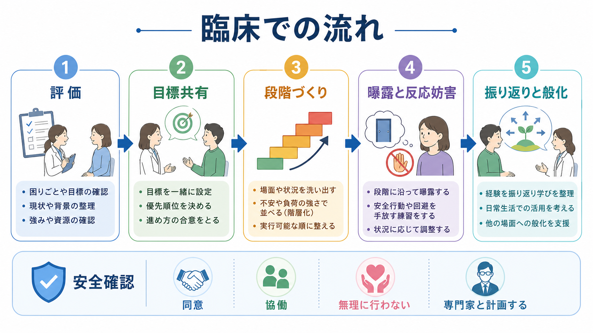
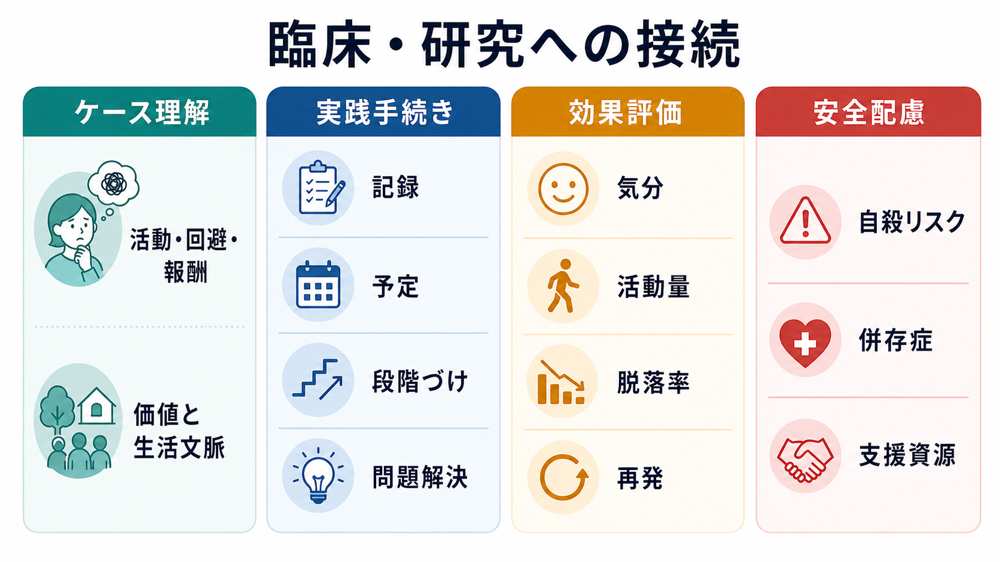
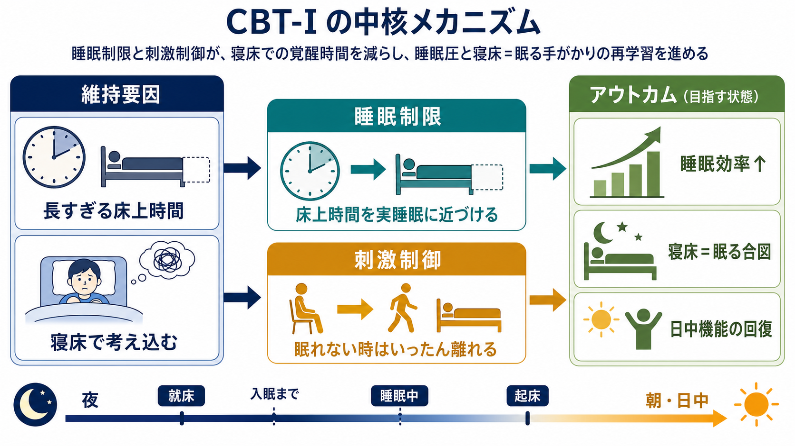

# 曝露療法とは何か

## 要点

- 曝露療法は、恐怖対象や不安状況を避け続けることで維持される[[不安とは何か|不安]]と[[回避行動とは何か|回避行動]]の悪循環に、段階的・計画的に働きかける心理療法である[1][2]。
- 中核は「怖さを無理に消す」ことではなく、「予測していた破局が実際には起きない」「不安があっても行動できる」という新しい学習を作ることである[1][4]。
- 不安症、[[限局性恐怖症とは何か|限局性恐怖症]]、[[パニック症とは何か|パニック症]]、[[強迫症とは何か|強迫症]]、[[PTSDとは何か|PTSD]]などで、曝露を含む認知行動療法やトラウマ焦点化治療が検討される[2][3][5][6][8]。
- 強迫症では、曝露に加えて確認・洗浄・回避などの反応を控える「曝露反応妨害法 exposure and response prevention: ERP」が重要になる[5][7]。
- 実施には、評価、同意、安全確認、段階づくり、振り返り、般化が必要であり、個別の症状やリスクを踏まえた専門的判断なしに強行するものではない[5][6][8]。

## この記事で答える問い

1. 曝露療法は、単なる「慣れ」や「根性で耐えること」と何が違うのか。
2. 回避や安全行動は、なぜ短期的には助けになっても長期的には不安を維持しやすいのか。
3. 抑制学習モデルでは、曝露中に何が学習されると考えるのか。
4. 臨床では、どのような症状や治療法と接続して理解すればよいのか。

## まず結論

曝露療法は、恐怖対象や不安状況に「無理やり直面させる」技法ではない。むしろ、本人が避けてきた状況を共同で整理し、予測、身体反応、回避、安全行動、生活上の制限を見立てたうえで、扱える範囲から経験を更新していく心理療法である[1][2]。

たとえば「電車に乗るとパニック発作で倒れるかもしれない」と予測して電車を避けると、その場の不安は下がる。しかし、避けるたびに「電車は危険」「避けたから助かった」という学習が強まりやすい。曝露療法では、状況に安全に近づき、予測と結果を確かめ、身体反応や不安があっても行動できることを学び直す[1][4]。

## 背景

恐怖は危険を避けるための適応的な反応である。しかし、実際の危険に比べて過剰に広がったり、回避によって生活が狭まったりすると、症状として問題になる。[[予期不安とは何か|予期不安]]、身体感覚への過敏な注意、失敗や汚染への破局的予測、トラウマ手がかりへの回避などは、異なる診断名の背後で共通して見られることがある[2]。

認知行動療法の研究では、不安症に対して曝露を含む介入が有効であることが繰り返し示されてきた[3]。ただし、曝露の説明は時代によって変わってきた。古典的には「不安に慣れる」「不安が下がるまでその場にとどまる」という馴化モデルで説明されることが多かった。現在は、それに加えて「恐怖記憶が消えるのではなく、安全に関する新しい記憶が形成され、必要な文脈で取り出されやすくなる」という抑制学習モデルが重視されている[1]。

## 基本概念

### 曝露

曝露とは、恐怖や不安を引き起こす対象、状況、身体感覚、記憶、イメージに、治療目標に沿って近づくことである。実際の場所や物に近づく in vivo 曝露、想像上で記憶や場面に向き合うイメージ曝露、身体感覚をあえて起こして検証する内受容感覚曝露などがある[1][2]。

### 回避

回避は、短期的には苦痛を下げる。電車に乗らない、人前で話さない、汚染が気になる物に触れない、トラウマを思い出す場所に行かない、といった行動は、その場では自然な防衛反応である。しかし、回避だけで対処すると、恐怖対象が本当に危険だったのか、予測していた破局が起きるのかを確かめる機会が減る。結果として、不安は更新されにくくなる[1][4]。

### 安全行動

安全行動とは、不安状況に入っていても「これをしているから大丈夫」と感じるための行動である。例として、常に出口の近くにいる、安心確認を繰り返す、特定の薬や水を必ず持つ、視線を合わせない、何度も手洗いや確認をする、などがある。安全行動は急にすべて取り除けばよいわけではないが、何が学習を妨げているかを見極め、段階的に減らすことがある[1][5]。

### 反応妨害

強迫症の ERP では、曝露だけでなく反応妨害が重要になる。たとえば汚染への恐怖がある場合、汚染が気になる対象に触れるだけでなく、通常ならすぐに行う過剰な洗浄や確認を控える。これにより、「儀式をしないと耐えられない」「儀式をしないと危険が起きる」という予測を検証する[5][7]。

## 仕組み

### 回避の悪循環

曝露療法の入口は、恐怖そのものよりも「恐怖を避けるために何が起きているか」を見ることである。

| 段階 | その場で起きること | 長期的に起きやすいこと |
|---|---|---|
| 恐怖手がかり | 場所、記憶、身体感覚、考えが不安を誘発する | 手がかりへの警戒が高まる |
| 破局予測 | 「倒れる」「汚染する」「責められる」などを予測する | 予測が検証されない |
| 回避・安全行動 | 逃げる、確認する、儀式をする | 一時的に安心する |
| 負の強化 | 安心したため同じ行動を繰り返しやすい | 生活範囲が狭まり、不安が維持される |

この循環を断つために、曝露では「不安がゼロになること」だけを目標にしない。不安がある状態で、予測と結果を比べ、避けずにいられた経験を蓄積することが重要になる[1][4]。

### 抑制学習モデル

抑制学習モデルでは、曝露によって恐怖記憶が単純に消去されるとは考えない。むしろ、もとの恐怖記憶は残りうるが、それと競合する「安全記憶」や「別の意味づけ」が形成されると考える[1]。

たとえば「人前で話すと必ず笑われる」という予測を持つ人が、段階的に短い発言を試し、実際の反応を観察する。ここで重要なのは、単に不安が下がるまで待つことではなく、「予測していた結果と実際の結果のずれ」を学習することである。抑制学習を強める工夫として、複数の文脈で練習する、安全行動を減らす、予測を言語化してから結果を確認する、練習の変動性を持たせる、といった方法が論じられている[1]。

### 情動処理モデルとの関係

Foa と Kozak の情動処理理論では、恐怖は「刺激」「反応」「意味」が結びついた恐怖構造として理解される。治療的な曝露では、その恐怖構造が十分に活性化され、同時に「実際には安全である」「予測と異なる」という修正情報が入ることが重要だと考えられた[4]。この考え方は、後の抑制学習モデルと完全に同じではないが、曝露を単なる我慢ではなく、記憶と意味づけの更新として理解する基盤になっている。

## 図解

この記事の3枚の図は、次の読み方を想定している。

| 図 | 読み方 |
|---|---|
| 図1 | 恐怖・不安、回避、安全行動、段階的曝露、新しい学習、生活機能の回復を一つの全体像として見る |
| 図2 | 恐怖記憶が消えるのではなく、安全記憶が追加され、文脈の中で取り出されるという抑制学習を理解する |
| 図3 | 臨床では、評価、同意、階層づくり、曝露、振り返り、般化を協働的に進めることを確認する |

## 臨床・研究との接続

### 不安症との接続

不安症では、過剰な恐怖、不安、回避が生活機能を制限する。曝露を含む CBT は、多くの不安関連問題で研究されてきた[2][3]。ただし、「不安症なら必ず曝露をすればよい」という単純な話ではない。何を恐れているのか、何を避けているのか、身体疾患や物質使用、うつ、希死念慮、解離、発達特性、生活環境がどう関わるのかを評価する必要がある。

### 強迫症と ERP

[[強迫症とは何か|強迫症]]では、侵入的な考えやイメージが不安・嫌悪・責任感を引き起こし、それを下げるために確認、洗浄、数える、祈る、安心確認を求めるなどの強迫行為が繰り返される。NICE は OCD の心理的治療として、CBT と ERP を重症度や本人の希望に応じて位置づけている[5]。ERP は、強迫観念を完全に消すことではなく、強迫行為をしなくても不安や責任感が変化しうることを学ぶ手続きである[7]。

### PTSD と持続エクスポージャー

[[PTSDとは何か|PTSD]]では、トラウマ記憶、回避、過覚醒、否定的認知や気分が関わる。持続エクスポージャー療法 prolonged exposure: PE は、PTSD に対するトラウマ焦点化心理療法の一つとして主要ガイドラインで扱われている[6][8]。ただし、トラウマ関連の曝露は、症状を強める可能性や安全確保の問題もあるため、現在の安全、安定化、同意、治療関係、併存症を慎重に扱う必要がある[6][8]。

### パニック症と内受容感覚曝露

[[パニック症とは何か|パニック症]]では、動悸、息苦しさ、めまいなどの身体感覚が「倒れる」「死ぬ」「制御不能になる」と解釈され、さらに不安を増幅することがある。内受容感覚曝露では、身体感覚を安全に経験し直し、身体感覚そのものが必ず破局を意味するわけではないことを学ぶ[2]。

### 限局性恐怖症と in vivo 曝露

[[限局性恐怖症とは何か|限局性恐怖症]]では、動物、血液・注射・負傷、飛行機、高所、閉所など、特定の対象や状況への恐怖が中心になる。実際の対象に段階的に近づく in vivo 曝露が検討されやすいが、血液・注射・負傷型では失神反応への注意など、恐怖対象ごとの工夫が必要になる[2]。

## よくある誤解

### 誤解1: 曝露療法は恐怖を我慢させる訓練である

曝露療法の目的は、苦痛を増やすことではない。予測、回避、安全行動、実際の結果を観察し、新しい学習が起きる条件を整えることが目的である[1]。

### 誤解2: 不安が下がれば成功、不安が下がらなければ失敗である

セッション中に不安が下がることは役に立つ場合がある。しかし、抑制学習モデルでは、それだけを成功指標にしない。不安が残っていても、予測と結果のずれを学べたか、安全行動なしで行動できたか、別の文脈で取り出せる記憶ができたかが重要になる[1]。

### 誤解3: 早く強い曝露をしたほうがよい

強い曝露が常に有効とは限らない。本人の同意、治療目標、症状の重さ、身体疾患、解離、希死念慮、生活上の安全、治療関係を踏まえて、段階と速度を決める必要がある[6][8]。無理な曝露は、治療中断や再トラウマ化のリスクを高めうる。

### 誤解4: 曝露療法は薬物療法や他の心理療法と競合する

臨床では、薬物療法、心理教育、認知再構成、マインドフルネス、家族支援、環境調整などと組み合わせて検討されることがある。重要なのは、「何を変えたいのか」「どの維持要因に働きかけるのか」を明確にすることである。

## 関連ノート

既存ノート:

- [[不安とは何か]]
- [[予期不安とは何か]]
- [[回避行動とは何か]]
- [[限局性恐怖症とは何か]]
- [[パニック症とは何か]]
- [[強迫症とは何か]]
- [[PTSDとは何か]]

今後の作成候補:

- 曝露反応妨害法ERPとは何か
- 内受容感覚曝露とは何か
- 持続エクスポージャー療法PEとは何か
- 安全行動とは何か
- 抑制学習モデルとは何か

MOC更新候補:

- `content/00_MOC/MOC｜臨床実践・治療.md`
- `content/00_MOC/MOC｜精神医学.md`
- `content/00_MOC/MOC｜学習・行動・動機づけ.md`

## 理解チェック

1. 回避行動はなぜ短期的には安心をもたらし、長期的には不安を維持しやすいのか。
2. 抑制学習モデルでは、「恐怖記憶が消える」と「安全記憶が追加される」はどう違うのか。
3. ERP で「反応妨害」が重要になる理由は何か。
4. PTSD に対する曝露を考えるとき、なぜ安全確認と同意が特に重要なのか。

## 未解決問題

- 抑制学習を最大化する具体的手続きのうち、どの要素がどの患者群に最も有効かは、なお研究途上である[1]。
- 曝露療法の効果を、症状軽減だけでなく生活機能、価値に沿った行動、再発予防、治療中断率でどう評価するかは重要な課題である。
- デジタル介入、バーチャルリアリティ曝露、遠隔治療を、どの症状・重症度・安全条件で使うべきかは、さらに検討が必要である。

## 参考文献

[1] Craske, M. G., Treanor, M., Conway, C. C., Zbozinek, T., & Vervliet, B. (2014). Maximizing exposure therapy: An inhibitory learning approach. *Behaviour Research and Therapy, 58*, 10-23. https://doi.org/10.1016/j.brat.2014.04.006

[2] Craske, M. G., Stein, M. B., Eley, T. C., Milad, M. R., Holmes, A., Rapee, R. M., & Wittchen, H.-U. (2017). Anxiety disorders. *Nature Reviews Disease Primers, 3*, 17024. https://doi.org/10.1038/nrdp.2017.24

[3] Hofmann, S. G., & Smits, J. A. J. (2008). Cognitive-behavioral therapy for adult anxiety disorders: A meta-analysis of randomized placebo-controlled trials. *Journal of Clinical Psychiatry, 69*(4), 621-632. https://doi.org/10.4088/JCP.v69n0415

[4] Foa, E. B., & Kozak, M. J. (1986). Emotional processing of fear: Exposure to corrective information. *Psychological Bulletin, 99*(1), 20-35. https://doi.org/10.1037/0033-2909.99.1.20

[5] National Institute for Health and Care Excellence. (2005, last reviewed 2024). *Obsessive-compulsive disorder and body dysmorphic disorder: treatment* (Clinical guideline CG31). https://www.nice.org.uk/guidance/cg31

[6] U.S. Department of Veterans Affairs & U.S. Department of Defense. (2023). *VA/DoD Clinical Practice Guideline for Management of Posttraumatic Stress Disorder and Acute Stress Disorder*. https://www.healthquality.va.gov/guidelines/MH/ptsd/

[7] Law, C., & Boisseau, C. L. (2019). Exposure and response prevention in the treatment of obsessive-compulsive disorder: Current perspectives. *Psychology Research and Behavior Management, 12*, 1167-1174. https://doi.org/10.2147/PRBM.S211117

[8] National Institute for Health and Care Excellence. (2018, updated). *Post-traumatic stress disorder* (NICE guideline NG116). https://www.nice.org.uk/guidance/ng116

## 更新ログ

- 2026-04-28: 初版作成。曝露療法の基本概念、抑制学習モデル、臨床適用、誤解、関連ノート候補、参考文献、画像リンクを整理。
