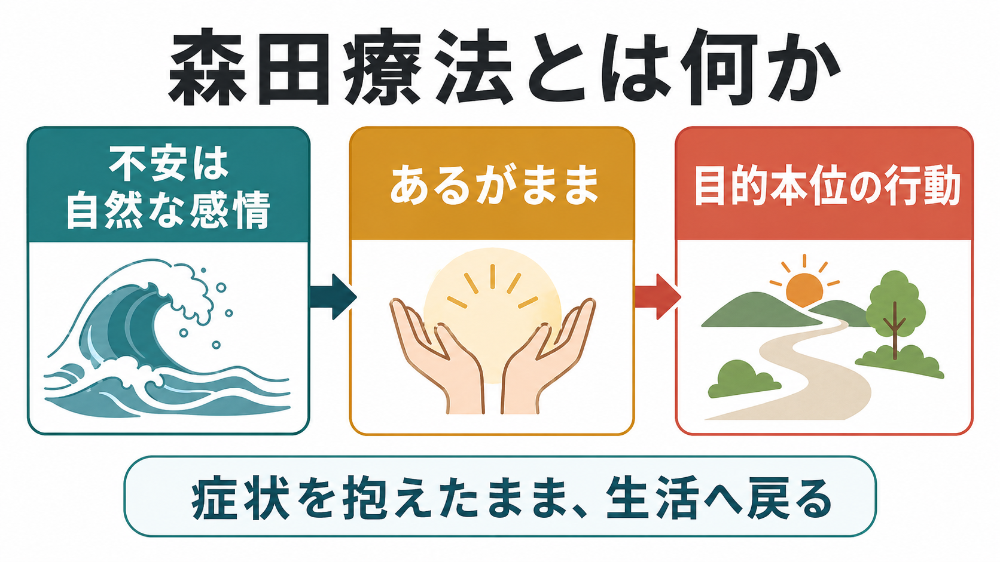
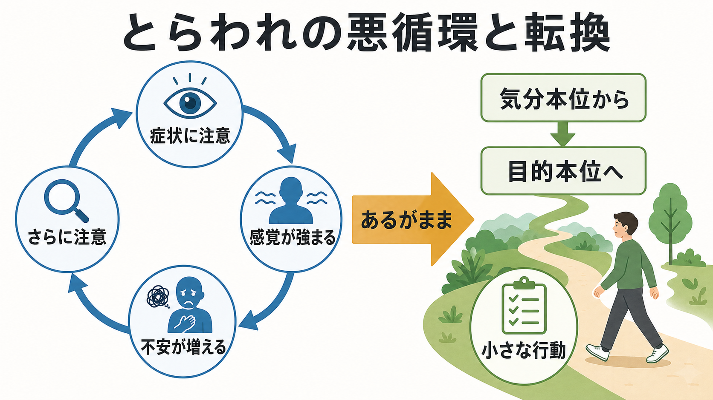
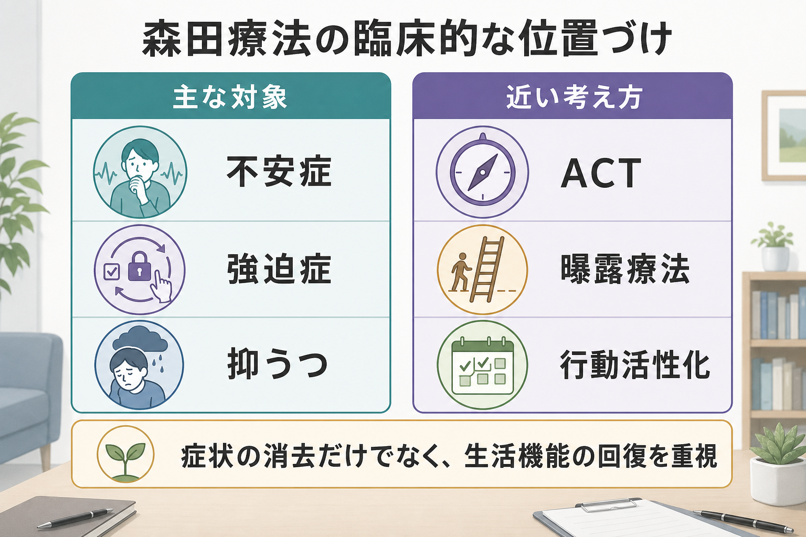

# 森田療法とは何か

## 要点

- 森田療法は、森田正馬が創始した日本発の精神療法で、不安・恐怖・身体感覚などを「消す」よりも、それらを自然な感情として扱い、生活上の目的に向けて行動を広げることを重視する[1][2]。
- 中核概念は「あるがまま」「目的本位」「生の欲望」「精神交互作用」である。症状への注意と排除努力が症状を強める悪循環に気づき、症状を抱えたまま行動する方向へ転換する[3][4]。
- 元来は神経症圏、とくに強迫症、社交不安症、パニック症、広場恐怖、全般不安症、病気不安症などが対象とされてきたが、近年は抑うつや慢性うつ状態への応用も研究されている[2][5][6]。
- 森田療法は「我慢しろ」「考え方を変えろ」という助言ではない。感情を意志で制御しようとする構えから離れ、現実の課題・生活・価値ある行動へ注意を戻す治療的実践である[3][4]。
- 研究エビデンスは蓄積しているが、研究の質や文化差、治療形式の違いには注意が必要である。臨床では教育・研究上の知識として理解し、個別の治療適応は専門職と相談して判断する。

## この記事で答える問い

1. 森田療法は、[[心理療法とは何か|心理療法]]のなかでどのような位置にあるのか。
2. 「あるがまま」とは、何もしないことなのか、それとも行動の仕方なのか。
3. 森田療法は、不安症・強迫症・抑うつとどのように接続するのか。
4. [[認知行動療法CBTとは何か|CBT]]、[[曝露療法とは何か|曝露療法]]、[[アクセプタンス&コミットメント・セラピーACTとは何か|ACT]]とどこが似ていて、どこが異なるのか。

## まず結論

森田療法とは、不安や症状を完全に取り除いてから生きるのではなく、不安や症状があるままでも、いま必要な行動へ向かうための心理療法である。ここでいう「あるがまま」は、症状を放置することでも、苦痛を美化することでもない。感情や身体感覚は自然に生じるものとして認めつつ、行動は生活上の目的に沿って選ぶ、という態度を育てることである[3][4]。

たとえば、動悸が起きることを恐れて外出を避ける人がいるとする。森田療法では、まず「動悸が起きてはいけない」という構えそのものが注意を動悸へ固定し、動悸への敏感さを強めている可能性を見る。次に、動悸をなくすことだけを目標にするのではなく、買い物に行く、職場に戻る、人と会う、家事をする、といった生活上の目的へ小さく関わる方向を探る。

## 背景

森田療法は、精神科医の森田正馬によって20世紀初頭に創始された。日本森田療法学会は、森田療法を1919年に創始された独自の精神療法として紹介し、元来の対象を強迫性障害、社交恐怖や広場恐怖などの恐怖症性不安障害、パニック障害、全般性不安障害、心気障害などの神経症性障害としている[1]。東京慈恵会医科大学森田療法センターも、森田療法を日本で生まれた不安症に対する精神療法として説明し、症状の排除よりも「受け入れること」と生活への関与を重視する点を強調している[2]。

歴史的には、森田療法は入院治療を中心に発展した。典型的には、安静、軽作業、作業、社会生活への復帰という段階を通じて、症状を観察しながら生活リズムと行動を回復する。しかし現代では、外来森田療法、集団療法、教育的プログラム、他の心理療法との統合的実践など、多様な形で用いられる。外来森田療法ガイドラインは、現代の外来実践における共通要素を整理し、症状へのとらわれ、生の欲望、日記や面接を通じた気づき、目的本位の行動などを治療の焦点として示している[3]。

この背景を理解すると、森田療法は単なる「日本的な気合い」ではなく、注意・感情・行動・生活機能の関係を扱う治療モデルとして読める。とくに、不安をなくすための努力が逆に不安への注意を強める、という臨床的観察は、[[パニック症のCBTでは何を行うのか|パニック症のCBT]]や[[曝露反応妨害法ERPとは何か|ERP]]で扱う回避・安全行動の問題とも接続しやすい。

## 基本概念

### あるがまま

「あるがまま」とは、感情・身体感覚・思考を、まず起きている事実として認めることである。重要なのは、それを好きになることでも、症状に従うことでもない。感情は自然に起きるが、行動は選べる、という区別を実践することである[4]。

この点は、ACTのアクセプタンスや[[マインドフルネスストレス低減法MBSRとは何か|マインドフルネス]]と似ている。しかし森田療法では、受容そのものを内面的な状態として追い求めるより、生活のなかで必要な行動へ入ることが重視される。受容は「考え方」として完成するのではなく、行動しながら身についていく。

### 目的本位

目的本位とは、気分や症状の有無ではなく、いま何をする必要があるか、何を大切にしたいかに沿って行動を選ぶ態度である。対義的に使われるのが「気分本位」で、気分がよくなったら外出する、不安が消えたら挑戦する、確信が得られたら決める、というように、行動の条件を内的状態へ過度に依存させる構えを指す。

森田療法は、不安をゼロにしてから行動するのではなく、不安を抱えたまま、行動を小さく再開する。これは行動活性化や曝露療法と共通する部分をもつが、森田療法では「生の欲望」と結びついた生活の充実が強調される。

### 生の欲望

生の欲望とは、よりよく生きたい、成長したい、人とつながりたい、役割を果たしたい、健康でありたいという自然な方向性である。森田療法では、不安や恐怖はこの生の欲望と裏表の関係にあると考える。失敗を恐れるのは、うまくやりたいからであり、病気を恐れるのは、生きたいからである。

この見方は、不安を敵として扱うだけでなく、その背後にある願いや価値を見つける助けになる。不安をなくすことだけに集中すると、不安の背後にある「何を大事にしたいのか」が見えにくくなる。森田療法は、そこへ注意を戻す。

### 精神交互作用

精神交互作用とは、ある感覚や症状へ注意を向けることで、その感覚がさらに強まり、強まった感覚がさらに注意を引きつける悪循環である。動悸、めまい、赤面、確認したい衝動、不安な予感などは、それ自体が苦痛であるだけでなく、「気にしてはいけない」「消さなければならない」と構えるほど、注意の焦点になりやすい。

この悪循環は、CBTでいう身体感覚への破局的解釈、安全行動、回避、反すうと重なる部分がある。ただし森田療法は、認知内容の妥当性を細かく検証するよりも、感情を自然なものとして扱い、行動を目的へ戻す実践を前面に出す。

## 仕組み

森田療法の仕組みは、次のように整理できる。

1. 症状や不安をなくそうとする努力が、症状への注意を強める。
2. 注意が症状へ固定されると、身体感覚や不安がさらに目立つ。
3. 症状を避ける行動が増えると、生活範囲が狭くなり、自己効力感が低下する。
4. 感情を「あるがまま」に認め、症状があっても小さな行動を選ぶ。
5. 行動が増えることで、生活機能、役割、興味、対人関係が少しずつ回復する。

この流れで重要なのは、症状の軽減を直接操作するのではなく、症状への関わり方と行動の条件を変える点である。外来森田療法ガイドラインでも、治療者は患者が症状にとらわれたあり方に気づき、生の欲望に沿って生活を広げるよう援助することが示されている[3]。

## 図解

森田療法を一枚の流れとして見るなら、起点は「症状を消したい」という自然な願いである。しかし、その願いが「症状がある限り何もできない」という条件づけになると、とらわれが強まる。森田療法は、症状を敵視する構えから、症状を抱えたまま生活へ戻る構えへ移る。

| 視点 | 気分本位 | 目的本位 |
|---|---|---|
| 行動の条件 | 不安が消えたら動く | 不安があっても必要なことを小さく行う |
| 注意の向き | 症状の有無、安心確認、失敗予測 | 目の前の課題、生活、役割、価値 |
| 短期的結果 | 安心することがある | 不安を抱えたまま行動する負荷がある |
| 長期的結果 | 回避と確認が固定化しやすい | 生活範囲と自己効力感が戻りやすい |

## 臨床・研究との接続

森田療法は、臨床的には不安症・強迫症・身体症状へのとらわれ・慢性うつ状態などと接続する。東京慈恵会医科大学森田療法センターは、外来治療、日記指導、グループ療法、リカバリープログラムなどを通じて、患者が症状へのとらわれに気づき、不安のまま生の欲望にしたがって行動を広げ、生活全体を充実させることを援助すると説明している[8]。

研究面では、英国で行われた Morita Trial が重要である。試験プロトコルでは、森田療法が望ましくない症状を制御・除去するよりも、自然な感情として扱う点で西洋の心理療法と対照的であると説明され、うつ病と不安症をもつ成人を対象に、通常治療への追加として検討された[5]。その後のパイロットRCTでは、68名が無作為化され、4か月フォローアップの保持率や治療遵守などから、より大規模な試験が実施可能であること、うつ症状への有望性が示された[6]。

メタ分析では、成人うつ病に対する森田療法と薬物療法の併用が、薬物療法単独より抑うつ重症度や寛解率で有利である可能性が示された。一方で、含まれた研究はバイアスリスクが不明または高いものが多く、結論は限定的であり、多施設・大規模・高品質の試験が必要とされている[7]。したがって、森田療法を「確立済みで万能」と見るのではなく、有望だが研究課題を残す心理療法として読むのが妥当である。

関連する心理療法との比較では、CBTは認知・行動・身体反応の相互作用を構造化して扱い、曝露療法は回避を減らす行動実験を重視し、ACTは価値に沿った行動とアクセプタンスを重視する。森田療法はこれらと重なりながらも、「自然」「事実」「生活」「生の欲望」という語彙で、症状との関係を再編する点に特徴がある[4]。

## よくある誤解

### 誤解1: あるがままとは、症状を放置することである

違う。あるがままは、症状に巻き込まれて生活を止めることではない。むしろ、症状があるという事実を認めたうえで、食事、睡眠、仕事、学習、家事、対人関係、休養など、いま必要な行動へ戻るための態度である。

### 誤解2: 森田療法は、苦痛を我慢させる治療である

森田療法には、不安や苦痛をすぐに消そうとしない側面がある。しかし、それは苦痛を軽視することではない。安全確保、診断評価、薬物療法、危機介入、環境調整が必要な場面では、それらが優先される。教育・研究上の理解と、個別の臨床判断は分ける必要がある。

### 誤解3: 森田療法は、認知や感情を扱わない

森田療法は、認知や感情を扱う。ただし、感情を論理で説得して消すことを主目標にしない。感情がどう生じ、注意や行動とどう結びつき、生活をどう狭めているかを見る。感情を変える入口を、感情そのものではなく行動と生活に置く。

### 誤解4: 森田療法は、現代のエビデンスに合わない

単純には言えない。研究は存在し、うつ病や不安症への応用も検討されている[5][6][7]。一方で、研究数、治療形式、文化差、比較条件、バイアスリスクには限界がある。したがって、森田療法は歴史的価値だけでなく研究対象としても重要だが、効果を過大評価しない姿勢が必要である。

## 関連ノート

- [[心理療法とは何か]]
- [[認知行動療法CBTとは何か]]
- [[アクセプタンス&コミットメント・セラピーACTとは何か]]
- [[曝露療法とは何か]]
- [[曝露反応妨害法ERPとは何か]]
- [[パニック症のCBTでは何を行うのか]]
- [[マインドフルネスストレス低減法MBSRとは何か]]
- [[認知再構成法とは何か]]

## 関連ノート候補

- 「森田療法におけるあるがままとは何か」
- 「精神交互作用とは何か」
- 「目的本位と気分本位とは何か」
- 「不安症に対する森田療法」
- 「森田療法とACTの違い」

## MOC更新候補

- `content/00_MOC/MOC・臨床実践・治療.md`
- `content/00_MOC/MOC・心理療法.md`

## 理解チェック

1. 森田療法でいう「あるがまま」は、症状に従うことではなく、症状を抱えたまま何へ向かう態度か。
2. 精神交互作用では、症状への注意と症状の強まりがどのように循環するか。
3. 気分本位と目的本位の違いを、日常生活の例で説明できるか。
4. 森田療法とACT、曝露療法、CBTの共通点と相違点を一つずつ挙げられるか。
5. 研究エビデンスを読むとき、なぜ「有望」と「確立済み」を区別する必要があるか。

## 参考文献

[1] 日本森田療法学会. 日本森田療法学会のご紹介・森田療法とは. https://www.jps-morita.jp/introduce.html

[2] 東京慈恵会医科大学 森田療法センター. 森田療法とは. https://morita-jikei.jp/morita_therapy/

[3] Japanese Society for Morita Therapy Committee on the Standardization of Outpatient Morita Therapy. (2021). *Guidelines for Practising Outpatient Morita Therapy: Paired Japanese-English Translation Edition*. https://moritatherapy.org/wp-content/uploads/2014/11/GD.pdf

[4] Sugg, H. V. R., Richards, D. A., & Frost, J. (2020). What is Morita Therapy? The nature, origins, and cross-cultural application of a unique Japanese psychotherapy. *Journal of Contemporary Psychotherapy*, 50, 313-322. https://doi.org/10.1007/s10879-020-09464-6

[5] Sugg, H. V. R., Richards, D. A., & Frost, J. (2016). Morita therapy for depression and anxiety (Morita Trial): study protocol for a pilot randomised controlled trial. *Trials*, 17, 161. https://doi.org/10.1186/s13063-016-1279-3

[6] Sugg, H. V. R., Richards, D. A., Frost, J., et al. (2018). Morita Therapy for depression (Morita Trial): a pilot randomised controlled trial. *BMJ Open*, 8(8), e021605. https://doi.org/10.1136/bmjopen-2018-021605

[7] Jia, Y., Li, M., Cheng, Z., Cui, L., Zhao, J., Liu, Y., Leng, M., Li, F., & Chen, L. (2018). Morita therapy for depression in adults: A systematic review and meta-analysis. *Psychiatry Research*, 269, 763-771. https://doi.org/10.1016/j.psychres.2018.08.108

[8] 東京慈恵会医科大学 森田療法センター. 施設紹介. https://morita-jikei.jp/facility/

## 未解決問題

- 森田療法のどの要素が、どの診断群・重症度・文化的背景で最も効果に寄与するのか。
- 入院森田療法、外来森田療法、集団療法、オンライン支援で、作用機序や適応はどの程度異なるのか。
- ACT、曝露療法、行動活性化、マインドフルネス系介入との共通因子と固有因子を、どのように実証的に分けられるのか。
- 症状軽減だけでなく、生活機能、価値に沿った行動、再発予防、患者の主観的回復をどう測定するのか。
