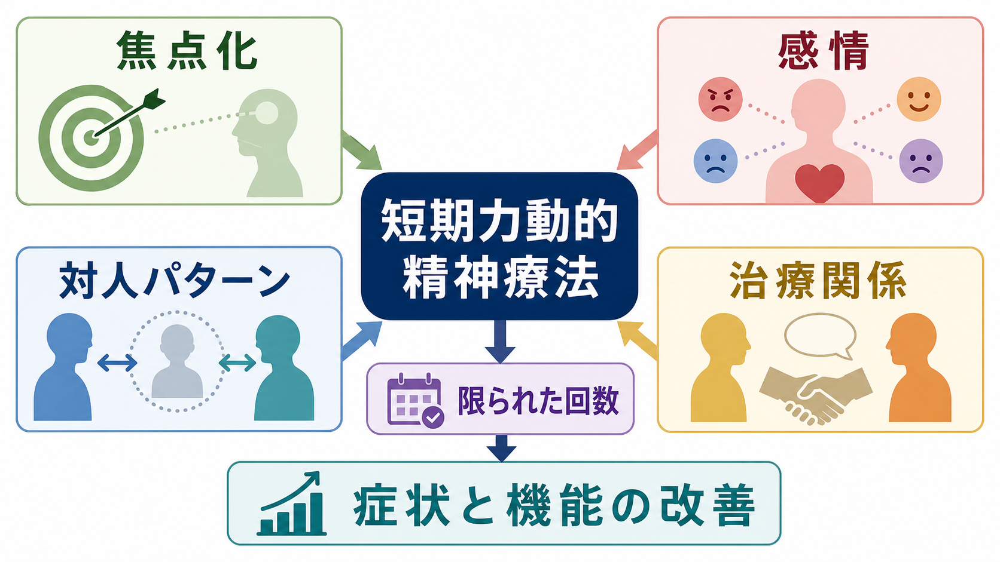
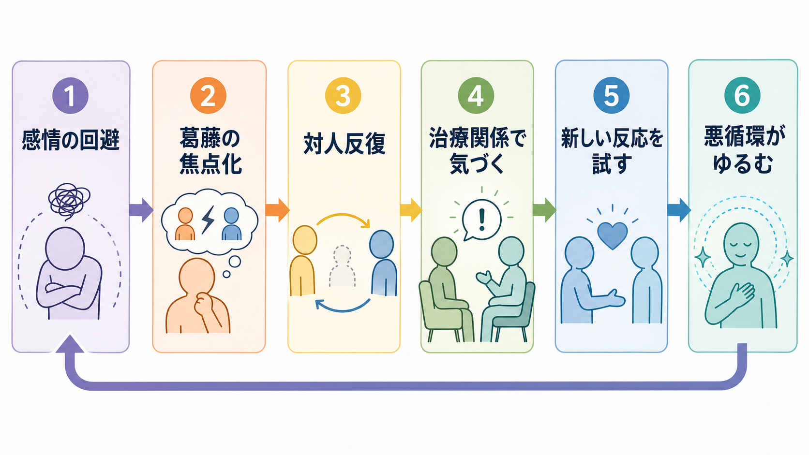
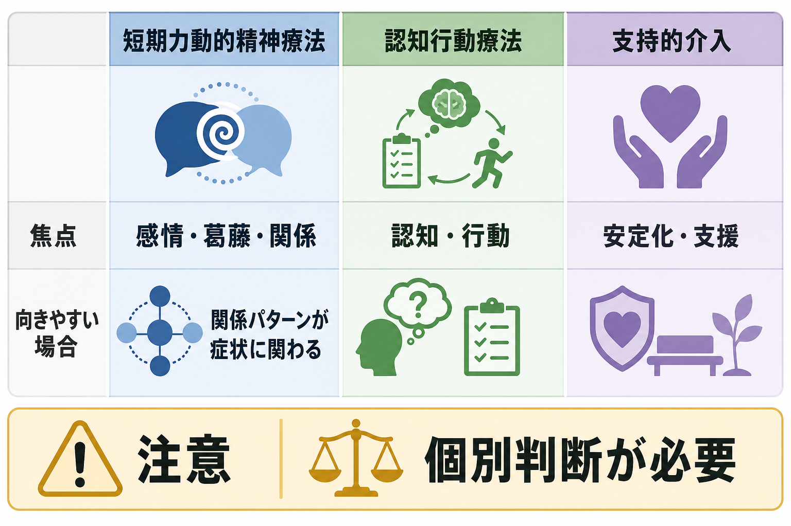

# 短期力動的精神療法とは何か

## 要点

- 短期力動的精神療法 short-term psychodynamic psychotherapy, STPP は、精神分析的な見方を基盤にしながら、焦点を絞り、期間や回数を限定して行う個人心理療法である。
- 中心に置くのは、症状そのものだけでなく、つらい感情の回避、葛藤、反復する対人パターン、治療関係の中で再現される関係の型である [1][5]。
- 研究では、うつ病、不安症、身体症状、パーソナリティ関連の困難を含む common mental disorders に対して、待機・通常治療・最小接触より良い改善を示す可能性がある。ただし研究間の異質性と実施品質の差には注意が必要である [1][3][4]。
- [[認知行動療法CBTとは何か]]が認知・行動の修正を明示的に扱うのに対し、STPP は感情、葛藤、関係性の意味づけをより前景化する。ただし両者は対立する体系ではなく、症例理解と治療目標によって使い分ける。

## この記事で答える問い

1. 短期力動的精神療法は、長期の精神分析的治療と何が違うのか。
2. 「焦点化された葛藤」や「対人パターン」を扱うとは、臨床的に何をすることなのか。
3. どのような症状や困難に向きやすく、どのような場合に注意が必要か。
4. 研究エビデンスはどこまで示され、どこに限界が残っているのか。

## まず結論

短期力動的精神療法は、「過去を長く掘り下げる治療」ではなく、現在の症状や生活機能を苦しくしている反復パターンを、限られた時間の中で見つけて扱う治療である。たとえば、親密になりたいのに相手に頼ると恥や怒りが出て距離を取る、評価されたいのに批判を恐れて回避する、悲しみを感じる前に身体症状や過活動で処理する、といった循環を焦点にする。

治療では、症状を「性格のせい」と決めつけるのではなく、感情、願望、防衛、対人関係、生活史、現在のストレスをつなげて理解する。限られた回数で行うため、扱うテーマは一つから少数に絞られる。NICE のうつ病ガイドラインでは、STPP は訓練を受けた治療者が個別に行い、抑うつに特化した経験的に検証されたプロトコルを用いる治療として位置づけられている [2]。

## 背景

力動的精神療法は、精神分析の理論から発展した心理療法群である。古典的な精神分析では、無意識的葛藤、転移、防衛、幼少期経験の影響を長期的に扱うことが多かった。一方、医療・地域臨床・保険診療の現場では、限られた期間で利用でき、症状改善や機能回復を評価しやすい治療形式が求められた。そこから、焦点化、時間制限、治療契約、アウトカム評価を重視する短期力動的アプローチが発展した [1][5]。

短期力動的精神療法は、単一の技法名ではなく、複数のモデルを含む広いカテゴリーである。支持的・表出的精神療法、焦点化精神療法、短期力動療法、動的対人療法、集中的短期力動療法など、モデルごとに重点は異なる。それでも共通する軸は、症状を「意味のない反応」と見なさず、感情と関係の文脈で理解する点にある。

## 基本概念

### 焦点化

短期で行うため、治療全体の焦点を明確にする。焦点は「うつを治す」のような広い目標だけではなく、「拒絶される不安が出ると怒りで相手を遠ざけ、その後に孤立と抑うつが強まる」といった循環として定式化される。焦点があることで、毎回の面接で扱う素材を選びやすくなる。

### 葛藤

ここでいう葛藤は、単なる迷いではない。近づきたいが怖い、怒りを感じるが壊れるのが怖い、依存したいが恥ずかしい、成功したいが罰されそうに感じる、といった相反する感情・願望・恐れの組み合わせである。本人が自覚しにくい葛藤は、身体症状、回避、過剰適応、対人トラブルとして現れることがある [1][5]。

### 防衛と感情回避

防衛は、苦痛な感情や記憶から心を守る働きである。防衛そのものは病的とは限らない。しかし、防衛が固定化すると、悲しみを感じる前に怒る、恥を感じる前に相手を批判する、不安を避けるために挑戦をやめる、といった形で生活を狭める。STPP は、防衛を取り除くことではなく、防衛がいつ何を守っているのかを理解し、より柔軟な反応を増やすことを目指す。

### 対人パターン

症状はしばしば対人関係の中で強まる。[[対人関係療法IPTとは何か]]が現在の対人問題領域を明示的に扱うのに対し、STPP では反復する関係の型や、治療者との関係に現れる期待・不安・怒り・恥にも注目する。社交不安症向けの短期力動的精神療法では、症状に関わる中核的な葛藤関係テーマや恥への焦点化が推奨構成要素として挙げられている [6]。

## 仕組み

STPP の変化過程は、一つの技法だけで説明できない。実用的には、次のような流れとして理解できる。

1. 症状や困りごとを、感情・対人関係・生活史の文脈に置き直す。
2. 反復するパターンを、治療者と患者が共有できる言葉にする。
3. つらい感情を避けず、耐えられる範囲で体験し、言語化する。
4. 治療関係の中で再現される期待や恐れを扱う。
5. 面接外の対人場面で、少し違う反応を試す。
6. 症状、対人機能、自己理解の変化を確認する。

たとえば、[[うつ病とは何か|うつ病]]では「何も感じない」「自分が悪い」と訴えられていても、その背景に怒りを表すことへの恐れ、依存への恥、喪失への悲しみがある場合がある。STPP では、抑うつ症状を評価しつつ、どの感情が回避され、どの関係パターンが反復され、どの場面で自己批判が強まるのかを見る。2015年のメタ分析更新では、うつ病に対する STPP は対照条件より有効で、治療中の症状軽減と機能改善が示され、フォローアップでも維持または改善が報告されている [3]。

## 図解

STPP は、[[心理療法とは何か]]の中でも「洞察」と「感情体験」と「関係性」を結びつける治療として理解しやすい。ただし、治療の目的は洞察を得ること自体ではない。洞察が、感情の扱い方、対人場面での選択、症状の悪循環の変化につながることが重要である。

## 臨床・研究との接続

### うつ病

NICE の成人うつ病ガイドラインでは、STPP は個別セッションで、うつ病に特化した経験的に検証されたプロトコルを用いる治療として示されている。焦点は、重要な関係やストレス場面での困難な感情を認識し、反復するパターンを同定することにある [2]。[[大うつ病性障害とは何か]]や[[不安症とうつ病はどう併存するのか]]と接続して読むと、症状評価と関係性評価を分けずに考えやすい。

### 不安症と社交不安

[[不安症群とは何か]]では、回避が症状を維持する重要な要素になる。社交不安症では、恥、評価への恐れ、拒絶予期、自己批判が対人場面を狭める。NICE の社交不安症ガイドラインは、CBT を第一選択としつつ、CBT や薬物療法を希望しない成人に、社交不安症向けに開発された短期力動的精神療法を考慮しうるとしている。ただし、CBT などに比べて臨床効果と費用対効果は限定的であることにも注意を促している [6]。大規模 RCT でも、社交不安症に対して力動的療法と CBT が比較されており、疾患特異的プロトコルで評価する必要性が示されている [7]。

### パーソナリティ機能と対人パターン

[[パーソナリティ機能の障害とは何か]]や[[境界性パーソナリティ障害とは何か]]で扱うような自己像・対人関係・情動調整の困難では、短期介入だけで十分とは限らない。STPP が役立つ場合もあるが、自傷リスク、解離、重いトラウマ、物質使用、生活不安定性がある場合は、安定化、危機対応、治療構造の明確化が優先される。必要に応じて [[DBTの感情調整スキルとは何か]] や [[DBTの対人関係スキルとは何か]] のようなスキル訓練、薬物療法、ケースマネジメントと組み合わせる。

### 研究エビデンスの読み方

Cochrane レビューは、成人の common mental disorders に対する STPP の RCT 33件、2173人を検討し、短期・中期では対照群より改善が大きい傾向を報告した。一方で、研究の質、モデルの違い、手続きの違い、長期追跡での不確実性があり、結論は慎重に読む必要がある [1]。2023年の umbrella review は、成人の common mental disorders に対する力動的精神療法を経験的支持治療として再評価し、複数領域で支持を示す一方、疾患別・比較試験・機序研究の精緻化が課題であることを示している [4]。

## よくある誤解

### 「短期だから浅い治療である」

短期であることは、浅いことを意味しない。むしろ、焦点を絞ることで、反復パターンや感情回避を集中的に扱える場合がある。ただし、複雑なトラウマ、慢性的な対人不安定性、重い自殺リスクがある場合には、短期形式だけで十分と考えない。

### 「過去の親子関係だけを話す治療である」

過去は扱うが、目的は過去の説明で現在を固定することではない。現在の症状、仕事、家族、恋愛、治療関係の中で、どの感情と関係パターンが繰り返されているかを理解するために過去を使う。

### 「エビデンスがない」

力動的精神療法には研究があり、STPP についてもメタ分析やガイドラインで扱われている [1][3][4]。ただし、すべての疾患で第一選択という意味ではない。疾患、重症度、患者の希望、治療者の訓練、利用可能な治療、費用対効果を含めて判断する。

### 「感情を出せばよい」

感情を出すこと自体が目的ではない。安全な治療関係の中で、感情がどのように避けられ、どのように対人パターンや症状に結びつくかを理解し、面接外の生活で使える変化につなげることが重要である。

## 関連ノート

- [[心理療法とは何か]]
- [[認知行動療法CBTとは何か]]
- [[対人関係療法IPTとは何か]]
- [[マインドフルネスストレス低減法MBSRとは何か]]
- [[うつ病とは何か]]
- [[大うつ病性障害とは何か]]
- [[不安症群とは何か]]
- [[社交不安症とは何か]]
- [[パーソナリティ機能の障害とは何か]]
- [[境界性パーソナリティ障害とは何か]]

## 理解チェック

1. STPP でいう「焦点化」は、単に主訴を一つに絞ることとどう違うか。
2. 感情回避、防衛、対人パターンは、どのように症状維持と結びつくか。
3. CBT、IPT、支持的介入と比較したとき、STPP の焦点はどこにあるか。
4. STPP の研究エビデンスを読むとき、疾患別プロトコル、治療者訓練、比較条件、フォローアップを確認する必要があるのはなぜか。

## 関連ノート候補・MOC更新候補

- MOC 更新候補: `content/00_MOC/MOC｜臨床実践・治療.md`
- MOC 更新候補: `content/00_MOC/MOC｜精神医学.md`
- 今後の作成候補: 「力動的定式化とは何か」
- 今後の作成候補: 「転移と逆転移とは何か」
- 今後の作成候補: 「防衛機制とは何か」

## 未解決問題

- どの患者が STPP、CBT、IPT、支持的介入、薬物療法、複合治療のどれから最も利益を得るかを、個別化して予測する研究はまだ十分ではない。
- STPP の有効成分が、感情体験、洞察、治療同盟、転移作業、対人場面での新しい行動のどれにどの程度依存するかは、モデルごとに検証が必要である。
- 日本語臨床圏で、疾患別マニュアル、治療者訓練、アウトカム測定、長期フォローアップを組み合わせた実装研究が必要である。

## 参考文献

[1] Abbass, A. A., Kisely, S. R., Town, J. M., Leichsenring, F., Driessen, E., De Maat, S., Gerber, A., Dekker, J., Rabung, S., Rusalovska, S., & Crowe, E. (2014). Short-term psychodynamic psychotherapies for common mental disorders. *Cochrane Database of Systematic Reviews*, 2014(7), CD004687. https://doi.org/10.1002/14651858.CD004687.pub4

[2] National Institute for Health and Care Excellence. (2022). *Depression in adults: treatment and management* (NICE guideline NG222). https://www.nice.org.uk/guidance/ng222/chapter/Recommendations

[3] Driessen, E., Hegelmaier, L. M., Abbass, A. A., Barber, J. P., Dekker, J. J. M., Van, H. L., Jansma, E. P., & Cuijpers, P. (2015). The efficacy of short-term psychodynamic psychotherapy for depression: A meta-analysis update. *Clinical Psychology Review*, 42, 1-15. https://doi.org/10.1016/j.cpr.2015.07.004

[4] Leichsenring, F., Abbass, A., Heim, N., Keefe, J. R., Kisely, S., Luyten, P., Rabung, S., & Steinert, C. (2023). The status of psychodynamic psychotherapy as an empirically supported treatment for common mental disorders: An umbrella review based on updated criteria. *World Psychiatry*, 22(2), 286-304. https://doi.org/10.1002/wps.21104

[5] Shedler, J. (2010). The efficacy of psychodynamic psychotherapy. *American Psychologist*, 65(2), 98-109. https://doi.org/10.1037/a0018378

[6] National Institute for Health and Care Excellence. (2013). *Social anxiety disorder: recognition, assessment and treatment* (Clinical guideline CG159). https://www.nice.org.uk/guidance/cg159/chapter/recommendations

[7] Leichsenring, F., Salzer, S., Beutel, M. E., Herpertz, S., Hiller, W., Hoyer, J., Huesing, J., Joraschky, P., Nolting, B., Pöhlmann, K., Ritter, V., Stangier, U., Strauss, B., Stuhldreher, N., Tefikow, S., Teismann, T., Willutzki, U., Wiltink, J., & Leibing, E. (2013). Psychodynamic therapy and cognitive-behavioral therapy in social anxiety disorder: A multicenter randomized controlled trial. *American Journal of Psychiatry*, 170(7), 759-767. https://doi.org/10.1176/appi.ajp.2013.12081125
