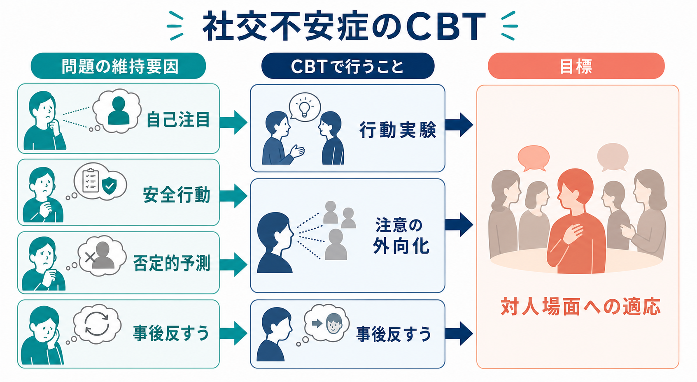
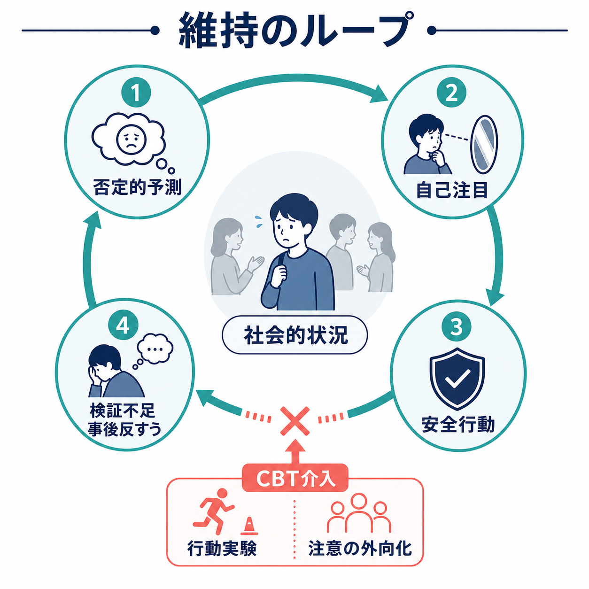
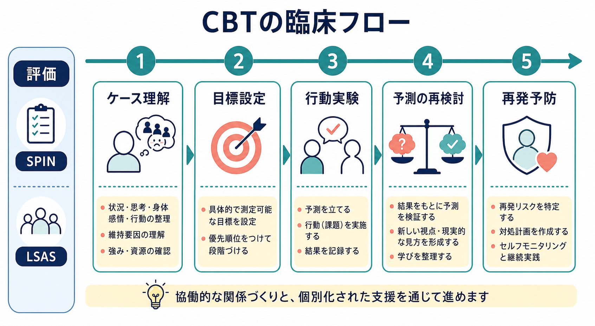

# 社交不安症のCBTでは何を行うのか

## 要点

- [[社交不安症とは何か|社交不安症]]のCBTは、「人前で緊張しないようにする練習」ではなく、否定的に評価されるという予測、自己注目、安全行動、事後反すうが不安を維持する仕組みを一緒に検証する治療である[1][2]。
- 中心課題は、対人場面を避けるか耐えるだけにせず、「自分がどう見えるか」から「相手・課題・会話の流れ」へ注意を戻し、安全行動を減らした状態で予測を検証することである[1][5]。
- NICE は成人の社交不安症に対して、Clark & Wells モデルまたは Heimberg モデルに基づく、社交不安症に特化した個人CBTを初期治療として推奨している[1]。
- 研究上も、個人認知療法やCBT系介入は、待機群、通常治療、曝露と応用リラクセーションなどとの比較で有効性が示されている[4][5][6]。
- 医療・臨床の場では、個別診断や治療指示としてではなく、本人の目標、併存症、生活機能、文化的背景、治療関係を踏まえて適用する必要がある[1]。

## この記事で答える問い

1. 社交不安症のCBTは、実際の面接やセッションで何を扱うのか。
2. 自己注目、安全行動、否定的予測は、なぜ治療の中心になるのか。
3. 曝露、行動実験、認知再構成、ビデオフィードバックはどう使い分けるのか。
4. 臨床・研究では、どの程度の根拠があると言えるのか。

## まず結論

社交不安症のCBTでは、怖い場面にただ慣れることだけを目標にしない。むしろ、「自分は変に見える」「沈黙したら嫌われる」「赤面したら終わりだ」といった否定的予測を、対人場面の中で検証可能な仮説として扱う。そこで、本人が普段使っている安全行動を見つけ、自己注目を外向きの注意へ切り替え、行動実験を通して「実際に何が起きたか」を確認する[1][2][5]。

この意味で、CBTは「気合いで人前に出る訓練」ではなく、[[不安とは何か|不安]]の維持過程を変える共同作業である。本人が避けてきた場面に入ることはあるが、その目的は苦痛に耐えることではなく、予測・注意・行動・結果の対応を観察し直すことである。

## 背景

社交不安症では、人前で話す、会議で発言する、食事を見られる、雑談する、電話をかける、視線を合わせるといった場面で、否定的評価への恐れが強くなる。診断上は、恐怖・回避・苦痛・機能障害が重要であり、単なる内向性や「緊張しやすさ」とは区別される[1]。関連する診断分類の考え方は [[DSMとICDは何が違うのか]] とも接続できる。

NICE ガイドラインでは、評価時に、恐れている場面、恐れている出来事、身体症状、自己イメージ、安全探索行動、注意の焦点、予期不安と事後処理、仕事・教育・社会生活への影響を確認することが推奨されている[1]。これは、社交不安症のCBTが「症状名」だけでなく、本人ごとの維持サイクルを把握する治療だからである。

また、社交不安症は[[不安症群とは何か|不安症群]]の一部として理解されるが、広場恐怖、パニック症、全般不安症とは介入の焦点が異なる。社交不安症では、特に「他者から見られ、評価される自己」が中心テーマになる。

## 基本概念

### 否定的予測

否定的予測とは、「声が震えたら無能だと思われる」「沈黙したら相手が怒る」「赤面したら軽蔑される」といった、対人場面で起きると予測される破局的な出来事である。CBTでは、これを説得で否定するのではなく、どの場面で、どの程度信じていて、何を根拠にしているのかを具体化する。

予測は、曖昧なままだと検証できない。したがって、「相手に嫌われる」ではなく、「発表後に質問が出なかったら、参加者の8割は退屈だと思っていると解釈する」のように、場面、予測、確信度、観察可能な手がかりに分ける。

### 自己注目

自己注目とは、会話や相手の反応ではなく、自分の身体感覚、表情、声、頭の中の自己イメージに注意が向く状態である。Clark & Wells モデルでは、社交不安症の人は社会的脅威を感じると、内部情報を手がかりに「自分は他人からどう見えているか」を推測しやすいとされる[2]。

例えば、心拍が速いことを「周囲にも緊張がばれている証拠」と解釈する。実際には、本人の身体感覚と他者から見える振る舞いは一致しないことが多い。そこでCBTでは、注意を外に向ける練習や、ビデオフィードバックを使った検証が行われる[7]。

### 安全行動

安全行動とは、恐れている結果を防ぐための行動である。例として、目を合わせない、原稿を過剰に読む、短く答える、話す前に何度も頭の中で文章を確認する、汗や赤面を隠す、質問しない、会話を早く終わらせる、といった行動がある。

安全行動は短期的には安心をもたらす。しかし長期的には、「安全行動をしたから失敗しなかった」と学習され、予測の検証が起きにくい。さらに、相手から見ると不自然さや距離感として見える場合もある。自己注目と安全行動は互いに強め合い、社交不安を維持する要因になる[2][8]。

### 予期不安と事後反すう

[[予期不安とは何か|予期不安]]は、場面の前から「失敗するかもしれない」と想像して不安が高まる状態である。事後反すうは、場面が終わった後に「変なことを言った」「あの表情は軽蔑だった」と反復的に見直す過程である。CBTでは、事前のシミュレーションと事後の反省を、学習に役立つ振り返りと、不安を維持する反すうに分ける。

## 仕組み

Clark & Wells モデルでは、社会的場面に入る前後で次のような循環が起きると考える[2]。

1. 対人場面を「評価される危険」として解釈する。
2. 「失敗する」「変に見える」と予測する。
3. 注意が自分の身体感覚や自己イメージへ向く。
4. 安全行動で失敗を防ごうとする。
5. 実際の他者反応を観察しにくくなり、予測が検証されない。
6. 事後反すうで失敗の記憶が強化され、次の場面の予期不安が高まる。

Rapee & Heimberg モデルも、社会的評価場面での自己表象、他者評価の推測、注意バイアス、不安反応が相互作用する点を重視する[3]。両モデルに共通するのは、「社交不安は場面そのものだけでなく、その場面で何に注意を向け、何を証拠として採用し、どの行動で危険を避けているかによって維持される」という見方である。

## 図解

上の2枚は、CBTの全体像と維持ループを示している。1枚目では、問題の維持要因として自己注目、安全行動、否定的予測、事後反すうを置き、それに対して行動実験、注意の外向化、事後処理の修正を対応させた。2枚目では、否定的予測から自己注目、安全行動、検証不足、事後反すうへ進む循環を示した。

3枚目は、臨床での進め方をフローとして整理したものである。実際の順番は機械的に固定されるわけではないが、多くの場合、評価、ケース理解、目標設定、行動実験、予測の再検討、再発予防という流れをとる。評価尺度として SPIN や LSAS が使われることがあり、NICE も介入評価を支える尺度として例示している[1]。

## CBTで実際に行うこと

### 1. ケース理解をつくる

最初に行うのは、本人の「困っている場面」を細かく理解することである。対象は、診断名ではなく、具体的な生活場面である。例えば、会議で発言できない、授業で質問できない、店員に話しかけられない、オンライン会議でカメラをオンにできない、といった形で整理する。

この段階では、[[心理教育とは何か|心理教育]]も重要である。社交不安症は本人の性格の欠陥ではなく、予測、注意、回避、安全行動、反すうが絡み合う維持過程として説明できる。こうした説明は、恥や自己非難を弱め、治療で何を試すのかを明確にする。

### 2. 目標を「不安ゼロ」ではなく「行動可能性」に置く

社交不安症のCBTでは、不安を完全になくすことを唯一の目標にしない。むしろ、「不安があっても発言する」「会話の途中で自分の心拍ではなく相手の言葉に戻る」「安全行動を減らしても破局が起きるか確認する」といった、行動と学習に基づく目標を立てる。

目標設定では、[[精神科治療計画はどのように立てるのか|治療計画]]と同じく、本人の価値や生活上の優先度が重要になる。発表ができるようになること、友人関係を広げること、職場で質問できることなど、治療の成果は症状尺度だけでなく生活機能にも表れる。

### 3. 自己注目と安全行動を実験で見える化する

Clark & Wells 型のCBTでは、自己注目と安全行動の悪影響を体験的に確認する課題がよく用いられる[1]。例えば、同じ短い会話を2条件で行う。

| 条件 | 注意の向き | 安全行動 | 確認すること |
|---|---|---|---|
| いつもの条件 | 自分の声・表情・失敗予測に集中 | 目を合わせない、短く答える、過剰に準備する | 不安、会話のしにくさ、相手の反応 |
| 実験条件 | 相手の言葉・表情・会話内容に注意 | 安全行動を一部減らす | 予測がどの程度当たったか |

この実験は「うまく話す訓練」ではない。重要なのは、自己注目と安全行動が本当に役に立っているのか、それとも不安やぎこちなさを強めているのかを観察することである。日本の臨床サンプルを含む研究でも、安全行動と自己注目を減らした条件では、主観的・客観的な評価が改善することが報告されている[8]。

### 4. 行動実験で否定的予測を検証する

行動実験は、単なる曝露とは少し違う。曝露が「恐れている場面に近づく」ことを重視するのに対し、行動実験は「予測を検証する」ことを重視する。例えば、「質問すると相手は迷惑そうにする」という予測があれば、実際に短い質問をして、相手の反応、会話の継続、予測の確信度変化を記録する。

行動実験では、結果が本人にとって意味を持つように設計する。失敗しないように安全行動を最大限使った実験では、予測が外れても「うまく隠せたからだ」と解釈されやすい。したがって、安全行動をどの程度減らすか、何を観察するか、どの指標で判断するかを事前に決める。

### 5. ビデオフィードバックで自己イメージを更新する

社交不安症では、本人の中の自己イメージが、実際に他者から見える姿よりも否定的に歪むことがある。ビデオフィードバックは、本人の予測と実際の映像を比較し、否定的自己イメージを更新するために使われる[7]。

ただし、ただ動画を見るだけでは不十分なことがある。不安が強い人は、動画を見ても悪い点だけを探す、身体感覚を思い出しながら見る、細部を過剰に評価することがある。したがって、視聴前に「何を予測したか」「第三者ならどう見るか」「安全行動はどう見えるか」を整理してから見ることが重要である[7]。

### 6. 事後反すうを学習に変える

事後反すうでは、場面の後に悪い瞬間だけを切り取り、「やはり失敗した」と結論づけやすい。CBTでは、振り返りを禁止するのではなく、反すうと学習を分ける。

- 反すう: 証拠を増やさず、同じ失敗イメージを繰り返す。
- 学習: 予測、実際の結果、代替説明、次に試す行動を短く記録する。

この切り替えは、再発予防にもつながる。治療後に不安が再び高まった場合でも、「自分は戻ってしまった」と解釈するのではなく、維持ループのどこが再開しているかを確認できる。

## 臨床・研究との接続

成人の社交不安症では、NICE が社交不安症に特化した個人CBTを初期治療として推奨し、Clark & Wells モデルでは最大14回程度、Heimberg モデルでは15回程度の構造化された介入を示している[1]。Clark & Wells 型では、心理教育、自己注目と安全行動の体験的検証、ビデオフィードバック、外向き注意訓練、行動実験、記憶や中核信念の扱い、予期・事後処理の修正、再発予防が含まれる[1]。

ネットワークメタ解析では、心理療法、薬物療法、自助介入を含めた成人社交不安症の急性期治療が比較され、個人CBTを含む心理療法の有効性が支持されている[4]。また、Clark らのRCTでは、認知療法が曝露と応用リラクセーションおよび待機群と比較され、症状改善が示された[5]。Mörtberg らのRCTでも、個人認知療法、集中的集団認知療法、通常治療が比較され、個人認知療法の有効性が示されている[6]。

臨床的には、CBTは単独で完結する技法集ではない。[[治療関係とは何か|治療関係]]、本人の恥への配慮、併存するうつ病・物質使用・発達特性、生活環境、文化的背景を踏まえる必要がある[1]。また、心理療法が神経・認知システムにどのような変化をもたらすかは、[[精神療法は脳を変えるのか]]という問いとも接続する。

## よくある誤解

**誤解1: CBTは人前に出る根性訓練である。**  
実際には、対人場面に入ること自体が目的ではない。目的は、予測、注意、安全行動、結果の関係を検証し、現実的な学習を作ることである[1][2]。

**誤解2: 安全行動は悪いので一気に全部やめるべきである。**  
安全行動は本人が苦痛を下げるために工夫してきた対処であり、いきなり全てを外す必要はない。CBTでは、どの安全行動がどの予測を検証不能にしているかを見て、段階的に実験する。

**誤解3: 認知再構成は「気にしすぎ」と言い聞かせることである。**  
認知再構成は説得ではない。本人の予測を明確にし、証拠、反証、代替説明、行動実験の結果から、より検証可能で柔軟な見方を作る作業である。

**誤解4: 不安が残っているなら治療は失敗である。**  
不安が残っていても、回避が減り、注意を戻せるようになり、生活上の行動が増えれば重要な変化である。不安の有無だけでなく、機能と学習を見る必要がある。

## 関連ノート

- [[社交不安症とは何か]]
- [[不安症群とは何か]]
- [[不安とは何か]]
- [[予期不安とは何か]]
- [[心理教育とは何か]]
- [[治療関係とは何か]]
- [[精神科治療計画はどのように立てるのか]]
- [[生物心理社会モデルとは何か]]
- [[精神療法は脳を変えるのか]]
- [[DSMとICDは何が違うのか]]

MOC更新候補: [[MOC｜臨床実践・治療]], [[MOC｜精神医学]], [[MOC｜疾患・症候群]]

## 理解チェック

1. 社交不安症のCBTで、自己注目と安全行動を最初に評価するのはなぜか。
2. 「曝露」と「行動実験」は、目的の置き方としてどう違うか。
3. 安全行動を減らした実験で、どのような観察指標を事前に決めるとよいか。
4. 事後反すうを「学習」に変えるには、どの情報を記録すればよいか。
5. 社交不安症のCBTを個別化するとき、併存症や生活機能をどう考慮する必要があるか。

## 未解決問題

- オンライン会議、SNS、リモート学習など、現代的な評価場面に合わせて行動実験をどう設計するか。
- 児童青年期、高齢者、発達特性を持つ人、文化的少数者に対して、社交不安症特化CBTをどのように調整するか。
- ビデオフィードバックや注意訓練を、遠隔CBTやデジタル介入でどの程度再現できるか。
- 症状改善だけでなく、孤立、就労・学業、自己効力感、生活の質への長期効果をどう評価するか。

## 参考文献

[1] National Institute for Health and Care Excellence. (2013). *Social anxiety disorder: recognition, assessment and treatment* (Clinical guideline CG159). https://www.nice.org.uk/guidance/cg159

[2] Clark, D. M., & Wells, A. (1995). A cognitive model of social phobia. In R. G. Heimberg, M. R. Liebowitz, D. A. Hope, & F. R. Schneier (Eds.), *Social Phobia: Diagnosis, Assessment, and Treatment* (pp. 69-93). Guilford Press.

[3] Rapee, R. M., & Heimberg, R. G. (1997). A cognitive-behavioral model of anxiety in social phobia. *Behaviour Research and Therapy, 35*(8), 741-756. https://doi.org/10.1016/S0005-7967(97)00022-3

[4] Mayo-Wilson, E., Dias, S., Mavranezouli, I., Kew, K., Clark, D. M., Ades, A. E., & Pilling, S. (2014). Psychological and pharmacological interventions for social anxiety disorder in adults: A systematic review and network meta-analysis. *The Lancet Psychiatry, 1*(5), 368-376. https://doi.org/10.1016/S2215-0366(14)70329-3

[5] Clark, D. M., Ehlers, A., Hackmann, A., McManus, F., Fennell, M., Grey, N., Waddington, L., & Wild, J. (2006). Cognitive therapy versus exposure and applied relaxation in social phobia: A randomized controlled trial. *Journal of Consulting and Clinical Psychology, 74*(3), 568-578. https://doi.org/10.1037/0022-006X.74.3.568

[6] Mörtberg, E., Clark, D. M., Sundin, Ö., & Åberg Wistedt, A. (2007). Intensive group cognitive treatment and individual cognitive therapy vs. treatment as usual in social phobia: A randomized controlled trial. *Acta Psychiatrica Scandinavica, 115*(2), 142-154. https://doi.org/10.1111/j.1600-0447.2006.00839.x

[7] Warnock-Parkes, E., Wild, J., Stott, R., Grey, N., Ehlers, A., & Clark, D. M. (2017). Seeing is believing: Using video feedback in cognitive therapy for social anxiety disorder. *Cognitive and Behavioral Practice, 24*(2), 245-255. https://doi.org/10.1016/j.cbpra.2016.03.007

[8] Furukawa, T. A., Chen, J., Watanabe, N., Nakano, Y., Ietsugu, T., Ogawa, S., Funayama, T., & Noda, Y. (2009). Videotaped experiments to drop safety behaviors and self-focused attention for patients with social anxiety disorder: Do they change subjective and objective evaluations of anxiety and performance? *Journal of Behavior Therapy and Experimental Psychiatry, 40*(2), 202-210. https://doi.org/10.1016/j.jbtep.2008.08.003
