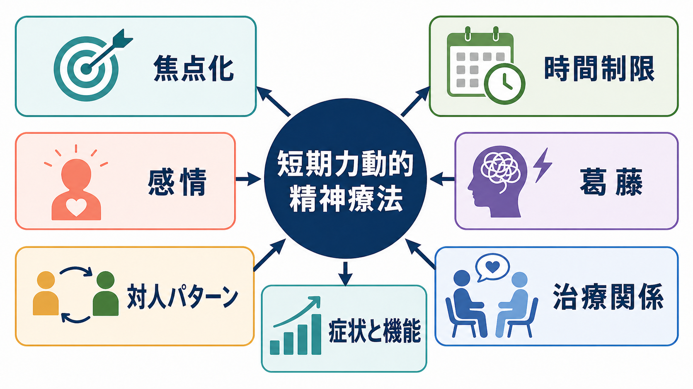
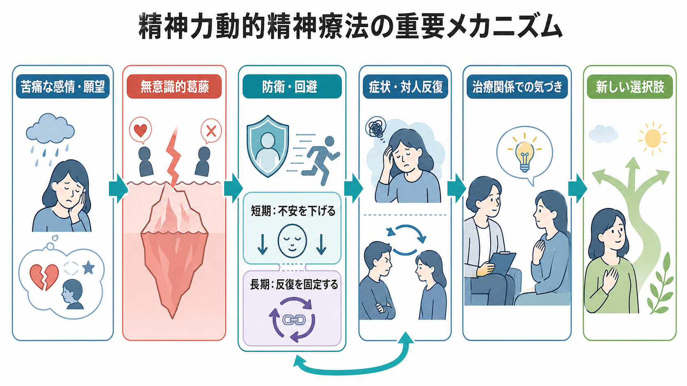
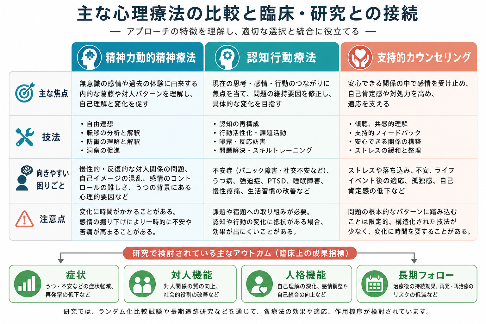

# 精神力動的精神療法とは何か

## 要点

- 精神力動的精神療法は、本人が十分には気づいていない感情、願望、葛藤、防衛、対人パターンを、治療関係の中で探索する心理療法である[1][2]。
- 現代の精神力動的精神療法は、古典的な精神分析そのものではなく、週1回前後の短期・中期・長期の個人療法として行われることが多い[1][3]。
- 中核技法は、感情への焦点化、防衛や回避の理解、反復する関係パターンの同定、過去経験と現在のつながり、[[転移とは何か|転移]]と[[治療関係とは何か|治療関係]]の検討である[2]。
- うつ病、不安症、身体症状症、パーソナリティ病理などでは、短期精神力動的精神療法を含む力動的治療の有効性を支持するメタ分析・アンブレラレビューがある。ただし疾患、治療形式、研究品質により確実性は異なる[4][5][6]。
- 臨床上は、個別の診断や治療指示ではなく、症状、対人機能、治療目標、リスク、本人の希望、利用可能な専門性を踏まえて選択されるべき治療である[3]。

## この記事で答える問い

1. 精神力動的精神療法は、何を変えようとする治療なのか。
2. 無意識的葛藤、防衛、転移は、臨床ではどう扱われるのか。
3. 認知行動療法や支持的面接と、どこが似ていてどこが違うのか。
4. 研究上、どの程度の有効性が示され、どこに限界があるのか。

## まず結論

精神力動的精神療法は、「症状をなくす技法」というより、症状や対人困難を支えている反復パターンを理解し、別の反応を選べるようにする治療である。たとえば、親密な関係で拒絶されると予期して先に距離を取る、怒りを感じると自責に変換する、援助を求めたいのに相手を試すように振る舞う、といったパターンを扱う。

治療者は、単に助言するのではなく、患者が感情を安全に言語化し、回避や[[防衛機制とは何か|防衛]]の働きを理解し、治療者との関係にも現れる反復を一緒に検討する。変化は、知的な「わかった」だけではなく、感情を伴った理解、治療関係での新しい経験、日常場面での選択の変化を通じて進む[1][2][7]。

## 背景

精神力動的精神療法は、精神分析の伝統から発展したが、現代の臨床ではより時間限定的、焦点化、実証研究志向になっている。Shedler は、精神力動的治療の本質を「十分には知られていない自己の側面を探索すること、とくにそれが治療関係に現れる仕方を扱うこと」と整理している[1]。

NICE の成人うつ病ガイドラインでは、短期精神力動的精神療法を、治療特異的訓練を受けた実践者が行う個人療法として位置づけている。うつ病に対する短期精神力動的精神療法は、重要な関係やストレス状況で生じる難しい感情を認識し、反復パターンを同定し、治療者との関係も現在の葛藤を扱う焦点として用いる治療と説明されている[3]。

## 基本概念

### 無意識的葛藤

無意識的葛藤とは、本人が明確には自覚していない願望、感情、恐れ、禁止、対人期待がぶつかり合う状態である。たとえば「近づきたい」と「傷つきたくない」が同時に働くと、近づく相手ほど避ける、助けを求めたい相手ほど攻撃的になる、といった矛盾した行動が生じうる。

ここでいう無意識は、神秘的な場所ではない。言葉になっていない感情、気づくと不安になる記憶、習慣化した対人予測、身体反応として先に出る反応などを含む。精神力動的精神療法は、それらを患者の体験に即して少しずつ言語化する。

### 防衛

防衛は、苦痛な感情や葛藤から心を守る働きである。否認、知性化、投影、回避、反動形成、自責化などは、短期的には不安を下げる。しかし、同じ防衛が固定化すると、感情を感じられない、親密な関係を避ける、相手を誤解する、症状が反復するといった問題につながる。

重要なのは、防衛を「悪いもの」として壊すのではなく、その人がなぜそれを必要としてきたのかを理解することである。治療では、いま何を感じそうになり、どのようにそれを避けたのかを、責めずに観察する。

### 転移と逆転移

転移とは、過去の重要な関係で形成された期待や感情が、現在の関係、とくに治療者との関係に現れることである。治療者を批判的な親のように感じる、見捨てられる前提で反応する、評価されたい気持ちと反発が同時に出る、といった形をとる。

[[逆転移とは何か|逆転移]]は、患者との関係の中で治療者側に生じる感情や反応である。現代の精神力動的臨床では、逆転移は単なる妨害ではなく、患者が他者に引き起こしやすい対人反応を理解する手がかりにもなる。ただし治療者自身の課題と混同しないため、訓練、スーパービジョン、境界設定が必要である。

## 仕組み

精神力動的精神療法の変化は、次の循環として理解できる。

1. 苦痛な感情や願望が生じる。
2. それに伴う不安や葛藤を下げるため、防衛や回避が働く。
3. 防衛は短期的には苦痛を減らすが、長期的には症状や対人反復を固定する。
4. 治療関係の中で、その反応が安全に観察される。
5. 感情、願望、防衛、対人予測を結びつけて理解する。
6. 日常場面で、以前とは少し違う選択肢を試せるようになる。

この過程は、単純な洞察主義ではない。Leichsenring らは、変化機序として、感情体験、治療同盟、転移作業、防衛への介入、対人パターンの変化、自己理解などを検討する必要を論じている[7]。つまり、精神力動的精神療法は「過去を語る治療」ではなく、現在の体験がどのように組織化され、関係の中でどう反復され、どこで変化できるかを扱う治療である。

## 図解

図1は、精神力動的精神療法を「焦点化」「感情」「葛藤」「対人パターン」「治療関係」「症状と機能」の全体構造として示している。図2は、防衛が短期的には不安を下げ、長期的には反復を固定しうるというメカニズムを整理している。図3は、精神力動的精神療法、[[行動活性化とは何か|行動活性化]]や CBT 系の治療、[[支持的面接とは何か|支持的面接]]を、焦点と技法の違いから比較している。

## 臨床・研究との接続

短期精神力動的精神療法については、Cochrane レビューが、成人の一般的な精神障害に対する短期精神力動的精神療法を検討し、待機・通常治療・最小接触統制より改善が大きい傾向を報告している。ただし、研究の異質性、サンプル数、長期追跡で一部の効果が統計的に不安定になる点には注意が必要である[4]。

うつ病では、短期精神力動的精神療法のメタ分析更新が、治療中の症状軽減と機能改善、追跡時の維持またはさらなる改善、対照条件に対する有効性を報告している。一方で、他の心理療法との比較では大きな差が出ないことも多く、「誰に、どの形式で、どの程度の期間がよいか」という個別化の問いが残る[5]。

2023年のアンブレラレビューは、成人のうつ病、身体症状症、不安症、パーソナリティ障害に関する近年のメタ分析を評価し、うつ病と身体症状症では高品質、不安症とパーソナリティ障害では中等度品質のエビデンスを報告している[6]。これは「力動的治療は実証研究と無関係」という見方を修正する根拠になるが、すべての問題に同じ強さで有効性が確立しているという意味ではない。

臨床では、[[精神科面接とは何か|精神科面接]]での評価、リスク評価、治療同盟、併存症、本人の希望、治療者の訓練水準が重要になる。自殺リスク、重い物質使用、急性精神病症状、暴力リスク、重篤な解離などがある場合は、精神力動的探索だけを前面に出すのではなく、安全確保と多職種連携を優先する。

## よくある誤解

### 誤解1: 精神力動的精神療法は、すべて幼少期のせいにする

幼少期や過去の関係は重要な素材になりうるが、目的は犯人探しではない。現在の感情、対人反応、治療関係の中で、過去から続く予測や反応がどう働くかを理解することが中心である。

### 誤解2: 科学的根拠がない

根拠の量や質は領域ごとに異なるが、短期精神力動的精神療法や精神力動的治療については、RCT、メタ分析、アンブレラレビューが存在する[4][5][6]。ただし、治療効果の大きさを一つの数値で語り切ることは難しく、研究対象、治療形式、治療者訓練、アウトカム指標を区別する必要がある。

### 誤解3: 沈黙して聞くだけの治療である

現代の精神力動的精神療法は、単なる傾聴ではない。感情への焦点化、防衛の明確化、反復パターンの同定、治療関係の検討、解釈、時には支持や構造化も含む。Blagys と Hilsenroth は、精神力動的治療を特徴づける要素として、感情、回避、反復パターン、過去経験、対人経験、治療関係、願望や空想への焦点を挙げている[2]。

### 誤解4: 認知行動療法と対立する

精神力動的精神療法と認知行動療法は、焦点や用語が違うが、実臨床では対立概念ではない。CBT が思考、行動、スキル、曝露、課題実践を明示的に扱う一方、精神力動的精神療法は感情、葛藤、関係パターン、治療関係に強く焦点を置く。どちらが適切かは、問題、目標、希望、治療者の熟練、利用可能性によって変わる。

## 関連ノート

- [[治療関係とは何か]]
- [[転移とは何か]]
- [[逆転移とは何か]]
- [[防衛機制とは何か]]
- [[支持的面接とは何か]]
- [[精神科面接とは何か]]
- [[精神科面接で境界設定はなぜ必要なのか]]
- [[沈黙は精神科面接でどう扱うべきか]]
- [[行動活性化とは何か]]

関連ノート候補: 「認知行動療法とは何か」「心理療法の共通因子とは何か」「治療同盟とは何か」「メンタライゼーションに基づく治療とは何か」「転移焦点化精神療法とは何か」。

MOC更新候補: `content/00_MOC/MOC｜臨床実践・治療.md` の心理療法セクションに本記事を追加する。

## 理解チェック

1. 精神力動的精神療法は、症状と対人パターンの関係をどのように理解するか。
2. 防衛はなぜ短期的には役立ち、長期的には問題を固定しうるのか。
3. 転移を扱うことは、単に過去を語ることとどう違うか。
4. 精神力動的精神療法と支持的面接は、どこが重なり、どこが異なるか。
5. 研究知見を臨床に使うとき、なぜ「どの患者に、どの形式で」という問いが重要になるか。

## 未解決問題

- 精神力動的精神療法のどの成分が、どの症状・人格機能・対人機能に効いているのか。
- 短期治療と長期治療を、どのような評価指標で使い分けるべきか。
- 治療者要因、治療同盟、転移作業、防衛への介入を、実臨床に近い形でどう測定するか。
- 文化差、ジェンダー、社会的権力関係が、転移や治療関係の理解にどう影響するか。

## 参考文献

[1] Shedler, J. (2010). The efficacy of psychodynamic psychotherapy. *American Psychologist, 65*(2), 98-109. https://doi.org/10.1037/a0018378

[2] Blagys, M. D., & Hilsenroth, M. J. (2000). Distinctive features of short-term psychodynamic-interpersonal psychotherapy: A review of the comparative psychotherapy process literature. *Clinical Psychology: Science and Practice, 7*(2), 167-188. https://doi.org/10.1093/clipsy.7.2.167

[3] National Institute for Health and Care Excellence. (2022). *Depression in adults: treatment and management* (NICE guideline NG222). https://www.nice.org.uk/guidance/ng222

[4] Abbass, A. A., Kisely, S. R., Town, J. M., Leichsenring, F., Driessen, E., De Maat, S., Gerber, A., Dekker, J., Rabung, S., Rusalovska, S., & Crowe, E. (2014). Short-term psychodynamic psychotherapies for common mental disorders. *Cochrane Database of Systematic Reviews*, 2014(7), CD004687. https://doi.org/10.1002/14651858.CD004687.pub4

[5] Driessen, E., Hegelmaier, L. M., Abbass, A. A., Barber, J. P., Dekker, J. J. M., Van, H. L., Jansma, E. P., & Cuijpers, P. (2015). The efficacy of short-term psychodynamic psychotherapy for depression: A meta-analysis update. *Clinical Psychology Review, 42*, 1-15. https://doi.org/10.1016/j.cpr.2015.07.004

[6] Leichsenring, F., Abbass, A., Heim, N., Keefe, J. R., Kisely, S., Luyten, P., Rabung, S., & Steinert, C. (2023). The status of psychodynamic psychotherapy as an empirically supported treatment for common mental disorders: An umbrella review based on updated criteria. *World Psychiatry, 22*(2), 286-304. https://doi.org/10.1002/wps.21104

[7] Leichsenring, F., Steinert, C., & Crits-Christoph, P. (2018). On mechanisms of change in psychodynamic therapy. *Zeitschrift fur Psychosomatische Medizin und Psychotherapie, 64*(1), 16-22. https://doi.org/10.13109/zptm.2018.64.1.16

[8] Fonseca, J. F. R. M., & Luyten, P. (2017). Depression and psychodynamic psychotherapy. *Revista Brasileira de Psiquiatria, 39*(3), 261-268. https://pmc.ncbi.nlm.nih.gov/articles/PMC6899418/
