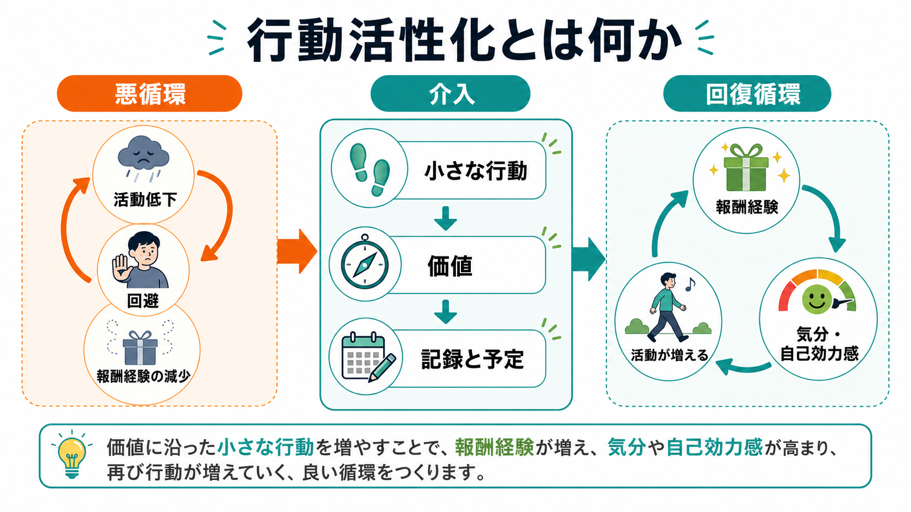
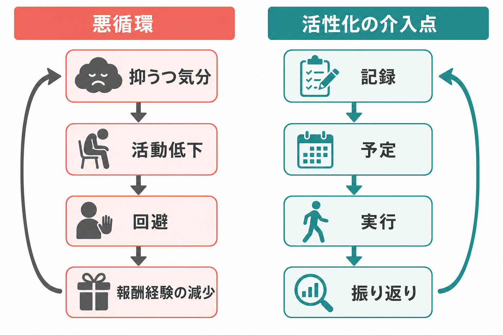
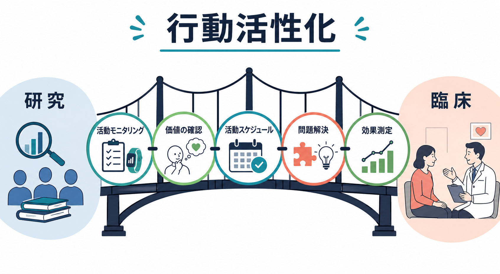

# 行動活性化とは何か

## 要点

- 行動活性化は、抑うつを「気分が悪いから動けない」だけでなく、「動けなくなることで報酬経験が減り、さらに気分が下がる」循環として理解する心理療法である [1]。
- 中核は、気分の回復を待つのではなく、生活文脈の中で価値に沿った小さな行動を計画し、実行後の気分・負担・報酬経験を観察することである [2][3]。
- 思考内容を直接修正することよりも、活動、回避、環境、報酬の関係を変える点に特徴がある。これは [[認知行動療法CBTとは何か]] の行動的要素と重なるが、独立した治療モデルとしても用いられる [1][4]。
- 成人の抑うつに対する研究では、行動活性化は通常治療より有効で、短期的には CBT と大きな差が確認されにくい。ただし長期効果、脱落、対象者ごとの適合性には注意が必要である [5][6]。
- 本記事は教育・研究目的の整理であり、個別の診断や治療指示ではない。重い抑うつ、自殺念慮、躁状態、物質使用、身体疾患が関わる場合は専門家による評価が必要である。

## この記事で答える問い

1. 行動活性化は、単に「活動を増やす」技法なのか。
2. 抑うつにおける活動低下、回避、報酬経験の減少はどのように循環するのか。
3. 実際の治療では、記録、予定、段階づけ、振り返りをどう使うのか。
4. 研究上、行動活性化の効果はどこまで支持され、どこに限界があるのか。

## まず結論

行動活性化とは、抑うつによって狭くなった生活の行動範囲を、本人の価値と環境に即して少しずつ広げ、自然な報酬経験に再接続する治療原理である。重要なのは「気分がよくなったら動く」という順序を固定しないことである。気分が低いままでも実行できる小さな行動を選び、その結果として気分、達成感、予測可能性、人との接触、生活リズムがどう変わるかを観察する [1][2]。

したがって、行動活性化は根性論でも気晴らしの勧めでもない。活動を増やすこと自体が目的なのではなく、回避によって失われた報酬経験を生活の中に戻し、「行動すると少し変わる」という学習を作ることが目的である [3][4]。この点で、[[強化とは何か]]、[[回避学習とは何か]]、[[報酬系とは何か]] と深く関係する。

## 背景

行動活性化は、認知療法の構成要素分析と、抑うつを環境・行動・強化の文脈で捉える行動理論から発展した。Jacobson らは、抑うつでは回避、引きこもり、不活動が生活上の二次的問題を増やし、肯定的強化への接触を減らすと整理した [1]。この観点では、抑うつ症状は個人の内面だけに閉じた現象ではなく、日々の環境、対人関係、役割、生活リズム、身体状態との相互作用として理解される。

その後、Martell らの文脈的行動活性化や、Lejuez らの Brief Behavioral Activation Treatment for Depression が整備され、活動モニタリング、価値の明確化、活動スケジューリング、段階づけ、問題解決などの手続きが簡潔にまとめられた [2][3]。NICE の成人うつ病ガイドラインでも、行動活性化は活動と気分の関連を同定し、回避を減らし、気分改善に関係する行動へ焦点を当てる構造化された心理的介入として位置づけられている [7]。

## 基本概念

### 活動

ここでいう活動は、趣味や運動だけを意味しない。起床、食事、入浴、通院、家事、学習、仕事、休息、人との連絡、短い散歩、書類整理など、生活を構成する具体的行動を含む。行動活性化では、活動を「気分がよいときに行うもの」ではなく、「環境との接触を変え、次の気分や行動可能性を変えるもの」として扱う [2]。

### 報酬経験

報酬経験とは、快感だけではない。達成感、安心感、予測可能性、所属感、身体の軽さ、生活が整う感覚、将来の負担が減ることなども含まれる。抑うつが強いと、以前は報酬になっていた活動が報酬として感じられにくくなる。そのため、最初は「楽しいこと」よりも「やると少し負担が減ること」「価値に沿っていること」から始める方が現実的な場合がある [3]。

### 回避

回避は短期的には苦痛を下げる。予定をキャンセルする、連絡を返さない、寝続ける、課題を先延ばしする、外出を避けるといった行動は、その瞬間の不安や疲労を減らすことがある。しかし長期的には、人との接触、成功経験、問題解決の機会、生活リズムを減らし、抑うつを維持しやすい [1][7]。これは [[回避行動とは何か]] と重なる臨床的ポイントである。

### 価値

活動は、単に数を増やせばよいわけではない。本人にとって意味のある方向、たとえば健康、家族、学習、仕事、信仰、創作、地域、休息、自立などに結びつくと、行動は続きやすくなる。価値は抽象的な標語ではなく、「今週 10 分だけできる行動」へ落とし込む必要がある [3]。

## 仕組み

抑うつの悪循環は、しばしば次のように進む。

1. 気分低下、疲労、無力感が強まる。
2. 活動量が下がり、予定や人との接触を避ける。
3. 短期的には楽になるが、長期的には報酬経験と達成感が減る。
4. 生活上の負担や未解決問題が増え、自己効力感が下がる。
5. さらに気分が下がり、次の行動が難しくなる。

行動活性化は、この循環を「気分を直接変える」より先に「行動と環境の接点を変える」ことで断ち切ろうとする。たとえば、朝にカーテンを開ける、5 分だけ外に出る、返信を 1 通だけ送る、食器を 3 つだけ洗う、支援者に予定を共有する、といった小さな行動を計画する。実行後には、気分、疲労、達成感、回避したくなった場面、予想と結果の違いを記録する [2][3]。

重要なのは、成功・失敗を性格の評価にしないことである。実行できなかった場合も、「時間帯が悪かった」「課題が大きすぎた」「支援が足りなかった」「報酬が見えにくかった」といった調整情報として扱う。これは [[行動変容はどのように起こるのか]] や [[目標設定は行動をどう変えるのか]] に通じる。

## 図解

上の図は、行動活性化の中心メカニズムを示している。左側の悪循環では、気分低下、活動低下、回避が互いに強め合う。中央の介入では、活動モニタリング、活動スケジュール、段階づけ、行動実験、実行後の振り返りを使って、行動と結果の関係を観察できる形にする。右側の回復循環では、報酬経験、自己効力感、次の行動が少しずつ増える。

臨床では、この図をそのまま一方向の直線過程として理解しない方がよい。抑うつの回復は波があり、活動量が上がっても気分がすぐ改善しない日がある。行動活性化で見るべきなのは、単日の気分だけでなく、数日から数週間の活動パターン、回避の減少、生活リズム、対人接触、負担の先送りが減っているかである。

## 臨床・研究との接続

成人の抑うつに対する Cochrane レビューでは、53 研究、5495 人が検討され、行動活性化は通常治療より短期的に有効である可能性が示された。一方で、CBT との比較では短期有効性に明確な差は確認されず、多くの結論は低から中等度の確実性にとどまる [5]。Ekers らのメタ分析でも、行動活性化は対照条件より有効とされたが、研究の質やフォローアップ期間の短さが限界として示されている [6]。

Dimidjian らの RCT では、成人の大うつ病に対して行動活性化、認知療法、抗うつ薬、プラセボが比較され、特に重症群で行動活性化が抗うつ薬に近い成績を示し、認知療法を上回る結果が報告された [4]。ただし、この結果は特定の研究条件に基づくものであり、すべての患者、文化、臨床設定にそのまま一般化できるわけではない。

NICE NG222 では、個人または集団の行動活性化が成人うつ病の治療選択肢として整理されている。個人 BA は通常 8 回または 12-16 回程度の構造化セッションとして説明され、活動と気分の関係を同定し、回避を減らし、気分改善と関連する行動に焦点を当てる [7]。これは、[[うつ病とは何か]] の治療選択肢を考えるとき、薬物療法、CBT、対人関係療法、問題解決療法、身体活動、社会的支援と並べて検討されるべき位置づけである。

## よくある誤解

### 誤解1: とにかく外出や運動を増やせばよい

行動活性化は、外出や運動を無条件に勧める方法ではない。身体疾患、疲労、自殺リスク、生活困窮、対人暴力、発達特性、躁状態の可能性がある場合、活動を増やすことが負担や危険を高めることもある。必要なのは、本人の安全、価値、生活文脈、実行可能性を踏まえた段階づけである。

### 誤解2: 気分を無視して行動する

気分は無視しない。むしろ、活動前後の気分、疲労、達成感、回避衝動を記録する。違いは、気分を行動開始の唯一の条件にしない点である。気分が低くてもできる最小単位の行動を探し、その結果を観察する。

### 誤解3: 認知行動療法と対立する

行動活性化は CBT と重なる歴史をもつが、思考内容の修正を中心に置かず、行動と環境の機能分析を前面に置く。CBT の一部として使われることも、独立した治療として使われることもある [1][5]。

### 誤解4: セルフヘルプだけで十分である

軽度の抑うつや再発予防では、記録表や活動予定をセルフヘルプ的に使える場合がある。しかし、症状が重い、自殺念慮がある、躁うつの鑑別が必要、薬物・アルコール使用がある、家庭内暴力や虐待がある、生活基盤が不安定である場合には、専門家による評価と支援資源の調整が必要である。

## 関連ノート

- [[うつ病とは何か]]
- [[認知行動療法CBTとは何か]]
- [[報酬系とは何か]]
- [[強化とは何か]]
- [[回避行動とは何か]]
- [[回避学習とは何か]]
- [[行動変容はどのように起こるのか]]
- [[目標設定は行動をどう変えるのか]]

MOC 更新候補: `content/00_MOC/` 配下の臨床実践・治療、心理療法、認知科学・心理学、学習・行動・動機づけ関連 MOC。並列ジョブとの競合を避けるため、本記事では MOC 本体は更新しない。

## 理解チェック

1. 行動活性化では、なぜ「気分がよくなってから動く」という順序だけでは不十分なのか。
2. 回避は短期的には役立つことがあるのに、なぜ抑うつを維持しうるのか。
3. 「楽しい活動」と「価値に沿った活動」はどのように違うのか。
4. 活動スケジュールが実行できなかったとき、どのような調整情報を検討できるか。
5. 行動活性化の研究知見を読むとき、短期効果、長期効果、脱落率、対象者の違いのうち何を確認すべきか。

## 参考文献

[1] Jacobson, N. S., Martell, C. R., & Dimidjian, S. (2001). Behavioral activation treatment for depression: Returning to contextual roots. *Clinical Psychology: Science and Practice, 8*(3), 255-270. https://doi.org/10.1093/clipsy.8.3.255

[2] Martell, C. R., Addis, M. E., & Jacobson, N. S. (2001). *Depression in Context: Strategies for Guided Action*. W. W. Norton. https://wwnorton.com/books/9780393703504

[3] Lejuez, C. W., Hopko, D. R., Acierno, R., Daughters, S. B., & Pagoto, S. L. (2011). Ten year revision of the brief behavioral activation treatment for depression: Revised treatment manual. *Behavior Modification, 35*(2), 111-161. https://doi.org/10.1177/0145445510390929

[4] Dimidjian, S., Hollon, S. D., Dobson, K. S., Schmaling, K. B., Kohlenberg, R. J., Addis, M. E., Gallop, R., McGlinchey, J. B., Markley, D. K., Gollan, J. K., Atkins, D. C., Dunner, D. L., & Jacobson, N. S. (2006). Randomized trial of behavioral activation, cognitive therapy, and antidepressant medication in the acute treatment of adults with major depression. *Journal of Consulting and Clinical Psychology, 74*(4), 658-670. https://doi.org/10.1037/0022-006X.74.4.658

[5] Uphoff, E., Ekers, D., Robertson, L., Dawson, S., Sanger, E., South, E., Samaan, Z., Richards, D., Meader, N., & Churchill, R. (2020). Behavioural activation therapy for depression in adults. *Cochrane Database of Systematic Reviews*, 2020(7), CD013305. https://doi.org/10.1002/14651858.CD013305.pub2

[6] Ekers, D., Webster, L., Van Straten, A., Cuijpers, P., Richards, D., & Gilbody, S. (2014). Behavioural activation for depression; an update of meta-analysis of effectiveness and sub group analysis. *PLOS ONE, 9*(6), e100100. https://doi.org/10.1371/journal.pone.0100100

[7] National Institute for Health and Care Excellence. (2022). *Depression in adults: treatment and management* (NICE guideline NG222). https://www.nice.org.uk/guidance/ng222

## 未解決問題

- 行動活性化の長期効果と再発予防効果を、どの対象群でどの程度期待できるか。
- どの患者特性が、個人 BA、集団 BA、CBT、薬物療法、併用療法の選択に関係するか。
- 活動量、報酬経験、気分変化、神経報酬系指標の対応を、臨床的に有用な形で測定できるか。
- デジタル介入や低強度支援で、脱落を減らしながら行動活性化を届けられるか。
