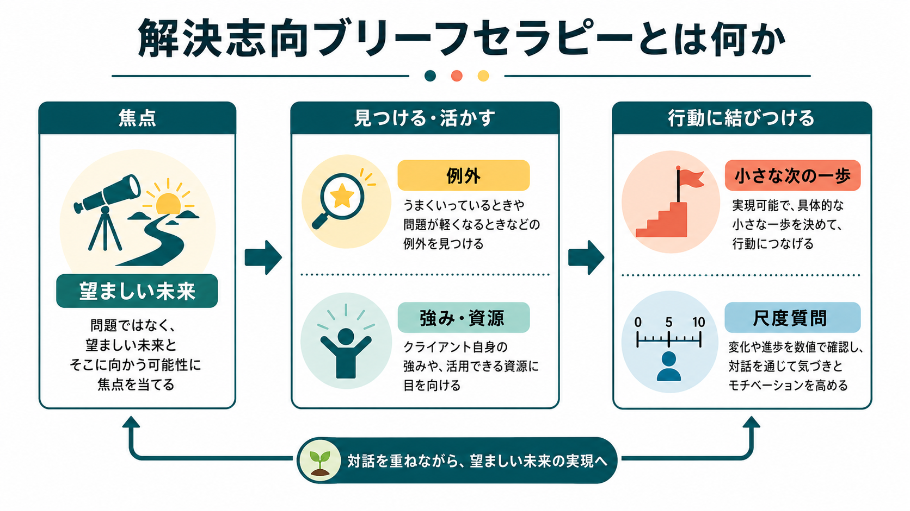
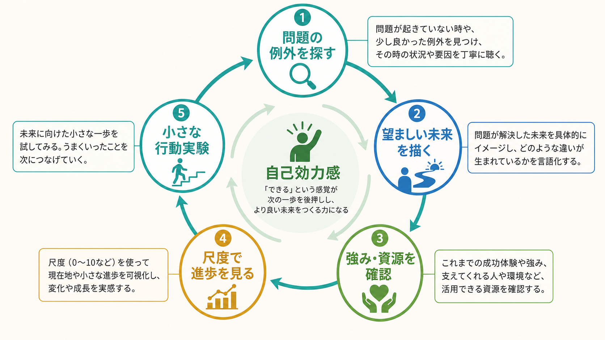
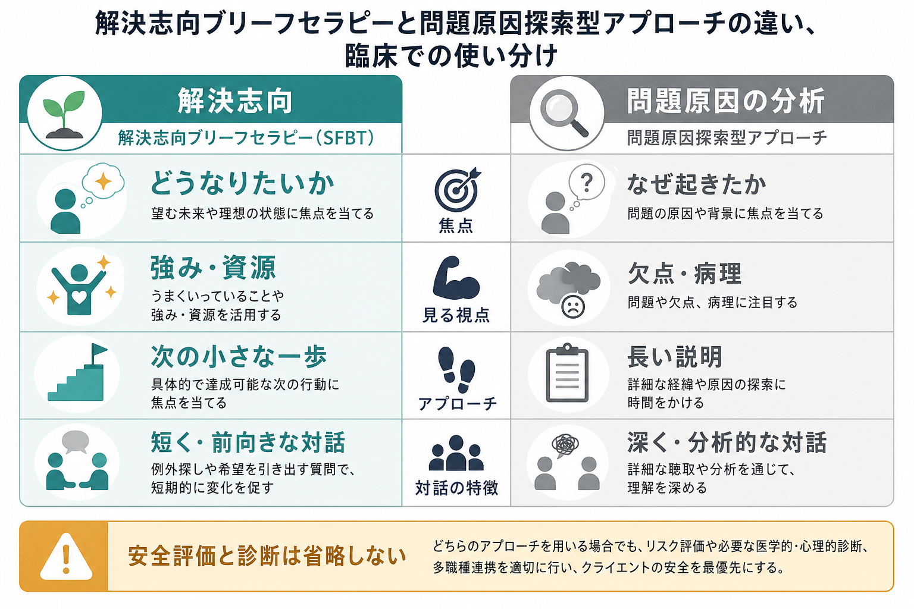

# 解決志向ブリーフセラピーとは何か

## 要点

- 解決志向ブリーフセラピー（solution-focused brief therapy: SFBT）は、問題の原因を長く分析するよりも、「何が望ましい未来か」「すでに少しでもうまくいっている例外は何か」「次にできる小さな一歩は何か」に焦点を当てる短期心理療法である[1][2]。
- 中核は、クライエントの強み・資源・過去の成功を、具体的な目標と行動に変換する対話である[1]。
- 代表的な技法には、ミラクル・クエスチョン、例外質問、スケーリング質問、コーピング質問、コンプリメントがある[1][2]。
- 効果研究は肯定的な知見を示す一方、研究の質、対象集団、比較条件、アウトカムの異質性に注意して読む必要がある[3][4][7]。
- 診断、リスク評価、トラウマ、重症精神症状、生活困窮などを無視して「前向きに考えればよい」と扱う方法ではない。

## この記事で答える問い

1. SFBT は、どのような発想の心理療法なのか。
2. 例外、強み、目標、尺度質問は、何を変えようとしているのか。
3. SFBT のエビデンスはどの程度あるのか。
4. 臨床で使うとき、どのような誤解と限界に注意すべきか。

## まず結論

SFBT は、「なぜ問題が起きたのか」を問わない療法ではない。主な焦点を、「その人が望む生活はどのようなものか」「問題が少しでも弱まる時はいつか」「その時には何が違うのか」「次に 1 点だけ前に進むには何ができるか」に置く療法である[1][2]。

この発想は、[[心理療法とは何か|心理療法]]全体の中では、短期・協働・目標志向・強み志向の実践として位置づけられる。[[認知行動療法CBTとは何か|CBT]]が認知・感情・身体反応・行動の維持循環を検討するのに対し、SFBT は「すでに起きている例外」と「望ましい未来の具体描写」から、変化の足場を作る点に特徴がある。

## 背景

SFBT は、Steve de Shazer、Insoo Kim Berg らが Brief Family Therapy Center の実践を通じて発展させた短期療法である。発展の背景には、家族療法、ブリーフセラピー、社会構成主義的な言語観、治療面接の逐語的観察がある[2]。ただし、SFBT は「理論を覚えてから適用する」よりも、会話の中で何が変化を生むかを観察し、クライエント自身の言葉で解決像を作る実践として整理されてきた[1][2]。

SFBTA の治療マニュアルでは、SFBT はクライエントが望む未来を詳細に描き、その未来にすでに含まれている行動・関係・資源を見つけ、短い面接の中で次の行動を組み立てる方法として説明される[1]。この意味で、SFBT は「原因を否認する療法」ではなく、「原因説明だけでは生活が動かないとき、どこから変化を始められるか」を探す療法である。

## 基本概念

### 望ましい未来

SFBT では、目標は単なる「症状がなくなること」ではなく、生活の中で観察できる変化として表現される。たとえば「不安をなくしたい」だけではなく、「朝、布団から出て、10 分だけ散歩し、職場に遅刻の連絡をせずに向かえる」のように、行動・関係・時間・場所を含めて描く。

この考え方は、[[目標設定は行動をどう変えるのか|目標設定]]とも接続する。曖昧な願望よりも、観察できる行動として目標を小さく定義した方が、本人と支援者が進捗を確認しやすくなる。

### 例外

例外とは、問題が「いつも通り」には起きなかった場面である。落ち込みが強い人にも、少しだけ動けた時間、誰かと話せた場面、怒りが爆発しなかった瞬間、衝動を数分遅らせられた出来事があるかもしれない。SFBT は、その例外を偶然として流さず、「何が違っていたのか」「誰が何をしていたのか」「どうすれば再現しやすいか」と詳しく見る[1]。

例外探索は、問題を軽視することではない。むしろ、問題が強い中でも残っている変化可能性を、臨床的に観察できる材料として扱う。

### 強みと資源

SFBT でいう強みは、性格の長所だけではない。人間関係、過去の成功、習慣、技能、場所、制度、身体感覚、価値観、信仰、趣味、仕事上の経験、これまで耐えてきた工夫なども資源になる。[[動機づけとは何か|動機づけ]]は、本人の価値や目標と結びつくと行動に変わりやすい。SFBT は、こうした資源を「助言」ではなく、本人の語りの中から引き出す。

### 短期性

「ブリーフ」は、雑に短く済ませるという意味ではない。面接の焦点を絞り、変化に関係する会話を優先し、毎回の面接で小さな進展を確認するという意味である[1]。短期であるほど、初期評価、リスク評価、治療同盟、目標の合意が重要になる。

## 仕組み

SFBT の変化メカニズムは単一ではない。少なくとも、次のような経路が想定される。

第一に、注意の焦点が変わる。問題だけを観察していると、失敗、欠陥、原因、再発の証拠が目に入りやすい。SFBT は、例外と望ましい未来を詳しく聞くことで、「問題が少し弱まる条件」へ注意を向ける。

第二に、自己効力感が変わる。クライエントが「自分は何もできていない」と感じているときでも、例外を丁寧に見ると、すでに使っている対処、我慢、調整、依頼、回避しすぎない行動が見つかることがある。これは「できるはずだ」と励ますことではなく、「実際に何をしていたか」を確認する作業である[1][2]。

第三に、行動実験が小さくなる。SFBT は、完璧な解決を一気に目指すよりも、尺度で 1 点だけ上がるための行動を探す。これは[[行動活性化とは何か|行動活性化]]や問題解決的支援とも接点をもつが、SFBT ではとくに本人の言葉で定義された「望ましい未来」に沿って行動を選ぶ。

### 代表的な質問

| 技法 | 典型的な問い | ねらい |
|---|---|---|
| ミラクル・クエスチョン | 「もし問題が解決していたら、明日の朝、最初に何が違うと気づきますか」 | 望ましい未来を具体化する |
| 例外質問 | 「少しでもましだった時は、何が違っていましたか」 | すでに起きている変化を見つける |
| スケーリング質問 | 「0 から 10 で、今はどのあたりですか」 | 進捗、目標、次の一歩を共有する |
| コーピング質問 | 「これだけ大変な中で、どうやって今日まで持ちこたえましたか」 | 耐えてきた力と資源を言語化する |
| コンプリメント | 「その状況で連絡できたのは、かなり大きな工夫ですね」 | 実際の行動に基づいて強みを返す |

## 図解

SFBT を臨床で使うときは、「問題原因の分析」と「解決志向」を二者択一にしないことが重要である。自殺リスク、虐待、精神病症状、重度の物質使用、身体疾患、法的・経済的危機がある場合、評価と安全計画は省略できない。そのうえで、本人が望む生活と小さな変化の手がかりを探す。

## 臨床・研究との接続

SFBT の効果研究は、学校、地域支援、医療、家族支援、物質使用、抑うつ・不安、行動上の問題など、多様な場面で行われてきた。Kim のメタ分析では、SFBT は小さいが肯定的な効果を示し、とくに内在化問題で有意な効果が報告された[3]。ただし、DARE の批判的要約は、単独著者レビュー、研究品質、異質性、バイアスの可能性に注意を促している[3]。

Gingerich と Peterson のシステマティックレビューは、43 件の統制アウトカム研究を整理し、多くの研究で肯定的な結果が報告されたとまとめた[4]。一方で、同レビューに対する DARE の評価は、エビデンスのばらつきが大きく、効果を強く言いすぎるのは慎重であるべきだと指摘している[4]。

医療場面に限定したメタ分析では、強み志向・解決志向の介入が健康関連アウトカムに有益である可能性が示された[5]。また、地域サービスにおけるランダム化研究のメタ分析では、中等度の全体効果が報告されている[6]。ただし、対象、実施者、セッション数、比較条件、測定指標が異なるため、「SFBT はどの問題にも同じように効く」と読むのは不正確である。

2025 年のアンブレラレビューは、複数のシステマティックレビューとメタ分析を統合し、SFBT の有効性に全体として肯定的な傾向を認めつつ、研究の方法論的限界、異質性、アウトカムごとの差を考慮する必要を示している[7]。米国の予防サービス clearinghouse でも、SFBT は強み志向・目標志向のプログラムとして整理されているが、評価は対象集団とアウトカムに依存する[8]。

臨床的には、SFBT は単独療法としてだけでなく、[[ケースフォーミュレーションとは何か|ケースフォーミュレーション]]、CBT、家族支援、医療的治療、福祉的支援と組み合わせて使われることがある。重要なのは、「解決志向」という態度を、評価の省略や苦痛の否認に変えないことである。

## よくある誤解

### 誤解1: 原因を考えない浅い療法である

SFBT は、原因の理解を禁止する療法ではない。面接の焦点を、原因説明だけでなく、変化が起きる条件に広げる療法である。原因理解が安全や治療方針に必要な場合は扱う。ただし、原因が完全にわからない段階でも、小さな改善を始められることがある。

### 誤解2: ポジティブ思考を勧めるだけである

SFBT は「前向きに考えましょう」と言う技法ではない。例外、尺度、行動、他者から見える変化など、観察可能な材料を使う。コンプリメントも、根拠のない称賛ではなく、実際に本人が行った対処に基づいて返す。

### 誤解3: 重い問題には使ってはいけない

重い問題では、SFBT 単独で十分とは限らない。しかし、安全評価、診断、薬物療法、危機介入、福祉支援と併用しながら、本人の資源や望ましい未来を扱うことはありうる。問題は「使うか使わないか」ではなく、どのリスク評価と支援体制の中で、どの範囲に使うかである。

### 誤解4: すぐに効果が出ないと失敗である

短期療法は、短期間で必ず解決するという約束ではない。短い面接で焦点を絞り、変化の手がかりを探すという意味である。改善が乏しい場合は、目標、治療同盟、併存症、生活環境、介入強度、他職種連携を見直す必要がある。

## 関連ノート

- [[心理療法とは何か]]
- [[認知行動療法CBTとは何か]]
- [[行動活性化とは何か]]
- [[ケースフォーミュレーションとは何か]]
- [[目標設定は行動をどう変えるのか]]
- [[動機づけとは何か]]

## 関連ノート候補

- 「家族療法とは何か」
- 「ナラティブセラピーとは何か」
- 「動機づけ面接とは何か」
- 「ミラクル・クエスチョンとは何か」
- 「心理療法における強み志向とは何か」

## MOC更新候補

- `content/00_MOC/MOC｜臨床実践・治療.md`
- `content/00_MOC/MOC｜学習・行動・動機づけ.md`

並列ジョブとの競合を避けるため、本記事では MOC 本体は更新しない。

## 理解チェック

1. SFBT が「問題原因」よりも「例外」と「望ましい未来」を重視する理由を説明できるか。
2. ミラクル・クエスチョン、例外質問、スケーリング質問の違いを説明できるか。
3. 「ポジティブ思考」と SFBT の違いを、観察可能な行動という観点から説明できるか。
4. SFBT を使うときにも、安全評価や診断を省略してはいけない理由を説明できるか。

## 参考文献

[1] Solution Focused Brief Therapy Association. (2013). *Solution Focused Therapy Treatment Manual for Working with Individuals, 2nd Version*. https://www.sfbta.org/SFBT_Revised_Treatment_Manual_2013.pdf

[2] de Shazer, S., Dolan, Y., Korman, H., Trepper, T., McCollum, E., & Berg, I. K. (2021). *More Than Miracles: The State of the Art of Solution-Focused Brief Therapy* (2nd ed.). Routledge. https://www.routledge.com/More-Than-Miracles-The-State-of-the-Art-of-Solution-Focused-Brief-Therapy/deShazer-Dolan-Korman-Trepper-McCollum-Berg/p/book/9780367646417

[3] Kim, J. S. (2008). Examining the effectiveness of solution-focused brief therapy: A meta-analysis. *Research on Social Work Practice*, 18(2), 107-116. https://doi.org/10.1177/1049731507307807 ; DARE critical abstract: https://www.ncbi.nlm.nih.gov/books/NBK75038/

[4] Gingerich, W. J., & Peterson, L. T. (2013). Effectiveness of solution-focused brief therapy: A systematic qualitative review of controlled outcome studies. *Research on Social Work Practice*, 23(3), 266-283. https://doi.org/10.1177/1049731512470859 ; DARE critical abstract: https://www.ncbi.nlm.nih.gov/books/NBK138422/

[5] Zhang, A., Franklin, C., Currin-McCulloch, J., Park, S., & Kim, J. (2018). The effectiveness of strength-based, solution-focused brief therapy in medical settings: A systematic review and meta-analysis of randomized controlled trials. *Journal of Behavioral Medicine*, 41(2), 139-151. https://doi.org/10.1007/s10865-017-9888-1

[6] Franklin, C., Ding, X., Kim, J. S., Zhang, A., Hai, A. H., Jones, K., Nachbaur, M., & O'Connor, A. (2024). Solution-focused brief therapy in community-based services: A meta-analysis of randomized controlled studies. *Research on Social Work Practice*, 34(2), 133-147. https://doi.org/10.1177/10497315231162611

[7] Zak, A. M., & Pekala, K. (2025). Effectiveness of solution-focused brief therapy: An umbrella review of systematic reviews and meta-analyses. *Psychotherapy Research*, 35(7), 1043-1055. https://doi.org/10.1080/10503307.2024.2406540

[8] Administration for Children and Families, Prevention Services Clearinghouse. *Solution-Focused Brief Therapy*. https://preventionservices.acf.hhs.gov/programs/977/show

## 未解決問題

- SFBT のどの要素が、どの対象者・アウトカムに対して最も重要な変化要因なのかは、まだ十分に分解されていない。
- 文化、言語、家族構造、学校・職場・地域資源の違いが、例外探索や目標設定にどう影響するかをさらに検討する必要がある。
- 重症例や複合的困難では、SFBT をどの評価・安全計画・多職種支援と組み合わせると最も有益かが課題である。
