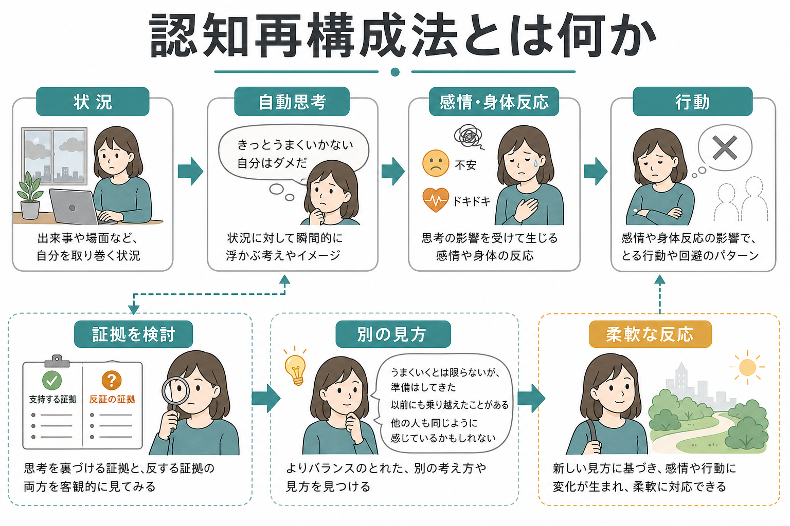
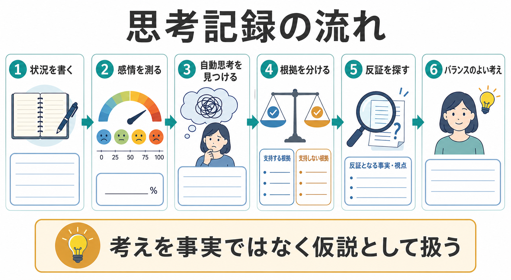

# 認知再構成法とは何か

## 要点

- 認知再構成法は、出来事そのものではなく、出来事への解釈である「自動思考」が感情・身体反応・行動に影響するという認知行動療法の考え方に基づく技法である[1][2]。
- 目的は「ポジティブに考える」ことではなく、考えを事実ではなく仮説として扱い、証拠・反証・別の視点を検討して、よりバランスのよい考え方を作ることである[2][3]。
- 典型的には、状況、感情の強さ、自動思考、支持する根拠、支持しない根拠、代替思考、再評価後の感情を記録する[3]。
- CBT 全体としては、うつ病、不安症、身体症状、ストレス関連問題など幅広い領域で有効性が検討されてきたが、認知再構成法だけを単独の万能技法として扱うのは不正確である[4][5]。
- 臨床では、[[ケースフォーミュレーションとは何か]]、行動実験、曝露、[[行動活性化とは何か]]などと組み合わせ、本人の文脈に合わせて使う。

## この記事で答える問い

1. 認知再構成法は何を変えようとする技法なのか。
2. 自動思考、認知の偏り、代替思考はどう関係するのか。
3. 思考記録はどのような順序で使うのか。
4. 臨床・研究上、どこまで根拠があり、どこに限界があるのか。

## まず結論

認知再構成法は、つらい感情を引き起こす考えを「間違い」と決めつけて訂正する技法ではない。むしろ、自動的に浮かんだ解釈を一度紙面や対話の上に取り出し、「どの証拠があるか」「別の説明はありうるか」「大切な人が同じ状況なら何と言うか」と検討する方法である[2][3]。その結果、最初の考えよりも広く、柔軟で、行動につながりやすい考え方を作る。

## 背景

認知再構成法は、Aaron T. Beck らの認知療法と、その後の認知行動療法の中核技法として発展した。Beck らは、抑うつなどの苦痛が、状況そのものだけでなく、自己・世界・将来についての否定的な解釈や信念により維持されると考えた[1]。この考え方は、感情、身体反応、行動、環境を相互に扱う CBT の枠組みに組み込まれている[2][4]。

ただし、認知再構成法は、個人の苦痛を「考え方の問題」に還元するためのものではない。実際の喪失、貧困、差別、暴力、身体疾患、職場環境など、現実の負荷がある場合には、それを過小評価せず、環境調整・支援資源・安全確保と並行して扱う必要がある。

## 基本概念

### 自動思考

自動思考とは、ある状況で瞬間的に浮かぶ言葉、イメージ、予測、自己評価である。たとえば、発表前に「失敗したら終わりだ」、返信が来ないときに「嫌われたに違いない」と浮かぶ考えがこれにあたる。自動思考は速く、もっともらしく感じられるため、本人には「考え」ではなく「現実そのもの」に見えやすい[2]。

### 認知の偏り

認知の偏りは、情報の取り入れ方や意味づけに生じる一定の傾向である。代表例には、破局視、全か無か思考、過度の一般化、心の読みすぎ、感情的決めつけなどがある。これらは誰にでも起こるが、ストレスが高いときや抑うつ・不安が強いときには、[[認知バイアスとは何か]]として働き、気分と行動の悪循環を強めることがある[2][3]。

### 代替思考

代替思考は、単なる楽観的な言い換えではない。支持する根拠と支持しない根拠の両方を見たうえで、「より正確で、役に立ち、今の行動選択を広げる考え」を作る。たとえば「絶対に失敗する」を「不安は強いが、準備した部分もある。うまくいかない箇所があっても、質問に戻れば立て直せる」と組み直す。

## 仕組み

認知再構成法の仕組みは、考えを直接消すことではなく、思考と距離を取ることにある。自動思考を記録すると、本人は「私はダメだ」という結論から少し離れて、「私はいま『自分はダメだ』という考えを持っている」と観察できる。この距離ができると、考えを証拠に照らして検討しやすくなる。

実際の思考記録では、次の順序をとることが多い[3]。

| 段階 | 見るポイント | 例 |
|---|---|---|
| 状況 | いつ、どこで、何が起きたか | 会議で質問された |
| 感情 | 感情名と強さ | 不安 80%、恥 70% |
| 自動思考 | 頭に浮かんだ言葉やイメージ | 「答えられないと無能だと思われる」 |
| 根拠 | その考えを支持する事実 | すぐに答えられない質問があった |
| 反証 | その考えに合わない事実 | 後で資料を示して回答できた |
| 代替思考 | 両方を踏まえた考え | 「すぐ答えられないことはあるが、確認して返答できる」 |
| 再評価 | 感情の変化と次の行動 | 不安 50%、次回は資料を準備する |

## 図解

1枚目の図は、状況、自動思考、感情・身体反応、行動がどのように結びつき、認知再構成法がその中の「解釈」を検討する技法であることを示している。2枚目の図は、思考記録を使った実践の流れを示している。

重要なのは、図の矢印が一方向の因果だけを意味しない点である。行動が変わると新しい経験が得られ、その経験が自動思考や信念に戻って影響する。したがって、認知再構成法は、[[認知的柔軟性とは何か]]を高める対話的・実験的プロセスとして理解するとよい。

## 臨床・研究との接続

CBT は、複数の精神健康上の問題に対して研究されており、メタ分析レビューでは不安症、身体症状、過食、怒り、ストレスなどで比較的強い根拠が報告されている[4]。うつ病に対しても、近年の大規模メタ分析で CBT の有効性が検討されており、待機や通常ケアなどとの比較で効果が示される一方、研究間の異質性や出版バイアス、比較条件の違いに注意が必要である[5]。

ガイドライン上も、成人うつ病では重症度や本人の希望に応じて心理療法、薬物療法、支援的介入などを選択肢として提示することが重視され、CBT はその主要な心理療法のひとつに位置づけられている[6]。社交不安症では、Clark and Wells 型 CBT や Heimberg 型 CBT など、障害特異的な CBT が推奨されている[7]。

臨床では、認知再構成法を「面接室で納得したら終わり」にしないことが重要である。思考記録や宿題を通じて日常場面で試すことは、CBT の効果を支える要素のひとつとされる[8]。ただし、宿題は罰や評価ではなく、本人が扱える大きさに調整された共同実験として設計する必要がある。

## よくある誤解

### 「ポジティブ思考に変える技法」である

認知再構成法は、否定的な考えを無理に明るく置き換える技法ではない。根拠がある心配や怒りを消すのではなく、過度に狭くなった解釈を広げる。

### 「考え方が悪いから症状が出る」と説明する

これは不適切である。苦痛は、身体状態、生活史、対人関係、社会環境、神経生物学的要因などの相互作用で生じる。認知再構成法は、その中で変化可能な一部として「解釈と行動の連鎖」を扱う。

### 「正しい答えを治療者が教える」

認知再構成法では、治療者が本人の考えを論破するのではなく、ソクラテス式質問や共同検証を通じて本人が別の見方を見つける。治療者の役割は、説得よりも、問いの設計と安全な検討の支援である[2]。

### 「重い問題には使えない」

単独で十分とは限らないが、重い抑うつ、不安、トラウマ関連症状、身体疾患併存などでも、適切な評価、安全確保、治療計画の一部として使われることがある[4][6]。一方で、急性の自殺危機、精神病症状の増悪、強い解離、重い認知機能障害などがある場合には、優先順位と導入方法を慎重に考える。

## 関連ノート

- [[認知バイアスとは何か]]
- [[認知的柔軟性とは何か]]
- [[行動活性化とは何か]]
- [[ケースフォーミュレーションとは何か]]
- [[DBTのマインドフルネススキルとは何か]]

## MOC更新候補

- `content/00_MOC/` 配下に心理療法または臨床実践の MOC がある場合、バッチ統合時に本記事へのリンクを追加する。
- 並列実行との衝突を避けるため、このタスクでは MOC ファイルを直接更新しない。

## 理解チェック

1. 自動思考と事実はどのように区別できるか。
2. 認知再構成法が「ポジティブ思考」と異なる点は何か。
3. 思考記録で、支持する根拠だけでなく反証も書く理由は何か。
4. 認知再構成法を使うとき、環境要因や安全確保を軽視してはいけないのはなぜか。

## 未解決問題

- どの症状・文脈で、認知再構成法、行動実験、曝露、マインドフルネス、行動活性化のどれを優先すべきかは、個別のケースフォーミュレーションに依存する。
- 認知再構成法のどの要素が変化を媒介するのか、技法固有効果と治療関係・期待・行動変化の寄与をどう分けるかは、研究上なお検討が続いている。
- デジタル CBT やセルフヘルプで思考記録を使う場合、どの程度の支援があれば継続と安全性が高まるかは実装上の課題である。

## 参考文献

[1] Beck, A. T., Rush, A. J., Shaw, B. F., Emery, G., DeRubeis, R. J., & Hollon, S. D. (2024). *Cognitive Therapy of Depression* (2nd ed.). Guilford Press. First edition originally published in 1979. https://www.guilford.com/books/Cognitive-Therapy-of-Depression/Beck-Rush-Shaw-Emery/9781572305823

[2] Beck, J. S. (2021). *Cognitive Behavior Therapy: Basics and Beyond* (3rd ed.). Guilford Press/Routledge. https://www.routledge.com/Cognitive-Behavior-Therapy-Third-Edition-Basics-and-Beyond/Beck/p/book/9781462544196

[3] NHS. (n.d.). *Thought record*. Every Mind Matters. https://www.nhs.uk/every-mind-matters/mental-wellbeing-tips/self-help-cbt-techniques/thought-record/

[4] Hofmann, S. G., Asnaani, A., Vonk, I. J. J., Sawyer, A. T., & Fang, A. (2012). The efficacy of cognitive behavioral therapy: A review of meta-analyses. *Cognitive Therapy and Research, 36*(5), 427-440. https://doi.org/10.1007/s10608-012-9476-1

[5] Cuijpers, P., Miguel, C., Harrer, M., Plessen, C. Y., Ciharova, M., Ebert, D., & Karyotaki, E. (2023). Cognitive behavior therapy vs. control conditions, other psychotherapies, pharmacotherapies and combined treatment for depression: A comprehensive meta-analysis including 409 trials with 52,702 patients. *World Psychiatry, 22*(1), 105-115. https://doi.org/10.1002/wps.21069

[6] National Institute for Health and Care Excellence. (2022). *Depression in adults: treatment and management* (NICE guideline NG222). https://www.nice.org.uk/guidance/ng222

[7] National Institute for Health and Care Excellence. (2013). *Social anxiety disorder: recognition, assessment and treatment* (Clinical guideline CG159). https://www.nice.org.uk/guidance/cg159

[8] Kazantzis, N., Whittington, C. J., & Dattilio, F. M. (2010). Meta-analysis of homework effects in cognitive and behavioral therapy: A replication and extension. *Clinical Psychology: Science and Practice, 17*(2), 144-156. https://doi.org/10.1111/j.1468-2850.2010.01204.x
