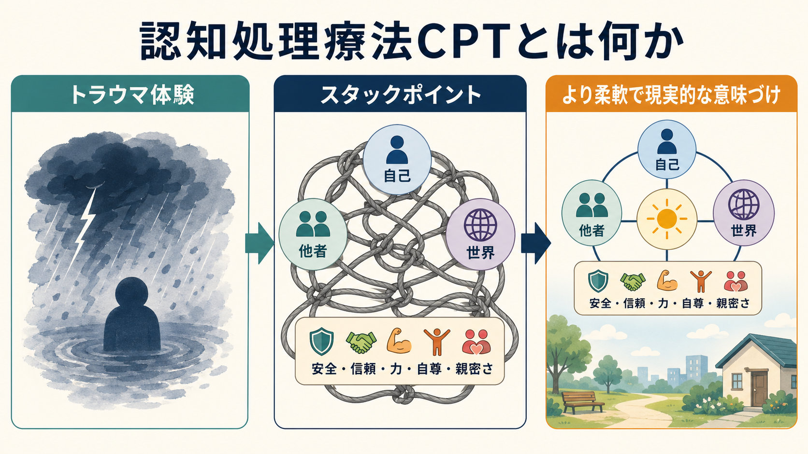
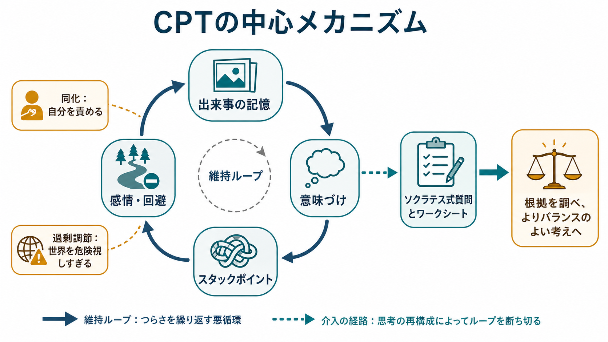
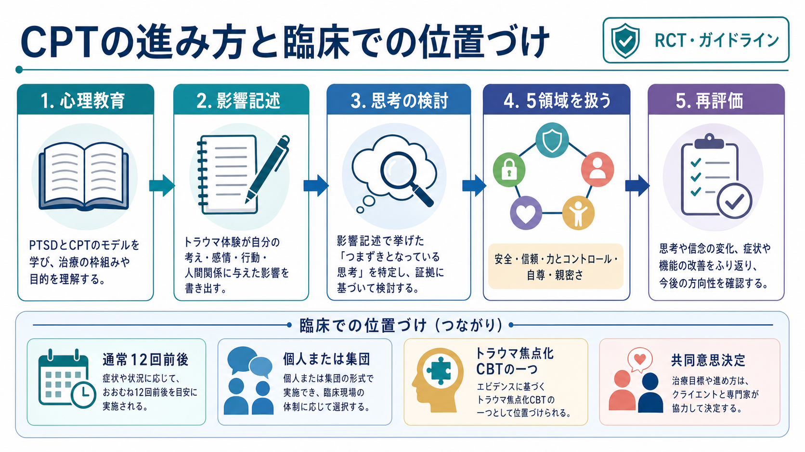

# 認知処理療法CPTとは何か

## 要点

- 認知処理療法（Cognitive Processing Therapy: CPT）は、[[PTSDとは何か|PTSD]]に対するトラウマ焦点化心理療法の一つであり、トラウマ体験そのものよりも、体験後に固定化した「自分・他者・世界への意味づけ」を扱う。
- 中心概念は「スタックポイント」である。これは「自分のせいだ」「誰も信じられない」「世界は完全に危険だ」のように、回復を妨げる硬い信念や解釈を指す[1][2]。
- CPTは、スタックポイントを見つけ、証拠を吟味し、より柔軟で現実的な考えへ調整する治療である。単なるポジティブ思考ではなく、[[認知再構成法とは何か|認知再構成]]とソクラテス式質問を用いた共同作業である[1][3]。
- 主要ガイドラインでは、CPTはPTSDに対する第一選択級の心理療法として扱われる。VA/DoD 2023ガイドラインは、CPT、[[曝露療法とは何か|持続エクスポージャー]]、EMDRなどを強く推奨される心理療法として整理している[4]。
- 本記事は教育・研究目的の概説であり、個別の診断や治療適応を判断するものではない。実施には訓練を受けた専門家による評価、同意、安全確認、共同意思決定が必要である。

## この記事で答える問い

1. CPTは、PTSDの何を治療対象にしているのか。
2. 「スタックポイント」「同化」「過剰調節」「適応的調節」とは何か。
3. CPTは、通常どのような流れで進むのか。
4. 研究・ガイドライン上、CPTはどの程度支持されているのか。
5. CPTを理解するとき、どのような誤解に注意すべきか。

## まず結論

CPTは、トラウマ後に生じた苦痛を「記憶を消す」「出来事を忘れる」ことで解決しようとする治療ではない。むしろ、トラウマ体験によって揺らいだ信念体系を、治療者と本人が一緒に点検する治療である。たとえば「自分が悪かった」「どこにいても危険だ」「親しい人を信じると必ず傷つく」といった考えが、回避、罪悪感、恥、過覚醒、対人困難を維持している場合、その考えの根拠と反証を検討し、より正確で広い意味づけへ調整していく[1][2]。

## 背景

PTSDでは、侵入的な記憶、回避、気分・認知の陰性変化、過覚醒が組み合わさり、生活機能や対人関係が損なわれる。CPTは、このうち特に「トラウマ後の認知と信念の変化」に焦点を当てる。これは[[認知行動療法CBTとは何か|認知行動療法CBT]]の系譜に属するが、一般的な認知再構成をPTSDにそのまま当てはめるのではなく、トラウマ体験後の自己責任感、恥、信頼、安全、力とコントロール、自尊、親密さを体系的に扱う点に特徴がある[1][3]。

CPTは、もともと性的暴力被害後の慢性PTSDを対象に検証され、その後、退役軍人、軍人、対人暴力被害者、さまざまな文化圏や臨床設定で研究が広がった。初期のRCTでは、CPTと持続エクスポージャーはいずれも最小注意条件よりPTSD症状と抑うつを改善し、CPTは罪悪感の一部指標で優位性を示した[5]。その後の構成要素研究では、認知的要素が中核的な変化に重要であることが示唆されている[6]。

## 基本概念

### スタックポイント

スタックポイントとは、トラウマからの自然な回復を妨げる硬直した考えである。出来事についての事実そのものではなく、「それは自分が弱かったからだ」「自分は汚れている」「誰も信用できない」「世界は完全に危険だ」のような意味づけである。CPTでは、スタックポイントを記録し、事実、解釈、感情、行動を区別しながら検討する[1][2]。

### 同化・過剰調節・適応的調節

CPTの理論では、トラウマ後の意味づけには大きく三つの方向がある。第一に「同化」は、出来事を既存の信念に無理に合わせることで、典型例は「悪いことが起きたのだから、自分に落ち度があったはずだ」という自己責任化である。第二に「過剰調節」は、トラウマ情報をもとに信念全体を極端に変えることで、「一人の加害者がいた」から「すべての人は危険だ」と一般化するような形をとる。第三に「適応的調節」は、事実を否認せず、同時に過度に一般化しない、よりバランスのよい信念更新である[1][3]。

### 5つの信念領域

CPTでは、後半に「安全」「信頼」「力とコントロール」「自尊」「親密さ」という5領域を重点的に扱う。これは、トラウマが単一の恐怖記憶だけでなく、生活全体を支える信念体系に影響しうるためである[1][3]。この構造により、CPTは症状低減だけでなく、対人関係、自己評価、日常生活の再構築にも接続しやすい。

## 仕組み

CPTの中心的な変化メカニズムは、回避によって固定化した意味づけを、言語化・記録・検討を通して更新することである。本人は「影響記述」やワークシートを用い、トラウマが自分の考え、感情、行動、人間関係に与えた影響を整理する。治療者は、断定的に「正しい考え」を教えるのではなく、ソクラテス式質問によって、根拠、反証、別の説明、考えの有用性を一緒に検討する[1][3]。

重要なのは、CPTが「感情を消す」治療ではない点である。罪悪感、怒り、悲しみ、恐怖は、出来事の意味づけと結びついている。たとえば、同じ恐怖でも「今ここも危険だ」という現在の脅威判断と、「あの時は危険だったが、今は違う」という判断では、行動の幅が異なる。CPTは、感情を否定せず、その背後にある考えを見える形にして、現実に照らして調整する[1][2]。

## 図解

CPTの典型的な流れは、心理教育、影響記述、思考の検討、5領域の作業、再評価という順で理解できる。標準的には12回前後のプロトコルとして説明されるが、現在の実践では症状変化や臨床的必要に応じて回数を調整する考え方も示されている[1][3]。

## 臨床・研究との接続

CPTは、PTSDに対するエビデンスに基づく[[心理療法とは何か|心理療法]]の代表例である。VA National Center for PTSDは、CPTをPTSDに対するトラウマ焦点化心理療法として説明し、個人形式・集団形式のいずれでも実施可能だが、臨床判断と本人の選好が重要であると整理している[1][2]。また、CPTにはトラウマ記述を含む形式と、認知的作業を中心にする形式があり、現在のマニュアルでは本人と治療者が必要性を検討して選択する形が説明されている[1][3]。

研究面では、AHRQの系統的レビュー更新は、成人PTSDに対する心理療法・薬物療法を広く比較し、CPTについてPTSD症状、抑うつ症状、PTSD診断喪失に対する中等度のエビデンスを報告している[7]。VA/DoD 2023ガイドラインも、治療選択においてCPTを含むトラウマ焦点化心理療法を重視し、薬物療法や補完的介入より優先される場面が多いことを示す[4]。ただし、どの治療が最適かは、症状、リスク、併存症、本人の価値観、アクセス、文化的背景によって変わる。

## よくある誤解

### 誤解1: CPTは「出来事を前向きに考える」訓練である

CPTはポジティブ思考の訓練ではない。むしろ、考えを「事実」「推測」「自己責任化」「過度の一般化」に分け、根拠に照らしてより正確にする作業である[1][3]。苦痛を軽く見積もるのではなく、出来事の重大さを認めながら、過剰な自己非難や世界全体への一般化をゆるめる。

### 誤解2: CPTでは必ずトラウマの詳細を長く語らなければならない

CPTではトラウマが自分に与えた影響を書くが、詳細なトラウマ記述を含めるかどうかは形式によって異なる。近年の説明では、認知的作業を中心にしたCPTと、記述を含むCPT+Aを区別し、本人と治療者が協働して選ぶことが強調される[1][3]。

### 誤解3: CPTは曝露療法と無関係である

CPTは[[曝露療法とは何か|曝露療法]]と同じではないが、トラウマ関連の思考・感情・記憶を避けずに扱う点では、回避を減らす治療である。持続エクスポージャーが恐怖記憶への計画的接近を中心にするのに対し、CPTは意味づけと信念の更新を中心にする。

### 誤解4: マニュアル通りに進めれば誰にでも同じように使える

CPTは構造化された治療だが、機械的な手順ではない。自殺リスク、解離、物質使用、対人安全、生活環境、文化的背景、治療への準備性を評価し、必要に応じて安定化、危機対応、他治療との組み合わせを検討する必要がある。ガイドラインも、治療選択は臨床判断と共同意思決定を置き換えるものではないと明記している[4]。

## 関連ノート

- [[PTSDとは何か]]
- [[心理療法とは何か]]
- [[認知行動療法CBTとは何か]]
- [[認知再構成法とは何か]]
- [[曝露療法とは何か]]
- [[EMDRとは何か]]

MOC更新候補: `content/00_MOC/` 配下の臨床実践・心理療法・トラウマ関連MOCがある場合、バッチ統合時に本記事へのリンク追加を検討する。

## 理解チェック

1. CPTでいうスタックポイントは、出来事そのものではなく、どのようなものを指すか。
2. 「同化」と「過剰調節」は、それぞれどのようにPTSD症状を維持しうるか。
3. CPTが扱う5つの信念領域を挙げられるか。
4. CPTと曝露療法は、どこが重なり、どこが異なるか。
5. CPTを個別の治療として検討するとき、なぜ共同意思決定と安全評価が必要か。

## 未解決問題

- どの患者特性、トラウマ種別、併存症がCPTへの反応性を予測するかについては、まだ十分に確立していない[7]。
- CPT、持続エクスポージャー、EMDR、薬物療法、複合介入の最適な選択順序や組み合わせには、直接比較研究がさらに必要である[4][7]。
- テレヘルス、集中型CPT、文化適応、通訳を介した実施など、実装研究の蓄積が今後の課題である[1][3]。

## 参考文献

[1] Galovski, T. E., Norman, S. B., & Hamblen, J. L. Cognitive Processing Therapy for PTSD. PTSD: National Center for PTSD. https://www.ptsd.va.gov/professional/treat/txessentials/cpt_for_ptsd_pro.asp

[2] PTSD: National Center for PTSD. Cognitive Processing Therapy (CPT) for PTSD. https://www.ptsd.va.gov/understand_tx/cognitive_processing.asp

[3] Resick, P. A., Monson, C. M., & Chard, K. M. (2024). *Cognitive Processing Therapy for PTSD: Second Edition: A Comprehensive Therapist Manual*. Guilford Press. https://www.guilford.com/books/Cognitive-Processing-Therapy-for-PTSD/Resick-Monson-Chard/9781462554270

[4] U.S. Department of Veterans Affairs & Department of Defense. (2023). *VA/DoD Clinical Practice Guideline for Management of Posttraumatic Stress Disorder and Acute Stress Disorder*. https://www.healthquality.va.gov/guidelines/mh/ptsd/

[5] Resick, P. A., Nishith, P., Weaver, T. L., Astin, M. C., & Feuer, C. A. (2002). A comparison of cognitive-processing therapy with prolonged exposure and a waiting condition for the treatment of chronic posttraumatic stress disorder in female rape victims. *Journal of Consulting and Clinical Psychology, 70*(4), 867-879. https://doi.org/10.1037//0022-006x.70.4.867

[6] Resick, P. A., Galovski, T. E., Uhlmansiek, M. O., Scher, C. D., Clum, G. A., & Young-Xu, Y. (2008). A randomized clinical trial to dismantle components of cognitive processing therapy for posttraumatic stress disorder in female victims of interpersonal violence. *Journal of Consulting and Clinical Psychology, 76*(2), 243-258. https://doi.org/10.1037/0022-006X.76.2.243

[7] Forman-Hoffman, V., Middleton, J. C., Feltner, C., et al. (2018). *Psychological and Pharmacological Treatments for Adults With Posttraumatic Stress Disorder: A Systematic Review Update*. Agency for Healthcare Research and Quality. https://doi.org/10.23970/AHRQEPCCER207
