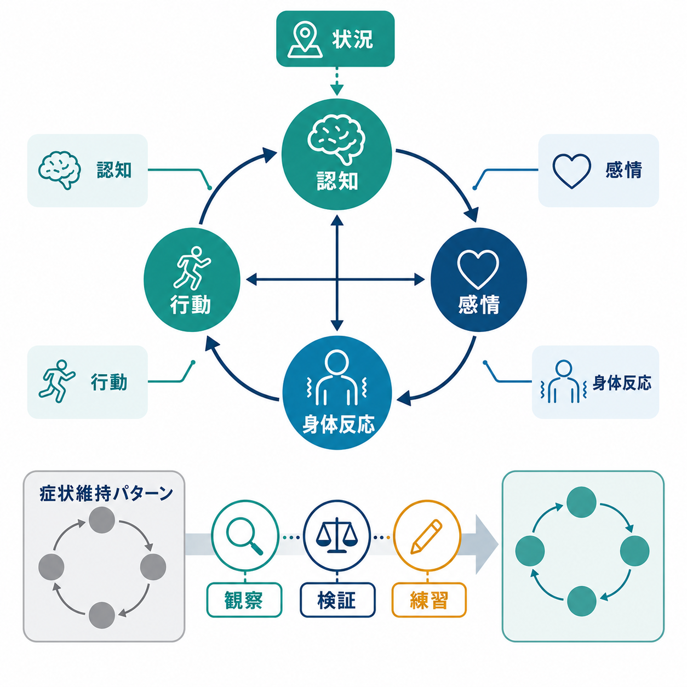
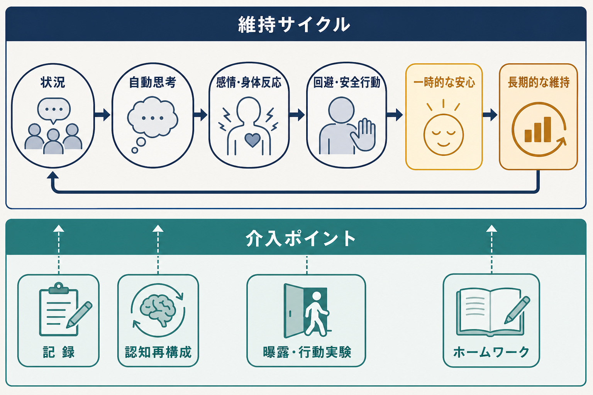

# 認知行動療法CBTとは何か

## 要点

- 認知行動療法（cognitive behavioral therapy: CBT）は、状況そのものだけでなく、その状況をどう解釈し、どのように行動するかが、感情・身体反応・生活機能に影響するという見方に基づく心理療法である[1][2]。
- CBT は「前向きに考える訓練」ではない。自動思考、信念、回避、安全行動、生活リズムなどを観察し、現実に照らして検証し、より機能的な行動を練習する構造化された治療である[2][3]。
- うつ、不安症、パニック症、強迫症、不眠、摂食症状、慢性疼痛など、多様な問題に応用されてきた。効果の強さは対象疾患、介入形式、治療者訓練、併存症、脱落率によって異なる[4][5]。
- 臨床では、診断名だけでなく「何が症状を維持しているか」という個別のケースフォーミュレーションが重要になる。これは [[5Pモデルとは何か]] と接続して理解できる。

## この記事で答える問い

1. CBT はどのような心理療法なのか。
2. 認知・感情・身体反応・行動は、どのように症状維持に関わるのか。
3. 認知再構成、行動実験、曝露、ホームワークは何を変えようとしているのか。
4. CBT の有効性を読むとき、どのような限界と注意点を見ればよいのか。

## まず結論

CBT は、困りごとを「本人の性格」や「気の持ちよう」に還元せず、状況、認知、感情、身体反応、行動が互いに影響し合う循環として捉える。治療では、その循環のどこに介入すれば生活機能が回復しやすいかを、治療者とクライエントが共同で仮説化する[1][2]。

たとえば不安では、「危険だ」と感じる自動思考、動悸や緊張、回避や安全行動が短期的な安心をもたらす一方で、長期的には「避けなければ耐えられない」という学習を強めることがある。CBT はこの循環を、記録、認知再構成、曝露、行動実験、問題解決、スキル練習などで少しずつ変えていく[2][3]。

## 背景

CBT は、行動療法の学習理論と、Aaron T. Beck らの認知療法を背景に発展した。現在の CBT は単一の技法名というより、認知的介入と行動的介入を組み合わせる治療ファミリーとして理解したほうがよい[1][6][7]。

基本姿勢は、現在の問題に焦点を当て、目標を明確にし、セッションを構造化し、面接内外の練習を通じて変化を促すことである[2][3][8]。ただし「過去を扱わない」という意味ではない。発達歴、対人関係、トラウマ、文化的背景、社会的条件は、信念や回避パターンを理解するために重要であり、必要に応じてケースフォーミュレーションに含める。

## 基本概念

### 認知

認知とは、状況に対する解釈、評価、予測、イメージ、記憶の呼び出され方を含む。CBT では、とくに瞬間的に浮かぶ「自動思考」と、より持続的な「中核信念」「スキーマ」を区別する[1]。

重要なのは、認知を「間違っている考え」と決めつけることではない。治療では、証拠、代替解釈、有用性、行動への影響を一緒に検討する。思考の内容を現実的に評価し直すこともあれば、「その考えが出ても行動を選べる」ように距離を取ることもある。後者は [[ACTとは何か]] や [[DBTのマインドフルネススキルとは何か]] とも接続する。

### 感情・身体反応

不安、抑うつ、怒り、恥、罪悪感などの感情は、身体反応と結びついて現れる。動悸、息苦しさ、筋緊張、疲労、睡眠変化などは、脅威評価や回避行動をさらに強めることがある[2][3]。

CBT は感情を消すことを目標にしない。感情を合図として読み取り、強度、持続、誘因、身体反応、行動との関係を観察し、感情に巻き込まれすぎずに必要な行動を選べるようにする。

### 行動

行動には、実際に行うことだけでなく、避けること、確認すること、先延ばしすること、過剰に準備すること、安心材料を探すことも含まれる。これらは短期的には苦痛を下げるが、長期的には症状維持に関わる場合がある[2][3]。

うつでは活動低下が気分の落ち込みを維持し、不安では回避や安全行動が恐怖の予測を検証する機会を奪う。強迫症では確認や洗浄などの儀式が一時的安心をもたらす一方で、脅威予測を固定することがある。

## 仕組み

CBT の中核は、症状を維持する循環を見つけ、その循環の一部を変えることで全体の変化を起こす点にある。

### 1. 記録で循環を見える化する

最初の介入は、困りごとを抽象的な「つらい」から、観察可能なパターンに分解することである。状況、自動思考、感情、身体反応、行動、結果を記録すると、「何がきっかけで、何が続き、何が短期的に効いているが長期的に困りごとを残しているか」が見えやすくなる[3]。

### 2. 認知再構成で解釈の幅を広げる

認知再構成では、自動思考を取り出し、根拠、反証、別の見方、最悪・最良・現実的見積もり、友人に同じことが起きたらどう言うか、といった問いを使う。目的は「ポジティブ思考」ではなく、苦痛を増幅している解釈を検証可能な形にし、より現実的で役に立つ考え方を作ることである[1][2]。

### 3. 行動実験で予測を検証する

行動実験は、「人前で少し詰まったら皆に軽蔑される」「メールをすぐ返さなければ関係が壊れる」などの予測を、現実の小さな実験として検証する方法である。結果が予測と異なる場合、認知が変わる。予測が一部当たった場合でも、対処可能性や許容可能性を学べる。

### 4. 曝露で回避の学習を変える

曝露は、不安や恐怖を引き起こす状況に段階的に近づき、回避や安全行動を減らしながら新しい学習を作る方法である。不安を無理に消すのではなく、「不安があっても耐えられる」「予測した破局は起きない、または起きても対処できる」という経験を積む[3][5]。

### 5. ホームワークで面接外の生活に移す

CBT では面接内で話すだけでなく、記録、活動計画、行動実験、曝露練習、問題解決、睡眠・生活リズムの調整などを、面接外で試すことが多い。APA の解説でも、CBT は本人が自分の治療者になれるよう、セッション内外の練習を重視すると説明されている[2]。

## 図解

上の 2 つの図は、CBT を次のように読むための補助である。

| 図 | 読み方 |
|---|---|
| 概念地図 | 状況、認知、感情、身体反応、行動が一方向ではなく相互作用することを示す。 |
| 維持サイクル | 回避や安全行動が短期的には安心をもたらすが、長期的には症状維持に関わることを示す。 |

図を臨床で使う場合は、一般論として見せるだけでなく、本人の実際のエピソードに置き換える必要がある。「昨日の会議」「寝る前の反すう」「電車に乗る場面」など、具体的な状況で書くほど、介入点が明確になる。

## 臨床・研究との接続

### うつ病

NICE の成人うつ病ガイドラインでは、うつ病の重症度や希望に応じて、個人 CBT、グループ CBT、行動活性化、問題解決療法、対人関係療法、薬物療法などが選択肢として整理されている[4]。CBT は、活動低下、否定的自動思考、反すう、回避、睡眠リズムの乱れなどを扱う。

ただし、うつ病の治療選択は症状の重症度、自殺リスク、精神病症状、双極性障害の可能性、身体疾患、薬物療法の適応、本人の希望によって変わる。教育・研究目的の記事であり、個別の診断や治療指示として読まない。

### 不安症・パニック症

NICE の全般不安症・パニック症ガイドラインでは、段階的ケアの中で、低強度の自助・心理教育から、高強度 CBT や薬物療法までが位置づけられている[5]。パニック症では、身体感覚への破局的解釈、予期不安、広場恐怖、回避、安全行動を扱うことが多い。

### 第三世代CBTとの関係

CBT からは、マインドフルネス認知療法、弁証法的行動療法、アクセプタンス&コミットメント・セラピーなども発展した[6]。これらは、思考内容を変えるだけでなく、思考との関係、価値に沿った行動、感情調整、対人スキルなどを重視する。関連ノートとして [[ACTとは何か]]、[[弁証法的行動療法DBTとは何か]]、[[DBTの対人関係スキルとは何か]] を参照できる。

### エビデンスを読むときの注意

Hofmann らのメタ分析レビューは、CBT が多くの問題に応用され、全体として強いエビデンス基盤をもつと整理している一方で、対象疾患やサブグループによって研究の厚みが異なることも示している[6]。したがって「CBT は効くか」という問いは粗すぎる。より正確には、「どの問題に、どの形式の CBT を、誰が、どの程度の訓練・スーパービジョンのもとで、どの比較条件に対して行ったか」を見る必要がある。

## よくある誤解

### 誤解1: CBT はポジティブ思考である

CBT は、つらい考えを明るい考えに置き換える技法ではない。自動思考や信念を、証拠、文脈、行動結果に照らして検証する治療である。悲しみ、怒り、不安が妥当な状況では、それらの感情を否定しない。

### 誤解2: CBT はマニュアル通りに進めればよい

CBT には構造化されたプロトコルがあるが、実際には個別化が不可欠である。治療者は診断、発達歴、文化、価値、生活環境、併存症、治療同盟を踏まえてケースフォーミュレーションを更新する[1][3]。

### 誤解3: CBT は過去や関係性を扱わない

CBT は現在の問題維持要因を重視するが、過去の経験や関係性を無視しない。過去の経験が中核信念や安全行動に影響しているなら、治療上重要な情報になる。

### 誤解4: ホームワークは宿題をこなすことが目的である

ホームワークの目的は、治療室の理解を生活場面に移すことである。量をこなすことではなく、仮説を検証し、失敗も含めて次の面接材料にすることが重要である。

## 関連ノート

- [[5Pモデルとは何か]]: CBT のケースフォーミュレーションを整理する枠組みとして有用。
- [[ACTとは何か]]: 思考内容の修正だけでなく、思考との距離、価値に沿った行動を扱う比較対象。
- [[DBTのマインドフルネススキルとは何か]]: 感情や思考への気づき方を理解する補助線。
- [[弁証法的行動療法DBTとは何か]]: 感情調整と行動選択をつなぐ関連領域。
- [[DSMとICDは何が違うのか]]: 診断分類と心理療法の関係を考えるときの背景知識。

### MOC更新候補

- `content/00_MOC/` 配下の臨床実践・心理療法系 MOC があれば、本記事へのリンク追加候補。
- 並列ジョブとの競合を避けるため、本タスクでは MOC 本体は更新しない。

### 今後の作成候補

- 認知再構成とは何か
- 行動活性化とは何か
- 曝露療法とは何か
- 安全行動とは何か
- CBTにおけるケースフォーミュレーションとは何か

## 理解チェック

1. CBT でいう「認知」は、単なる意識的な考えだけでなく、どのような要素を含むか。
2. 回避や安全行動は、なぜ短期的には役立つのに長期的には症状維持に関わることがあるのか。
3. 認知再構成と行動実験は、どちらも「考えを変える」介入だが、検証の仕方はどう違うか。
4. CBT のエビデンスを読むとき、疾患名以外に確認すべき条件は何か。

## 未解決問題

- どの症状・問題に対して、認知的介入、行動的介入、曝露、マインドフルネス、対人スキル訓練のどれが主要な変化機序なのかは、対象ごとに検討が必要である。
- デジタル CBT、低強度 CBT、集団 CBT、文化適応 CBT では、効果、脱落、治療同盟、アクセシビリティのバランスが異なる。
- 重度・複雑例、併存症、社会的逆境を抱える人への CBT は、標準プロトコルだけでなく、多職種支援や環境調整との統合が重要になる。

## 参考文献

[1] Beck Institute. Understanding CBT. https://beckinstitute.org/about/intro-to-cbt/

[2] American Psychological Association, Society of Clinical Psychology. What is Cognitive Behavioral Therapy? https://www.apa.org/ptsd-guideline/patients-and-families/cognitive-behavioral

[3] Chand, S. P., Kuckel, D. P., & Huecker, M. R. Cognitive Behavior Therapy. *StatPearls*. NCBI Bookshelf. https://www.ncbi.nlm.nih.gov/sites/books/NBK470241/

[4] National Institute for Health and Care Excellence. Depression in adults: treatment and management. NICE guideline NG222. Published June 29, 2022; last reviewed January 30, 2026. https://www.nice.org.uk/guidance/ng222

[5] National Institute for Health and Care Excellence. Generalised anxiety disorder and panic disorder in adults: management. NICE clinical guideline CG113. Published January 26, 2011; last reviewed May 7, 2024. https://www.nice.org.uk/guidance/cg113

[6] Hofmann, S. G., Asnaani, A., Vonk, I. J. J., Sawyer, A. T., & Fang, A. (2012). The efficacy of cognitive behavioral therapy: A review of meta-analyses. *Cognitive Therapy and Research*, 36(5), 427-440. https://doi.org/10.1007/s10608-012-9476-1

[7] Craske, M. G. (2017). *Cognitive-Behavioral Therapy, Second Edition*. American Psychological Association. https://www.apa.org/pubs/books/4317445

[8] InformedHealth.org. In brief: Cognitive behavioral therapy (CBT). NCBI Bookshelf. Last update August 21, 2025. https://www.ncbi.nlm.nih.gov/books/NBK279297/
