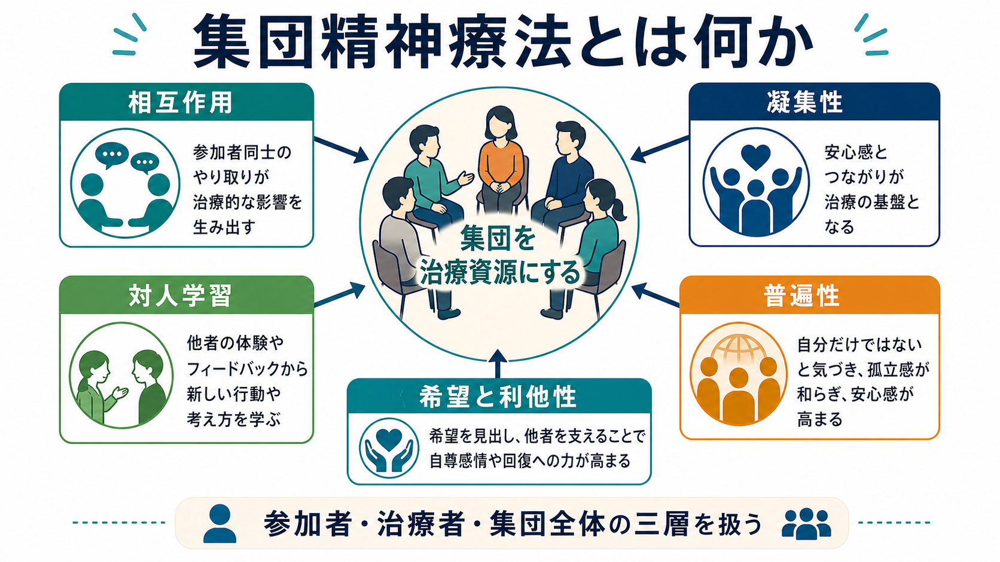
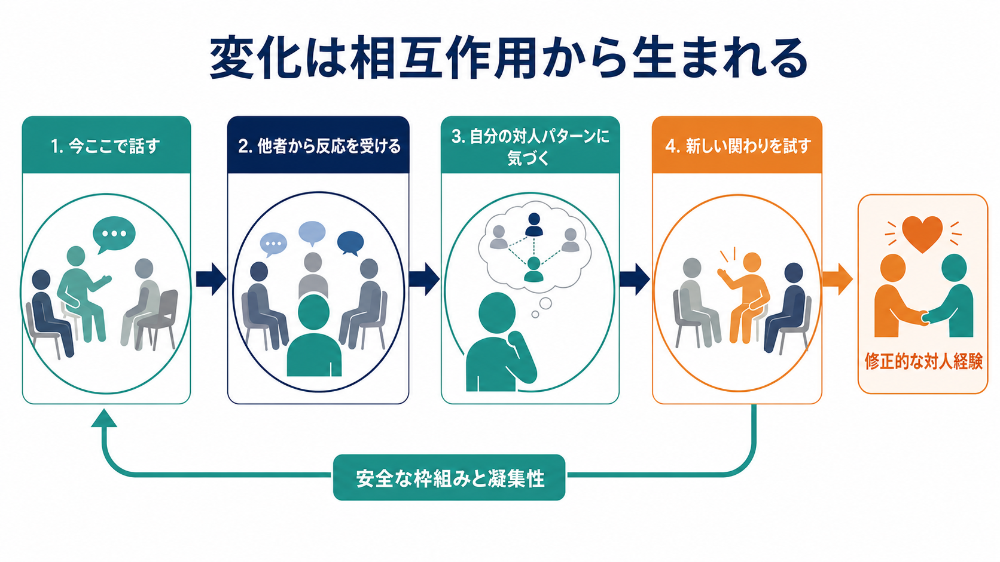

# 集団精神療法とは何か

## 要点

- 集団精神療法は、治療者と個人の一対一の関係だけでなく、参加者同士の相互作用と集団全体の力動を治療資源として用いる[[心理療法とは何か|心理療法]]である。
- 中核は「安全な枠組みの中で、今ここで起きる対人パターンを観察し、言葉にし、フィードバックを受け、新しい関わり方を試す」ことにある。
- 重要な治療因子には、凝集性、普遍性、希望、利他性、対人学習、感情表出、修正的な対人経験が含まれる[1][2]。
- エビデンスは診断横断的に蓄積されており、個人療法と同等の効果が示される比較研究や、うつ病に対する有効性を示すメタ分析がある[3][4][5]。
- ただし、集団に入れば自動的に良くなるわけではない。選択、準備、守秘、境界、危機対応、途中離脱、凝集性の維持、測定に基づくフィードバックが臨床上の要点になる[1][7][8]。

## この記事で答える問い

1. 集団精神療法は、単なる「複数人で受ける心理療法」と何が違うのか。
2. 参加者同士の相互作用は、どのように治療資源になるのか。
3. 凝集性、対人学習、普遍性、希望、利他性は、どのように変化を支えるのか。
4. 臨床では、どのような準備・安全管理・評価が必要なのか。
5. 研究上、どこまで有効性が示され、どこに未解決問題が残るのか。

## まず結論

集団精神療法とは、参加者が同じ場に集まること自体を治療とみなす方法ではない。むしろ、参加者、治療者、集団全体という三つの水準で起きる相互作用を、症状、感情、対人関係、自己理解の変化に結びつける構造化された治療である[1]。

たとえば、ある参加者が「人に頼ると迷惑になる」と感じて沈黙しがちな場合、個人療法ではその信念を語り、過去の経験や現在の生活との関係を検討する。集団精神療法では、それに加えて、実際に集団の中で沈黙がどう受け取られたか、他の参加者が何を感じたか、本人がフィードバックをどう受け取ったかを扱える。つまり、対人パターンが「語られる内容」だけでなく「その場で起きている出来事」として扱われる。

## 背景

集団精神療法は、精神分析的集団療法、対人関係論、認知行動療法、支持的療法、心理教育、スキルトレーニング、セルフヘルプ・グループなど、多様な系譜を持つ。ここでは主に、参加者同士の相互作用を治療資源として用いる心理療法的グループを中心に整理する。

AGPA の実践ガイドラインは、力動的・相互作用的・関係論的な集団精神療法について、個人内力動、対人力動、集団全体の力動を同時に扱うモデルとして説明している[1]。この見方では、治療者は単に発言順を管理する司会者ではない。集団の構造、感情的気候、相互フィードバック、境界、発達段階、参加者の準備性を見ながら、どの水準に介入するかを選ぶ。

また、集団精神療法は「効率化のために個人療法をまとめたもの」でもない。たしかに費用やアクセスの面で利点を持ちうるが、治療的に重要なのは、他者の反応を通じて自分の対人パターンを知り、同時に他者を支える経験を持てる点である[2]。

## 基本概念

### 集団を治療資源にする

集団精神療法の特徴は、治療者だけでなく参加者同士も治療的な情報源になる点である。参加者は、他の参加者の語りに共感したり、違和感を覚えたり、励ましたり、沈黙したりする。その反応は、本人の対人世界に似た形で現れることがある。

このため、集団は小さな社会的場として機能する。普段の生活で繰り返される「頼れない」「怒りを言えない」「相手を助けすぎる」「評価されると固まる」といったパターンが、集団の中でも再演される。治療では、それを責めるのではなく、観察し、意味づけ、別の行動を試す材料にする。

### 凝集性

凝集性は、参加者が集団に所属し、受け入れられ、共に作業できると感じる関係性の質である。凝集性は単なる仲の良さではない。安心感、課題への共同作業、否定的感情を扱える関係の強さを含む。

凝集性と治療結果の関係を扱ったメタ分析では、凝集性とアウトカムに有意な関連が示されている[6]。ただし、凝集性が高ければ常に良いという単純な話ではない。高い凝集性は率直なフィードバックや葛藤の処理を支えうるが、同調圧力や沈黙の固定化にもなりうる。そのため、治療者は「温かいが、現実を避けない」集団気候を作る必要がある。

### 普遍性

普遍性とは、「自分だけがこの苦しみを抱えているわけではない」と知る経験である[2]。これは孤立感や恥を和らげる。たとえば、[[大うつ病性障害とは何か|うつ病]]、不安、対人恐怖、喪失、トラウマ反応、慢性疾患に伴う困難では、同じ経験を持つ他者の存在が、自己非難を弱めるきっかけになる。

ただし、普遍性は「皆同じだから大丈夫」という雑な一般化ではない。似ている部分と違う部分の両方を見分けることで、自分の経験をより細かく理解できる。

### 対人学習

対人学習は、他者との相互作用を通じて、自分の対人パターン、相手への影響、別の関わり方を学ぶ過程である[1][2]。ここでは、助言よりもフィードバックが重要になる。

たとえば「あなたの話を聞くと、助けたい気持ちになる一方で、こちらに近づいてほしくないのかなとも感じた」といった反応は、本人にとって外から見た自分の関わり方を知る手がかりになる。これは[[対人関係療法IPTとは何か|対人関係療法]]の焦点とも接続するが、集団精神療法では複数の他者から同時に異なる反応を得られる点が特徴である。

### 希望と利他性

集団では、少し先に進んだ参加者の変化を見ることで希望が生まれる。また、自分が他者の役に立つ経験は、無力感や自己否定を弱めることがある[2]。この利他性は、単なる「励まし役」になることではない。自分の経験を語り、それが誰かの理解や回復の材料になることで、自分の経験にも別の意味が与えられる。

## 仕組み

集団精神療法の変化は、しばしば次の循環として理解できる。

1. 安全な枠組みを作る。
2. 参加者が「今ここ」で起きている感情や関係を言葉にする。
3. 他者から反応やフィードバックを受ける。
4. 自分の対人パターン、期待、回避、怒り、依存、恥に気づく。
5. 集団の中で新しい関わり方を試す。
6. その結果を振り返り、生活場面に持ち帰る。

この循環は、[[認知行動療法CBTとは何か|CBT]]の行動実験や認知再構成、[[弁証法的行動療法DBTとは何か|DBT]]の対人関係スキル、[[支持的精神療法とは何か|支持的精神療法]]の安全な関係づくりとも重なる。ただし、集団精神療法では、変化の実験場が治療者との二者関係だけでなく、複数の参加者がいる相互作用の場になる。

重要なのは、葛藤や沈黙も失敗ではなく、扱い方によっては治療材料になる点である。たとえば、ある参加者の発言に対して別の参加者が傷ついたとき、治療者がただ場をなだめるだけなら、集団は衝突を避ける学習をする。反対に、責め合いを放置すれば、傷つきが増える。治療的には、何が起きたのか、誰が何を感じたのか、どのような期待や恐れが働いたのかを、安全な枠組みの中で言葉にする。

## 図解

上の二つの図は、集団精神療法を二つの角度から整理している。

| 図 | 主な焦点 | 読み方 |
|---|---|---|
| 概念地図 | 集団精神療法の主要因子 | 相互作用、凝集性、対人学習、普遍性、希望と利他性が、集団を治療資源にする。 |
| 変化メカニズム | 今ここでの相互作用から変化が生まれる流れ | 発言、反応、気づき、実験、修正的な対人経験が循環する。 |

3枚目の図を追加する場合は、次のような「比較・適応判断」図が有用である。

**図解案**: 「集団精神療法・個人療法・心理教育グループの比較」を日本語インフォグラフィックにする。横軸に「主な治療資源」「向いている課題」「注意点」、縦軸に「集団精神療法」「個人療法」「心理教育・スキル訓練グループ」を置く。色は白背景、ティール、ネイビー、オレンジ。本文ラベルは短く、臨床判断を断定しない。

## 臨床・研究との接続

### 適応と準備

集団精神療法では、参加者の選択と準備が治療の一部である。AGPA ガイドラインは、目標、役割、守秘、参加ルール、期待、集団で扱う課題を事前に説明することを重視している[1]。

適応判断では、診断名だけでなく、現在の危機度、衝動性、対人機能、心理的マインドネス、参加動機、集団課題に取り組む余力、守秘や境界を守れるかを検討する。自殺リスク、重度の物質使用、急性精神病症状、著しい攻撃性、現実的な安全確保の難しさがある場合には、集団単独で抱え込まず、個別評価、危機介入、薬物療法、家族支援、福祉資源との連携が必要になる。

### 治療者の役割

治療者は、司会者、教育者、観察者、境界設定者、感情調整者、対人フィードバックの翻訳者として働く。発言量を均等にするだけではなく、集団内で何が避けられ、誰がどの役割に固定され、どの感情が言葉にされていないかを見る。

また、治療者は参加者同士の関係を活性化する。参加者が治療者だけに向けて話す場合、「今の話を聞いて、他の方はどう感じましたか」と集団へ戻す。逆に、参加者同士のやり取りが傷つきや攻撃に傾く場合は、境界を整え、感情を言語化し、意味づけへつなげる。

### 有効性

集団精神療法の有効性は、問題領域や治療モデルによって異なる。個人療法と集団療法を直接比較したメタ分析では、全体として両形式の効果に明確な差はないと報告されている[3]。うつ病に対する集団精神療法のメタ分析では、待機群などと比べて抑うつ症状を減らす効果が示された[4]。

ただし、「集団形式であれば何でも同じように効く」とは言えない。構造化されたCBTグループ、対人関係に焦点化したグループ、支持的グループ、心理教育グループ、力動的プロセスグループでは、想定する変化機序も必要な訓練も異なる。研究を読むときは、対象者、診断、集団サイズ、開放型か閉鎖型か、セッション数、治療者訓練、アウトカム指標、脱落率を確認する必要がある。

### 測定とフィードバック

近年は、集団の関係性や治療進捗を測定し、治療者へフィードバックする実践も検討されている。Group Questionnaire は、参加者と治療者、参加者同士、参加者と集団全体の関係を、肯定的結合、肯定的作業、否定的関係などの側面から捉える測定法として研究されてきた[7]。また、集団療法での関係破綻と修復を測定に基づいて把握する試みも報告されている[8]。

これは、集団精神療法を「雰囲気」で進めるのではなく、関係の質、症状、脱落リスク、参加者ごとの体験を継続的に点検する方向性といえる。

## よくある誤解

### 誤解1: 集団精神療法は、安価な個人療法の代替である

費用面の利点はありうるが、集団精神療法の本質はコスト削減ではない。参加者同士の相互作用、複数の視点、対人パターンの再演と修正、他者を支える経験が、個人療法とは異なる治療資源になる。

### 誤解2: 人前で深い話をするのが苦手な人には向かない

苦手さ自体が治療課題になる場合もある。ただし、誰にでも即座に適しているわけではない。準備面接、参加目的の明確化、守秘と境界の説明、段階的な参加が重要である。

### 誤解3: 集団では個別の問題が扱われにくい

集団では、個別の問題が他者との関係の中で見えやすくなることがある。もちろん、重い危機、詳細なトラウマ処理、薬物調整、家族・職場・福祉との具体的調整などは、個別支援や他職種連携が必要になる。

### 誤解4: 集団の雰囲気が良ければ治療は成功である

雰囲気の良さだけでは不十分である。凝集性は重要だが、衝突を避けるだけの和やかさは変化を妨げることがある。安全な枠組みの中で、違和感、怒り、羨望、失望、境界、依存も扱えることが重要である。

### 誤解5: 集団内のフィードバックは率直であればよい

率直さだけでは治療的にならない。フィードバックは、時期、相手の準備性、集団の凝集性、治療目標、安全性に応じて扱う必要がある[1]。治療者は、攻撃や説教にならないよう、体験に基づく表現へ整える。

## 関連ノート

- [[心理療法とは何か]]
- [[支持的精神療法とは何か]]
- [[対人関係療法IPTとは何か]]
- [[認知行動療法CBTとは何か]]
- [[弁証法的行動療法DBTとは何か]]
- [[DBTの対人関係スキルとは何か]]
- [[メンタライゼーションに基づく治療MBTとは何か]]
- [[行動活性化とは何か]]

関連ノート候補:

- 「治療同盟とは何か」
- 「心理療法における凝集性とは何か」
- 「グループプロセスとは何か」
- 「心理療法における有害事象とは何か」
- 「測定に基づく心理療法とは何か」

MOC更新候補:

- `content/00_MOC/` 配下の臨床実践・心理療法系MOCに、本記事 `[[集団精神療法とは何か]]` を追加する。
- 並列ジョブとの競合を避けるため、本記事ではMOC本体は更新しない。

## 理解チェック

1. 集団精神療法が「複数人で受ける個人療法」ではない理由を、相互作用、凝集性、対人学習の語を使って説明できるか。
2. 凝集性が治療に役立つ場合と、同調圧力として働く場合を区別できるか。
3. 「今ここ」の相互作用を扱うことが、なぜ対人パターンの変化につながるのかを説明できるか。
4. 集団精神療法の適応判断で、診断名以外に見るべき要素を挙げられるか。
5. 集団精神療法の有効性研究を読むとき、集団サイズ、開放型・閉鎖型、治療モデル、脱落率、アウトカム指標を確認する理由を説明できるか。

## 参考文献

[1] American Group Psychotherapy Association. *Practice Guidelines for Group Psychotherapy*. https://agpa.org/guidelines-ethics/practice-guidelines-for-group-psychotherapy/

[2] Yalom, I. D., & Leszcz, M. (2020). *The Theory and Practice of Group Psychotherapy* (6th ed.). Basic Books. https://www.hachettebookgroup.com/titles/irvin-d-yalom/the-theory-and-practice-of-group-psychotherapy/9781541617575/

[3] McRoberts, C., Burlingame, G. M., & Hoag, M. J. (1998). Comparative efficacy of individual and group psychotherapy: A meta-analytic perspective. *Group Dynamics: Theory, Research, and Practice, 2*(2), 101-117. https://doi.org/10.1037/1089-2699.2.2.101

[4] McDermut, W., Miller, I. W., & Brown, R. A. (2001). The efficacy of group psychotherapy for depression: A meta-analysis and review of the empirical research. *Clinical Psychology: Science and Practice, 8*(1), 98-116. https://doi.org/10.1093/clipsy.8.1.98

[5] Burlingame, G. M., Fuhriman, A., & Mosier, J. (2003). The differential effectiveness of group psychotherapy: A meta-analytic perspective. *Group Dynamics: Theory, Research, and Practice, 7*(1), 3-12. https://doi.org/10.1037/1089-2699.7.1.3

[6] Burlingame, G. M., McClendon, D. T., & Yang, C. (2018). Cohesion in group therapy: A meta-analysis. *Psychotherapy, 55*(4), 384-398. https://doi.org/10.1037/pst0000173

[7] Krogel, J., Burlingame, G., Chapman, C., Renshaw, T. L., Gleave, R., Beecher, M., & MacNair-Semands, R. (2013). The Group Questionnaire: A clinical and empirically derived measure of group relationship. *Psychotherapy Research, 23*(3), 344-354. https://doi.org/10.1080/10503307.2012.729868

[8] Burlingame, G. M., Alldredge, C. T., & Arnold, R. A. (2021). Alliance rupture detection and repair in group therapy: Using the Group Questionnaire--GQ. *International Journal of Group Psychotherapy, 71*(2), 338-370. https://doi.org/10.1080/00207284.2020.1844010

## 未解決問題

- どの参加者に、どの種類の集団精神療法が、どの時期に最も適しているかを予測する実用的指標はまだ十分ではない。
- 凝集性、治療同盟、集団気候、対人学習が、どの順序で変化し、どのアウトカムに効くのかはさらに検討が必要である。
- オンライン集団療法、ハイブリッド集団、文化的多様性を含む集団で、守秘・安全・凝集性をどう保つかは重要な研究課題である。
- 有効性だけでなく、悪化、脱落、同調圧力、境界侵害などの有害事象をどう測定し予防するかが課題である。
