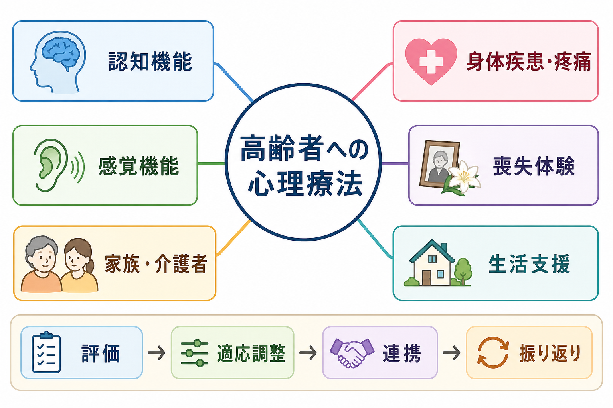
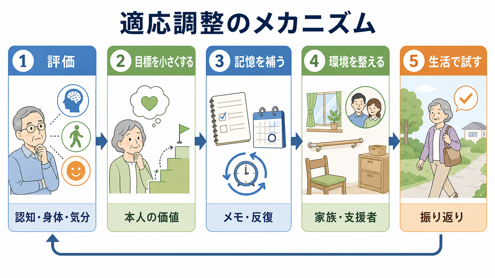
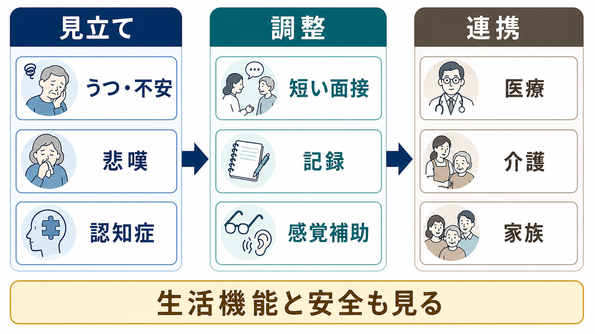

# 高齢者への心理療法では何に注意するのか

## 要点

- 高齢者への心理療法では、年齢だけで方法を単純化するのではなく、認知機能、身体疾患、感覚機能、喪失体験、生活環境、家族・介護者の関与を同時に見立てる。
- [[認知行動療法CBTとは何か]]、問題解決療法、支持的精神療法、悲嘆への介入などは高齢者にも用いられるが、面接の長さ、宿題、記憶補助、移動負担、医療・介護連携を調整する必要がある[1][2]。
- 認知症や軽度認知障害がある場合も心理療法を一律に除外しない。説明を短くし、反復、視覚的手がかり、介護者参加、環境調整を組み合わせる[5]。
- 喪失体験は「老年期だから当然」と片づけず、通常の悲嘆、うつ病、複雑性悲嘆、自殺リスク、孤立を分けて評価する[6]。
- 心理療法だけで抱え込まず、身体疾患、疼痛、睡眠、服薬、転倒、生活支援、介護者負担を含めて[[地域連携は精神科診療で何を意味するのか]]につなげる。

## この記事で答える問い

1. 高齢者への心理療法では、通常の成人心理療法と何が違うのか。
2. 認知機能低下や身体疾患があるとき、心理療法をどう調整するのか。
3. 喪失体験、家族関係、生活支援をどのように治療計画に入れるのか。
4. 心理療法で扱う範囲と、多職種連携へつなぐ範囲をどう分けるのか。

## まず結論

高齢者への心理療法で最も重要なのは、「心理的問題を、生活の中で維持されている問題として見る」ことである。気分、不安、悲嘆、対人関係だけを見るのではなく、記憶、注意、聴力、視力、疼痛、睡眠、薬剤、移動能力、家族・介護者、経済状況、孤立を一緒に評価する[1]。

これは心理療法を弱めるという意味ではない。むしろ、心理療法の効果が生活に届くように、介入単位を小さくし、反復し、記録を残し、日常の支援者と共有可能な形にするということである。老年期うつ病に対する心理療法のネットワークメタ分析やメタ分析では、心理療法は高齢者にも有効な選択肢であることが示されているが、対象者の重症度、併存症、施設入所、認知機能、介入形式によって結果は変わる[2][3]。

## 背景

老年期には、退職、配偶者や友人の死、慢性疾患、痛み、運転や外出の制限、役割喪失、介護される側への移行などが重なりやすい。これらは単なる背景ではなく、抑うつ、不安、孤立、睡眠障害、自己効力感の低下を維持する条件になりうる。したがって、[[老年精神医学とは何か]]の視点では、心理療法を個人内の認知や感情だけに閉じず、生活機能と社会的支援の変化として見る。

また、高齢者では身体疾患と精神症状が絡みやすい。例えば疼痛、心不全、糖尿病、神経疾患、睡眠障害、薬剤副作用は、気分や意欲、認知機能に影響する。心理療法の場で「気持ちの問題」として扱う前に、医学的評価が必要な症状、せん妄、認知症、身体疾患による抑うつ・不安を見逃さないことが重要である。

## 基本概念

### 認知機能を前提にしすぎない

心理療法は、話を理解し、覚え、次回まで試す作業を含む。そのため、注意、記憶、遂行機能が低下していると、通常の面接構造やホームワークがそのままでは機能しにくい。[[認知機能低下はどのように評価するのか]]を踏まえ、理解度を確認し、要点を紙に残し、課題を1つに絞り、セッション冒頭で前回内容を再確認する。

問題解決療法は、老年期うつ病、とくに遂行機能低下を伴う群で研究されてきた。問題を具体化し、選択肢を出し、実行可能な計画に落とす構造は、抽象的な洞察よりも生活機能へ結びつきやすい[4]。

### 身体疾患とフレイルを治療計画に入れる

身体疾患は心理療法の「邪魔」ではなく、治療計画の一部である。疼痛が強い人に長時間の面接や複雑な宿題を求めると、失敗体験が増える。[[フレイルと精神症状はどう関係するのか]]を踏まえると、活動量の低下、転倒不安、疲労、睡眠、栄養、孤立は相互に強化しあう。心理療法では、活動目標を「毎日30分歩く」ではなく、「玄関先まで出る」「週1回だけ電話する」のように、身体状態に合わせて段階化する。

### 感覚機能を面接技法として扱う

聴力や視力の低下は、理解力や意欲の低下に見えることがある。感覚障害は生活の質と関連し、二重感覚障害では負担が大きくなりやすい[7]。面接室では、照明、座る位置、声量、マスク越しの聞き取り、補聴器や眼鏡の使用、資料の文字サイズを確認する。これは配慮ではなく、心理療法の前提条件である。

### 喪失を「普通」と決めつけない

高齢者には喪失体験が多い。しかし、喪失が多いことと、苦痛が治療対象でないことは別である。[[喪失体験はライフスパンでどう影響するのか]]、[[喪失反応と大うつ病はどう違うのか]]を手がかりに、悲嘆、うつ病、複雑性悲嘆、自責、希死念慮、社会的孤立を分けて評価する。複雑性悲嘆に対する治療は、高齢者を含むRCTで有効性が検討されている[6]。

### 家族・介護者は資源にも負担にもなる

家族や介護者は、記憶補助、通院支援、生活環境調整の重要な資源である。同時に、本人の自律性を奪う、過保護になる、介護者自身が疲弊する、家族内葛藤が強まることもある。[[介護者負担は精神健康にどう影響するのか]]を踏まえ、本人の同意を得たうえで、どの情報を誰と共有するかを明確にする。認知症介護者へのCBTでは、介護者の抑うつやストレス軽減に小さいが有意な効果が報告されている[8]。

## 仕組み

高齢者への心理療法の調整は、次の流れで考えると整理しやすい。

1. 評価: 気分、不安、悲嘆だけでなく、認知機能、身体疾患、感覚機能、睡眠、服薬、生活機能、安全を確認する。
2. 目標を小さくする: 抽象的な「元気になる」ではなく、生活の中で観察できる行動にする。
3. 記憶を補う: メモ、予定表、反復、家族との共有、次回冒頭の復習を使う。
4. 環境を整える: 移動、面接時間、電話・オンライン、介護サービス、医療受診を調整する。
5. 生活で試す: 面接内の理解で終わらせず、本人の生活で実行可能かを確認する。

この仕組みは、[[心理療法とは何か]]の基本である「見立て、目標、介入、振り返り」を、老年期の生活条件に合わせて再設計するものといえる。認知症や軽度認知障害があっても、CBTや心理療法的介入は、介護者参加や記憶補助を含めることで、抑うつ、不安、生活の質に役立つ可能性がある[5]。ただし、重度の認知機能低下、せん妄、急性の身体疾患、虐待や自殺リスクがある場合は、心理療法単独で進めず、医療・介護・福祉との連携を優先する。

## 図解

3枚の図は、以下の順に読むとよい。

| 図 | 読み方 |
|---|---|
| 全体像 | 高齢者心理療法では、認知機能、身体疾患、喪失、生活支援、感覚機能、家族・介護者を同時に見る。 |
| 適応調整 | 目標を小さくし、記憶を補い、生活で試すことで、面接内の理解を日常行動へ移す。 |
| 臨床接続 | 見立て、調整、連携を分けることで、心理療法だけで抱え込まない。 |

## 臨床・研究との接続

臨床では、まず「心理療法の適応があるか」ではなく、「どの形なら心理療法が生活に届くか」を問う。外来に来られる人には通常の面接を短く構造化し、施設入所者や在宅療養者にはスタッフや家族との連携を含める。オンラインや電話を使う場合も、聴力、視力、機器操作、プライバシー、家族同席の可否を確認する。

研究面では、老年期うつ病や不安に対する心理療法の有効性は示されている一方で、非常に高齢の人、身体合併症が多い人、認知症を伴う人、施設入所者、文化的少数者ではエビデンスが薄い部分がある[2][3][5]。したがって、臨床では研究知見を機械的に当てはめず、本人の価値、生活状況、支援資源、リスクに合わせて調整する。

## よくある誤解

### 誤解1: 高齢者には心理療法は効きにくい

年齢だけで心理療法の効果を否定する根拠は乏しい。うつ病や不安への心理療法は高齢者にも有効な選択肢であり、問題解決療法、CBT、悲嘆への介入などは研究されている[2][3][4][6]。重要なのは、若年成人向けの形式をそのまま使うのではなく、認知・身体・生活条件に合わせて変えることである。

### 誤解2: 認知症があれば心理療法はできない

重度の認知機能低下では方法の限界があるが、軽度認知障害や軽中等度認知症では、短い説明、反復、視覚資料、介護者参加、行動活性化、環境調整を組み合わせる余地がある[5]。ただし、[[認知症とは何か]]、せん妄、身体疾患、薬剤影響の鑑別は先に確認する。

### 誤解3: 喪失は老年期なら仕方がない

喪失は普遍的だが、苦痛、孤立、生活機能低下、自殺リスクを放置してよいわけではない。悲嘆の意味を尊重しつつ、抑うつ、複雑性悲嘆、虐待、孤立を評価し、必要に応じて専門的支援につなぐ。

### 誤解4: 家族がいれば支援は足りている

家族がいることは保護因子になりうるが、介護負担や葛藤が強い場合はリスクにもなる。本人の意思決定を支えながら、家族への心理教育、介護者支援、社会資源の導入を組み合わせる。[[社会的支援は健康にどう影響するのか]]の視点では、支援の量だけでなく、本人が支援をどう受け取っているかが重要である。

## 関連ノート

- [[心理療法とは何か]]
- [[認知行動療法CBTとは何か]]
- [[支持的精神療法とは何か]]
- [[老年精神医学とは何か]]
- [[老年期うつ病とは何か]]
- [[老年期の心理発達とは何か]]
- [[認知症とは何か]]
- [[認知機能低下はどのように評価するのか]]
- [[フレイルと精神症状はどう関係するのか]]
- [[喪失体験はライフスパンでどう影響するのか]]
- [[喪失反応と大うつ病はどう違うのか]]
- [[介護者負担は精神健康にどう影響するのか]]
- [[地域連携は精神科診療で何を意味するのか]]

## MOC更新候補

- `content/00_MOC/` 配下の臨床実践・心理療法系MOCに、本記事へのリンクを追加する候補。
- 老年精神医学、認知症、喪失・悲嘆、地域連携のMOCがある場合、本記事を横断的な関連記事として追加する候補。

## 理解チェック

1. 高齢者への心理療法で、認知機能と感覚機能を確認する理由は何か。
2. 喪失体験を「年齢相応」とだけ見なすと、どのようなリスクを見落とすか。
3. 心理療法の宿題を調整するとき、どのような記憶補助や生活支援を使えるか。
4. 家族・介護者を治療に含めるとき、本人の同意と自律性をどう守るか。
5. 心理療法単独で進めず、医療・介護・福祉連携を優先すべき場面はどのようなときか。

## 未解決問題

- 身体合併症、フレイル、感覚障害、認知症を併存する高齢者に、どの心理療法形式が最も実装しやすいか。
- 施設、在宅、外来、オンラインで、介入効果と継続率がどのように変わるか。
- 本人の自律性と介護者参加を両立させるための実践モデルを、どのように評価するか。

## 参考文献

[1] American Psychological Association. (2024). *Guidelines for Psychological Practice With Older Adults*. https://www.guidelinecentral.com/guideline/3542055/

[2] Cuijpers, P., Miguel, C., Karyotaki, E., & Harrer, M. (2026). Psychological treatment of depression in older adults: A network meta-analysis. *International Psychogeriatrics*. https://doi.org/10.1016/j.inpsyc.2026.100213

[3] Wuthrich, V. M., Meuldijk, D., Jagiello, T., González Robles, A., Jones, M. P., & Cuijpers, P. (2021). Efficacy and effectiveness of psychological interventions on co-occurring mood and anxiety disorders in older adults: A systematic review and meta-analysis. *International Journal of Geriatric Psychiatry*. https://doi.org/10.1002/gps.5486

[4] Kiosses, D. N., & Alexopoulos, G. S. (2014). Problem-Solving Therapy in the Elderly. *Current Treatment Options in Psychiatry*, 1(1), 15-26. https://doi.org/10.1007/s40501-013-0003-0

[5] Jin, J. W., Nowakowski, S., Taylor, A., Medina, L. D., & Kunik, M. E. (2021). Cognitive Behavioral Therapy for Mood and Insomnia in Persons With Dementia: A Systematic Review. *Alzheimer Disease & Associated Disorders*, 35(4), 366-373. https://doi.org/10.1097/WAD.0000000000000454

[6] Shear, M. K., Wang, Y., Skritskaya, N., Duan, N., Mauro, C., & Ghesquiere, A. (2014). Treatment of Complicated Grief in Elderly Persons: A Randomized Clinical Trial. *JAMA Psychiatry*, 71(11), 1287-1295. https://doi.org/10.1001/jamapsychiatry.2014.1242

[7] Tseng, Y.-C., Liu, S. H.-Y., Lou, M.-F., & Huang, G.-S. (2018). Quality of life in older adults with sensory impairments: A systematic review. *Quality of Life Research*, 27, 1957-1971. https://doi.org/10.1007/s11136-018-1799-2

[8] Hopkinson, M. D., Reavell, J., Lane, D. A., & Mallikarjun, P. (2019). Cognitive Behavioral Therapy for Depression, Anxiety, and Stress in Caregivers of Dementia Patients: A Systematic Review and Meta-Analysis. *The Gerontologist*, 59(4), e343-e362. https://doi.org/10.1093/geront/gnx217
