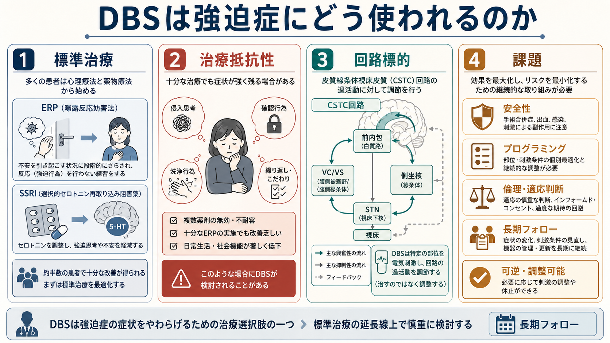
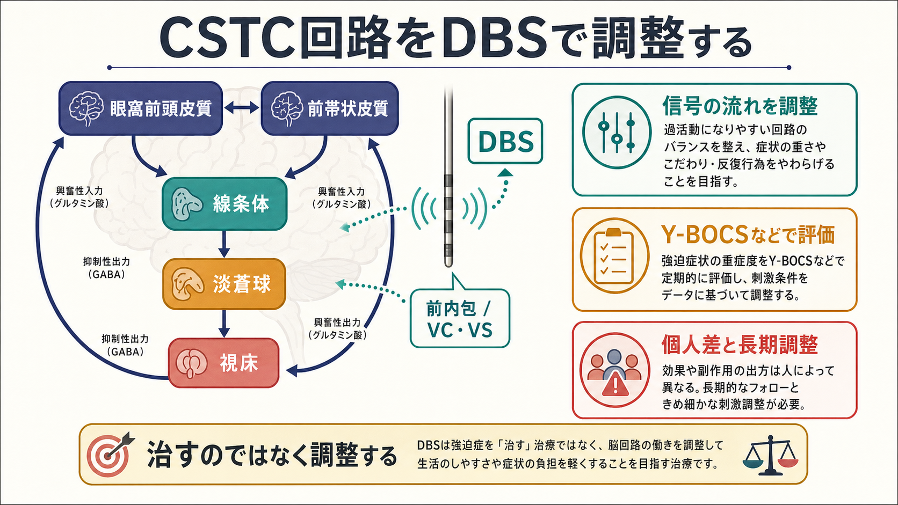
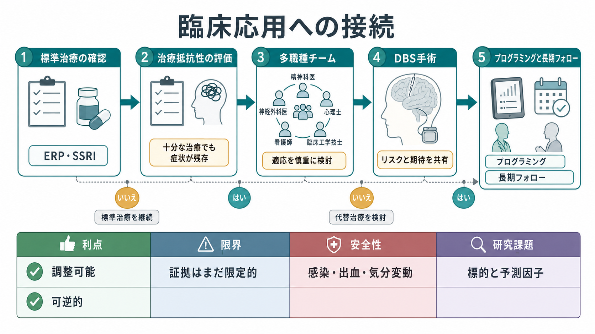

# DBSは強迫症にどう使われるのか

## 要点

- 深部脳刺激（deep brain stimulation: DBS）は、[[強迫症とは何か|強迫症]]そのものを「取り除く」治療ではなく、強迫症状を支える神経回路の活動を電気刺激で調整しようとする治療・研究技術である。
- 強迫症DBSでは、前内包、腹側内包・腹側線条体（VC/VS）、側坐核、視床下核（STN）など、[[強迫症では皮質線条体視床回路に何が起きているのか|皮質線条体視床回路]]と強く結びつく部位が主な標的候補になる。
- 通常の治療選択肢は、[[曝露反応妨害法ERPとは何か|曝露反応妨害法ERP]]を含むCBTと[[SSRIとは何か|SSRI]]などの薬物療法であり、DBSはそれらを十分に試しても重い症状と生活障害が続く場合に限って検討される。
- 米国では慢性・重症・治療抵抗性OCDに対する前内包刺激が Humanitarian Device Exemption（HDE）として承認されているが、英国NICEは、証拠の量と質が十分でないため研究文脈でのみ行うべきだとしている[1][2]。
- 重要な課題は、誰に効くのか、どの標的が最適か、どの刺激条件がよいか、長期の副作用・気分変動・認知変化をどう監視するかである[3][4]。

## この記事で答える問い

この記事では、DBSが強迫症にどう使われるのかを、次の問いに分けて整理する。

1. DBSは強迫症の何を標的にするのか。
2. なぜCSTC回路が治療標的として考えられるのか。
3. 標準治療との関係で、DBSはどこに位置づけられるのか。
4. 臨床応用と研究上の限界はどこにあるのか。

## まず結論

DBSは、強迫症の第一選択治療ではない。標準治療であるERPを含むCBT、SSRI、クロミプラミン、増強療法、専門的な集中的治療などを十分に検討しても、重い強迫観念・強迫行為と生活障害が残る成人患者で、専門チームと研究的枠組みのもとに検討される選択肢である[1][2]。

考え方の中心は、強迫症を「意思の弱さ」や「性格」ではなく、眼窩前頭皮質、前帯状皮質、線条体、淡蒼球、視床を含むCSTC回路の過活動・誤った警告信号・行動ゲーティングの偏りとして捉えることである。DBSはこの回路の一部に持続的または調整可能な電気刺激を加え、強迫観念と強迫行為のループを弱めることを目指す[3][5]。

ただし、「標的に電極を入れれば治る」という単純な話ではない。DBSの効果は刺激部位、電極位置、刺激パラメータ、併存症、心理社会的支援、術後の調整、患者本人の目標によって変わる。したがって、DBSは外科手術であると同時に、長期の臨床評価と共同意思決定を必要とする神経調節治療である。

## 背景

強迫症では、本人の意に反して反復する思考・イメージ・衝動である強迫観念と、それに伴う不安や不完全感を下げるために行われる強迫行為が中心になる。多くの人ではERPを含むCBTやSSRIが有効だが、一部では十分な治療を受けても症状が重く残り、日常生活、家族関係、就労・就学、身体的健康に大きな影響が続く[6]。

NICEのOCD治療ガイドラインは、機能障害の程度に応じてCBT（ERPを含む）とSSRIを段階的に組み合わせることを推奨している。成人の重症例では、SSRIとCBT（ERPを含む）の併用が標準的な位置づけになる[6]。DBSはこの標準治療の代替というより、標準治療を最適化しても十分な改善が得られない場合に、専門施設で慎重に検討される追加的選択肢である。

米国FDAのHDEでは、Reclaim DBS Therapy for OCD が、慢性・重症・治療抵抗性OCDの成人に対して、前内包の両側刺激を行う補助療法として承認されている。条件には、少なくとも3種類のSSRIが奏効しないことが含まれている[2]。一方、NICEは2021年のHealthTech guidanceで、成人の慢性・重症・治療抵抗性OCDへのDBSについて、安全性と有効性の証拠が質・量とも不十分であるため、研究文脈でのみ用いるべきだとした[1]。この違いは、DBSが期待される治療であると同時に、まだ一般化に慎重さが必要な領域であることを示している。

## 基本概念

### DBS

DBSは、脳深部の標的部位に電極を留置し、皮下に埋め込んだ刺激装置から電気刺激を送る治療技術である。運動障害領域ではパーキンソン病や本態性振戦などで発展してきた。精神疾患領域では、症状を支える神経回路を可逆的・調整可能に変える方法として研究されている。より一般的なDBSの仕組みは、[[深部脳刺激DBSは神経回路をどう調節するのか]]で扱う。

DBSは局所の神経細胞を単純に「興奮」または「抑制」するだけではない。刺激は、電極周囲の軸索、通過線維、局所回路、遠隔のネットワーク活動に影響しうる。そのため臨床的には、どの灰白質核を狙うかだけでなく、どの白質線維束・ネットワークを調整するかが重要になる[5][7]。

### 治療抵抗性

強迫症DBSの対象は、一般に治療抵抗性の重症例である。ここでの治療抵抗性とは、単に「薬を少し使ったが効かなかった」という意味ではない。十分な用量・期間のSSRI、クロミプラミンや増強療法、ERPを含む十分なCBT、専門的評価、併存症の治療などを検討しても、重い症状と機能障害が続く状態を指す。

この概念は重要である。DBSは侵襲的な手術と長期管理を伴うため、標準治療が未実施または不十分な段階で使うものではない。むしろ「標準治療を尽くした後でもなお、回路レベルの介入を検討するほど生活障害が大きいか」を判断するための枠組みである。

### CSTC回路

強迫症では、眼窩前頭皮質、前帯状皮質、線条体、淡蒼球、視床、皮質へ戻るループであるCSTC回路が重要な仮説として扱われてきた。強迫観念や確認行為は、「危険かもしれない」「まだ完了していない」という信号が過剰に残り、行動の停止や切り替えが難しくなる現象として理解できる。

ただしCSTC回路だけで強迫症の全体を説明できるわけではない。不安、嫌悪、報酬、認知制御、習慣形成、家族・環境要因も関わる。DBSの標的選択も、この複数ネットワークの中で、症状ループに強く関わる結節点や線維束をどう調整するかという問題になる[3][5]。

## 仕組み

強迫症DBSの標的としてよく議論されるのは、前内包、VC/VS、側坐核、STNである。前内包やVC/VSは、前頭前野・眼窩前頭皮質・前帯状皮質と線条体・視床を結ぶ線維が通る領域であり、強迫症の警告信号や価値づけ、行動選択のループに影響しうる。側坐核は報酬・動機づけ・情動評価と関係し、STNは大脳基底核回路の行動停止・切り替えに関わる結節点として扱われる。

臨床研究では、STN刺激のランダム化比較試験で重症OCDの症状改善が報告されている[4]。また、VC/VS刺激の国際的経験や、側坐核刺激の研究でも症状軽減が報告されている[7][8]。メタ解析では、Y-BOCSの改善や反応例が示される一方で、研究数・対象者数が少なく、標的・刺激条件・選択基準にばらつきがあることも繰り返し指摘されている[3][5]。

DBSの効果は、電源を入れた直後だけで完結しない。術後には刺激の周波数、パルス幅、振幅、接点選択を調整し、効果と副作用のバランスを探る。気分の高揚、不安、易刺激性、無気力、睡眠変化、衝動性、認知変化などを観察し、必要に応じて薬物療法や心理療法も調整する。つまりDBSは「手術」だけではなく、長期のプログラミングと心理社会的支援を含む治療プロセスである。

## 図解

図1は、標準治療、治療抵抗性、回路標的、課題という4つの観点から強迫症DBSを整理している。DBSはERPやSSRIの前に置かれる治療ではなく、標準治療の延長線上で慎重に検討される。

図2は、CSTC回路とDBS標的の関係を示している。重要なのは、DBSが「悪い部分を切り取る」治療ではなく、回路の信号の流れや同期、行動ゲーティングを調整する治療として考えられる点である。

図3は、臨床応用までの流れを示している。標準治療の確認、治療抵抗性の評価、多職種チームによる適応判断、手術、プログラミング、長期フォローが一続きのプロセスになる。

## 臨床・研究との接続

臨床でDBSを考えるとき、最初の問いは「DBSが可能か」ではなく「標準治療が十分に行われたか」である。ERPを含むCBTが十分な質と量で実施されたか、SSRIの用量と期間は十分だったか、副作用や服薬継続の問題はどう扱われたか、併存するうつ病、チック、発達特性、物質使用、家族の巻き込まれ、生活環境が評価されたかを確認する必要がある。

次に、DBSで何を改善目標にするかを明確にする。Y-BOCSの低下は代表的な研究指標だが、本人にとっては、入浴時間が短くなる、確認に費やす時間が減る、家族への確認要求が減る、通学・就労を再開できる、生活範囲が広がるといった機能目標も重要である。NICEも、今後の研究ではOCD症状の軽減だけでなく、生活の質、神経精神医学的影響、認知的影響を含めるべきだとしている[1]。

研究面では、標的部位の個別化が大きなテーマである。従来は前内包、VC/VS、側坐核、STNといった解剖学的ラベルで標的が語られてきた。しかし実際には、刺激がどの白質線維束を通じてどの前頭線条体ネットワークに影響するかが重要である。近年は構造MRI、拡散MRI、機能結合、症状次元を組み合わせて、患者ごとの有効な刺激ネットワークを推定する発想が強まっている[5]。

安全性も中心課題である。DBSには手術関連の出血、感染、けいれん、ハードウェア不具合、電池交換、刺激に伴う気分・不安・認知・衝動性の変化がありうる。精神疾患へのDBSでは、本人の希望、期待の調整、同意能力、家族や支援者の関与、研究参加と治療期待の区別も慎重に扱う必要がある。

## よくある誤解

### 誤解1: DBSは強迫症を電気で消す治療である

DBSは強迫症を瞬時に消す治療ではない。刺激によって症状が軽くなる人はいるが、効果は個人差が大きく、術後の刺激調整、薬物療法、心理療法、生活支援が必要になる。DBSは「治す」というより「症状を支える回路の働きを調整し、生活機能の回復を助ける」治療として理解する方が正確である。

### 誤解2: DBSが効くならERPやSSRIは不要である

逆である。DBSの検討は、ERPやSSRIを含む標準治療を十分に行ったかの確認から始まる。DBS後にも、強迫行為の減少によってERPに取り組みやすくなる、薬物療法の調整が必要になる、家族の巻き込まれを減らす支援が必要になることがある。DBSは標準治療を置き換える単独治療ではない。

### 誤解3: 標的部位が同じなら効果も同じである

同じ「前内包」や「VC/VS」と呼ばれても、電極の位置、刺激接点、個人の白質走行、症状次元、併存症によって効果は変わる。DBSの標的は、脳地図上の一点というより、症状に関わるネットワークへの入り口として考える必要がある。

### 誤解4: 侵襲的なので不可逆である

DBSは手術を伴うため侵襲的であり、リスクもある。しかし刺激そのものは調整・停止できる点で、歴史的な精神外科的破壊術とは異なる。とはいえ、電極留置やハードウェア管理のリスクは残るため、「可逆的だから軽い治療」と考えるのも誤りである。

## 関連ノート

- [[強迫症とは何か]]
- [[強迫症では皮質線条体視床回路に何が起きているのか]]
- [[深部脳刺激DBSは神経回路をどう調節するのか]]
- [[DBSは精神疾患治療に応用できるのか]]
- [[曝露反応妨害法ERPとは何か]]
- [[SSRIとは何か]]

MOC更新候補: `content/00_MOC/` 配下の臨床実践・治療、精神医学、脳・神経科学、神経調節関連MOCに追加候補。

## 理解チェック

1. 強迫症DBSは、なぜ標準治療の前ではなく、治療抵抗性の重症例で検討されるのか。
2. 前内包、VC/VS、側坐核、STNは、CSTC回路のどのような機能と結びついているのか。
3. DBSを「脳の悪い部分を止める治療」と説明すると、何が抜け落ちるのか。
4. Y-BOCSの改善以外に、DBS研究で評価すべきアウトカムには何があるか。
5. 侵襲的だが調整可能であるというDBSの特徴は、倫理的判断にどのような影響を与えるか。

## 参考文献

[1] NICE. (2021). *Deep brain stimulation for chronic, severe, treatment-resistant obsessive-compulsive disorder in adults: HealthTech guidance HTG577*. https://www.nice.org.uk/guidance/HTG577

[2] U.S. Food and Drug Administration. (2009). *Humanitarian Device Exemption H050003: Medtronic (Activa) Deep Brain Stimulation for OCD Therapy*. https://www.accessdata.fda.gov/scripts/cdrh/cfdocs/cfhde/hde.cfm?id=H050003

[3] Gadot, R., Najera, R., Hirani, S., Anand, A., Storch, E., Goodman, W. K., Shofty, B., & Sheth, S. A. (2022). Efficacy of deep brain stimulation for treatment-resistant obsessive-compulsive disorder: systematic review and meta-analysis. *Journal of Neurology, Neurosurgery & Psychiatry, 93*(11), 1166-1173. https://doi.org/10.1136/jnnp-2021-328738

[4] Mallet, L., Polosan, M., Jaafari, N., Baup, N., Welter, M. L., Fontaine, D., du Montcel, S. T., Yelnik, J., Chéreau, I., Arbus, C., Raoul, S., Aouizerate, B., Damier, P., Chabardès, S., Czernecki, V., Ardouin, C., Krebs, M. O., Bardinet, E., Chaynes, P., ... STOC Study Group. (2008). Subthalamic nucleus stimulation in severe obsessive-compulsive disorder. *New England Journal of Medicine, 359*(20), 2121-2134. https://doi.org/10.1056/NEJMoa0708514

[5] Alonso, P., Cuadras, D., Gabriëls, L., Denys, D., Goodman, W., Greenberg, B. D., Jimenez-Ponce, F., Kuhn, J., Lenartz, D., Mallet, L., Nuttin, B., Real, E., Segalas, C., Schuurman, R., Tezenas du Montcel, S., & Menchon, J. M. (2015). Deep brain stimulation for obsessive-compulsive disorder: a meta-analysis of treatment outcome and predictors of response. *PLOS ONE, 10*(7), e0133591. https://doi.org/10.1371/journal.pone.0133591

[6] NICE. (2005). *Obsessive-compulsive disorder and body dysmorphic disorder: treatment. Clinical guideline CG31*. https://www.nice.org.uk/guidance/cg31

[7] Greenberg, B. D., Gabriels, L. A., Malone, D. A., Rezai, A. R., Friehs, G. M., Okun, M. S., Shapira, N. A., Foote, K. D., Cosyns, P. R., Kubu, C. S., Malloy, P. F., Salloway, S. P., Giftakis, J. E., Rise, M. T., Machado, A. G., Baker, K. B., Stypulkowski, P. H., Goodman, W. K., Rasmussen, S. A., & Nuttin, B. J. (2010). Deep brain stimulation of the ventral internal capsule/ventral striatum for obsessive-compulsive disorder: worldwide experience. *Molecular Psychiatry, 15*, 64-79. https://doi.org/10.1038/mp.2008.55

[8] Denys, D., Mantione, M., Figee, M., van den Munckhof, P., Koerselman, F., Westenberg, H., Bosch, A., & Schuurman, R. (2010). Deep brain stimulation of the nucleus accumbens for treatment-refractory obsessive-compulsive disorder. *Archives of General Psychiatry, 67*(10), 1061-1068. https://doi.org/10.1001/archgenpsychiatry.2010.122

## 未解決問題

- 強迫症のどの症状次元が、どのDBS標的や線維束と最も対応するのか。
- 反応予測因子として、構造結合、機能結合、症状プロファイル、認知課題、生活データをどう組み合わせるべきか。
- DBS後にERPや薬物療法をどのタイミングで、どの程度組み合わせると最も機能回復につながるのか。
- 研究参加、治療期待、侵襲性、長期管理負担を、本人・家族・治療チームでどう共有するべきか。
