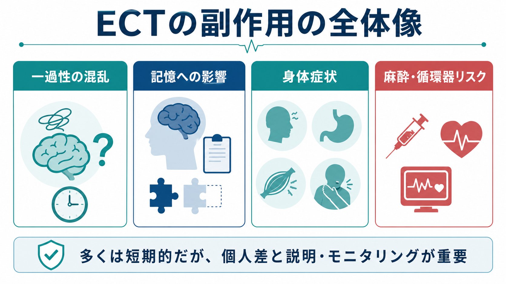
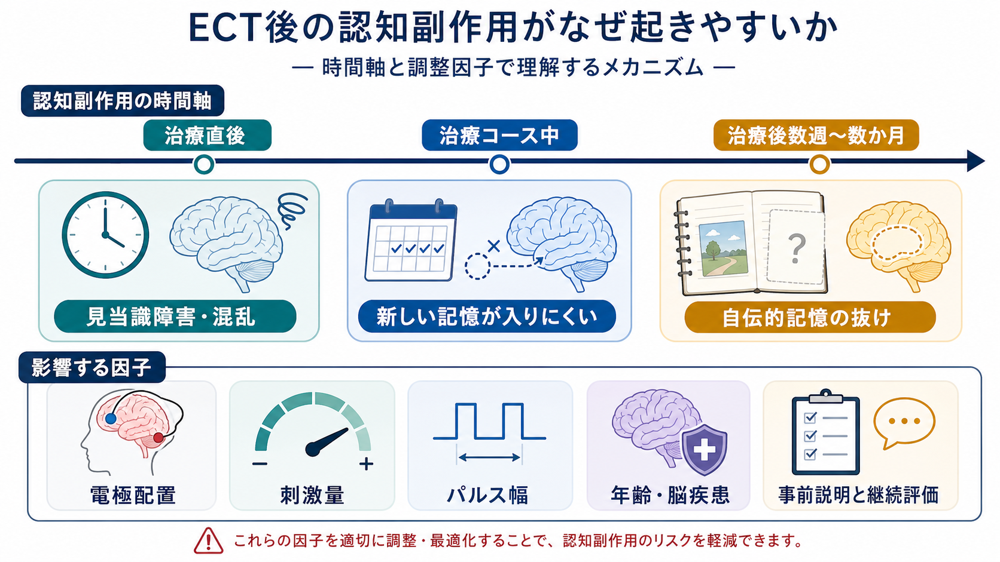

# ECTの副作用には何があるのか

## 要点

- [[電気けいれん療法ECTとは何か|ECT]]の副作用は、治療直後の混乱、前向性・逆向性健忘、頭痛、筋肉痛、悪心、歯・舌・顎の損傷、麻酔関連リスク、血圧・脈拍変動などに分けて考える。
- もっとも説明とモニタリングが重要なのは、認知・記憶への影響である。多くは短期的に改善するが、自伝的記憶の抜けが長く残る人もいるため、軽視してよい副作用ではない[1][2][3][4]。
- ECTは全身麻酔と筋弛緩薬を用いる医療手技であり、麻酔、循環器、呼吸器、神経疾患、妊娠、フレイルなどの身体リスクを事前評価する必要がある[1][7][8]。
- 副作用リスクは、電極配置、刺激量、パルス幅、治療回数、年齢、既存の脳疾患や認知機能、併存身体疾患で変わる[2][4][5][6]。

## この記事で答える問い

ECTの副作用は「記憶が悪くなること」だけではない。この記事では、[[ECTの適応はどう判断するか|ECTの適応判断]]や[[身体療法のインフォームドコンセントでは何を説明するか|身体療法のインフォームドコンセント]]で説明すべき副作用を、臨床で使いやすい分類で整理する。

## まず結論

ECTの副作用は、短期の身体症状と、個人差の大きい認知・記憶症状を分けて説明するのが実用的である。頭痛、筋肉痛、顎の痛み、悪心、眠気、治療直後の混乱は比較的よくみられ、通常は短時間から数日以内に軽快する。一方、記憶への影響は「新しいことを覚えにくい」「治療前後の出来事を思い出しにくい」「人生上の出来事の記憶が抜ける」という複数の形をとり、回復の時間経過にも個人差がある[3][4][5]。

NICEは、ECT実施前に麻酔リスク、併存症、予想される有害事象、特に認知機能障害、治療しないリスクを文書化して検討すること、治療中も認知機能を継続的に評価することを求めている[1]。したがってECTの副作用説明は、「安全だから心配ない」でも「危険だから行うべきでない」でもなく、症状の重さ、代替治療、迅速な反応の必要性、本人の価値観を含めたリスク・ベネフィット評価として扱う。

## 背景

現代のECTは、初期の無麻酔・高用量のイメージとは異なり、短時間作用性の全身麻酔、筋弛緩薬、酸素化、心電図・血圧・酸素飽和度・脳波などのモニタリング下で行われる[7][8]。このため骨折や重篤な身体損傷は大きく減ったが、手技としての麻酔リスクと、発作誘発に伴う循環動態変化は残る。

ECTの副作用を理解するときに難しいのは、治療対象となる重症うつ病、躁病、カタトニア、精神病性症状そのものが、睡眠、注意、記憶、食事、身体状態を悪化させうる点である。例えば治療前から[[認知機能障害とは何か|認知機能障害]]や[[記憶障害とは何か|記憶障害]]がある場合、治療後の変化をECTだけに帰属できないことがある[3][4]。だからこそ、治療前のベースライン評価と、治療中・治療後の反復評価が重要になる。

## 基本概念

### 治療直後の混乱

治療直後には、麻酔からの覚醒、発作後状態、疾患背景の影響が重なり、見当識障害、ぼんやりする感じ、会話内容を覚えていない状態が起こりうる。RCPsychは、ECT直後の混乱は特に高齢者で目立ちやすく、通常は短時間で軽快すると説明している[3]。ただし高齢者、脳血管障害、認知症、せん妄リスク、身体合併症がある場合は、混乱が長引く可能性を考える。

### 記憶への影響

記憶の副作用は、少なくとも三つに分けると整理しやすい。

| 種類 | 内容 | 臨床での見え方 |
|---|---|---|
| 治療直後の見当識障害 | 覚醒後に場所・時間・状況が分かりにくい | 「ここはどこか」「何をしたのか」が分からない |
| 前向性健忘 | 治療コース中や直後に新しい情報を覚えにくい | 面会、説明、予定を忘れる |
| 逆向性健忘・自伝的記憶の抜け | 治療前の出来事、特に治療前後の生活史を思い出しにくい | 入院前後の出来事、仕事・家族行事の記憶が抜ける |

系統的レビューでは、標準化された認知検査上の低下は治療終了直後、とくに0から3日で目立ち、その後は多くの領域でベースラインへ戻る傾向が示されている[5]。一方で、Porterらは、自伝的記憶の障害は標準的な神経心理検査だけでは捉えにくく、本人にとって重大な副作用になりうると論じている[4]。したがって「検査値が戻った」ことと「本人が生活史の記憶喪失を問題にしていない」ことは同じではない。

### 身体症状

よく説明される短期副作用には、頭痛、筋肉痛、顎の痛み、悪心・嘔吐、疲労感、眠気がある[3][7]。筋弛緩薬を使っても、咬筋や筋肉の収縮、発作後の筋痛、麻酔薬の影響は完全にはなくならない。多くは対症療法で対応可能だが、既往の片頭痛、顎関節症、歯科的問題、嘔吐・誤嚥リスクがある場合は事前に共有しておく。

### 麻酔・循環器・呼吸器リスク

ECTは短時間の手技だが、全身麻酔を伴う。事前評価では、心筋虚血、不整脈、心不全、重い肺疾患、頭蓋内圧上昇、脳血管病変、妊娠、フレイル、薬剤相互作用などを確認する[7]。ECT中は発作に伴い、一時的な徐脈、頻脈、高血圧、心筋酸素需要の増加が起こりうる[7]。日本のm-ECT麻酔に関する報告でも、安全性向上には全身状態の把握、麻酔科・内科との連携、合併症予防が重要とされる[8]。

## 仕組み

認知副作用が起きる理由は一つではない。ECTは治療上必要な全般化発作を誘発し、その前後に脳活動、神経伝達、睡眠、麻酔、循環動態が変化する。治療直後の混乱は、発作後状態と麻酔覚醒が重なることで説明しやすい。治療コース中の前向性健忘は、新しい情報の符号化と保持が一時的に不安定になることと関係する。逆向性健忘や自伝的記憶の抜けは、治療前後の個人的出来事の想起に関わるネットワークへの影響として臨床的に問題になる[4][5]。

副作用の強さは治療条件にも左右される。両側性ECTは右片側性ECTより認知副作用が強くなりやすく、刺激量が発作閾値を大きく上回るほど認知副作用が増える傾向がある[2][6][7]。超短パルス右片側性ECTは認知副作用を減らす方向に働きうるが、効果発現の速さや十分な治療効果とのバランスを考える必要がある[4][6]。

## 図解

上の1枚目は、ECT副作用を「認知・記憶」「身体症状」「麻酔・循環器」「モニタリング」の四つに分けた概念地図である。2枚目は、認知副作用を治療直後、治療コース中、治療後数週から数か月という時間軸で整理し、電極配置、刺激量、パルス幅、年齢・脳疾患などの調整因子を示している。

画像内の語句は要約用であり、実際の説明では、本人の病状、治療しないリスク、代替治療、同意能力、家族・支援者の関与、治療中止基準を個別に確認する。

## 臨床・研究との接続

ECTの副作用管理は、実施前、治療コース中、終了後で分けると漏れが少ない。

| 時点 | 確認すること | 目的 |
|---|---|---|
| 実施前 | 既往歴、内服、麻酔リスク、歯科・顎関節、認知機能、本人が守りたい記憶 | ベースラインとリスク説明を明確にする |
| 各セッション後 | 見当識、頭痛、筋痛、悪心、血圧・脈拍、せん妄徴候 | 急性副作用を早期に拾う |
| コース中 | 症状改善、記憶の訴え、刺激条件、治療回数 | 効果と副作用の釣り合いを見直す |
| 終了後 | 日常生活上の記憶困難、自伝的記憶、復職・運転・重要判断の可否 | 長引く影響と支援ニーズを確認する |

認知副作用が問題になる場合、臨床では刺激条件の調整、右片側性や超短パルスへの変更、治療間隔や回数の再検討、治療終了の判断、神経心理評価への紹介などが検討される[1][3][4]。ただし、症状が生命に関わるほど重い場合や、カタトニア、拒食・脱水、強い自殺リスクがある場合には、治療しないリスクも大きい。ECTの副作用評価は、[[薬物療法のリスクベネフィットをどう考えるか|リスクベネフィット]]を動的に見直す作業である。

## よくある誤解

### 「ECTは現代では副作用がほとんどない」

現代の修正型ECTは、麻酔と筋弛緩により身体損傷リスクを大きく減らしている。しかし、認知・記憶副作用、麻酔関連リスク、循環動態変化は残る。特に記憶への影響は本人の生活史やアイデンティティに関わるため、頻度だけでなく意味の大きさを説明する必要がある[3][4]。

### 「記憶障害は必ず永続する」

標準化された認知検査では、治療直後の低下が多く、数日から数週間で回復する傾向が報告されている[5]。ただし、自伝的記憶の抜けは長く残ることがあり、個人差も大きい[3][4]。したがって「必ず戻る」と断定せず、「多くは改善するが、残る場合もある」と説明するのが妥当である。

### 「副作用が出たら必ず中止する」

副作用は中止の重要な理由になりうるが、常に即中止とは限らない。NICEは、治療反応が得られたとき、または有害作用の証拠があるときには、より早く終了することを含めて評価するよう求めている[1]。実際には、刺激条件の変更、治療間隔の調整、身体合併症対応、本人・家族との再説明を含めて判断する。

## 関連ノート

- [[電気けいれん療法ECTとは何か]]
- [[ECTの適応はどう判断するか]]
- [[身体療法のインフォームドコンセントでは何を説明するか]]
- [[rTMSの安全性と副作用は何か]]
- [[記憶障害とは何か]]
- [[認知機能障害とは何か]]
- [[薬剤副作用の早期発見はどう行うか]]
- [[身体合併症は精神科診療でなぜ重要なのか]]

## MOC更新候補

- `content/00_MOC/` 配下の臨床実践、身体療法、神経調節、精神科治療に関するMOCへ追加候補。
- 並列生成ジョブとの競合を避けるため、本記事ではMOCファイル自体は更新しない。

## 理解チェック

1. ECTの記憶副作用を、治療直後の混乱、前向性健忘、逆向性健忘・自伝的記憶の抜けに分けると、それぞれ何が違うか。
2. 頭痛、筋肉痛、悪心などの短期身体症状と、麻酔・循環器リスクはどのように説明を分けるべきか。
3. 両側性ECT、右片側性ECT、刺激量、パルス幅は、認知副作用のリスクと治療効果のバランスにどう関わるか。
4. 「ECTをしないリスク」も副作用説明に含めるべきなのはなぜか。

## 未解決問題

- 自伝的記憶の長期的変化を、本人の主観的苦痛と標準化検査の両方でどう測定するか。
- 認知副作用を減らしながら、重症例で十分な速効性を保つ刺激条件をどう個別化するか。
- 高齢者、脳血管障害、認知症、発達障害、頭部外傷歴をもつ人で、ECT後の認知リスクをどう予測するか。
- ECTを受けた本人の経験を、同意説明、治療中止基準、治療後支援にどう反映するか。

## 参考文献

[1] National Institute for Health and Care Excellence. *Guidance on the use of electroconvulsive therapy: 1 Guidance* (TA59). 2003, updated 2009. https://www.nice.org.uk/guidance/ta59/chapter/1-Guidance

[2] National Institute for Health and Care Excellence. *Guidance on the use of electroconvulsive therapy: 4 Evidence and interpretation* (TA59). 2003, updated 2009. https://www.nice.org.uk/guidance/ta59/chapter/4-evidence-and-interpretation

[3] Royal College of Psychiatrists. *Electroconvulsive therapy (ECT)*. https://www.rcpsych.ac.uk/mental-health/treatments-and-wellbeing/ect

[4] Porter, R. J., Baune, B. T., Morris, G., et al. (2020). Cognitive side-effects of electroconvulsive therapy: what are they, how to monitor them and what to tell patients. *BJPsych Open*, 6(3), e40. https://doi.org/10.1192/bjo.2020.17

[5] Semkovska, M., & McLoughlin, D. M. (2010). Objective cognitive performance associated with electroconvulsive therapy for depression: a systematic review and meta-analysis. *Biological Psychiatry*, 68(6), 568-577. https://doi.org/10.1016/j.biopsych.2010.06.009

[6] Sackeim, H. A., Prudic, J., Nobler, M. S., et al. (2008). Effects of pulse width and electrode placement on the efficacy and cognitive effects of electroconvulsive therapy. *Brain Stimulation*, 1(2), 71-83. https://doi.org/10.1016/j.brs.2008.03.001

[7] Salik, I., & Marwaha, R. (2022). Electroconvulsive Therapy. In *StatPearls*. StatPearls Publishing. https://www.ncbi.nlm.nih.gov/books/NBK538266/

[8] 鮫島達夫・一瀬邦弘・奥村正紀ほか. (2012). 修正型電気けいれん療法（m-ECT）の麻酔法の現況と今後のあり方. *総合病院精神医学*, 24(2), 110-117. https://doi.org/10.11258/jjghp.24.110
