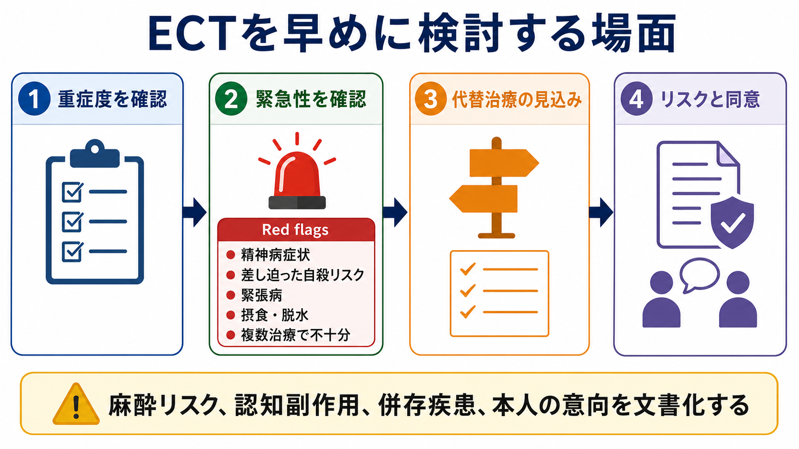
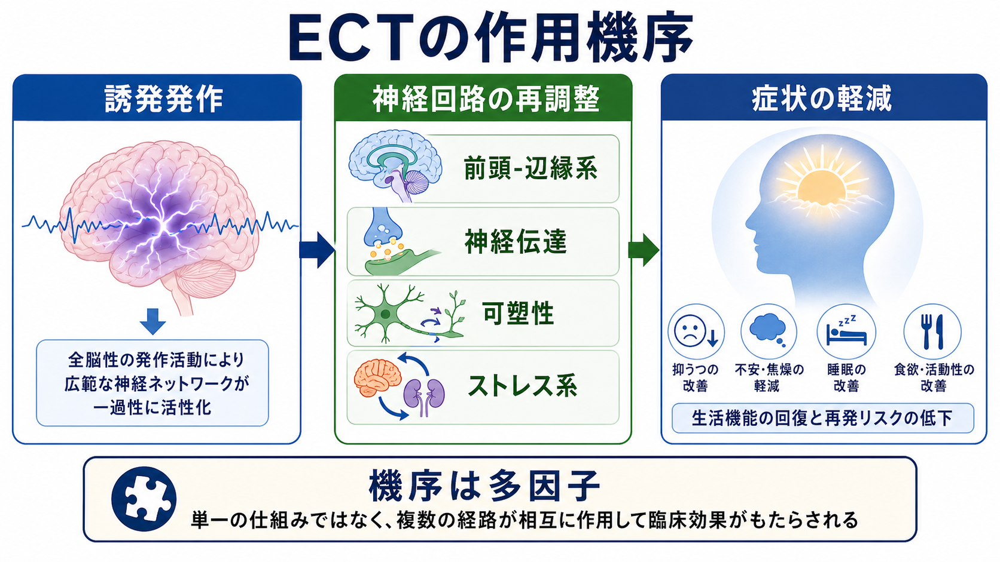

# ECTの適応はどう判断するか

## 要点

- ECT（electroconvulsive therapy, 電気けいれん療法）は、「最後の手段」ではなく、重症度・緊急性・治療抵抗性・安全性のバランスで早めに検討される身体療法である。
- 特に、精神病性うつ病、差し迫った自殺リスク、緊張病、摂食・脱水・著しい衰弱、複数治療で不十分な重症うつ病では、適応判断の優先度が上がる[1][2]。
- 判断の核心は「診断名」だけでなく、「この患者で、ECTを遅らせるリスクが、ECTそのもののリスクを上回るか」である。
- 麻酔リスク、心血管・神経学的併存症、認知副作用、本人の価値観、同意能力、治療後の再発予防計画を文書化する必要がある[3]。

## この記事で答える問い

このノートでは、ECTの適応を次の問いに分解する。

1. どのような症例では ECT を早めに検討するのか。
2. 精神病性うつ病、自殺リスク、緊張病、治療抵抗性は、それぞれどう判断に効くのか。
3. 「効く可能性」と「リスク・同意・代替治療」をどう並べて考えるのか。

## まず結論

ECTの適応判断は、次の4点を同時に見ると整理しやすい。

| 判断軸 | ECTを検討しやすい所見 | 注意点 |
|---|---|---|
| 重症度 | 精神病症状、昏迷、拒食・脱水、著しい衰弱、入院を要する重症うつ病 | 症状の重さだけでなく、生命・身体リスクを評価する |
| 緊急性 | 差し迫った自殺リスク、緊張病、急速な機能低下、薬物療法を待てない状態 | 「数週間待てるか」を臨床的に判断する |
| 治療抵抗性 | 十分量・十分期間の薬物療法や心理社会的介入で不十分 | ただし緊急例では複数治療の失敗を待たない |
| 安全性と同意 | 他治療のリスクが高い、過去にECT反応良好、本人が希望 | 麻酔・認知副作用・併存疾患・意思決定支援を文書化する |

## 背景

ECTは、全身麻酔と筋弛緩のもとで治療的な発作を誘発する精神科身体療法である。現代の修正型ECTは、麻酔、筋弛緩、酸素化、循環管理、発作モニタリングを伴う医療手技であり、歴史的な無麻酔のイメージとは区別して理解する必要がある[4]。

ガイドライン上、重症大うつ病では、緊張病、精神病性うつ病、重度の自殺傾向、過去のECT良好反応、医学的・精神医学的に迅速で確実な反応が必要な場合、複数の抗うつ薬への反応不良または忍容性不良などで ECT が推奨される[1]。NICEも、緊張病や重症・遷延性躁病では、他治療が無効または生命を脅かす状態で、迅速な短期改善を得る目的で ECT を用いると整理している[3]。

重要なのは、ECTの位置づけを「強い治療だから最後」ではなく、「遅らせることで不可逆的な損失が生じうるときに、早く検討すべき治療」として捉えることである。

## 基本概念

### 精神病性うつ病

精神病性うつ病では、妄想、幻覚、強い罪業感、貧困妄想、身体妄想などにより、食事・服薬・安全確保が難しくなることがある。CORE研究では、単極性大うつ病に対する急性期ECTで、精神病性うつ病の寛解率は非精神病性うつ病より高く、改善も早いと報告された[5]。このため、精神病症状を伴う重症うつ病では、薬物療法のみで長く待つより、ECTを早めに治療選択肢へ入れる。

ただし、精神病性うつ病だから自動的にECTという意味ではない。抗うつ薬と抗精神病薬の併用、入院環境、身体状態、同意能力、本人の希望を評価し、治療選択肢の一つとして位置づける。

### 希死念慮・自殺リスク

ECTは「自殺そのものを単独で治療する手技」ではなく、重症うつ病や精神病症状に伴う自殺念慮を、症状全体の改善を通じて短期間で下げうる治療である。CORE研究では、単極性うつ病患者444名のうち、治療前に強い自殺念慮・自殺企図を報告した患者で、ECT開始後1週、2週、治療終了時に自殺念慮の消失が段階的に増えた[6]。

臨床的には、差し迫った自殺リスク、保護入院が必要な水準の危険性、妄想に基づく自殺企図、拒食・脱水、強い焦燥や昏迷がある場合、ECTを「通常治療が失敗した後」ではなく、早期選択肢として検討する。

### 緊張病

緊張病は、無動、無言、拒絶、姿勢保持、蝋屈症、常同、興奮、自律神経症状などを示す症候群で、気分障害、精神病性障害、神経疾患、身体疾患、薬剤・物質関連状態にまたがる。BAPの緊張病ガイドラインは、緊張病の治療を速やかに開始し、第一選択としてベンゾジアゼピン系薬と ECT のいずれか、または両方を考えると整理している[2]。

悪性緊張病では、発熱、自律神経不安定、筋強剛、意識障害、脱水、横紋筋融解などが問題になりうる。ロラゼパム反応が不十分な場合には、ECTの遅れが致命的になりうるため、48-72時間以内のECT開始が推奨される場面がある[2]。

### 治療抵抗性

治療抵抗性うつ病では、十分量・十分期間の抗うつ薬、増強療法、心理療法、環境調整を経ても改善が乏しい場合に ECT が検討される。VA/DoDガイドラインは、複数の抗うつ薬への反応不良または忍容性不良をECT適応の一つとして挙げている[1]。

ここで注意すべきなのは、「治療抵抗性」は単に薬を何種類飲んだかではなく、診断の再評価、双極性、精神病症状、物質使用、身体疾患、服薬継続、心理社会的ストレス、治療用量・期間の妥当性を含む再評価を伴う概念だという点である。

## 仕組み

ECTの作用機序は単一ではない。治療的発作をきっかけに、前頭-辺縁系ネットワーク、神経伝達、神経内分泌、炎症、睡眠、神経可塑性などが多層的に変化すると考えられている[4]。これは、[[シナプス可塑性とは何か]]、[[GABAは脳で何をしているのか]]、[[神経伝達物質はどのように放出されるのか]]と接続して理解できる。

ただし、機序が多因子であることは、適応判断を曖昧にしてよいという意味ではない。臨床で最初に見るべきなのは、「この人に今、迅速な症状改善が必要か」「ECT以外の選択肢を待てるか」「ECTのリスクをどう最小化できるか」である。

## 図解

図解としては、次の2枚を使う。

1枚目は、重症度、緊急性、代替治療、リスクと同意を並べた実践フローである。ECTを検討する場面を、精神病症状、自殺リスク、緊張病、拒食・脱水、複数治療で不十分という赤旗として整理している。

2枚目は、ECTの作用を「誘発発作から神経回路の再調整、症状軽減へ」という単純な因果直線ではなく、神経伝達、可塑性、ストレス系、前頭-辺縁系の多層変化として整理する図である。

## 臨床・研究との接続

ECT適応を判断するときは、次の順番で考えると実務に落とし込みやすい。

1. まず、現在の危険性を評価する。自殺企図の切迫、拒食・脱水、昏迷、緊張病、精神病症状、興奮、身体衰弱があれば、治療を待つリスクが大きい。
2. 次に、診断と病態を再評価する。大うつ病、双極性うつ病、躁病、緊張病、統合失調症スペクトラム、薬剤性・身体疾患性の鑑別を行う。
3. そのうえで、代替治療の速度と見込みを比べる。薬物療法が有効でも発現に時間がかかる場合、生命・身体リスクが高い症例では ECT の優先度が上がる。
4. 最後に、リスク・同意・継続計画を文書化する。麻酔評価、認知機能評価、併存疾患、本人・家族への説明、アドバンスディレクティブ、治療後の薬物療法や維持療法を確認する[3][7]。

神経調節という広い枠組みでは、ECTは[[反復経頭蓋磁気刺激rTMSとは何か]]や[[トランスクラニアル磁気刺激TMSは何をしているのか]]より侵襲性が高いが、重症・緊急例での即効性と有効性が期待される治療である。したがって、軽症から中等症の外来うつ病でrTMSを検討する文脈と、精神病性うつ病・緊張病・切迫した自殺リスクでECTを検討する文脈は分けて考える。

## よくある誤解

### 「ECTは薬がすべて失敗してから使う」

治療抵抗性は重要な適応の一つだが、緊張病、精神病性うつ病、重度の自殺リスク、生命・栄養リスクでは、複数治療の失敗を待つこと自体が危険になりうる[1][2]。

### 「ECTは症状を一時的に消すだけで、あとは何もしなくてよい」

急性期ECTで寛解しても再発予防は必要である。治療後は、薬物療法、心理社会的支援、再発兆候の共有、維持ECTの要否などを検討する[7]。

### 「認知副作用があるから適応はほとんどない」

認知副作用は重要なリスクであり、治療前後の評価と説明が必要である。一方で、重症うつ病、緊張病、拒食・脱水、自殺リスクを放置するリスクも評価しなければならない。NICEは、ECT判断では麻酔リスク、併存症、認知障害を含む有害事象、治療しないリスクを文書化するよう求めている[3]。

## 関連ノート

- [[反復経頭蓋磁気刺激rTMSとは何か]]
- [[トランスクラニアル磁気刺激TMSは何をしているのか]]
- [[TMSはうつ病治療でどの神経回路を狙っているのか]]
- [[シナプス可塑性とは何か]]
- [[GABAは脳で何をしているのか]]
- [[神経伝達物質はどのように放出されるのか]]

## MOC更新候補

- [[MOC｜臨床実践・治療]]
- [[MOC｜精神医学]]
- [[MOC｜神経科学と精神疾患]]

## 理解チェック

1. ECTを「最後の手段」とだけ考えると、どのような症例で判断が遅れるか。
2. 精神病性うつ病でECTを早めに検討する理由は何か。
3. 緊張病でロラゼパム反応を見ながらも、ECT準備を遅らせてはいけない場面はどこか。
4. ECTの適応判断で、麻酔リスクや認知副作用と並べて必ず評価すべき「治療しないリスク」は何か。

## 未解決問題

- どの臨床指標を用いれば、ECTの早期導入が最も利益をもたらす患者を精密に予測できるか。
- 認知副作用を最小化しながら、重症例での速効性を保つ刺激条件・電極配置・治療間隔はどこまで個別化できるか。
- ECT後の再発予防として、薬物療法、維持ECT、心理社会的介入をどう組み合わせるのが最適か。

## 参考文献

[1] VA/DoD. (2022). *VA/DoD Clinical Practice Guideline for the Management of Major Depressive Disorder*. https://www.healthquality.va.gov/guidelines/MH/mdd/

[2] Rogers, J. P., Oldham, M. A., Fricchione, G., et al. (2023). Evidence-based consensus guidelines for the management of catatonia: Recommendations from the British Association for Psychopharmacology. *Journal of Psychopharmacology, 37*(4), 327-369. https://doi.org/10.1177/02698811231158232

[3] NICE. (2003, updated 2009). *Guidance on the use of electroconvulsive therapy*. Technology appraisal guidance TA59. https://www.nice.org.uk/guidance/ta59

[4] Kritzer, M. D., Peterchev, A. V., & Camprodon, J. A. (2023). Electroconvulsive Therapy: Mechanisms of Action, Clinical Considerations, and Future Directions. *Harvard Review of Psychiatry, 31*(3), 101-113. https://doi.org/10.1097/HRP.0000000000000365

[5] Petrides, G., Fink, M., Husain, M. M., et al. (2001). ECT remission rates in psychotic versus nonpsychotic depressed patients: A report from CORE. *Journal of ECT, 17*(4), 244-253. https://doi.org/10.1097/00124509-200112000-00003

[6] Kellner, C. H., Fink, M., Knapp, R., et al. (2005). Relief of expressed suicidal intent by ECT: A consortium for research in ECT study. *American Journal of Psychiatry, 162*(5), 977-982. https://doi.org/10.1176/appi.ajp.162.5.977

[7] Thirthalli, J., Sinha, P., & Sreeraj, V. S. (2023). Clinical Practice Guidelines for the Use of Electroconvulsive Therapy. *Indian Journal of Psychiatry, 65*(2), 258-269. https://doi.org/10.4103/indianjpsychiatry.indianjpsychiatry_491_22
