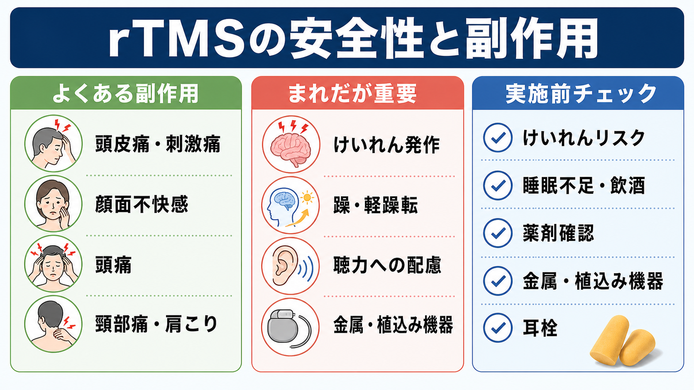
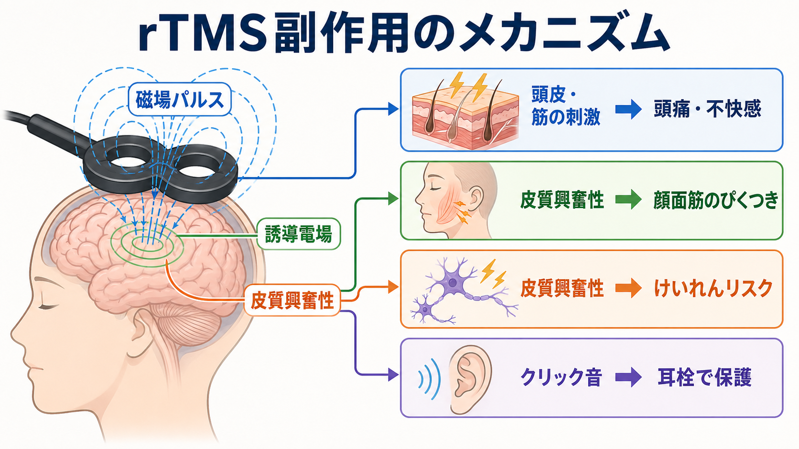
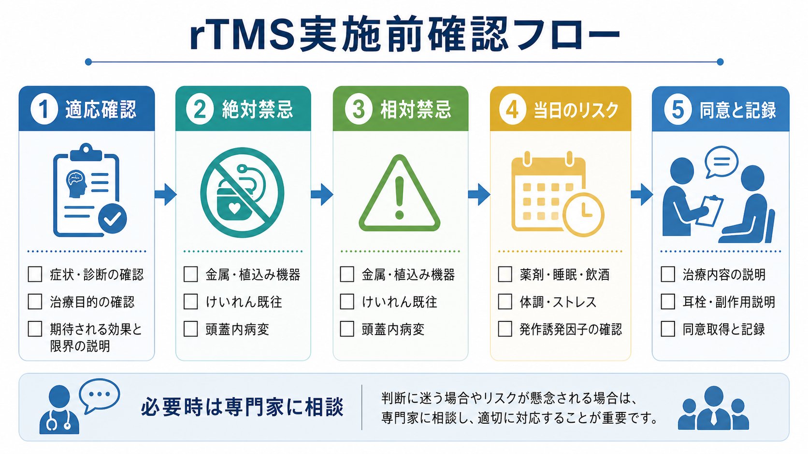

# rTMSの安全性と副作用は何か

## 要点

- [[反復経頭蓋磁気刺激rTMSとは何か|rTMS]]は、麻酔を用いず外来で実施されることが多い非侵襲的な神経調節法であり、適切なスクリーニングと刺激条件の管理を前提に、重篤な有害事象はまれとされる[1][2]。
- よくある副作用は、頭皮痛・刺激痛、顔面不快感、頭痛、頸部痛・肩こり、刺激中のクリック音に関連する不快感である[1][3]。
- 最も重視すべきまれなリスクは、けいれん発作である。リスクは刺激条件だけでなく、てんかん既往、脳病変、睡眠不足、飲酒、薬剤、代謝異常などに左右される[1][4]。
- 金属・電子機器の植込み、頭蓋内金属、てんかんリスク、双極性障害における躁転リスク、妊娠、重い身体疾患などは、実施前に系統的に確認する[1][5]。
- 本記事は教育・研究目的の整理であり、個別の適応判断や治療指示ではない。

## この記事で答える問い

この記事では、rTMSを実施する前に「何を安全確認すべきか」を中心に整理する。焦点は、(1)よくある副作用、(2)まれだが重要な有害事象、(3)禁忌・注意事項、(4)説明と同意に含めるべき論点である。

## まず結論

rTMSの安全性は「刺激そのものが常に安全」という意味ではなく、対象者、刺激部位、頻度、強度、列車時間、休止時間、併存疾患、薬剤、当日の状態を合わせて管理したときに、許容可能なリスクに近づくという意味で理解するのがよい[1]。臨床で最初に確認するべきことは、頭蓋内・頭頸部の金属や電子機器、けいれんリスク、双極性障害や躁・軽躁歴、薬剤、睡眠不足・飲酒・発熱などの当日要因である[1][5]。

## 背景

rTMSは、コイルから生じる急速な磁場変化によって脳内に誘導電場を作り、皮質興奮性や脳ネットワークの状態を変化させる方法である。[[TMSはうつ病治療でどの神経回路を狙っているのか|うつ病治療でのTMS]]では、左背外側前頭前野への高頻度刺激や右前頭前野への低頻度刺激などが用いられてきた[6]。

安全性の議論では、研究用TMSと臨床用rTMSを分けて考える必要がある。研究では健康参加者を対象に多様な刺激条件を探索する一方、臨床では診断、適応、除外基準、治療プロトコル、緊急時対応が定められる。日本では、うつ病に対するrTMSの適正使用について、2024年改訂の指針が公開されており、適応、禁忌、実施体制、説明事項が整理されている[5]。

## 基本概念

### よくある副作用

もっとも多いのは、刺激部位周辺の頭皮痛、刺激痛、顔面不快感、頭痛である。これはコイル下の頭皮・筋・末梢神経が刺激されること、刺激中のクリック音、同じ姿勢で治療を受けることなどと関係する[1][3]。多くは軽度から中等度で、治療継続中に慣れることもあるが、痛みを我慢させる前提で進めるものではない。

刺激中には顔面筋のぴくつき、眼周囲や顎周囲の違和感が出ることがある。これは脳の「治療効果」そのものではなく、コイル位置や刺激強度によって頭皮・筋・末梢神経が同時に刺激されるために起こることが多い。

### まれだが重要な副作用

最も重要なのはけいれん発作である。安全性ガイドラインでは、TMS関連けいれんはまれだが、刺激条件が安全範囲を超える場合、けいれん閾値を下げる薬剤や状態がある場合、既往歴や脳病変がある場合に注意が必要とされる[1][4]。[[てんかんに伴う精神症状とは何か|てんかん]]の既往がある人では、単純な「可・不可」ではなく、疾患の安定性、発作型、服薬、刺激条件、実施目的を専門的に評価する。

うつ病治療としてのrTMSでは、気分の高揚、焦燥、不眠、躁・軽躁転にも注意する。特に[[双極性障害とは何か|双極性障害]]や[[軽躁状態とは何か|軽躁状態]]の既往がある場合、抗うつ治療全般と同様に、気分エピソードの評価と経過観察が必要である[5]。

### 禁忌と注意事項

絶対禁忌として最も典型的なのは、刺激部位近傍の強磁性金属や、TMSの磁場で作動に影響を受けうる植込み型電子機器である[1][7]。例として、頭蓋内電極、脳深部刺激装置、人工内耳、植込み型薬剤ポンプ、ペースメーカーや除細動器などは、機器の種類、位置、製造元情報、磁場との距離を慎重に確認する。

相対禁忌・慎重判断には、けいれん既往、脳腫瘍・脳梗塞・頭部外傷などの頭蓋内病変、けいれん閾値を下げうる薬剤、物質使用、睡眠不足、発熱、代謝異常、妊娠、重い身体疾患、同意能力に関わる状態などが含まれる[1][5]。これらは一律に禁止というより、実施目的と代替手段、リスク軽減策、緊急時対応を含めて判断する領域である。

## 仕組み

rTMSの副作用は、主に四つの経路で理解できる。

第一に、磁場パルスは脳内に誘導電場を生じ、皮質興奮性を変化させる。治療目的ではこの変化を利用するが、条件によっては神経活動の過剰な同期化が起こり、けいれんリスクにつながる可能性がある[1]。

第二に、コイル直下の頭皮、筋、末梢神経も刺激される。これが頭皮痛、刺激痛、顔面筋のぴくつき、不快感の主な原因になる[1]。

第三に、TMSコイルは刺激時にクリック音を発する。聴覚保護を行わない場合、音による不快感や聴覚への負担が問題になるため、耳栓などの保護が推奨される[1][7]。

第四に、うつ病治療の文脈では、脳ネットワークへの作用と気分状態の変化を区別して観察する必要がある。改善と副作用の境界が曖昧になりうるため、不眠、焦燥、活動性増加、衝動性、躁・軽躁症状を治療前後で追う。

## 図解

実施前確認は、単なる問診票の記入ではなく、「適応」「禁忌」「相対リスク」「当日の状態」「説明と記録」を順に確認するプロセスである。特に並列して確認すべきなのは、金属・植込み機器、けいれん既往、頭蓋内病変、薬剤、睡眠、飲酒、耳栓などの聴覚保護、副作用説明である。

## 臨床・研究との接続

臨床では、rTMSは[[治療抵抗性うつ病とは何か|治療抵抗性うつ病]]などで検討されることが多い。しかし、安全確認は適応確認と同じくらい重要である。例えば、薬物療法で十分に改善しないうつ病に対してrTMSを検討する場合でも、[[双極性障害とうつ病はどう鑑別するのか|双極性障害との鑑別]]、けいれんリスク、頭蓋内病変、植込み機器、現在の薬剤、同意能力を確認せずに始めるべきではない[5]。

研究では、刺激パラメータ、個人差、神経画像に基づくターゲティング、シータバースト刺激などが検討されている。新しいプロトコルは有効性だけでなく、安全性データの蓄積が必要であり、既存ガイドラインの範囲を超える刺激では倫理審査、モニタリング、停止基準が重要になる[1][6]。

## よくある誤解

### 「非侵襲的だからリスクはない」

非侵襲的とは、頭蓋内に電極を入れないという意味であり、リスクがゼロという意味ではない。rTMSには頭痛・痛み・聴覚負担・けいれん発作などのリスクがある[1][7]。

### 「頭痛が出たら効いている証拠である」

頭痛や刺激痛は効果の指標ではない。コイル位置、刺激強度、頭皮・筋刺激、姿勢、緊張などで生じうる副作用として扱う。

### 「けいれんは刺激機器だけで決まる」

けいれんリスクは、刺激条件だけでなく、個人の脳病変、てんかん既往、睡眠不足、飲酒、薬剤、代謝状態などの組み合わせで変わる[1][4]。

### 「金属があればすべて禁止である」

重要なのは金属の種類、位置、固定性、強磁性の有無、電子機器かどうかである。歯科金属のように通常問題になりにくいものもある一方、頭蓋内金属や植込み型電子機器は慎重な確認が必要である[1][7]。

## 関連ノート

- [[反復経頭蓋磁気刺激rTMSとは何か]]
- [[トランスクラニアル磁気刺激TMSは何をしているのか]]
- [[TMSはうつ病治療でどの神経回路を狙っているのか]]
- [[治療抵抗性うつ病とは何か]]
- [[双極性障害とうつ病はどう鑑別するのか]]
- [[てんかんに伴う精神症状とは何か]]
- [[インフォームドコンセントは精神科でどう行うのか]]
- [[ECTの副作用には何があるのか]]

## 理解チェック

1. rTMSで最も多い副作用は、どのような身体部位・刺激経路と関係するか。
2. けいれんリスクを評価するとき、刺激条件以外に何を確認すべきか。
3. 金属・植込み機器の確認で、単に「金属あり」と書くだけでは不十分な理由は何か。
4. うつ病治療としてrTMSを行う前に、双極性障害や躁・軽躁歴を確認する理由は何か。
5. 耳栓などの聴覚保護が安全確認に含まれる理由は何か。

## 参考文献

[1] Rossi S, Antal A, Bestmann S, et al. Safety and recommendations for TMS use in healthy subjects and patient populations, with updates on training, ethical and regulatory issues. *Clinical Neurophysiology*. 2021;132(1):269-306. https://doi.org/10.1016/j.clinph.2020.10.003

[2] Lefaucheur JP, Aleman A, Baeken C, et al. Evidence-based guidelines on the therapeutic use of repetitive transcranial magnetic stimulation (rTMS): An update. *Clinical Neurophysiology*. 2020;131(2):474-528. https://doi.org/10.1016/j.clinph.2019.11.002

[3] Perera T, George MS, Grammer G, Janicak PG, Pascual-Leone A, Wirecki TS. The Clinical TMS Society consensus review and treatment recommendations for TMS therapy for major depressive disorder. *Brain Stimulation*. 2016;9(3):336-346. https://doi.org/10.1016/j.brs.2016.03.010

[4] Lerner AJ, Wassermann EM, Tamir DI. Seizures from transcranial magnetic stimulation 2012-2016: Results of a survey of active laboratories and clinics. *Clinical Neurophysiology*. 2019;130(8):1409-1416. https://doi.org/10.1016/j.clinph.2019.03.016

[5] 日本精神神経学会. 反復経頭蓋磁気刺激療法（rTMS）適正使用指針 2024年4月改訂版. https://www.jspn.or.jp/uploads/uploads/files/activity/Guidelines_for_appropriate_use_of_rTMS_202404ver2.pdf

[6] O'Reardon JP, Solvason HB, Janicak PG, et al. Efficacy and safety of transcranial magnetic stimulation in the acute treatment of major depression: a multisite randomized controlled trial. *Biological Psychiatry*. 2007;62(11):1208-1216. https://doi.org/10.1016/j.biopsych.2007.01.018

[7] U.S. Food and Drug Administration. Class II Special Controls Guidance Document: Repetitive Transcranial Magnetic Stimulation (rTMS) Systems. https://www.fda.gov/regulatory-information/search-fda-guidance-documents/class-ii-special-controls-guidance-document-repetitive-transcranial-magnetic-stimulation-rtms-systems

## 未解決問題

- 個人の脳構造・薬剤・睡眠状態を統合した、けいれんリスクの定量的予測はまだ十分に確立していない。
- 新しい刺激プロトコルや加速型プロトコルでは、有効性と安全性を同時に追跡する実装研究が必要である。
- 臨床現場で、頭痛や不快感をどの程度まで許容し、どの時点で刺激条件を調整するかについては、施設ごとの手順化が重要である。

## MOC更新候補

- `content/00_MOC/` 配下の臨床実践・治療、神経調節、うつ病治療に関するMOCがあれば、バッチ統合時に本記事へのリンクを追加する。
