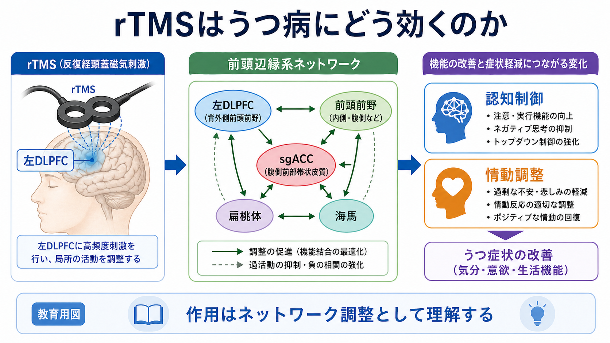
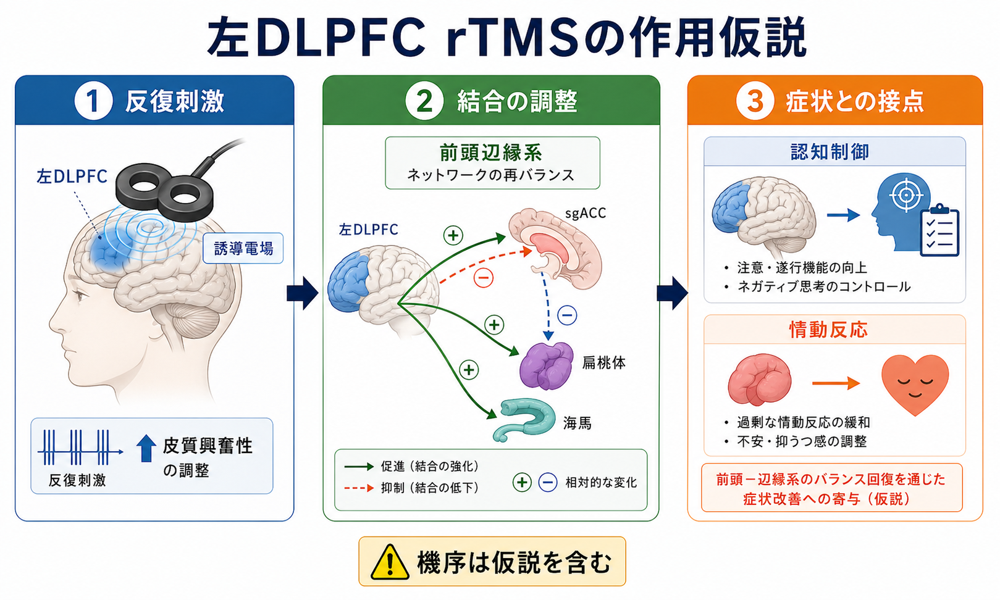
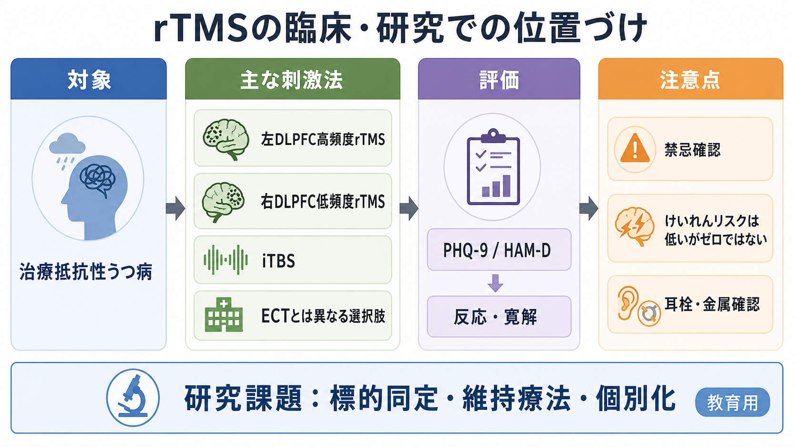

# rTMSはうつ病にどう効くのか

## 要点

- rTMS（repetitive transcranial magnetic stimulation; 反復経頭蓋磁気刺激）は、頭皮上のコイルから急速に変化する磁場を作り、皮質に誘導電場を生じさせる非侵襲的な神経調節法である。うつ病では主に左背外側前頭前野（left dorsolateral prefrontal cortex; 左DLPFC）高頻度刺激、右DLPFC低頻度刺激、iTBSなどが検討・使用されてきた[1][2]。
- 作用は「気分中枢を直接オンにする」というより、[[トランスクラニアル磁気刺激TMSは何をしているのか|TMS]]による局所皮質活動の調整が、DLPFC、膝下部前帯状皮質（subgenual anterior cingulate cortex; sgACC）、扁桃体、海馬などを含む前頭辺縁系ネットワークへ波及する、と理解するとよい[3][4]。
- 臨床的には、薬物療法や心理療法だけで十分に改善しない[[治療抵抗性うつ病とは何か|治療抵抗性うつ病]]に対する選択肢の一つであり、反応・寛解は期待できるが、個人差が大きく、効果を保証する治療ではない[1][2][5]。
- けいれんなどの重篤な有害事象はまれだが、金属・植込み機器・てんかん既往・薬剤・睡眠不足などの確認、耳栓などの聴覚保護、刺激条件の管理が不可欠である[6]。

## この記事で答える問い

1. なぜうつ病でDLPFCを刺激するのか。
2. DLPFC刺激はどのように前頭辺縁系へ波及すると考えられているのか。
3. rTMSは臨床ではどのような位置づけの治療なのか。
4. 「脳を磁気で治す」という説明のどこに注意が必要か。

## まず結論

rTMSは、うつ病の原因を単一の場所に見つけてそこを修理する治療ではない。より妥当には、**認知制御に関わるDLPFCを反復刺激し、sgACCや扁桃体を含む前頭辺縁系ネットワークの活動・結合のバランスを変える治療**として理解される。左DLPFC高頻度刺激やiTBSは、うつ病に対する有効性を示す研究とガイドライン上の支持を持つが、標的同定、維持療法、個別化、機序の詳細には未解決の点が残る[1][2][4][5]。

## 背景

うつ病では、気分の落ち込みだけでなく、意欲低下、快感消失、注意・遂行機能の低下、反すう、睡眠や食欲の変化が同時に現れる。これらは[[うつ病とは何か|うつ病]]を「気分だけの問題」としてではなく、情動、認知制御、身体状態、報酬処理を含むネットワークの変調として捉える必要があることを示している。

古典的な神経回路モデルでは、うつ病は前頭前野、帯状皮質、扁桃体、海馬、線条体などの機能的な不均衡として整理されてきた[3]。その中でDLPFCは、注意、作業記憶、遂行機能、ネガティブな情報へのトップダウン制御に関わる領域である。DLPFCを刺激標的にする発想は、DLPFCが孤立して「うつ気分」を作るからではなく、前頭辺縁系の結合構造の中で比較的アクセスしやすい皮質ノードだからである[2][4]。

## 基本概念

### rTMS

rTMSは、TMSパルスを一定の頻度と強度で反復して与える方法である。単発TMSが主に皮質興奮性や運動誘発電位の評価に使われるのに対し、rTMSは刺激後にも残る活動性・可塑性の変化を狙う。刺激の効果は、周波数、強度、総パルス数、刺激部位、コイル角度、脳の状態、薬剤、個人差に左右される[1][6]。

### DLPFC

DLPFCは背外側前頭前野で、実行機能、注意制御、作業記憶、反すうの制御に関わる。うつ病治療では、左DLPFCの活動低下、右前頭領域との左右差、DLPFCとsgACCの機能的結合などが、刺激標的を考える手がかりにされてきた[4]。

### 前頭辺縁系ネットワーク

前頭辺縁系ネットワークとは、前頭前野と、帯状皮質、扁桃体、海馬、線条体などの情動・記憶・価値づけに関わる領域との相互作用を指す実用的な呼び方である。[[扁桃体回路は情動をどう処理するのか|扁桃体]]は情動的な重要性の検出に、海馬は文脈記憶に、sgACCは気分状態や自律神経・内受容的な情動状態との関係で注目される。DLPFC刺激の効果は、このネットワークの一部に間接的に及ぶと考えられている[3][4]。

## 仕組み

### 1. コイルは皮質に誘導電場を作る

TMSコイルに短時間の大電流を流すと、急速に変化する磁場が生じる。その磁場は頭皮・頭蓋骨を比較的通過しやすく、脳内に誘導電場を作る。実際に神経活動を変える直接要因は磁場そのものではなく、誘導電場である[1][6]。

### 2. 反復刺激は皮質興奮性と可塑性を変える

反復刺激では、1回ごとのパルス反応だけでなく、刺激後に残る興奮性変化やシナプス可塑性様の変化が問題になる。高頻度rTMSやiTBSは一般に促通方向、低頻度rTMSやcTBSは抑制方向の効果を示しやすいと説明されるが、これは単純な固定法則ではない。個人の脳状態、刺激標的、薬剤、睡眠、疾患状態によって方向も大きさも変わる[1][2][6]。

### 3. DLPFC刺激はsgACCとの結合に注目される

うつ病rTMS研究で特に重要なのは、DLPFC内の標的位置が、sgACCとどのように機能的に結合しているかである。Foxらの研究は、抗うつ効果の高いDLPFC刺激部位がsgACCと強い負の機能的結合を示す傾向を報告し、刺激標的を「頭皮上の一点」ではなく「ネットワーク内のノード」として考える流れを強めた[4]。この考え方は[[機能的結合解析とは何か|機能的結合解析]]や[[安静時fMRIは何を測っているのか|安静時fMRI]]と接続している。

### 4. 症状改善は「認知制御」と「情動調整」の接点に現れる

DLPFCを刺激しても、扁桃体やsgACCを直接刺激しているわけではない。仮説としては、DLPFCを含む前頭前野ネットワークの調整を通じて、ネガティブ情報への注意固定、反すう、情動反応の過剰な持続、自律神経的な緊張が変わり、気分・意欲・生活機能の改善につながると考えられる[3][4]。ただし、どの患者でどの経路が主要かは一様ではない。

## 図解

上の1枚目は、rTMSを「DLPFCへの刺激」から「前頭辺縁系ネットワーク調整」へ広げて理解するための概念地図である。2枚目は、左DLPFC、sgACC、扁桃体、海馬の関係を、機序仮説として単純化した図である。

3枚目は、臨床・研究での位置づけをまとめる。実際の治療判断では、診断、重症度、希死念慮、双極性障害の可能性、薬物療法歴、身体合併症、金属・植込み機器、てんかんリスクなどを総合して検討する。この記事は教育・研究目的の整理であり、個別の診断や治療指示ではない。

## 臨床・研究との接続

### 治療抵抗性うつ病での選択肢

rTMSは、一般に薬物療法や心理療法で十分な改善が得られない大うつ病性障害の治療選択肢として位置づけられる。メタ解析やネットワークメタ解析では、複数のrTMSプロトコルがシャム刺激より有効であることが示されている[5]。ただし、研究間で対象、刺激条件、標的同定法、評価尺度、併用治療が異なるため、単一の効果量で全てを説明するのは難しい。

### iTBSという短時間プロトコル

iTBS（intermittent theta burst stimulation）は、短時間で実施できるTBSプロトコルである。THREE-D試験では、治療抵抗性うつ病に対してiTBSが従来型の10 Hz左DLPFC rTMSに対して非劣性であることが示され、臨床運用上の時間短縮という利点が注目された[7]。ただし、iTBSが全患者で同等に適するわけではなく、標的、忍容性、施設のプロトコル、既往歴を踏まえた判断が必要である。

### ECTとの違い

rTMSは[[深部脳刺激DBSは神経回路をどう調節するのか|DBS]]のような植込み手術でも、電気けいれん療法（ECT）のように全般発作を治療機序の一部として利用する治療でもない。ECTは重症例、精神病症状、緊急性の高い状態などで重要な選択肢になりうる一方、rTMSは外来で反復実施しやすい非侵襲的神経調節として位置づけられる。両者は競合する単純な上下関係ではなく、適応、緊急性、リスク、本人の希望、治療歴によって使い分けられる。

### 個別化の研究

現在の重要課題は、誰に、どの部位を、どの強度・頻度・期間で刺激するのがよいかを精密化することである。MRIに基づく標的同定、DLPFC-sgACC結合、症状次元、認知機能、脳状態依存性、維持療法の設計などが研究されている[4][6]。これは[[脳ネットワークの破綻は精神疾患をどう説明するのか|脳ネットワークの破綻]]を治療標的として扱う方向性ともつながる。

## よくある誤解

### 「磁気が直接うつ気分を消す」

正確ではない。rTMSは磁気そのもので気分を消すのではなく、誘導電場を通じて皮質活動を変え、その変化がネットワークを介して症状に関わると考えられる。

### 「DLPFCだけがうつ病の原因である」

正確ではない。DLPFCはアクセスしやすく、認知制御と前頭辺縁系結合に関わる重要ノードだが、うつ病はDLPFC単独の障害ではない。報酬系、睡眠、炎症、内分泌、ストレス、社会的要因も関わる。

### 「効果があるなら誰にでも効く」

正確ではない。臨床試験では平均的な有効性が示されても、個々の反応には大きな差がある。反応しない人もいるし、治療後に再燃する人もいる。評価尺度、生活機能、併用治療、維持方針を含めて考える必要がある[1][5]。

### 「安全だから確認は不要」

正確ではない。rTMSは非侵襲的で比較的安全な治療だが、けいれんリスク、頭痛、頭皮痛、聴覚保護、金属や植込み機器、薬剤、睡眠不足などの確認が必要である[6]。

## 関連ノート

- [[トランスクラニアル磁気刺激TMSは何をしているのか]]
- [[うつ病とは何か]]
- [[大うつ病性障害とは何か]]
- [[治療抵抗性うつ病とは何か]]
- [[機能的結合解析とは何か]]
- [[安静時fMRIは何を測っているのか]]
- [[扁桃体回路は情動をどう処理するのか]]
- [[脳ネットワークの破綻は精神疾患をどう説明するのか]]

## 理解チェック

1. rTMSで神経活動を変える直接要因は、磁場そのものではなく何か。
2. うつ病rTMSで左DLPFCが標的になりやすい理由を、前頭辺縁系ネットワークの観点から説明できるか。
3. DLPFC-sgACCの機能的結合は、刺激標的を考えるうえでどのような意味を持つか。
4. rTMS、iTBS、ECTの違いを、侵襲性、治療機序、臨床的位置づけから説明できるか。
5. rTMSの効果を「保証された局所修理」と説明してはいけない理由は何か。

## MOC更新候補

- `content/00_MOC/` の臨床実践・治療系MOCに本記事 `[[rTMSはうつ病にどう効くのか]]` を追加する。
- 神経調節、うつ病、治療抵抗性うつ病、脳ネットワーク、TMSの索引に関連づける。

## 未解決問題

- DLPFC-sgACC結合に基づく標的同定は、どの程度まで日常臨床で実装可能か。
- 初回治療後の維持rTMSは、どの間隔・期間・対象で最も有効か。
- 症状次元、認知機能、脳画像、EEG、薬物療法歴を組み合わせた反応予測はどこまで実用化できるか。
- うつ病のサブタイプごとに、左DLPFC、右DLPFC、両側刺激、iTBSの使い分けをどう設計すべきか。

## 参考文献

[1] Perera, T., George, M. S., Grammer, G., Janicak, P. G., Pascual-Leone, A., & Wirecki, T. S. (2016). The Clinical TMS Society consensus review and treatment recommendations for TMS therapy for major depressive disorder. *Brain Stimulation*, 9(3), 336-346. https://doi.org/10.1016/j.brs.2016.03.010

[2] Lefaucheur, J. P., Aleman, A., Baeken, C., Benninger, D. H., Brunelin, J., Di Lazzaro, V., et al. (2020). Evidence-based guidelines on the therapeutic use of repetitive transcranial magnetic stimulation (rTMS): An update. *Clinical Neurophysiology*, 131(2), 474-528. https://doi.org/10.1016/j.clinph.2019.11.002

[3] Mayberg, H. S. (1997). Limbic-cortical dysregulation: A proposed model of depression. *The Journal of Neuropsychiatry and Clinical Neurosciences*, 9(3), 471-481. https://doi.org/10.1176/jnp.9.3.471

[4] Fox, M. D., Buckner, R. L., White, M. P., Greicius, M. D., & Pascual-Leone, A. (2012). Efficacy of transcranial magnetic stimulation targets for depression is related to intrinsic functional connectivity with the subgenual cingulate. *Biological Psychiatry*, 72(7), 595-603. https://doi.org/10.1016/j.biopsych.2012.04.028

[5] Brunoni, A. R., Chaimani, A., Moffa, A. H., Razza, L. B., Gattaz, W. F., Daskalakis, Z. J., & Carvalho, A. F. (2017). Repetitive transcranial magnetic stimulation for the acute treatment of major depressive episodes: A systematic review with network meta-analysis. *JAMA Psychiatry*, 74(2), 143-152. https://doi.org/10.1001/jamapsychiatry.2016.3644

[6] Rossi, S., Antal, A., Bestmann, S., Bikson, M., Brewer, C., Brockmoller, J., et al. (2021). Safety and recommendations for TMS use in healthy subjects and patient populations, with updates on training, ethical and regulatory issues. *Clinical Neurophysiology*, 132(1), 269-306. https://doi.org/10.1016/j.clinph.2020.10.003

[7] Blumberger, D. M., Vila-Rodriguez, F., Thorpe, K. E., Feffer, K., Noda, Y., Giacobbe, P., et al. (2018). Effectiveness of theta burst versus high-frequency repetitive transcranial magnetic stimulation in patients with depression (THREE-D): A randomised non-inferiority trial. *The Lancet*, 391(10131), 1683-1692. https://doi.org/10.1016/S0140-6736(18)30295-2

[8] U.S. Food and Drug Administration. (2011). *Class II Special Controls Guidance Document: Repetitive Transcranial Magnetic Stimulation (rTMS) Systems*. https://www.fda.gov/regulatory-information/search-fda-guidance-documents/class-ii-special-controls-guidance-document-repetitive-transcranial-magnetic-stimulation-rtms-systems
