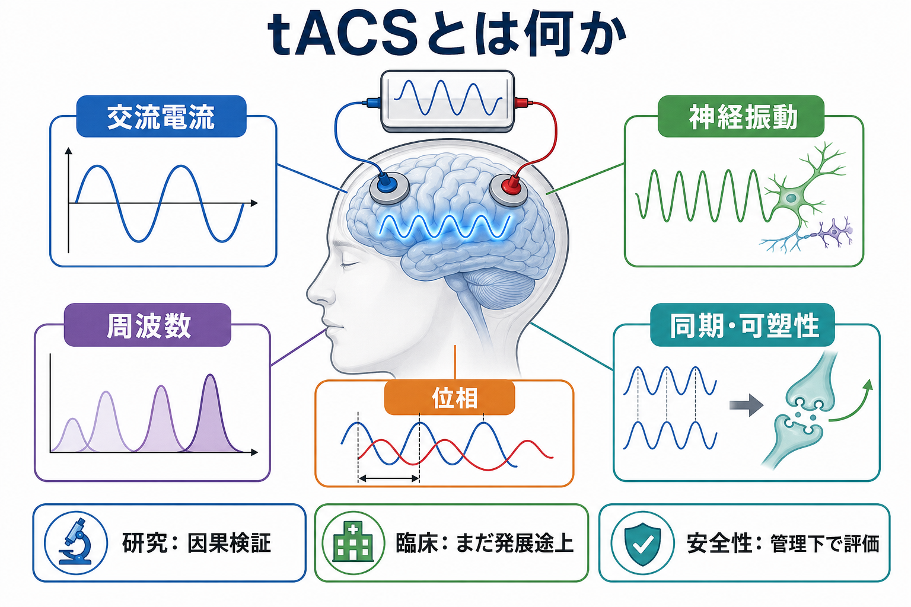
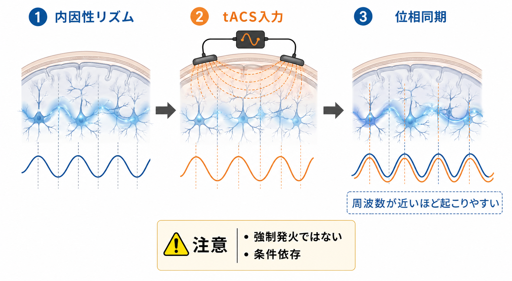
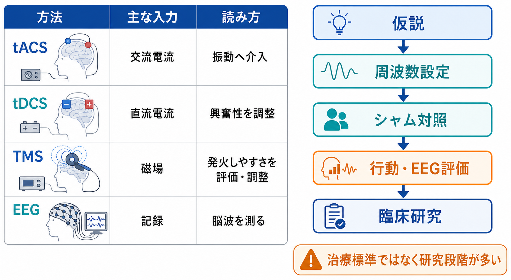

# tACSとは何か

## 要点

- tACS（transcranial alternating current stimulation; 経頭蓋交流電気刺激）は、頭皮上の電極から弱い交流電流を流し、[[神経振動とは何か|神経振動]]の周波数・位相・同期に介入しようとする非侵襲的脳刺激法である[1][2]。
- tDCS が直流電流で皮質興奮性をゆっくり偏らせる発想に近いのに対し、tACS は正弦波などの時間的に変化する電流で、脳内リズムの時間構造に合わせて働きかける点が特徴である[1][2]。
- 主要な考え方は、外部から与える振動が内因性リズムに近い周波数で入ると、位相がそろいやすくなり、刺激後の可塑的変化も生じうる、という「エントレインメント」と「状態依存的可塑性」である[2][3]。
- ただし、tACS は脳を直接「発火させる」方法ではない。効果は刺激周波数、電極配置、電流強度、課題中か安静時か、個人の基線リズム、シャム条件、測定法に強く依存する[3][5]。
- 臨床応用はうつ病、幻聴、統合失調症、睡眠、認知機能などで研究されているが、多くは研究段階であり、標準治療として確立している領域は限られる[7][8]。

## この記事で答える問い

1. tACS は、[[経頭蓋直流電気刺激tDCSは脳活動をどう変えるのか|tDCS]] や [[トランスクラニアル磁気刺激TMSは何をしているのか|TMS]] と何が違うのか。
2. 「神経振動を刺激する」とは、実際にはどのような仕組みを想定しているのか。
3. 臨床・精神医学研究で tACS を読むとき、何に注意すべきか。

## まず結論

tACS は、脳のリズムを外から「上書き」する装置ではなく、弱い交流電場を使って、すでに存在する脳内リズムの位相、同期、振幅、刺激後の可塑性を条件依存的に変えられるかを調べる方法である。したがって、tACS の効果を理解するには、「何 Hz で刺激したか」だけでなく、「どの脳領域にどの程度の電場が届いたか」「そのとき脳がどの状態だったか」「何をアウトカムとして測ったか」を同時に見る必要がある[1][3]。

この点で tACS は、[[脳波EEGは何を測っているのか|EEG]] や MEG で観察されるリズムと、行動・症状・ネットワーク機能との関係を因果的に検証するための手段として重要である[3][5]。一方で、臨床的には「特定の周波数を流せば症状が改善する」と単純化できる段階ではない。うつ病や幻聴への研究はあるが、試験規模、プロトコル、周波数、対象者、主要アウトカムがまだ不均一である[7][8]。

## 背景

脳活動は、単一ニューロンの発火だけでなく、多数のニューロン集団が時間的にまとまって活動するリズムとしても観察される。デルタ、シータ、アルファ、ベータ、ガンマなどの周波数帯域は、睡眠、注意、知覚、運動制御、記憶、予測処理などと関係するが、これらは単なる「ラベル」ではなく、神経回路の入力選択、情報統合、抑制、通信効率に関わる時間構造として理解される[1][3]。

従来の EEG 研究では、リズムと認知・症状の相関を調べることが多かった。しかし、相関だけでは「そのリズムが機能を支えているのか」「単に結果として変化しているだけか」は分からない。tACS は、特定の周波数・位相関係を外から操作し、その後の EEG や行動がどう変わるかを見ることで、神経振動の機能的役割を検証しようとする[3]。

## 基本概念

### tACS

tACS は、頭皮上に置いた複数の電極から、通常は 1-2 mA 程度の弱い交流電流を流す方法である。電流波形は正弦波が典型だが、研究目的に応じて周波数、位相、電極配置、刺激時間、強度、閉ループ制御などが変えられる[1][2]。

電流は頭皮、頭蓋骨、脳脊髄液、皮質を通って広がるため、電極の直下だけに作用するわけではない。実際にどの領域へどの向きの電場が届くかは、頭部形状、組織伝導率、電極サイズ、電極間距離、個人差に左右される[2]。このため、tACS 研究では電流分布モデルや個人 MRI に基づくシミュレーションが重要になる。

### tDCS、TMS、EEGとの違い

[[経頭蓋直流電気刺激tDCSは脳活動をどう変えるのか|tDCS]] は直流電流を用いて、膜電位や皮質興奮性を閾値未満で偏らせる発想が中心である。TMS は変化する磁場により脳内に誘導電場を作り、刺激条件によってはニューロン集団の発火を誘発できる。EEG は刺激ではなく記録法であり、頭皮上から同期したシナプス活動の総和を測る[1][2]。

tACS はこの中間に位置する。TMS のように強く発火を誘発するというより、tDCS と同じ低強度電気刺激の一種として、時間的に周期的な入力を与える。したがって、tACS の問いは「活動を増やすか減らすか」だけでなく、「いつ入力が届くと処理が変わるか」「どの周波数が回路の状態に合っているか」に向かう。

## 仕組み

### 1. エントレインメント

エントレインメントとは、外部から周期的な入力を受けた振動系が、その入力の周波数や位相に引き込まれる現象である。tACS では、外部から与える交流電場が、脳内の内因性リズムと近い周波数で入ると、ニューロン集団の発火しやすいタイミングがそろいやすくなると考えられている[2][5]。

ただし、これは「tACS がニューロンを毎周期強制的に発火させる」という意味ではない。低強度の電場は、ニューロンの膜電位をわずかに偏らせ、入力に反応しやすい時間窓を変える。したがって、効果は刺激前から存在するリズムの強さ、課題中の入力、覚醒水準、刺激部位の電場方向に依存する[2][3]。

### 2. 周波数特異性

tACS 研究では、アルファ帯域、シータ帯域、ガンマ帯域など、狙う機能仮説に応じて刺激周波数を決める。たとえば、個人のアルファ周波数に合わせた刺激が、刺激後のアルファ活動を高める可能性を示した研究がある[4]。また、同時 EEG を用いた研究では、刺激中のアーチファクトを処理しながら、10 Hz tACS が視覚関連の皮質活動へ与える影響を検討している[5]。

重要なのは、周波数名だけで効果を決めつけないことである。同じ「10 Hz」でも、後頭部への刺激、前頭部への刺激、安静時、課題中、閉眼、開眼、個人アルファ周波数とのずれによって意味が変わる。周波数は刺激パラメータであると同時に、仮説の表現でもある。

### 3. 位相とネットワーク同期

tACS は、単一領域のリズムだけでなく、複数領域間の位相関係を操作する目的でも使われる。2つの電極ペアや複数電極を用いて、領域間を同位相または逆位相で刺激し、結合や行動成績がどう変わるかを見る研究がある[3]。この発想は、[[神経同期とは何か|神経同期]]や communication-through-coherence の考え方と接続する。

ただし、位相同期が常に良いわけではない。過剰な同期は柔軟性を下げたり、病的リズムと関係したりする可能性がある。したがって、tACS で「同期を高める」ことは、文脈によって有益にも有害にもなりうる。

### 4. 刺激後効果と可塑性

tACS の効果は刺激中だけでなく、刺激終了後にも残ることがある。これは、単なる一時的な位相引き込みだけでなく、スパイクタイミング依存可塑性、シナプス効率、ネットワーク状態の変化が関与する可能性を示す[2][4]。しかし、刺激後効果は再現性、持続時間、個人差が問題になりやすい。刺激前の脳状態が効果の向きや大きさを決めるため、研究では基線 EEG、課題条件、睡眠、薬剤、年齢などの統制が重要になる。

## 図解

上の図1は、tACS を「交流電流」「神経振動」「周波数」「位相」「同期・可塑性」の連鎖として整理した。図2は、内因性リズムと外部入力の周波数が近いと位相がそろいやすい、という中心メカニズムを示している。

次の図3は、tACS を tDCS、TMS、EEG と比較し、研究プロトコルとして読むときの流れを示す。tACS 論文では、仮説、周波数設定、シャム対照、盲検化、行動・EEG 評価、有害事象の確認を一続きで見る必要がある。

| 観点 | tACSで見ること | 注意点 |
|---|---|---|
| 周波数 | アルファ、シータ、ガンマなど | 周波数帯名だけで機能を決めない |
| 位相 | 刺激波形と内因性リズムの時間関係 | 同期が常に良いとは限らない |
| 電場 | どの領域にどの向きで届くか | 電極直下だけに作用しない |
| 脳状態 | 安静時、課題中、睡眠、症状状態 | 状態依存性が大きい |
| アウトカム | EEG、行動、症状尺度、神経画像 | 測定指標ごとに解釈が異なる |
| 対照条件 | シャム刺激、別周波数、別位相 | 皮膚感覚・閃光感・期待効果に注意 |

## 臨床・研究との接続

### 神経振動の因果検証

tACS の最大の価値は、神経振動を単なる相関指標ではなく、操作可能な変数として扱える点にある。たとえば、ある課題でアルファ活動が増えることが観察されたとしても、それが抑制、注意のゲート、休止、疲労のどれを反映するかは分からない。tACS でアルファ帯域を操作し、課題成績や EEG 指標がどう変わるかを調べることで、より因果的な議論が可能になる[3][5]。

### 精神医学・臨床研究

精神医学では、うつ病、統合失調症、幻聴、睡眠障害、認知機能障害などで tACS が検討されている。うつ病では、アルファ帯域を標的とした tACS の RCT を対象にしたメタ解析があり、治療補助としての可能性が検討されているが、試験数とプロトコルの多様性から、結論は慎重に読む必要がある[7]。

幻聴への tACS 研究では、ガンマ帯域や前頭-側頭頭頂ネットワークを標的にする仮説が検討されている。2026年時点のメタ解析では、少数の RCT に基づく結果として、tACS とシャム刺激の差は明確ではなく、ガンマ帯域刺激に可能性はあるものの、エビデンスの確実性は低いと整理されている[8]。したがって、臨床で読む場合は「有望な神経調節研究」と「標準治療」を区別する必要がある。

### 安全性

低強度の経頭蓋電気刺激は、適切な研究・臨床管理下では、主に頭皮のピリピリ感、かゆみ、灼熱感、頭痛、疲労、閃光感などの軽度・一過性の有害事象が中心とされる。2025年の安全性・倫理・規制ガイドライン更新では、tDCS、tACS、tRNS などを含む低強度 tES について、大規模なセッション数に基づき、重篤な有害事象は報告されていないと整理されている[6]。

ただし、これは自己流使用の安全性を保証するものではない。てんかん、脳内・頭蓋内インプラント、皮膚疾患、妊娠、薬剤、未成年、高齢者、閉ループ刺激、家庭使用、MRI や EEG との併用では、個別の除外基準と監督が必要になる[6]。

## よくある誤解

### 誤解1: tACSは脳波を好きな周波数に変えられる

tACS は、狙った周波数を入力することはできるが、脳波を任意の周波数へ確実に変える装置ではない。内因性リズム、刺激部位、電場の向き、課題状態、個人差によって、効果は変わる[2][3]。

### 誤解2: 周波数が同じなら同じ効果が出る

同じ 10 Hz 刺激でも、後頭部、前頭部、運動野、安静時、課題中、閉眼、開眼では意味が違う。個人アルファ周波数との一致度も重要である[4]。

### 誤解3: tACSはTMSの弱い版である

tACS と TMS はどちらも非侵襲的脳刺激だが、物理原理も生理作用も異なる。TMS は誘導電場によって発火を誘発しうるが、tACS は低強度交流電流でリズムの時間構造を調整する発想が中心である[1][2]。

### 誤解4: 臨床効果があると証明されたらすぐ治療に使える

小規模試験で有望な結果が出ても、標準治療になるには、再現性、盲検性、シャム対照、適応、禁忌、用量反応、長期安全性、既存治療との比較が必要である。tACS の臨床応用は、多くの領域でまだ検証段階にある[7][8]。

## 関連ノート

- [[神経振動とは何か]]
- [[神経同期とは何か]]
- [[脳波EEGは何を測っているのか]]
- [[経頭蓋直流電気刺激tDCSは脳活動をどう変えるのか]]
- [[トランスクラニアル磁気刺激TMSは何をしているのか]]
- [[反復経頭蓋磁気刺激rTMSとは何か]]
- [[脳刺激は神経回路をどう変えるのか]]
- [[神経調節療法と薬物療法はどう組み合わせるか]]

関連ノート候補:
- 経頭蓋交流電気刺激tACSは神経振動をどう変えるのか
- tACS研究のシャム刺激と盲検化とは何か
- 閉ループtACSとは何か

MOC更新候補:
- バッチ統合時に `content/00_MOC/` の神経調節・身体療法または脳刺激関連 MOC に追加する。

## 理解チェック

1. tACS が「強制発火」ではなく「閾値未満の時間的調整」と説明される理由は何か。
2. tACS 研究で、刺激周波数だけでなく個人の基線リズムを見る必要があるのはなぜか。
3. tACS と tDCS、TMS、EEG の違いを、入力・作用・読み方の3点で説明できるか。
4. 臨床応用の論文を読むとき、シャム対照、盲検化、アウトカム、有害事象のどこに注意すべきか。
5. 「同期を高めること」が常に良いとは限らない理由を説明できるか。

## 参考文献

[1] Herrmann, C. S., Rach, S., Neuling, T., & Strüber, D. (2013). Transcranial alternating current stimulation: a review of the underlying mechanisms and modulation of cognitive processes. *Frontiers in Human Neuroscience*, 7, 279. https://doi.org/10.3389/fnhum.2013.00279

[2] Antal, A., & Herrmann, C. S. (2016). Transcranial alternating current and random noise stimulation: possible mechanisms. *Neural Plasticity*, 2016, 3616807. https://doi.org/10.1155/2016/3616807

[3] Vosskuhl, J., Strüber, D., & Herrmann, C. S. (2018). Non-invasive brain stimulation: a paradigm shift in understanding brain oscillations. *Frontiers in Human Neuroscience*, 12, 211. https://doi.org/10.3389/fnhum.2018.00211

[4] Zaehle, T., Rach, S., & Herrmann, C. S. (2010). Transcranial alternating current stimulation enhances individual alpha activity in human EEG. *PLOS ONE*, 5(11), e13766. https://doi.org/10.1371/journal.pone.0013766

[5] Helfrich, R. F., Schneider, T. R., Rach, S., Trautmann-Lengsfeld, S. A., Engel, A. K., & Herrmann, C. S. (2014). Entrainment of brain oscillations by transcranial alternating current stimulation. *Current Biology*, 24(3), 333-339. https://doi.org/10.1016/j.cub.2013.12.041

[6] Antal, A., Alekseichuk, I., Bikson, M., et al. (2025). Low intensity transcranial electric stimulation: Safety, ethical, legal regulatory and application guidelines (2017-2025: An update). *Clinical Neurophysiology*. https://doi.org/10.1016/j.clinph.2025.2111436

[7] Zheng, W., Cai, D. B., Nie, S., Chen, J. H., Huang, X. B., Goerigk, S., Brunoni, A. R., & Zheng, W. (2023). Adjunctive transcranial alternating current stimulation for patients with major depressive disorder: A systematic review and meta-analysis. *Frontiers in Psychiatry*, 14, 1154354. https://doi.org/10.3389/fpsyt.2023.1154354

[8] Venkatesan, V., Dharaiya, D., Patel, G., Donthu, R. K., Arjunan, K., Sathian, B., & Praharaj, S. K. (2026). Efficacy of transcranial alternating current stimulation (tACS) for treating hallucinations: A systematic review and meta-analysis. *Indian Journal of Psychological Medicine*. https://doi.org/10.1177/02537176261437978

## 未解決問題

- 個人の内因性リズムに合わせた周波数設定は、固定周波数よりどの程度有利か。
- 刺激中 EEG のアーチファクト除去は、どこまで信頼できるか。
- tACS の効果は、局所リズムの変化、領域間結合、皮膚感覚・期待効果のどれで説明されるのか。
- 精神疾患の症状改善に必要な刺激回数、周波数、電極配置、併用療法は何か。
- 家庭使用や長期反復使用の安全管理を、どのように標準化すべきか。
