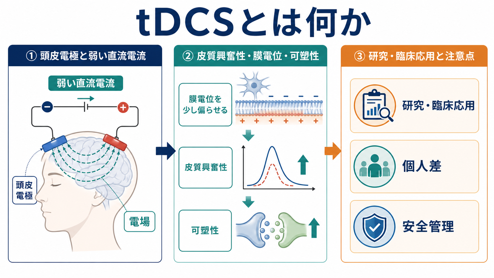
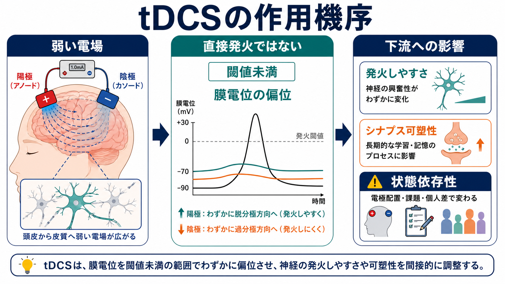
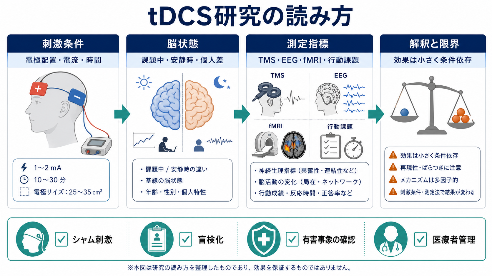

# tDCSとは何か

## 要点

- tDCS（transcranial direct current stimulation）は、頭皮上の電極間に弱い直流電流を流し、脳内に弱い電場を作る非侵襲的脳刺激の一種である。
- 主な理解は、ニューロンを直接発火させるのではなく、膜電位を閾値未満でわずかに偏らせ、同じ入力に対する反応しやすさを変えるというものである[1][2]。
- 陽極刺激は興奮性を高め、陰極刺激は興奮性を下げると説明されることが多いが、この規則は電極配置、刺激量、皮質状態、課題、個人差によって崩れる[2][5]。
- 研究では、TMS、EEG、fMRI、行動課題などと組み合わせて、刺激前後の神経生理指標や課題成績を比較する。ただし、効果は小さく、条件依存的で、再現性の評価が重要である[5][6]。
- 臨床応用は、うつ病、疼痛、脳卒中後リハビリテーション、認知機能などで検討されているが、適応ごとにエビデンスの強さは異なる。自己判断での使用や「能力向上装置」としての理解は避ける[4][7][8]。

## この記事で答える問い

1. tDCSは脳に何をしているのか。
2. なぜ弱い直流電流で皮質興奮性が変わると考えられるのか。
3. tDCSの研究・臨床応用を読むとき、何に注意すべきか。

## まず結論

tDCSは、脳を外から強く動かす方法ではなく、皮質の状態を少し傾ける方法である。古典的な運動野研究では、1 mA程度の弱い直流刺激により、TMSで測定される運動誘発電位が陽極刺激で増え、陰極刺激で減ることが示された[1]。この知見は、tDCSが皮質興奮性を非侵襲的に調整できる可能性を示した。

ただし、tDCSの効果は「電極を置いた場所がそのまま刺激部位になる」「陽極なら必ず促進、陰極なら必ず抑制」「1回の刺激で認知機能が確実に向上する」といった単純なものではない。頭蓋骨、脳脊髄液、脳回・脳溝、電極サイズ、電極間距離によって電場分布は変わり、刺激中の課題や個人の基線状態によって結果も変わる[3][5]。

## 背景

tDCSは、電気けいれん療法のように発作を誘発する治療ではなく、[[トランスクラニアル磁気刺激TMSは何をしているのか|TMS]]のように急速な磁場変化で発火を誘発する方法でもない。典型的には1-2 mA程度の直流電流を数分から数十分流し、皮質に届く弱い電場によって神経細胞の反応性を変える方法として扱われる。

近代的なtDCS研究の入口になったのは、ヒト運動野に弱い直流電流を加え、TMSで測定される運動野興奮性が変わることを示した研究である[1]。その後、薬理学、MRS、EEG、fMRI、計算モデル、臨床試験が組み合わされ、tDCSは「単純な局所刺激」ではなく、膜電位、シナプス可塑性、興奮・抑制バランス、ネットワーク状態を含む操作として研究されてきた[2]。

## 基本概念

### tDCS

tDCSは、transcranial direct current stimulationの略で、日本語では経頭蓋直流電気刺激、または経頭蓋直流刺激と呼ばれる。頭皮上に陽極と陰極の電極を置き、一定方向の弱い電流を流す。電流は頭皮、頭蓋骨、脳脊髄液、皮質を通るが、皮質に届く電場は弱く、通常はニューロンを直接発火させるほど強くない[1][2]。

### 皮質興奮性

皮質興奮性とは、ある皮質領域が入力に対してどの程度反応しやすいかを表す研究上の概念である。運動野研究では、TMSで誘発される筋電図反応を使って推定されることが多い。これは[[BOLD信号とは何か]]や[[fMRIは神経活動を直接測っているのか]]で扱う血流由来指標とは異なり、運動系の反応性を反映する。

### 陽極と陰極

単純化すれば、陽極刺激は膜電位を脱分極方向へ、陰極刺激は過分極方向へ傾けると説明される。しかし実際の皮質ニューロンは向きがそろっておらず、電場も脳回・脳溝に沿って複雑に分布する。そのため「陽極は常に促進、陰極は常に抑制」と読むのは危険である[3][5]。

## 仕組み

### 1. 弱い電場が膜電位を偏らせる

tDCSの第一の作用は、弱い電場によってニューロンの膜電位を閾値未満でわずかに偏らせることだと考えられている[1][2]。ここで重要なのは「閾値未満」である。tDCSは、神経細胞を強制的に発火させるというより、背景入力が来たときの発火しやすさを少し変える。

### 2. 後効果には可塑性が関わる

tDCSの効果は刺激中だけでなく、刺激終了後にも持続することがある。この後効果には、NMDA受容体を介した可塑性、GABA・グルタミン酸系の変化、膜電位変化とシナプス効率の相互作用が関わると考えられている[2]。ただし、これはtDCSが常に[[長期増強LTPとは何か|LTP]]や[[長期抑圧LTDとは何か|LTD]]を起こすという意味ではない。刺激条件、睡眠、疲労、課題中の神経活動、薬物、学習履歴によって後効果の向きと大きさは変わる。

この点は、[[シナプス可塑性とは何か]]や[[神経可塑性は発達と学習をどう支えるのか]]とつながる。tDCSは可塑性を「作る」装置というより、現在進行中の神経活動や学習過程の可塑性を変調する可能性がある操作として理解する方がよい。

### 3. 電場分布は電極直下だけで決まらない

電流は頭蓋骨で広がり、脳脊髄液や皮質形状によって局所的に集中する。MRI由来の頭部モデル研究では、従来型のパッド電極では電場が比較的広く分布し、最大電場が必ずしも電極直下に来るわけではないことが示されている[3]。そのため、tDCSの「刺激部位」は、頭皮上の電極位置だけではなく、電極サイズ、電流強度、電極間距離、頭部形状、モデル化の仮定を含めて考える必要がある。

## 図解

図1は、tDCSを「頭皮電極と弱い直流電流」「膜電位・皮質興奮性・可塑性」「研究・臨床応用と注意点」の連鎖として整理したものである。図2は、tDCSが直接発火ではなく閾値未満の膜電位偏位として働くという中心的な考え方を示している。

図3は、tDCS研究を読むときのチェックリストである。刺激条件だけでなく、課題中か安静時か、どの測定指標を使ったか、シャム刺激と盲検化が十分か、有害事象が確認されているかを分けて読む。

| 観点 | 確認すること | 注意点 |
|---|---|---|
| 刺激条件 | 電極配置、電流、時間、電極サイズ | 同じ「陽極刺激」でも電場分布は同じではない |
| 脳状態 | 安静時、課題中、学習中、疲労、薬物 | 効果は状態依存的に変わる |
| 測定指標 | TMS、EEG、fMRI、MRS、行動課題 | 指標ごとに反映する生理過程が違う |
| 研究デザイン | シャム刺激、盲検化、事前登録、サンプルサイズ | 皮膚感覚や期待効果を統制する必要がある |
| 安全性 | 有害事象、除外基準、医療者管理 | 研究条件下の安全性を自己使用へ一般化しない |

## 臨床・研究との接続

tDCSは、うつ病、慢性疼痛、脳卒中後リハビリテーション、認知機能、運動学習などで研究されてきた。治療応用では、適応ごとに推奨度が異なる。2017年のエビデンスに基づくガイドラインでは、うつ病や疼痛など一部の領域で一定の根拠が整理されているが、疾患・刺激条件・アウトカムによって評価は分かれる[7]。

うつ病については、急性うつ病エピソードに対するランダム化シャム対照試験をまとめた2020年のメタ解析で、能動tDCSはシャム刺激より抑うつ症状を改善し、反応・寛解率でも優れていたと報告された[8]。ただし、効果量は中等度以下で、研究プロトコル、併用療法、治療抵抗性、サンプル特性による違いがある。したがって、[[うつ病とは何か]]や[[治療抵抗性うつ病とは何か]]で扱う治療選択肢の一部として読むべきであり、個別の治療指示として一般化してはいけない。

安全性については、通常の研究プロトコルでは重篤な有害作用の報告は限られると整理されている[4]。しかし、これは適切なスクリーニング、刺激条件、装置管理、医療・研究倫理の枠組みがある場合の話である。皮膚刺激、頭痛、不快感、気分変化、既往症、薬物、てんかんリスク、植込み機器などへの配慮が必要であり、自己流の長時間・高頻度使用を正当化する根拠にはならない。

研究手段としては、tDCSは因果的な操作に近い利点をもつ。脳画像研究が「脳活動と課題の相関」を見ることが多いのに対し、tDCSは皮質状態を操作して行動や神経指標がどう変わるかを調べられる。ただし、電場は広く、ネットワーク全体に影響しうるため、[[脳内ネットワークとは何か]]や[[機能的結合解析とは何か]]の観点と組み合わせても、単純な局在論にはできない。

## よくある誤解

### 誤解1：tDCSは脳を直接発火させる

tDCSの基本作用は、直接発火ではなく、膜電位を閾値未満で偏らせることである[1][2]。同じ入力に対して反応しやすくなる、あるいは反応しにくくなるという調整として理解する。

### 誤解2：陽極は必ず促進、陰極は必ず抑制である

古典的な運動野研究ではそのような傾向が示されたが、すべての部位・強度・時間・課題・個人に一般化できるわけではない[5]。高強度、長時間刺激、発達段階、薬理状態、課題依存性によって効果の向きは変わりうる。

### 誤解3：電極の下だけが刺激される

頭蓋骨、脳脊髄液、脳回・脳溝の形状により、電場は広く分布し、局所的にも偏る。計算モデルを使って電場分布を推定する必要がある[3]。

### 誤解4：安全だから自己使用してよい

研究条件下での安全性データは、家庭での自己流使用を保証しない[4]。装置の品質、電極接触、皮膚状態、刺激条件、既往症、併用薬、期待効果の影響を管理できなければ、研究知見をそのまま持ち込むことはできない。

### 誤解5：認知機能を確実に高める

健康成人に対する単回tDCSの認知効果については、安定した効果を支持しない定量的レビューもある[6]。能力向上をうたう主張は、課題、刺激条件、統計的検出力、出版バイアス、再現性を含めて慎重に読む必要がある。

## 関連ノート

- [[経頭蓋直流電気刺激tDCSは脳活動をどう変えるのか]]
- [[トランスクラニアル磁気刺激TMSは何をしているのか]]
- [[TMSはうつ病治療でどの神経回路を狙っているのか]]
- [[深部脳刺激DBSは神経回路をどう調節するのか]]
- [[神経可塑性は発達と学習をどう支えるのか]]
- [[シナプス可塑性とは何か]]
- [[うつ病とは何か]]
- [[治療抵抗性うつ病とは何か]]

関連ノート候補:
- 非侵襲的脳刺激とは何か
- tACSとは何か
- tRNSとは何か
- 脳刺激研究のシャム対照とは何か
- tDCSの安全性をどう評価するか

MOC更新候補:
- `content/00_MOC/MOC｜臨床実践・治療.md` の神経調節・身体療法に追加する。
- 将来 `MOC｜神経調節・身体療法.md` を作る場合、tDCS、TMS、DBS、ECT、ニューロフィードバックをまとめる入口にする。

## 理解チェック

1. tDCSが「直接発火」ではなく「閾値未満の膜電位調整」と説明される理由は何か。
2. 陽極刺激と陰極刺激の単純な規則を、すべての研究に当てはめてはいけない理由は何か。
3. 電極位置と皮質内電場分布が一致しない理由を、頭蓋骨、脳脊髄液、脳回・脳溝の観点から説明できるか。
4. tDCS研究でシャム刺激と盲検化が重要になる理由は何か。
5. 研究条件下の安全性データを、家庭での自己使用にそのまま一般化できない理由は何か。

## 参考文献

[1] Nitsche, M. A., & Paulus, W. (2000). Excitability changes induced in the human motor cortex by weak transcranial direct current stimulation. *The Journal of Physiology*, 527(3), 633-639. https://doi.org/10.1111/j.1469-7793.2000.t01-1-00633.x

[2] Stagg, C. J., & Nitsche, M. A. (2011). Physiological basis of transcranial direct current stimulation. *The Neuroscientist*, 17(1), 37-53. https://doi.org/10.1177/1073858410386614

[3] Datta, A., Bansal, V., Diaz, J., Patel, J., Reato, D., & Bikson, M. (2009). Gyri-precise head model of transcranial direct current stimulation: Improved spatial focality using a ring electrode versus conventional rectangular pad. *Brain Stimulation*, 2(4), 201-207.e1. https://doi.org/10.1016/j.brs.2009.03.005

[4] Bikson, M., Grossman, P., Thomas, C., Zannou, A. L., Jiang, J., Adnan, T., et al. (2016). Safety of transcranial direct current stimulation: Evidence based update 2016. *Brain Stimulation*, 9(5), 641-661. https://doi.org/10.1016/j.brs.2016.06.004

[5] Wiethoff, S., Hamada, M., & Rothwell, J. C. (2014). Variability in response to transcranial direct current stimulation of the motor cortex. *Brain Stimulation*, 7(3), 468-475. https://doi.org/10.1016/j.brs.2014.02.003

[6] Horvath, J. C., Forte, J. D., & Carter, O. (2015). Quantitative review finds no evidence of cognitive effects in healthy populations from single-session transcranial direct current stimulation (tDCS). *Brain Stimulation*, 8(3), 535-550. https://doi.org/10.1016/j.brs.2015.01.400

[7] Lefaucheur, J. P., Antal, A., Ayache, S. S., Benninger, D. H., Brunelin, J., Cogiamanian, F., et al. (2017). Evidence-based guidelines on the therapeutic use of transcranial direct current stimulation (tDCS). *Clinical Neurophysiology*, 128(1), 56-92. https://doi.org/10.1016/j.clinph.2016.10.087

[8] Razza, L. B., Palumbo, P., Moffa, A. H., Carvalho, A. F., Solmi, M., Loo, C. K., & Brunoni, A. R. (2020). A systematic review and meta-analysis on the effects of transcranial direct current stimulation in depressive episodes. *Depression and Anxiety*, 37(7), 594-608. https://doi.org/10.1002/da.23004

## 未解決問題

- 個人の頭部形状、皮質構造、神経伝達物質状態、睡眠、薬物、課題状態から、tDCS反応性をどこまで予測できるのか。
- tDCS単独よりも、心理療法、リハビリテーション、運動学習、薬物療法と組み合わせたときに、どの条件で臨床的に意味のある効果が出るのか。
- 自宅実施型tDCSを研究・医療として扱う場合、装置管理、遠隔モニタリング、有害事象報告、期待効果の制御をどのように標準化すべきか。
- 皮質興奮性、ネットワーク結合、症状改善、生活機能改善をつなぐ因果経路を、どの測定指標の組み合わせで最も妥当に検証できるのか。
