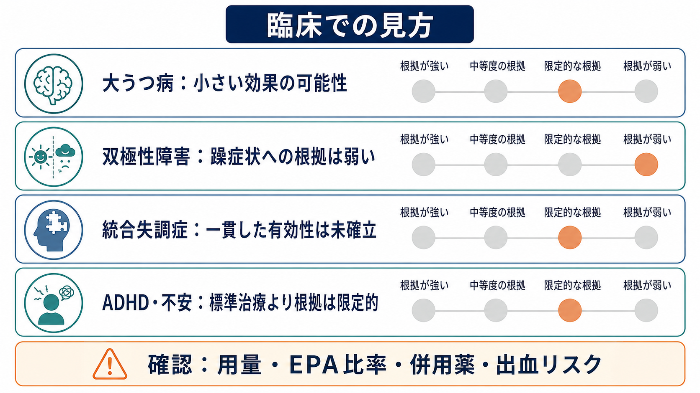
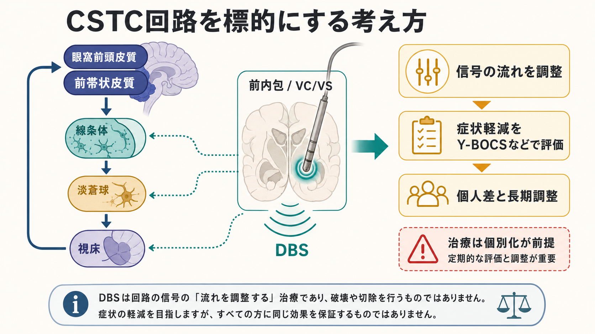
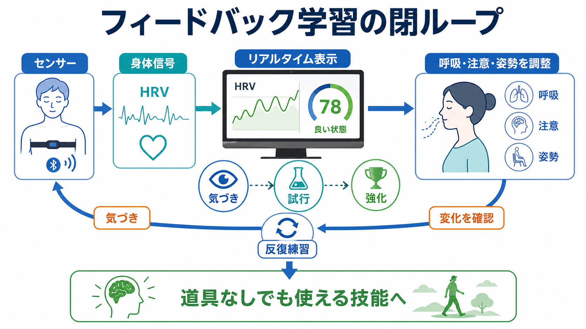

# オメガ3脂肪酸は精神疾患に有効なのか

## 要点

- オメガ3脂肪酸は、ALA、EPA、DHAを含む多価不飽和脂肪酸で、脳の細胞膜、脂質メディエーター、炎症調整に関わる。
- 精神医学で最も研究されているのは[[うつ病とは何か|うつ病]]・[[大うつ病性障害とは何か|大うつ病性障害]]であり、効果があるとしても平均的には小さく、研究の質や製剤差による不確実性が大きい[1][2]。
- EPA比率が高い製剤では有益性を示すメタ解析があるが、標準治療の代替ではなく、補助療法として慎重に位置づけるのが妥当である[3][4]。
- [[双極性障害とは何か|双極性障害]]では双極性うつへの小さなシグナルがある一方、躁症状への有効性は支持されにくい[7]。
- 統合失調症や精神病リスク状態では理論的関心は高いが、2025年時点のメタ解析では一貫した有効性は未確立である[8]。

## この記事で答える問い

1. オメガ3脂肪酸は、なぜ精神疾患と結びつけて研究されてきたのか。
2. うつ病、双極性障害、統合失調症で、どの程度の臨床的根拠があるのか。
3. 「サプリで治る」という理解と、「全く無意味」という理解のどちらが危ういのか。

## まず結論

オメガ3脂肪酸は、精神疾患に対する「単独の治療薬」としてではなく、炎症、脂質代謝、食生活、身体疾患リスクを含む総合的な治療計画の中で考える補助的介入である。特にうつ症状では、EPAを多く含む製剤を抗うつ薬などに併用した場合に小さな効果を示す研究がある。しかしCochraneレビューは、成人大うつ病に対する全体としての根拠を低から非常に低い確実性と評価し、効果があっても本人にとって意味のある大きさかは不確かだとしている[1]。

したがって臨床的には、[[精神科薬物療法とは何か|精神科薬物療法]]、心理療法、睡眠、運動、身体疾患管理を置き換えるものではなく、食事・栄養・炎症の文脈を補う選択肢として読むのがよい。補助的な栄養介入全体のメタ解析でも、オメガ3脂肪酸は抗うつ薬などへの併用候補として扱われるが、単独治療として一般化できる段階ではない[6]。

## 背景

オメガ3脂肪酸には、植物油やナッツ類に多いALA、魚油や藻類由来油に多いEPA・DHAがある。ALAからEPA・DHAへの変換は限られるため、精神医学研究の多くはEPAとDHAを直接含む魚油・精製製剤を扱ってきた[5]。

精神疾患との接点は大きく三つある。第一に、DHAは脳の細胞膜に多く含まれ、膜の流動性や受容体・シナプス機能に関係する。第二に、EPAやDHAはアラキドン酸系の脂質メディエーターと競合し、炎症反応の性質を変える。第三に、うつ病や双極性障害の一部では炎症、代謝異常、生活習慣、身体疾患が症状経過と重なりやすい。これは[[炎症仮説はうつ病をどう説明するのか]]とも接続する論点である。

## 基本概念

| 用語 | 意味 | 精神医学での見方 |
|---|---|---|
| ALA | 植物性食品に多い必須脂肪酸 | EPA/DHAへの変換は限られるため、治療研究では主役になりにくい |
| EPA | 魚油・藻類由来油に多い長鎖オメガ3脂肪酸 | うつ症状への補助療法研究で、DHAより注目されやすい |
| DHA | 脳・網膜に多い長鎖オメガ3脂肪酸 | 神経発達・膜構造では重要だが、成人うつ病の短期改善ではEPA優位の報告が多い |
| オメガ6/オメガ3比 | 食事中の脂肪酸バランス | 単純な「比」だけで病態を説明するのは過剰だが、炎症・代謝の文脈では参考になる |

## 仕組み

オメガ3脂肪酸の作用は、単一の神経伝達物質を増やすというより、細胞膜と炎症環境を通じて神経回路の反応性を調整するものとして理解しやすい。

1. **細胞膜の構成要素**  
   DHAは神経細胞膜のリン脂質に取り込まれ、膜の流動性、受容体配置、シナプス機能に関わる[5]。

2. **炎症性脂質メディエーターの調整**  
   EPAとDHAは、エイコサノイドや炎症収束に関わる脂質メディエーターの前駆体になる。オメガ6系とオメガ3系は代謝経路を一部共有するため、脂肪酸の構成は炎症シグナルの出方に影響しうる[5]。

3. **症状改善との距離**  
   ただし、炎症マーカーや膜脂質が変化しても、それが直ちに抑うつ気分、不安、認知機能、幻覚・妄想の改善へつながるとは限らない。精神症状は神経回路、心理社会的ストレス、睡眠、薬物療法、身体疾患が重なって生じるためである。

## 図解

臨床的に重要なのは、「どの疾患でも同じように効く」と考えないことである。現時点では、うつ症状に対する補助療法として最も根拠が集まっており、双極性障害や統合失調症では研究の方向性はあるものの、実装にはより慎重な判断が必要である。

## 臨床・研究との接続

### うつ病

成人の大うつ病に対するCochraneレビューは、35研究を含め、オメガ3脂肪酸がプラセボより小から中等度の効果を示す可能性を認めつつ、確実性は低く、効果が臨床的に意味のある大きさかは不確かだと結論づけている[1]。NCCIHも、うつ病への有用性は不確実であり、効果がある場合でもEPAがDHAより関与し、抗うつ薬の代替ではなく併用として考えるべき可能性を示している[2]。

一方、EPA比率に注目したメタ解析では、EPAが60%以上の製剤、特にEPA中心の用量設計で有益性が示されている[3]。ISNPRの実践ガイドラインも、大うつ病では補助療法としてEPA優位製剤を検討しうるとするが、これは診断、併用薬、身体状態を評価したうえでの臨床判断である[4]。

### 双極性障害

双極性障害では、うつ状態、躁状態、維持療法を分けて考える必要がある。メタ解析では双極性うつへの補助療法として小から中等度の効果が示唆されたが、躁症状への有効性は支持されなかった[7]。そのため、オメガ3脂肪酸を「気分安定薬の代わり」と考えるのは危険である。双極性障害では、躁転、睡眠リズム、抗うつ薬使用、気分安定薬の遵守が中心的な管理課題であり、栄養介入は周辺から支える位置づけになる。

### 統合失調症・精神病リスク状態

統合失調症では、脂肪酸代謝、酸化ストレス、炎症、神経発達との関係からオメガ3脂肪酸が研究されてきた。しかし2025年の更新メタ解析では、統合失調症および超高リスク群の全体解析でプラセボに対する有意な優位性は示されなかった[8]。初回エピソード、長期介入、抗酸化介入との併用などで探索的な可能性は残るが、現時点で標準治療として一般化する段階ではない。

### 安全性と実装

一般的な副作用は、魚臭い後味、口臭、胸やけ、悪心、下痢などの消化器症状である[2][5]。高用量では抗血小板作用や出血時間への影響が問題になりうるため、抗凝固薬・抗血小板薬、手術予定、出血傾向、肝疾患、妊娠中のサプリ選択では医療者との確認が必要である[5]。また、サプリメントは処方薬と異なり、EPA/DHA含有量、酸化、純度、ビタミンA・D含有量が製品ごとに異なる。

## よくある誤解

### 「魚油を飲めばうつ病は治る」

これは過剰である。平均効果は小さく、研究の確実性も高くない。重症うつ、希死念慮、精神病症状、双極性障害が疑われる場合にサプリだけで対応するのは不適切である。

### 「効果が小さいなら意味がない」

これも単純化である。炎症、食生活、心血管リスク、服薬忍容性、治療抵抗性などを含む個別文脈では、補助療法として検討する余地がある。重要なのは「誰に、どの製剤を、何と併用して、どの指標で評価するか」である。

### 「DHAが脳に多いから、DHAを多く飲めばよい」

DHAは脳構造に重要だが、成人うつ病の症状改善研究ではEPA優位の報告が多い[3][4]。発達、妊娠、認知機能、気分症状では問いが異なるため、ひとつの栄養素の一般論をそのまま治療判断に使わない。

### 「自然由来だから安全」

自然由来でも相互作用や品質差はある。特に抗凝固薬、抗血小板薬、高用量使用、既往歴のある人では確認が必要である[5]。

## 関連ノート

- [[うつ病とは何か]]
- [[大うつ病性障害とは何か]]
- [[双極性障害とは何か]]
- [[炎症仮説はうつ病をどう説明するのか]]
- [[精神科薬物療法とは何か]]
- [[身体疾患による気分障害とは何か]]

## MOC更新候補

- `content/00_MOC/`配下の臨床実践・治療系MOC
- `content/00_MOC/`配下の神経科学と精神疾患系MOC
- 栄養精神医学・炎症・身体療法をまとめるMOCがある場合は、補助療法の項目に追加候補

## 理解チェック

1. オメガ3脂肪酸のうつ病研究で、EPAとDHAはなぜ同じものとして扱いにくいのか。
2. 双極性障害で「うつ状態への補助療法」と「躁症状への治療」を分ける必要があるのはなぜか。
3. 研究で炎症関連の機序が示されても、臨床効果をすぐに断定できない理由は何か。

## 未解決問題

- 炎症マーカー、脂肪酸プロファイル、食事パターンから、反応しやすいサブグループを同定できるか。
- EPA比率、総用量、投与期間、併用薬の最適な組み合わせは何か。
- サプリメントではなく食事介入としての魚摂取・地中海食・生活習慣改善と、単独のEPA/DHA補充をどう比較すべきか。
- 統合失調症や精神病リスク状態で、初回エピソード、酸化ストレス、抗酸化介入との併用に意味のあるサブグループがあるか。

## 参考文献

[1] Appleton, K. M., Voyias, P. D., Sallis, H. M., Dawson, S., Ness, A. R., Churchill, R., & Perry, R. (2021). Omega-3 fatty acids for depression in adults. *Cochrane Database of Systematic Reviews*, 11, CD004692. https://doi.org/10.1002/14651858.CD004692.pub5

[2] National Center for Complementary and Integrative Health. (n.d.). Omega-3 Supplements: What You Need To Know. https://www.nccih.nih.gov/health/omega3-supplements-what-you-need-to-know

[3] Liao, Y., Xie, B., Zhang, H., He, Q., Guo, L., Subramanieapillai, M., Fan, B., Lu, C., & McIntyre, R. S. (2019). Efficacy of omega-3 PUFAs in depression: A meta-analysis. *Translational Psychiatry*, 9, 190. https://doi.org/10.1038/s41398-019-0515-5

[4] Guu, T. W., Mischoulon, D., Sarris, J., Hibbeln, J., McNamara, R. K., Hamazaki, K., et al. (2019). International Society for Nutritional Psychiatry Research Practice Guidelines for Omega-3 Fatty Acids in the Treatment of Major Depressive Disorder. *Psychotherapy and Psychosomatics*, 88(5), 263-273. https://doi.org/10.1159/000502652

[5] National Institutes of Health, Office of Dietary Supplements. (2025). Omega-3 Fatty Acids: Fact Sheet for Health Professionals. https://ods.od.nih.gov/factsheets/omega3fattyacids-healthprofessional/

[6] Sarris, J., Murphy, J., Mischoulon, D., Papakostas, G. I., Fava, M., Berk, M., & Ng, C. H. (2016). Adjunctive Nutraceuticals for Depression: A Systematic Review and Meta-Analyses. *American Journal of Psychiatry*, 173(6), 575-587. https://doi.org/10.1176/appi.ajp.2016.15091228

[7] Sarris, J., Mischoulon, D., & Schweitzer, I. (2012). Omega-3 for bipolar disorder: Meta-analyses of use in mania and bipolar depression. *Journal of Clinical Psychiatry*, 73(1), 81-86. https://doi.org/10.4088/JCP.10r06710

[8] Lin, C. Y., Lee, J. A., Peng, T. R., Tsai, P. Y., Lee, M. C., Chen, S. M., et al. (2025). Effect of n-3 polyunsaturated fatty acids on the treatment of schizophrenia: An updated systematic review and meta-analysis. *BMC Psychiatry*, 25, 1076. https://doi.org/10.1186/s12888-025-07508-6
