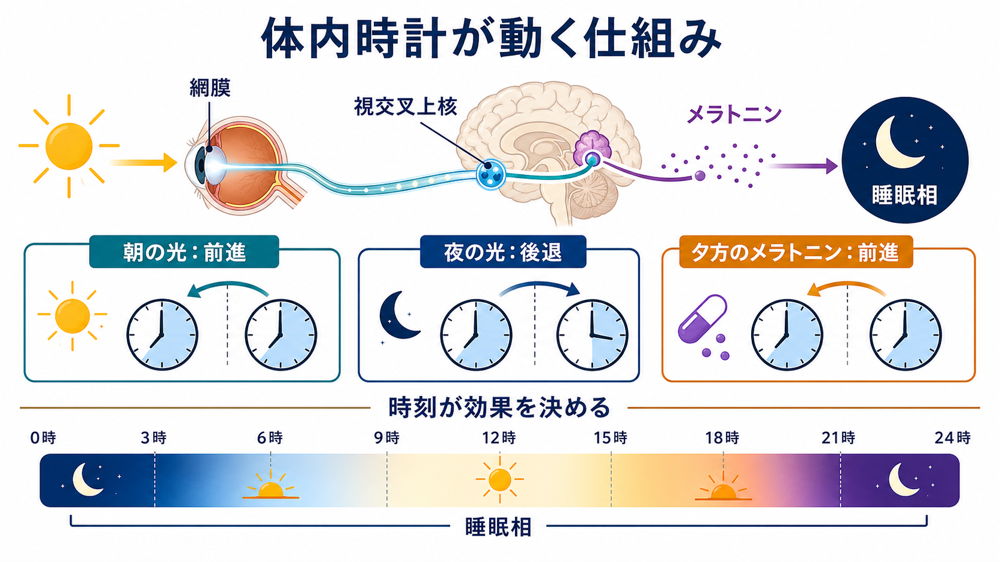
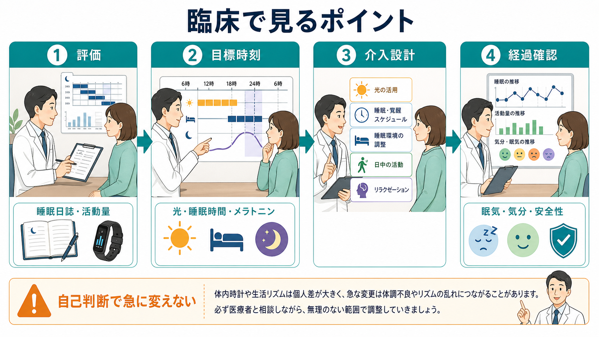

# クロノセラピーとは何か

## 要点

- クロノセラピーは、光、睡眠・覚醒時刻、メラトニンなどを「いつ」使うかによって、[[概日リズム睡眠覚醒障害とは何か|概日リズム]]や睡眠相を調整する治療・研究領域である。
- 体内時計は、網膜から[[視交叉上核]]へ入る光情報、松果体のメラトニン分泌、睡眠圧、社会的スケジュールによって毎日微調整される[1][2]。
- 同じ光やメラトニンでも、朝・夕方・夜のどの時刻に使うかで、睡眠相を前進させることも後退させることもある[2][3]。
- 臨床では、概日リズム睡眠覚醒障害、季節性うつ病、非季節性うつ病、双極性障害の補助療法などで研究されてきたが、対象疾患と安全性の確認が重要である[4][5][6][7]。
- 本記事は教育・研究目的の整理であり、個別の診断、服用時刻、用量、治療開始の指示ではない。

## この記事で答える問い

1. クロノセラピーは、単なる[[睡眠衛生]]や「早寝早起き」と何が違うのか。
2. 光、睡眠時間、メラトニンは、体内時計にどのように作用するのか。
3. どのような臨床・研究領域で使われ、どこに注意が必要なのか。
4. 読み手が論文や臨床解説を読むとき、何を確認すればよいのか。

## まず結論

クロノセラピーとは、睡眠や気分の問題を「症状だけ」ではなく「時刻のずれ」としても捉え、体内時計への入力を設計する治療群である。代表的な入力は、朝の光、夜の光の制限、就寝・起床時刻の調整、メラトニンの時刻調整である。

重要なのは、介入の強さよりも「タイミング」である。たとえば、朝の光は多くの場合、遅れた睡眠相を前に寄せる方向に働きやすい。一方、夜の強い光は、睡眠相を後ろへずらし、寝つきや翌朝の起床を難しくすることがある[2][3]。メラトニンも「眠気を出す薬」とだけ理解すると不十分で、服用時刻によって体内時計への作用が変わる[3][4]。

## 背景

人間の睡眠・覚醒、体温、ホルモン分泌、注意、気分には、およそ24時間周期のリズムがある。中心的な時計は視床下部の視交叉上核にあり、外界の明暗周期とずれないように毎日同調している[1][2]。

この同調を担う最も強い手がかりが光である。網膜には、ものを見るための桿体・錐体とは別に、メラノプシンを含む内因性光感受性網膜神経節細胞があり、明るさの情報を視交叉上核へ伝える。この経路は、睡眠・覚醒リズム、メラトニン分泌、体温リズムの調整に関わる[1]。

現代の生活では、朝に十分な光を浴びない、夜に強い照明や画面光を浴びる、休日に睡眠時刻が大きくずれる、交代勤務で明暗周期と活動周期がずれる、といった状況が起こりやすい。クロノセラピーは、このずれを「意志の弱さ」ではなく、体内時計への入力の問題として扱う。

## 基本概念

### クロノセラピー

クロノセラピーは、時刻生物学を臨床に応用する広い概念である。狭義には、光療法、断眠療法、睡眠相前進、メラトニン投与などを組み合わせる精神医学的介入を指すことがある。広義には、概日リズム睡眠覚醒障害に対する光、メラトニン、行動スケジュール調整も含まれる[4][6]。

このため、「クロノセラピー」という語を読むときは、何を指しているのかを確認する必要がある。[[光療法とは何か|光療法]]だけを指すのか、睡眠時間を意図的に動かす介入を指すのか、メラトニンの時刻調整を含むのかで、根拠と安全性は変わる。

### 体内時計と睡眠相

睡眠相とは、眠りやすい時間帯と起きやすい時間帯の位置である。睡眠相が遅れると、深夜まで眠くならず、朝に起きにくくなる。睡眠相が前に寄りすぎると、夕方から眠くなり、早朝に目が覚めやすい。

概日リズムの介入では、「前進」と「後退」を区別する。前進は、体内時計を早い時刻へ寄せること、後退は遅い時刻へ寄せることである。遅発睡眠覚醒相障害では前進が目標になりやすく、交代勤務や時差では状況によって目標が変わる[4]。

### Zeitgeber

Zeitgeber とは、体内時計を外界に同調させる手がかりである。最も強い zeitgeber は光だが、食事、運動、通勤・通学、対人接触、仕事開始時刻などの社会的リズムも補助的な手がかりになる。[[睡眠覚醒リズム療法とは何か|睡眠覚醒リズム療法]]は、この社会的リズムの安定化に近い視点をもつ。

## 仕組み

### 1. 光は網膜から視交叉上核へ入る

光は網膜を通じて視交叉上核へ届き、体内時計の位相を調整する[1][2]。朝の光は、夜型にずれたリズムを早める方向に使われることが多い。逆に夜の強い光は、メラトニン分泌を抑え、眠気の立ち上がりを遅らせる方向に働きうる。

ただし、光の効果は、照度、波長、照射時間、直前までの光環境、個人の睡眠相によって変わる。つまり「明るければよい」ではなく、「どの時刻に、どの程度の光を、どの目的で使うか」が問題になる。

### 2. メラトニンは時刻依存的に働く

メラトニンは夜間に分泌が増えるホルモンであり、暗さのシグナルとして体内時計と睡眠準備に関わる。研究では、メラトニンにも位相反応曲線があり、投与時刻によって体内時計を前進または後退させうることが示されてきた[3]。

臨床解説では、メラトニンが「睡眠薬」のように説明されることがあるが、クロノセラピーの文脈では、眠気の誘導だけでなく、体内時計への時刻信号として理解する必要がある。特に小児、妊娠中、併存疾患、他の薬剤を使っている場合には、自己判断での使用は避ける。

### 3. 睡眠時間の操作は強い介入になりうる

断眠療法や睡眠相前進は、うつ病エピソードに対するクロノセラピーとして研究されてきた。睡眠剥奪は短期的に抑うつ症状を軽減する可能性が報告されているが、効果の持続、再燃、疲労、安全性、双極性障害での気分高揚リスクなどの問題がある[6][7]。

したがって、睡眠時間を大きく削る介入は、一般的な生活改善として勧められるものではない。研究や専門的治療の枠組みでは、対象者、併用治療、観察項目、リスク管理を明確にして扱われる。

## 図解

図1は、光刺激が網膜から視交叉上核へ入り、メラトニンと睡眠相に影響する流れを示している。図の要点は、同じ介入でも時刻によって作用方向が変わるという点である。

図2は、臨床でクロノセラピーを考えるときの確認点をまとめたものである。睡眠日誌や活動量、目標時刻、介入設計、眠気・気分・安全性の確認を分けて見ると、単なる「早く寝る努力」とは異なる臨床的設計が見えやすくなる。

## 臨床・研究との接続

### 概日リズム睡眠覚醒障害

AASMの臨床ガイドラインでは、内因性の概日リズム睡眠覚醒障害に対して、対象や年齢層に応じて光療法、メラトニン、行動的介入が検討される[4]。たとえば、遅発睡眠覚醒相障害では、睡眠相を前進させる方向の介入が焦点になる。

しかし、すべてのリズム障害に同じ介入を当てはめるわけではない。遅れているのか、早まっているのか、非24時間なのか、交代勤務なのかによって、光を避ける時刻と浴びる時刻が変わる。

### 季節性うつ病とうつ病

季節性うつ病では、光療法が代表的な介入として研究されてきた。非季節性うつ病でも光療法や断眠療法が検討されているが、研究デザイン、併用治療、効果の持続性にはばらつきがある[5][6]。したがって、根拠を読むときは、対象が季節性か非季節性か、単独療法か補助療法かを分ける必要がある。

### 双極性障害

双極性障害では、気分エピソードと概日リズムの乱れが相互に関わる。光療法が抑うつ症状に使われる研究もあるが、躁転、混合状態、不眠の悪化などを慎重に見る必要がある。近年の臨床推奨では、双極性障害の光療法は、気分安定薬、照射時刻、症状モニタリング、安全確認を前提に扱われる[7]。この点は[[双極性障害とは何か]]や[[双極II型障害とは何か]]を読むときにも重要である。

### 睡眠日誌と測定

クロノセラピーでは、本人の主観だけでなく、睡眠日誌、活動量計、起床時刻、入眠時刻、日中の眠気、気分変動を継続して見ることが多い。研究では、メラトニン分泌開始時刻や深部体温などの生理指標が用いられることもあるが、通常の臨床・生活場面では、まず日々のリズムの記録が中心になる。

## よくある誤解

### 誤解1：クロノセラピーは早寝早起きの指導である

早寝早起きは結果として目標になることがあるが、クロノセラピーの中心は「時刻信号の設計」である。朝の光、夜の遮光、睡眠相、社会的予定、メラトニンの時刻を組み合わせて、体内時計が動く方向を考える。

### 誤解2：光は強いほどよい

光は時刻依存的な介入である。夜の強い光は、目的によっては逆効果になりうる。照度を上げることより、使用時刻、持続時間、距離、眼への安全性、併存する気分症状の確認が重要である[2][4]。

### 誤解3：メラトニンはただの睡眠薬である

メラトニンは眠気に関わるだけでなく、体内時計への時刻信号として働く。服用時刻によって作用方向が変わるため、用量だけを見ても不十分である[3][4]。

### 誤解4：睡眠時間を削ればうつ症状が改善する

断眠療法には短期効果を示す研究がある一方、再燃や安全性の問題がある[6]。自己判断で睡眠を削ることは、不眠、注意低下、事故リスク、躁転リスクを高めうるため、治療としては専門的な管理が前提になる。

## 関連ノート

- [[光療法とは何か]]
- [[睡眠覚醒リズム療法とは何か]]
- [[概日リズム睡眠覚醒障害とは何か]]
- [[睡眠覚醒障害群とは何か]]
- [[睡眠障害は脳機能にどのような影響を与えるのか]]
- [[概日リズムの乱れは精神疾患にどう関わるのか]]
- [[季節性うつ病とは何か]]
- [[うつ病とは何か]]
- [[双極性障害とは何か]]
- [[双極II型障害とは何か]]

MOC更新候補：

- `content/00_MOC/` 配下の臨床実践、睡眠医学、精神医学、神経調節・身体療法関連MOC
- 並列ジョブとの競合を避けるため、本記事ではMOC本体を更新しない。

## 理解チェック

1. クロノセラピーで「時刻」が重要になる理由は何か。
2. 朝の光と夜の光は、睡眠相に対してどのように異なる作用をもちうるか。
3. メラトニンを「睡眠薬」とだけ理解すると、どの点を見落とすか。
4. 断眠療法を一般的なセルフケアとして扱うべきでない理由は何か。
5. 概日リズム睡眠覚醒障害、季節性うつ病、双極性障害では、同じ光療法でも何を分けて考えるべきか。

## 未解決問題

- 個人の体内時計、光感受性、生活制約に合わせた最適な照射時刻を、臨床で簡便に推定する方法はまだ発展途上である。
- メラトニン、光、睡眠相前進、認知行動療法、薬物療法をどの順序で組み合わせるべきかは、対象疾患ごとに十分確立していない。
- 双極性障害や若年者、高齢者、神経発達症を伴う人では、効果と安全性のバランスをさらに検討する必要がある。
- スマートフォン、夜間照明、在宅勤務、交代勤務など、現代生活に即した実装研究が必要である。

## 参考文献

[1] Berson DM, Dunn FA, Takao M. Phototransduction by retinal ganglion cells that set the circadian clock. *Science*. 2002;295(5557):1070-1073. https://doi.org/10.1126/science.1067262

[2] Czeisler CA, Kronauer RE, Allan JS, et al. Bright light induction of strong type 0 resetting of the human circadian pacemaker. *Science*. 1989;244(4910):1328-1333. https://doi.org/10.1126/science.2734611

[3] Lewy AJ, Ahmed S, Jackson JML, Sack RL. Melatonin shifts human circadian rhythms according to a phase-response curve. *Chronobiology International*. 1992;9(5):380-392. https://doi.org/10.3109/07420529209064550

[4] Auger RR, Burgess HJ, Emens JS, Deriy LV, Thomas SM, Sharkey KM. Clinical practice guideline for the treatment of intrinsic circadian rhythm sleep-wake disorders: an update for 2015. *Journal of Clinical Sleep Medicine*. 2015;11(10):1199-1236. https://doi.org/10.5664/jcsm.5100

[5] Pail G, Huf W, Pjrek E, et al. Bright-light therapy in the treatment of mood disorders. *Neuropsychobiology*. 2011;64(3):152-162. https://doi.org/10.1159/000328950

[6] Mitter PM, De Crescenzo F, Loo Yong Kee K, et al. Sleep deprivation as a treatment for major depressive episodes: a systematic review and meta-analysis. *Sleep Medicine Reviews*. 2022;64:101647. https://doi.org/10.1016/j.smrv.2022.101647

[7] Geoffroy PA, Palagini L, Henriksen TEG, et al. Light therapy for bipolar disorders: Clinical recommendations from the International Society for Bipolar Disorders Chronobiology and Chronotherapy Task Force. *Dialogues in Clinical Neuroscience*. 2025;27(1):249-264. https://doi.org/10.1080/19585969.2025.2533806

[8] Abbott SM, Reid KJ, Zee PC. Circadian rhythm sleep-wake disorders. *Psychiatric Clinics of North America*. 2015;38(4):805-823. https://doi.org/10.1016/j.psc.2015.07.012
