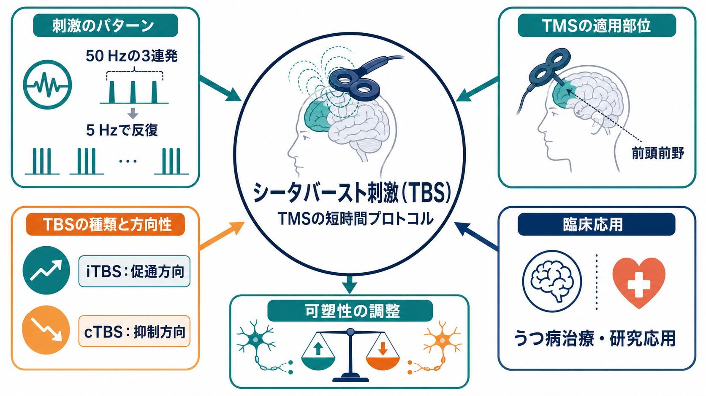
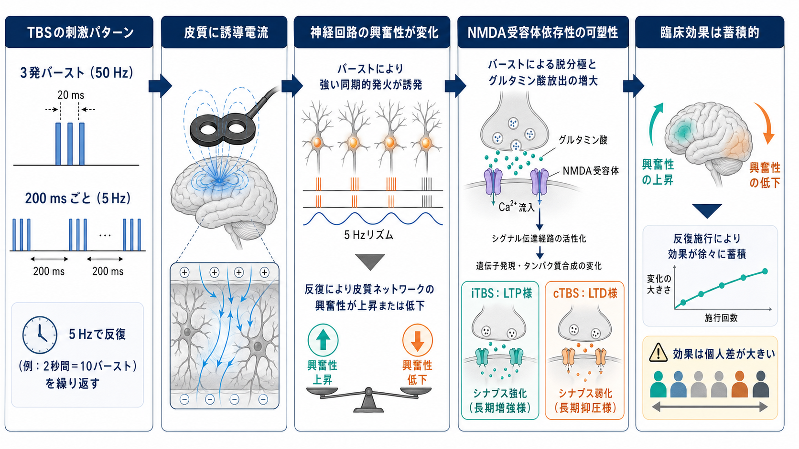

# シータバースト刺激とは何か

## 要点

- シータバースト刺激（theta burst stimulation; TBS）は、[[トランスクラニアル磁気刺激TMSは何をしているのか|TMS]]パルスを「50 Hzの3連発バースト」として出し、それを約5 Hz、すなわち200 msごとに反復する短時間プロトコルである[1]。
- 代表的には、間欠的に与える iTBS（intermittent TBS）は皮質興奮性を高める方向、連続的に与える cTBS（continuous TBS）は低める方向の後効果を生じやすい。ただし効果方向は絶対ではなく、個人差、標的、状態、薬剤、刺激条件に左右される[1][2]。
- TBSの狙いは、単に一瞬だけ神経を発火させることではなく、反復刺激によって[[シナプス可塑性とは何か|シナプス可塑性]]に似た皮質興奮性の変化を誘導することである[2][3]。
- 臨床では、左背外側前頭前野（left DLPFC）への iTBS が、治療抵抗性うつ病に対する従来型10 Hz rTMSと同程度の有効性を示し、1回あたり約3分で実施できる点が注目されている[6]。
- 安全性はTMS全体の枠組みで管理される。発作はまれだが重大な有害事象であり、禁忌、薬剤、てんかんリスク、金属・電子機器、頭痛や疼痛、聴覚保護などを事前に確認する必要がある[4][5]。

## この記事で答える問い

この記事では、シータバースト刺激を「短いTMS」としてだけでなく、「刺激パターンによって皮質可塑性を方向づけようとするプロトコル」として整理する。具体的には、TBSのパルス構造、iTBSとcTBSの違い、可塑性メカニズム、うつ病治療での臨床的位置づけ、安全性、研究上の限界を扱う。

## まず結論

TBSは、[[長期増強LTPとは何か|LTP]]・[[長期抑圧LTDとは何か|LTD]]のような活動依存的可塑性を、ヒトの大脳皮質に非侵襲的に誘導しようとするTMSプロトコルである。古典的な原法では、3発の高頻度パルスを1つのバーストにし、そのバーストをシータ帯域に近い5 Hzで繰り返す。iTBSでは2秒刺激と休止を反復し、cTBSでは連続して刺激する[1]。

臨床的に重要なのは、iTBSが従来型rTMSより短時間で施行できるにもかかわらず、治療抵抗性うつ病に対する大規模非劣性試験で10 Hz左DLPFC rTMSに劣らない結果を示した点である[6]。ただし、「3分でうつ病が治る」という意味ではない。通常は複数週にわたる反復セッションとして行われ、効果判定には症状尺度、生活機能、副作用、併用治療、適応の妥当性を含めた臨床判断が必要になる。

## 背景

TMSは、頭皮上のコイルから急速に変化する磁場を発生させ、皮質に誘導電流を生じさせる方法である。単発TMSは運動誘発電位などの計測に使われ、反復TMS（rTMS）は皮質興奮性やネットワーク活動を一定時間変える目的で使われる。TBSは、このrTMSの一種であり、短い時間に高密度のパルス列を与える「パターン化TMS」として位置づけられる[1][4]。

TBSが注目された理由は、Huangらの原著が、20秒から190秒程度の短い刺激で運動皮質の興奮性に比較的持続する変化を誘導できることを示したからである[1]。この発想は、海馬スライスなどで使われてきたシータバースト型の電気刺激を、ヒトの皮質刺激へ翻訳する試みといえる。

## 基本概念

### TBSの刺激パターン

TBSの基本単位は、50 Hzで3発続くパルスである。50 Hzとは、20 ms間隔でパルスが並ぶことを意味する。この3発バーストを200 msごと、すなわち5 Hzで繰り返す[1]。この「高頻度の小さな束を、シータ帯域に近いリズムで反復する」点が、通常の10 Hz rTMSや1 Hz rTMSとの違いである。

| 種類 | 典型的な与え方 | 期待される方向 | 主な使い方 |
|---|---|---|---|
| iTBS | 短い刺激列と休止を繰り返す | LTP様、促通方向 | うつ病治療、皮質興奮性を高める研究 |
| cTBS | バーストを連続して与える | LTD様、抑制方向 | 運動野・認知機能研究、過活動回路の一時的抑制 |
| 変法TBS | パルス数、強度、部位、間隔を変更 | 条件依存 | 個別化・加速プロトコル・研究用途 |

「iTBSは必ず促通、cTBSは必ず抑制」と覚えると危険である。原理的な傾向としては有用だが、実際の反応は、被刺激者の皮質状態、睡眠、薬剤、年齢、疾患、刺激強度、コイル位置、直前の運動・認知活動に影響される[2][4]。

### iTBSとcTBS

iTBSは intermittent theta burst stimulation の略で、刺激を間欠的に与える。うつ病治療でよく話題になるのは、左DLPFCへのiTBSである。短時間化により、患者の拘束時間を減らし、装置やスタッフの運用効率を高めうる[6][8]。

cTBSは continuous theta burst stimulation の略で、刺激を連続的に与える。運動皮質研究では、cTBSが運動誘発電位を低下させる方向の後効果を示すことがあり、特定の皮質領域の寄与を一時的に弱める「可逆的摂動」として使われる[1][3]。

## 仕組み

TBSの後効果は、単発TMSのような一回ごとの誘発反応だけでは説明できない。反復されるバーストが神経回路の発火タイミング、興奮性・抑制性入力、グルタミン酸作動性シナプス、カルシウム流入、受容体機能を変え、結果としてLTP様またはLTD様の可塑性を生じると考えられている[2][3]。

Huangらの理論モデルは、バースト刺激が興奮性効果と抑制性効果を同時に誘導し、その時間経過と累積の仕方によって最終的な促通・抑制方向が決まると説明する[2]。これは、TBSを「特定周波数だから効く」という単純な話ではなく、「パルスの束、間隔、休止、総パルス数、皮質の直前状態が組み合わさる」現象として見る必要があることを示している。

運動皮質での生理学的研究では、iTBSが運動誘発電位や皮質脊髄路の間接波に影響することが示されている[3]。ただし、M1で観察される興奮性変化を、そのままDLPFCやうつ病治療の臨床効果に直結させることはできない。DLPFCでは症状ネットワーク、前頭辺縁系、機能的結合、認知・情動制御が関わるため、局所興奮性と臨床反応の関係はより複雑である。

## 図解

TBSを図で理解する場合、3つの層に分けると整理しやすい。

| 層 | 見るべき点 | 読み違えやすい点 |
|---|---|---|
| 刺激パターン | 50 Hzの3連発、5 Hz反復、iTBS/cTBS | 「短いから弱い刺激」とは限らない |
| 生理メカニズム | 誘導電流、皮質興奮性、LTP/LTD様可塑性 | 周波数だけで効果方向が決まるわけではない |
| 臨床応用 | 左DLPFC iTBS、複数セッション、尺度での評価 | 1回3分で即時に治療完了するわけではない |

## 臨床・研究との接続

### うつ病治療

TBSの臨床応用で最も定着しているのは、大うつ病性障害に対する左DLPFC iTBSである。THREE-D試験では、治療抵抗性うつ病の患者を対象に、3分程度で実施できるiTBSと、従来型の10 Hz左DLPFC rTMSを比較し、iTBSが非劣性であることを示した[6]。その後のメタ解析でも、TBSはうつ病急性期治療の選択肢として検討されているが、研究間のプロトコル差、標的差、サンプルサイズ、盲検化の難しさには注意が必要である[7]。

臨床での価値は、単に「新しい刺激法」という点ではなく、短時間化にある。1回の施行時間が短くなると、患者の通院負担、椅子に座っている時間、施設のスループットに影響する。米国では、iTBSを含むTMS機器が大うつ病性障害に対して510(k)クリアランスを受けており、成人の薬物治療で十分な改善が得られなかった大うつ病エピソードが適応として記載されている[8]。

### 研究応用

研究では、TBSは「一時的に皮質の寄与を変えて、その領域が課題にどう関わるかを見る」ために使われる。たとえば運動野にcTBSを与えて運動制御への影響を見る、前頭前野にiTBSを与えて認知制御や情動調整への影響を見る、といった使い方である。これは脳領域を破壊する方法ではなく、時間限定的にネットワーク状態を変える摂動法である。

### 安全性と実施条件

TBSは短時間で終わるが、短時間だから安全確認を省略できるわけではない。TMS全体に共通して、発作リスク、てんかん既往、頭蓋内金属、植込み型電子機器、薬剤、睡眠不足、アルコール、妊娠、聴覚保護、刺激部位の痛みや頭痛などを確認する必要がある[4][5]。臨床では、医師による適応判断、説明と同意、訓練された実施者、緊急時対応、効果と副作用のモニタリングが前提になる[4]。

## よくある誤解

### 「TBSは3分で治療が終わる」

1セッションが短いという意味であり、治療全体が3分で終わるという意味ではない。うつ病治療では、通常、複数週にわたる反復セッションとして計画される[6]。

### 「iTBSは必ず興奮、cTBSは必ず抑制」

原法の運動皮質研究ではその傾向が示されたが、実際の効果方向には個人差が大きい。薬剤、直前の神経活動、刺激強度、標的領域、年齢、疾患状態が影響する[2][4]。

### 「TBSは脳の特定部位をオン・オフする」

TBSはスイッチのように領域をオン・オフする技術ではない。誘導電流は皮質表面付近のニューロン集団に作用し、その効果は局所回路と広域ネットワークに広がる。臨床効果も、局所刺激だけでなく、前頭辺縁系や機能的結合の変化として考える必要がある。

### 「短時間だから従来型rTMSより弱い」

刺激時間が短いことと、生理学的効果が弱いことは同じではない。TBSは高密度のパターン化刺激であり、短時間でも皮質興奮性に持続的な後効果を生じうる[1][2]。

## 関連ノート

- [[トランスクラニアル磁気刺激TMSは何をしているのか]]
- [[TMSはうつ病治療でどの神経回路を狙っているのか]]
- [[シナプス可塑性とは何か]]
- [[長期増強LTPとは何か]]
- [[長期抑圧LTDとは何か]]
- [[E_Iバランスとは何か]]
- [[うつ病とは何か]]
- [[電気けいれん療法ECTとは何か]]

### MOC更新候補

- `content/00_MOC/` 配下の神経調節・身体療法系MOCに本記事を追加する候補。
- TMS、rTMS、安全性、DLPFC、うつ病治療に関する既存ノート群から本記事への双方向リンクを検討する候補。

### 関連ノート候補

- 「iTBSとは何か」
- 「cTBSとは何か」
- 「TMSの運動閾値とは何か」
- 「TMS治療の適応と禁忌とは何か」
- 「DLPFCとは何か」

## 理解チェック

1. TBSの基本単位は、何Hzの何連発バーストか。
2. iTBSとcTBSは、刺激の与え方と期待される方向性がどう違うか。
3. TBSの効果を「LTP様」「LTD様」と呼ぶとき、なぜ「様」を付ける必要があるか。
4. うつ病治療でiTBSが注目される主な実務上の利点は何か。
5. 短時間プロトコルであっても、安全確認を省略できない理由は何か。

## 未解決問題

- M1で観察されるTBS後効果を、DLPFCや症状ネットワークの臨床反応へどこまで一般化できるか。
- どの患者がiTBSに反応しやすいかを、症状、脳画像、脳波、薬剤、遺伝・炎症指標などから予測できるか。
- 加速iTBSや個別化ターゲティングが、標準的なiTBSより有効かつ安全か。
- TBSの個人差を、睡眠、状態依存性、メタ可塑性、E/Iバランスとしてどう説明できるか。

## 参考文献

[1] Huang, Y. Z., Edwards, M. J., Rounis, E., Bhatia, K. P., & Rothwell, J. C. (2005). Theta burst stimulation of the human motor cortex. *Neuron, 45*(2), 201-206. https://doi.org/10.1016/j.neuron.2004.12.033

[2] Huang, Y. Z., Rothwell, J. C., Chen, R. S., Lu, C. S., & Chuang, W. L. (2011). The theoretical model of theta burst form of repetitive transcranial magnetic stimulation. *Clinical Neurophysiology, 122*(5), 1011-1018. https://doi.org/10.1016/j.clinph.2010.08.016

[3] Di Lazzaro, V., Dileone, M., Pilato, F., et al. (2008). The physiological basis of the effects of intermittent theta burst stimulation of the human motor cortex. *The Journal of Physiology, 586*(16), 3871-3879. https://doi.org/10.1113/jphysiol.2008.152736

[4] Rossi, S., Antal, A., Bestmann, S., et al. (2021). Safety and recommendations for TMS use in healthy subjects and patient populations, with updates on training, ethical and regulatory issues: Expert Guidelines. *Clinical Neurophysiology, 132*(1), 269-306. https://doi.org/10.1016/j.clinph.2020.10.003

[5] Oberman, L., Edwards, D., Eldaief, M., & Pascual-Leone, A. (2011). Safety of theta burst transcranial magnetic stimulation: A systematic review of the literature. *Journal of Clinical Neurophysiology, 28*(1), 67-74. https://doi.org/10.1097/WNP.0b013e318205135f

[6] Blumberger, D. M., Vila-Rodriguez, F., Thorpe, K. E., et al. (2018). Effectiveness of theta burst versus high-frequency repetitive transcranial magnetic stimulation in patients with depression (THREE-D): A randomised non-inferiority trial. *The Lancet, 391*(10131), 1683-1692. https://doi.org/10.1016/S0140-6736(18)30295-2

[7] Voigt, J. D., Leuchter, A. F., & Carpenter, L. L. (2021). Theta burst stimulation for the acute treatment of major depressive disorder: A systematic review and meta-analysis. *Translational Psychiatry, 11*, 330. https://doi.org/10.1038/s41398-021-01441-4

[8] U.S. Food and Drug Administration. (2018). 510(k) Premarket Notification K173620: MagVita TMS Therapy System w/Theta Burst Stimulation. https://www.accessdata.fda.gov/scripts/cdrh/cfdocs/cfpmn/pmn.cfm?ID=K173620
