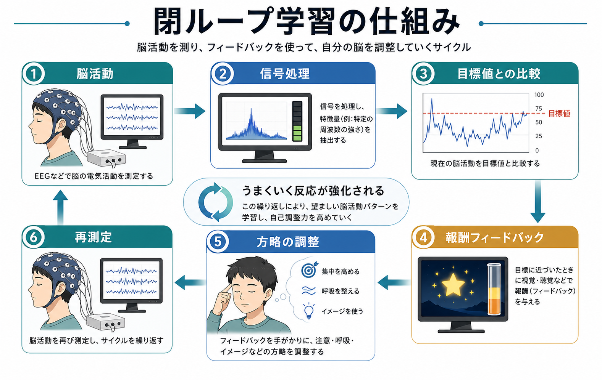
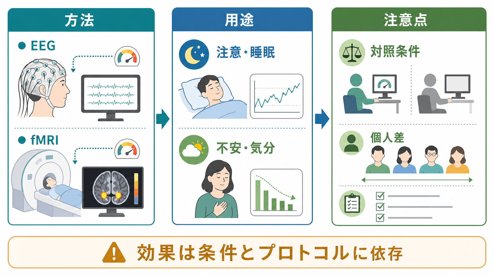

# ニューロフィードバックとは何か

## 要点

- ニューロフィードバックは、脳波（EEG）、fMRI、近赤外分光法などで測った神経活動を本人にリアルタイムで返し、望ましい脳活動パターンへ自己調整する学習を支える方法である[1]。
- 仕組みの中心は「閉ループ」である。測定、信号処理、フィードバック、本人の方略調整、再測定が短い周期で繰り返される[1][3]。
- 臨床ではADHD、不眠、不安・気分症状、リハビリテーションなどで研究されているが、疾患やプロトコルによってエビデンスの強さは大きく異なる[4][5][6]。
- 効果を読むときは、単に「脳波が変わったか」だけでなく、盲検化、シャム条件、標的信号の学習、症状・機能アウトカム、フォローアップを分けて見る必要がある[3][4]。
- 医療・心理臨床では、個別の診断や治療指示としてではなく、標準治療、心理社会的支援、薬物療法、[[反復経頭蓋磁気刺激rTMSとは何か]]や[[tDCSとは何か]]など他の神経調節法との位置づけを比較しながら考える。

## この記事で答える問い

1. ニューロフィードバックは何を測り、何を本人に返しているのか。
2. なぜフィードバックで脳活動の自己調整が学習されると考えられるのか。
3. ADHD、不眠、不安・気分症状などへの応用は、どこまで確からしいのか。
4. 「脳を鍛える治療」として読むとき、どのような誤解に注意すべきか。

## まず結論

ニューロフィードバックは、脳の活動を「見える化」し、その情報を手がかりに本人が注意、呼吸、イメージ、身体感覚への焦点づけなどを調整する訓練である。外から電気や磁気で脳を直接刺激する[[反復経頭蓋磁気刺激rTMSとは何か|rTMS]]や[[tDCSとは何か|tDCS]]とは異なり、基本的には測定とフィードバックを用いた学習法として位置づけられる[1][2]。

ただし、「脳波を変えれば症状が治る」という単純な話ではない。効果には、標的とした神経活動の特異的な変化、報酬学習、期待、治療者との関係、訓練時間、課題への取り組み、自然経過などが混ざりうる[2][3]。したがって、臨床応用を評価するには、シャムフィードバックや能動対照を含む研究、盲検化された評価、標的信号が実際に学習されたかの確認が重要になる[3][4]。

## 背景

バイオフィードバックは、心拍、筋電図、皮膚電気活動、呼吸、体温など、通常は意識しにくい身体信号を本人に返し、自己調整を促す方法である。ニューロフィードバックはその神経版であり、特にEEGを用いる場合は「EEGバイオフィードバック」とも呼ばれる。

古典的なEEGニューロフィードバックでは、特定の周波数帯域、例えばシータ波、ベータ波、SMR（sensorimotor rhythm）などを標的にする。近年は、fMRIで特定脳領域や機能的結合の活動を返すリアルタイムfMRIニューロフィードバック、機械学習で脳活動パターンを復号して返すデコーデッド・ニューロフィードバックも研究されている[1][7][8]。

この方法が注目される理由は二つある。第一に、脳活動を本人が内側から調整できるなら、神経回路を標的にした非侵襲的介入になりうる。第二に、研究法として、特定の脳活動パターンを変化させたときに行動や主観体験がどう変わるかを調べられる[1]。つまり、治療技法であると同時に、脳と行動の因果関係を探る実験ツールでもある。

## 基本概念

### ニューロフィードバック

ニューロフィードバックとは、神経活動を測定し、その情報を視覚、聴覚、ゲーム画面、報酬メーターなどとして本人へリアルタイムに提示し、神経活動の自己調整を促す手続きである[1]。本人は「この考え方をすれば必ずこの波が上がる」と明確に理解しているとは限らない。むしろ、試行錯誤の中で、うまくいった内的状態や方略が強化される。

### 標的信号

標的信号は研究・臨床目的によって異なる。EEGでは周波数帯域や事象関連電位、fMRIでは扁桃体、島皮質、前頭前野、運動野などの領域活動やネットワーク結合が使われる。どの信号を標的にするかは、「どの神経過程が症状や機能に関係すると仮定するか」という理論に依存する[1][8]。

### フィードバック

フィードバックは、波形そのものではなく、本人が理解しやすい形に加工されることが多い。画面上のバーが伸びる、音が変わる、ゲーム内の物体が動く、報酬マークが出る、といった提示である。ここで重要なのは、フィードバックが「正しい脳状態への説明」ではなく、「現在の信号が目標条件にどれだけ近いかを返す手がかり」である点である。

## 仕組み

ニューロフィードバックの仕組みは、閉ループ学習として整理できる[1]。

1. 脳活動を測定する。
2. ノイズ除去や特徴抽出を行い、標的信号を計算する。
3. 目標値や基準条件と比較する。
4. 本人へ視覚・聴覚などでフィードバックする。
5. 本人が注意、呼吸、イメージ、身体感覚、課題方略を変える。
6. 変化した脳活動を再び測定する。

このループが数秒から数十秒の周期で繰り返される。本人の視点では「どの内的状態が報酬を生むか」を探索する訓練であり、学習理論の観点ではオペラント条件づけや強化学習に近い[1][2]。ただし、臨床効果が出るには、脳信号の変化が症状や行動に意味のある変化として転移する必要がある。この「学習した脳活動が日常生活の機能改善に結びつくか」が、臨床研究上の中心問題になる。

### EEGニューロフィードバック

EEGニューロフィードバックは、時間分解能が高く、比較的安価で実施しやすい。一方で、空間分解能は限られ、筋電、眼球運動、瞬目、頭皮電位などのアーチファクトの影響を受けやすい。ADHD研究では、シータ/ベータ比、SMR、遅い皮質電位などを標的にしたプロトコルが多く用いられてきた[4][5]。

### fMRIニューロフィードバック

リアルタイムfMRIニューロフィードバックは、特定の脳領域やネットワークを比較的高い空間分解能で標的化できる。扁桃体、前頭前野、島皮質、運動野、報酬系などを対象に、情動調整、疼痛、依存、運動リハビリテーションなどへの応用が検討されている[7][8]。ただし、費用、装置アクセス、解析遅延、標準化、臨床実装の難しさが大きい。

### 特異的効果と非特異的効果

ニューロフィードバック研究では、「標的とした神経信号を学習したから効果が出た」のか、「治療への期待、課題への参加、治療者との関係、リラクゼーション、自己観察の増加などで効果が出た」のかを分ける必要がある[2][3]。この区別は、臨床的な有用性を否定するためではなく、何を標的に、誰へ、どの条件で使うべきかを明確にするために重要である。

## 図解

図1は、ニューロフィードバックを閉ループ学習として見たときの基本構造である。測定、信号処理、目標値との比較、報酬フィードバック、方略調整、再測定が循環する。

図2は、臨床・研究応用を読むときの整理である。方法、用途、注意点を分け、効果が条件とプロトコルに依存することを強調している。

## 臨床・研究との接続

### ADHD

ADHDはニューロフィードバック研究が最も多い領域の一つである。ランダム化比較試験をまとめたメタ解析では、治療に近い評価者では症状改善が見られる一方、盲検化されている可能性が高い評価や能動・シャム対照を用いた研究では効果が弱まる、または有意でなくなることが報告されている[4]。一方で、フォローアップを含むメタ解析では、ニューロフィードバック群で効果が持続する可能性も検討されている[5]。

このため、ADHDへのニューロフィードバックは「全く根拠がない」とも「確立した第一選択治療」とも言い切りにくい。標準治療、心理教育、環境調整、薬物療法、認知行動的支援と併せて、研究デザインと対象者を慎重に見ながら位置づける必要がある。

### 睡眠・不眠

不眠に対するニューロフィードバックでは、睡眠関連のEEG活動を標的にする研究がある。しかし、二重盲検プラセボ対照研究では、主観的改善が見られても、シャム条件との差や特異的な睡眠生理指標の変化をどう解釈するかが問題になった[6]。この領域は、期待、リラクゼーション、睡眠への注意の向け方などの非特異的要因を特に慎重に扱う必要がある。

### 不安・気分症状

不安や気分症状では、情動調整に関わる扁桃体、前頭前野、島皮質などを標的にしたfMRIニューロフィードバックが研究されている[7][8]。情動を思い出す、再評価する、肯定的記憶を用いるなどの心理的方略と組み合わせられることが多い。ここでは、脳活動の変化と主観的・行動的変化を同時に見ることが重要である。

### リハビリテーションと認知訓練

運動リハビリテーションや注意訓練では、運動野活動、感覚運動リズム、注意関連ネットワークなどを標的にできる可能性がある[1][8]。ただし、訓練効果が実生活の機能へ転移するか、どの患者が反応しやすいか、通常リハビリテーションと比べてどの程度の追加価値があるかは、プロトコルごとの検証が必要である。

## よくある誤解

### 誤解1: 脳波を変えれば症状は必ず治る

脳波やfMRI信号の変化は、症状改善の十分条件ではない。標的信号が変わっても、日常生活上の注意、睡眠、気分、社会機能が改善するとは限らない。逆に、症状が改善しても、それが標的信号の特異的学習によるとは限らない[2][3]。

### 誤解2: ニューロフィードバックは脳刺激である

ニューロフィードバックは通常、脳活動を測り、情報を返す学習法である。磁気や電流を使って脳活動を外から変える[[反復経頭蓋磁気刺激rTMSとは何か|rTMS]]、[[tDCSとは何か|tDCS]]、けいれん誘発を伴う[[修正型ECTとは何か|修正型ECT]]とは、作用の入口が異なる。

### 誤解3: 装置が高度なら効果も強い

fMRIは空間分解能が高いが、費用や実装負荷が大きく、臨床的有用性が自動的に高いわけではない。EEGは実施しやすいが、アーチファクトや標的設定の問題がある。方法の優劣は、標的、疾患、研究デザイン、訓練可能性、臨床アウトカムとの対応で判断する必要がある[1][8]。

### 誤解4: 参加者の努力だけで決まる

ニューロフィードバックでは、本人の探索や方略調整が重要である。しかし、信号処理の質、フィードバック設計、報酬設定、セッション数、治療者の説明、家庭や学校での支援、併存症なども結果に影響する。効果が出ない場合を本人の努力不足に還元してはいけない。

## 関連ノート

- [[反復経頭蓋磁気刺激rTMSとは何か]]: 外部から磁気刺激を与える神経調節法との比較。
- [[tDCSとは何か]]: 微弱直流電流による皮質興奮性調整との比較。
- [[修正型ECTとは何か]]: 重症うつ病などで用いられる身体療法との位置づけの比較。

### 関連ノート候補

- バイオフィードバックとは何か
- EEGとは何か
- fMRIニューロフィードバックとは何か
- ADHDに対する非薬物療法
- 強化学習とオペラント条件づけ
- 自己調整とメタ認知

### MOC更新候補

- `content/00_MOC/` 配下の臨床実践・治療、神経調節、精神医学、認知神経科学関連MOCに追加候補。
- 並列ジョブとの衝突を避けるため、本記事作成時点ではMOC本体は更新しない。

## 理解チェック

1. ニューロフィードバックは、rTMSやtDCSと何が異なるか。
2. 「閉ループ学習」とは、どのような循環を指すか。
3. ADHD研究で、盲検化された評価やシャム条件が重要になる理由は何か。
4. 臨床効果を判断するとき、脳信号の変化以外にどのアウトカムを見るべきか。
5. ニューロフィードバックの効果を「本人の努力」だけで説明してはいけない理由は何か。

## 未解決問題

- どの神経信号が、どの症状や機能に対して臨床的に意味のある標的になるのか。
- 反応しやすい人を事前に予測できるか。
- シャム条件、能動対照、盲検評価を含めた研究で、どのプロトコルが再現性を示すか。
- 訓練で得た自己調整が、家庭、学校、職場、対人場面へどの程度転移するか。
- 標準治療、心理療法、薬物療法、リハビリテーションと組み合わせたときの追加価値は何か。

## 参考文献

[1] Sitaram, R., Ros, T., Stoeckel, L., et al. (2017). Closed-loop brain training: the science of neurofeedback. *Nature Reviews Neuroscience*, 18, 86-100. https://doi.org/10.1038/nrn.2016.164

[2] Thibault, R. T., Lifshitz, M., & Raz, A. (2016). The self-regulating brain and neurofeedback: Experimental science and clinical promise. *Cortex*, 74, 247-261. https://doi.org/10.1016/j.cortex.2015.10.024

[3] Ros, T., Enriquez-Geppert, S., Zotev, V., et al. (2020). Consensus on the reporting and experimental design of clinical and cognitive-behavioural neurofeedback studies (CRED-nf checklist). *Brain*, 143(6), 1674-1685. https://doi.org/10.1093/brain/awaa009

[4] Cortese, S., Ferrin, M., Brandeis, D., et al. (2016). Neurofeedback for attention-deficit/hyperactivity disorder: Meta-analysis of clinical and neuropsychological outcomes from randomized controlled trials. *Journal of the American Academy of Child & Adolescent Psychiatry*, 55(6), 444-455. https://doi.org/10.1016/j.jaac.2016.03.007

[5] Van Doren, J., Arns, M., Heinrich, H., et al. (2019). Sustained effects of neurofeedback in ADHD: A systematic review and meta-analysis. *European Child & Adolescent Psychiatry*, 28, 293-305. https://doi.org/10.1007/s00787-018-1121-4

[6] Schabus, M., Griessenberger, H., Gnjezda, M.-T., Heib, D. P. J., Wislowska, M., & Hoedlmoser, K. (2017). Better than sham? A double-blind placebo-controlled neurofeedback study in primary insomnia. *Brain*, 140(4), 1041-1052. https://doi.org/10.1093/brain/awx011

[7] Stoeckel, L. E., Garrison, K. A., Ghosh, S., et al. (2014). Optimizing real time fMRI neurofeedback for therapeutic discovery and development. *NeuroImage: Clinical*, 5, 245-255. https://doi.org/10.1016/j.nicl.2014.07.002

[8] Paret, C., Goldway, N., Zich, C., et al. (2019). Current progress in real-time functional magnetic resonance-based neurofeedback: Methodological challenges and achievements. *NeuroImage*, 202, 116107. https://doi.org/10.1016/j.neuroimage.2019.116107
