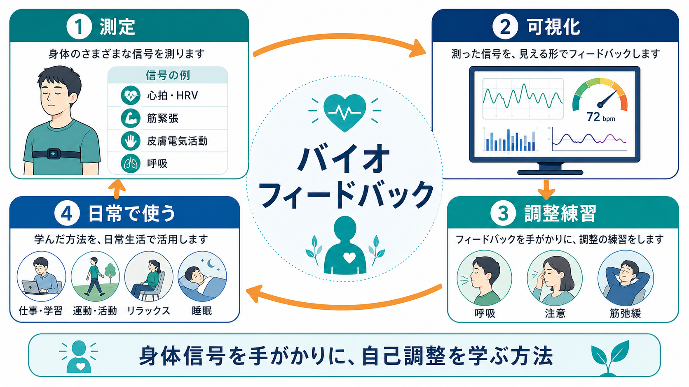
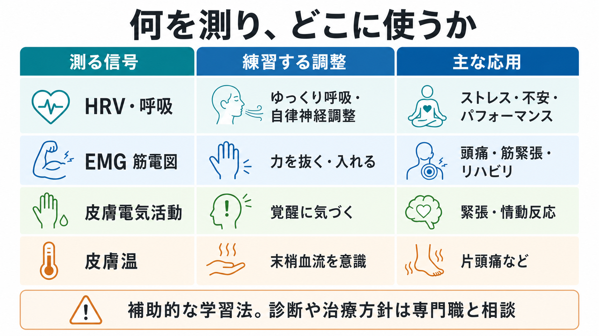

# バイオフィードバックとは何か

## 要点

- バイオフィードバックは、心拍、呼吸、筋緊張、皮膚電気活動、皮膚温、脳波などの身体信号を測定し、画面・音・ゲーム的表示などで本人に返すことで、自己調整を学ぶ方法である[1][2]。
- 目的は「機械に調整してもらうこと」ではなく、見えにくい身体状態に気づき、呼吸、注意、筋弛緩、姿勢、行動の調整を試し、その結果を確認する閉ループ学習である[1][3]。
- エビデンスは用途ごとに異なる。頭痛、HRVバイオフィードバック、骨盤底筋訓練の補助などで研究が多い一方、すべての症状に一律に効く方法ではない[4][5][6][7]。
- 臨床では、[[心理教育とは何か]]、[[認知行動療法CBTとは何か]]、リラクセーション、運動療法、リハビリテーションなどと組み合わせて使われることが多い。
- 医療・精神医学領域では、個別の診断や治療方針を置き換えるものではなく、教育・研究・補助的介入として位置づけるのが安全である。

## この記事で答える問い

1. バイオフィードバックは何を「フィードバック」しているのか。
2. なぜ身体信号を見える形にすると自己調整を学べるのか。
3. 心拍、筋電図、皮膚電気活動などの方法は何が違うのか。
4. 臨床・研究でどのように使われ、どこに限界があるのか。

## まず結論

バイオフィードバックとは、身体の内側で起きている変化を外部化し、本人がそれを見ながら調整方略を試す学習法である。たとえば、緊張で肩の筋電図が高くなる人は、筋弛緩を試し、画面上の筋活動が下がるかを確認する。呼吸が浅く速くなりやすい人は、呼吸ペースを整え、心拍変動がどう変わるかを見る。つまり「身体を測る技術」と「自己調整を学ぶ行動訓練」が合わさった介入である[1][2]。

この点で、バイオフィードバックは単なるリラクセーション法ではない。リラックスそのものが目的になる場合もあるが、中心にあるのは、測定、可視化、試行、強化、反復という学習過程である[2][3]。そのため、[[マインドフルネスストレス低減法MBSRとは何か]]のように身体感覚への注意を育てる介入や、[[認知行動療法CBTとは何か]]のように技能練習を重視する介入と相性がよい。

## 背景

不安、痛み、頭痛、緊張、睡眠困難、リハビリテーション上の運動制御の問題では、本人が「力が入っている」「呼吸が止まっている」「過覚醒になっている」と後から気づくことが多い。身体変化は主観的には曖昧で、本人の予測や不安によって過大評価・過小評価されることもある。

バイオフィードバックは、この曖昧な身体状態を、数値、波形、音、色、ゲーム的な達成表示に変換する。米国の AAPB、BCIA、ISNR による標準的な定義でも、精密な機器で生理活動を測定し、その情報を迅速・正確に本人へ返すことで、生理的変化の学習を支える方法とされている[1]。臨床的には、患者が受け身に治療を受けるだけでなく、自分で練習する技能として理解する点が重要である[2]。

## 基本概念

### 何を測るのか

代表的な対象は次のように整理できる。

| 測定信号 | よく使う指標 | 学習する調整の例 | 関連する応用 |
|---|---|---|---|
| 心拍・心拍変動 | HR、HRV、呼吸性洞性不整脈 | ゆっくりした呼吸、呼吸と心拍の同期 | ストレス、不安、パフォーマンス、情動調整 |
| 筋活動 | 表面筋電図 EMG | 筋弛緩、必要な筋だけを使う練習 | 緊張型頭痛、筋緊張、リハビリテーション |
| 皮膚電気活動 | 皮膚コンダクタンス | 覚醒・緊張への気づき | 不安、情動反応、ストレス反応 |
| 皮膚温 | 末梢皮膚温 | 末梢血流や緊張の変化への気づき | 片頭痛、冷え、リラクセーション訓練 |
| 脳波 | EEG | 注意・覚醒水準の調整 | ニューロフィードバック、研究・一部臨床応用 |

ここで重要なのは、測定値が「症状そのもの」ではないことである。筋電図は筋活動の一側面、HRVは自律神経調整の一側面、皮膚電気活動は交感神経性覚醒の一側面を示す。したがって、測定信号を診断名に直結させず、本人の課題、文脈、主観報告、行動変化と合わせて解釈する必要がある。

### フィードバックは何を強化するのか

バイオフィードバックで強化されるのは、単に「良い数値」ではない。むしろ、本人が「この呼吸だと心拍の波が整いやすい」「この場面で肩に力が入る」「注意を外へ向けると皮膚電気活動が下がる」といった、身体状態と行動方略の対応を学ぶことが中核である[2][3]。

この学習は、[[曝露療法とは何か]]で扱う不安反応の観察や、[[不眠症の認知行動療法CBT-Iとは何か]]で扱う覚醒・睡眠習慣のセルフモニタリングとも接続する。ただし、バイオフィードバックは測定機器を使って生理変化を可視化する点に特徴がある。

## 仕組み

基本的な流れは、測定、表示、調整、確認、反復である。

1. センサーで身体信号を測る。
2. 信号を画面や音に変換する。
3. 本人が呼吸、筋弛緩、姿勢、注意、イメージ、行動を変える。
4. 測定値がどう変わるかを確認する。
5. うまくいく方略を反復し、機器がない場面でも使える技能に近づける。

### HRVバイオフィードバック

心拍変動バイオフィードバックでは、呼吸と心拍変動の関係を使う。ゆっくりした呼吸、とくに個人の共鳴周波数に近い呼吸では、呼吸、心拍、血圧調整、圧受容器反射が同期し、HRVの振幅が高まりやすいと説明される[3]。Lehrer と Gevirtz は、HRVバイオフィードバックの主要機序として、圧受容器反射、共鳴、迷走神経求心路、自律神経ホメオスタシスの強化を論じている[3]。

ただし、HRVが高ければ常に良い、低ければ常に悪い、という単純な読み方は避ける。HRVは年齢、呼吸、姿勢、服薬、睡眠、疾患、運動習慣、測定条件の影響を受ける。臨床では、絶対値よりも、同じ条件での変化、本人の体験、機能改善を合わせて見る。

### EMGバイオフィードバック

EMGバイオフィードバックでは、筋活動を画面や音で返す。緊張型頭痛や顎関節周囲の緊張では「力を抜いているつもりでも活動が残る」ことがある。画面で筋活動を確認すると、本人はどの姿勢、呼吸、注意の向け方で筋活動が下がるかを学びやすい。

リハビリテーションでは、逆に「必要な筋を適切に使う」ために使われることもある。つまり、バイオフィードバックは常に抑制やリラックスだけを目指すものではなく、課題に応じて増やす、減らす、タイミングを整えるという運動学習にも使われる。

### 皮膚電気活動・皮膚温

皮膚電気活動は、発汗を介した交感神経性覚醒の指標として扱われる。強い緊張、驚き、不安、集中などで変化しやすい。皮膚温は末梢血流や交感神経緊張の影響を受けるため、末梢の温かさや冷えの自己調整を学ぶ手がかりになる。

これらの信号は、本人の「緊張していないつもり」と生理反応のズレを見つける助けになる。一方で、環境温、手指の動き、センサー装着、測定部位の影響も大きいため、単発の数値だけで心理状態を断定してはいけない。

## 図解

図1は、測定、可視化、調整練習、日常への転移という全体像を示す。図2は、フィードバック学習を閉ループとして示す。図3は、測定信号ごとの応用領域を比較したものである。

## 臨床・研究との接続

### 頭痛

頭痛領域は、バイオフィードバック研究が比較的多い領域である。片頭痛に関する古典的メタ分析では、バイオフィードバックが短期・長期の頭痛改善に有効であると結論されたが、前後比較データへの依存などにより結論の強さには注意が必要とされた[4]。緊張型頭痛に関するメタ分析でも、症状軽減は示された一方、薬物療法、理学療法、認知療法などとの優越性は明確ではないと評価されている[5]。

したがって、頭痛に対するバイオフィードバックは有望な補助的選択肢だが、「標準治療より常に優れる」とは言えない。睡眠、服薬、頭痛日誌、ストレス対処、身体活動などを含めた包括的な計画の中で位置づけるのが現実的である。

### ストレス・不安・情動調整

HRVバイオフィードバックは、ストレスや不安に対する研究が増えている。Goessl らのメタ分析は、HRVバイオフィードバックがストレス・不安症状に有効である可能性を示した[6]。また、Lehrer らの系統的レビュー・メタ分析では、HRVバイオフィードバックは多様な症状・機能指標に対して小から中等度の効果を示し、その効果量は他の有効な介入と大きく異ならないと報告された[7]。

ただし、研究対象、プロトコル、練習頻度、対照条件、アウトカムが多様である。臨床では、HRVを「自律神経を整える万能指標」として過度に宣伝するより、呼吸・注意・身体感覚への気づきを育てる練習法として説明する方が適切である。

### 骨盤底筋訓練・リハビリテーション

骨盤底筋訓練では、筋の収縮が本人に分かりにくいため、フィードバックやバイオフィードバックが補助として使われる。2025年の Cochrane レビューでは、女性の尿失禁に対する骨盤底筋訓練にバイオフィードバックを追加しても、生活の質、漏れの頻度、治癒・改善感に大きな差は少ない、またはほとんどない可能性が示されている[8]。一方で、満足度や練習理解を助ける可能性は残る。

この結果は、バイオフィードバックが無意味という意味ではない。どの筋を使っているか分かりにくい人、練習の動機づけが必要な人、リハビリテーションの初期学習には役立つことがある。ただし、機器を追加すれば常に成績が上がるとは限らない。

### 神経調節との違い

バイオフィードバックは、[[反復経頭蓋磁気刺激rTMSとは何か]]や[[tDCSとは何か]]のように外部から神経活動を直接変調しようとする介入とは異なる。中心にあるのは、本人が自分の生理反応を見ながら調整を学ぶことである。ニューロフィードバックのように脳波を対象にする方法もあるが、一般的なバイオフィードバックには心拍、筋活動、呼吸、皮膚反応など多様な身体信号が含まれる。

## よくある誤解

### 誤解1: 機械が身体を治してくれる

機械は測定して情報を返すだけである。変化を作るのは、本人の練習、臨床家の支援、環境調整、併用される治療である[2]。

### 誤解2: 数値が良くなれば症状も必ず良くなる

測定値は介入の手がかりであって、症状や生活機能そのものではない。頭痛、不安、睡眠、疼痛、運動機能では、本人の困りごと、日常行動、長期的アウトカムを合わせて見る必要がある。

### 誤解3: リラックスできれば何でも同じ

リラクセーションだけでも役立つ場合はある。しかし、バイオフィードバックの特徴は、身体信号を見ながら「どの方略が、どの身体反応を、どの程度変えるか」を学ぶ点にある。

### 誤解4: エビデンスはすべての用途で同じ強さである

用途によって研究量と効果の確かさは異なる。頭痛やHRVバイオフィードバックには比較的多くの研究があるが、特定の症状や市販デバイスの効果を一般化するには注意が必要である[4][5][6][7]。

## 関連ノート

- [[心理教育とは何か]]
- [[心理療法とは何か]]
- [[認知行動療法CBTとは何か]]
- [[マインドフルネスストレス低減法MBSRとは何か]]
- [[不眠症の認知行動療法CBT-Iとは何か]]
- [[曝露療法とは何か]]
- [[反復経頭蓋磁気刺激rTMSとは何か]]
- [[tDCSとは何か]]

MOC更新候補:

- `content/00_MOC/MOC｜臨床実践・治療.md`
- `content/00_MOC/MOC｜意識・自己・身体性.md`
- `content/00_MOC/MOC｜脳・神経科学.md`

## 理解チェック

1. バイオフィードバックで測定される代表的な身体信号を3つ挙げられるか。
2. バイオフィードバックが「閉ループ学習」と呼べる理由を説明できるか。
3. HRVバイオフィードバックで、呼吸と圧受容器反射がなぜ重要になるのかを説明できるか。
4. 「数値が改善したこと」と「臨床的に改善したこと」を区別できるか。
5. バイオフィードバックが、神経刺激法や単純なリラクセーション法とどう違うかを説明できるか。

## 参考文献

[1] Association for Applied Psychophysiology and Biofeedback. Standards for Performing Biofeedback. https://aapb.org/Standards_for_Performing_Biofeedback

[2] Frank, D. L., Khorshid, L., Kiffer, J. F., Moravec, C. S., & McKee, M. G. (2010). Biofeedback in medicine: who, when, why and how? *Mental Health in Family Medicine*, 7(2), 85-91. https://www.ncbi.nlm.nih.gov/pmc/articles/PMC2939454/pdf/MHFM-07-085.pdf

[3] Lehrer, P. M., & Gevirtz, R. (2014). Heart rate variability biofeedback: how and why does it work? *Frontiers in Psychology*, 5, 756. https://doi.org/10.3389/fpsyg.2014.00756

[4] Nestoriuc, Y., & Martin, A. (2007). Efficacy of biofeedback for migraine: a meta-analysis. *Pain*, 128(1-2), 111-127. https://www.ncbi.nlm.nih.gov/books/NBK73546/

[5] Nestoriuc, Y., Rief, W., & Martin, A. (2008). Meta-analysis of biofeedback for tension-type headache: efficacy, specificity, and treatment moderators. *Journal of Consulting and Clinical Psychology*, 76(3), 379-396. https://doi.org/10.1037/0022-006X.76.3.379

[6] Goessl, V. C., Curtiss, J. E., & Hofmann, S. G. (2017). The effect of heart rate variability biofeedback training on stress and anxiety: a meta-analysis. *Psychological Medicine*, 47(15), 2578-2586. https://doi.org/10.1017/S0033291717001003

[7] Lehrer, P., Kaur, K., Sharma, A., Shah, K., Huseby, R., Bhavsar, J., Sgobba, P., & Zhang, Y. (2020). Heart rate variability biofeedback improves emotional and physical health and performance: a systematic review and meta analysis. *Applied Psychophysiology and Biofeedback*, 45(3), 109-129. https://doi.org/10.1007/s10484-020-09466-z

[8] Cochrane. Pelvic floor muscle training with feedback or biofeedback for urinary incontinence in women. https://www.cochrane.org/evidence/CD009252_stanovitsya-li-trenirovka-myshc-tazovogo-dna-dlya-lecheniya-neprednamerennogo-otkhozhdeniya

## 未解決問題

- 市販ウェアラブルやアプリを使った家庭練習が、専門職による訓練と同等の効果を持つ条件はまだ十分に整理されていない。
- HRV、EMG、皮膚電気活動などのどの指標が、どの症状や機能改善を最もよく予測するかは用途ごとに検証が必要である。
- バイオフィードバック単独の効果と、臨床家との接触時間、心理教育、期待効果、練習量の効果を分ける研究設計が重要である。

