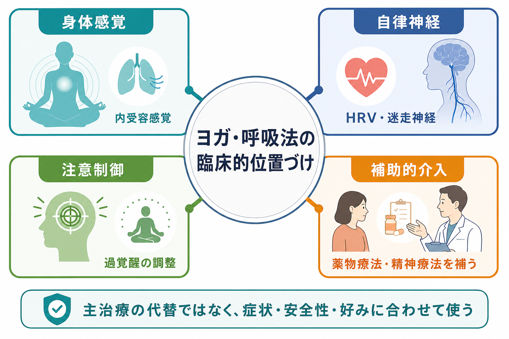
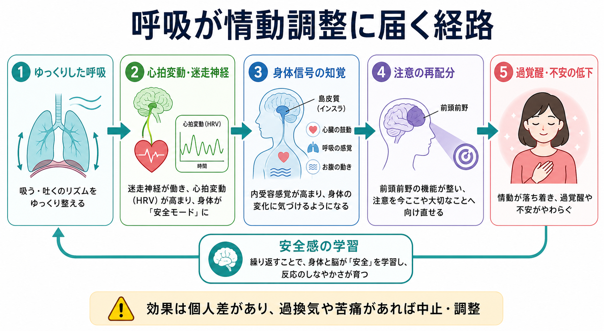
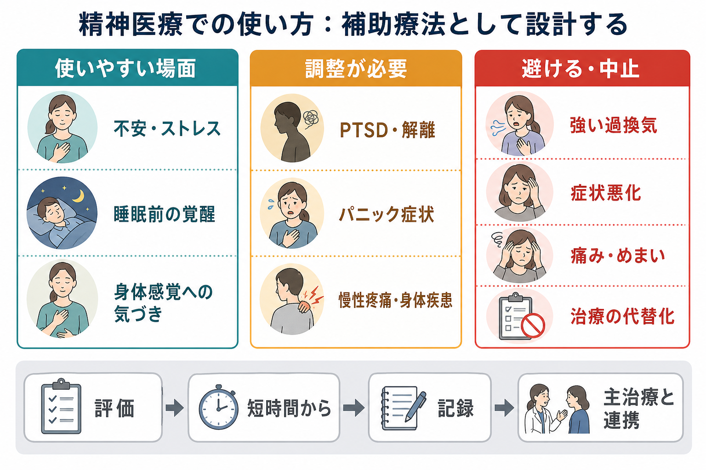

# ヨガや呼吸法は精神医療でどう使われるのか

## 要点

- ヨガや呼吸法は、精神疾患を単独で「治す」主治療というより、[[精神療法は脳を変えるのか|精神療法]]、薬物療法、睡眠・生活支援、リハビリテーションを補う身体志向の介入として位置づけるのが現実的である。
- 作用点は、主に「身体感覚への気づき」「[[自律神経ネットワークは内臓状態をどう制御するのか|自律神経]]の調整」「注意の向け方」「安全感の再学習」である。これは[[身体と感情はどのようにつながるのか|身体と感情]]、[[身体性は精神医学にどう関わるのか|身体性と精神医学]]の接点にある。
- うつ症状、不安症状、PTSD症状、ストレスに対して有望な研究はあるが、研究の質、介入内容、対象者、対照条件はばらつく。したがって、標準治療の代替ではなく、症状・身体状態・本人の好みに合わせて使う補助療法として扱う[1][5][6][7]。
- 呼吸法は、ゆっくりした呼吸、呼気を長めにする練習、ペース呼吸などを通じて、心拍変動、迷走神経系、情動調整と関係しうる。ただし、過換気、めまい、パニック誘発、解離の悪化があれば中止または調整する[2][3]。

## この記事で答える問い

この記事では、ヨガや呼吸法を「気分転換」や「民間療法」として片づけず、精神医療の中でどのような目的で、どこまで使えるのかを整理する。中心となる問いは次の三つである。

1. ヨガや呼吸法は、精神医療ではどの位置づけで使うべきか。
2. 身体感覚・自律神経・注意制御は、症状の改善とどう関係しうるか。
3. どのような場面で有用で、どのような場面では慎重に扱うべきか。

## まず結論

ヨガや呼吸法は、精神医療では「身体から入る自己調整スキル」として使うのが最も誤解が少ない。薬で神経伝達を調整する、心理療法で認知・感情・対人関係を扱う、生活支援で環境を整える、という主な治療軸に対して、ヨガや呼吸法は身体感覚と呼吸リズムを手がかりに、覚醒水準や注意の向け方を調整する補助線になる。

たとえば、[[不安症群とは何か|不安症]]では、動悸、息苦しさ、筋緊張、胸部不快感などの身体信号が「危険」の証拠として読まれやすい。呼吸法は、この身体信号に対して「すぐ逃げる」以外の応答を練習する場になりうる。[[うつ病とは何か|うつ病]]では、活動量低下、身体の重さ、睡眠リズムの乱れ、反すうが問題になることが多く、軽い身体活動や注意の切り替えが補助的に役立つ可能性がある[5]。[[PTSDとは何か|PTSD]]や[[複雑性PTSDとは何か|複雑性PTSD]]では、過覚醒、解離、身体感覚への恐怖が関わるため、トラウマに配慮した、選択可能で強制しない形の実施が重要になる[7]。

## 背景

精神医療は長く、言語化された症状、診断基準、薬物療法、面接技法を中心に発展してきた。一方で、実際の精神症状は身体から切り離せない。動悸、息苦しさ、胃腸症状、睡眠、疼痛、疲労、姿勢、筋緊張、発汗、震えは、単なる「付随症状」ではなく、情動、注意、予測、回避行動に影響する。

この観点から見ると、ヨガや呼吸法は「心を落ち着かせるための精神論」ではない。身体の内部信号を感じ、呼吸と姿勢を調整し、注意を現在の感覚へ戻し、過覚醒から少し距離を取るための訓練である。内受容感覚、すなわち身体内部から来る信号の感知と解釈は、不安、気分、摂食、依存、身体症状など複数の精神健康領域に関わると整理されている[4]。

ただし、ヨガや呼吸法への期待はしばしば過大になる。「自然だから安全」「呼吸を整えればすべて治る」「薬より優れている」といった言い方は、臨床的には危うい。研究上は有望な効果が示される領域がある一方で、試験規模、盲検化、対照条件、介入の標準化、安全性報告には限界がある。したがって、精神医療では、診断名だけで一律に勧めるのではなく、症状の型、身体疾患、トラウマ歴、解離、パニック発作、本人の文化的背景と好みに合わせて設計する必要がある[1][8]。

## 基本概念

### ヨガ

臨床で扱われるヨガは、宗教的実践そのものではなく、姿勢、呼吸、注意、リラクゼーション、短い瞑想を組み合わせた身体心理的プログラムとして使われることが多い。研究でも、ハタヨガ、トラウマセンシティブ・ヨガ、呼吸中心のヨガ、マインドフルネスに近いプログラムなど、内容はかなり異なる。

このため、「ヨガが効くか」と単純に問うより、「どの対象者に、どの強度で、どの要素を、何と比較して、どのアウトカムで評価したのか」を見る必要がある。うつ症状や不安症状に対するメタ解析では短期的な改善が示される一方、研究の質や長期効果には限界がある[5][6]。

### 呼吸法

呼吸法には、ペース呼吸、腹式呼吸、呼気を長めにする呼吸、共鳴周波数呼吸、ヨガ由来のプラーナーヤーマなどが含まれる。共通点は、普段は自動的に行われる呼吸へ意図的に注意を向け、リズム、深さ、呼気・吸気の比率を調整する点にある。

呼吸は、自律神経系と情動状態の両方に接続している。ゆっくりした呼吸は、心拍変動、圧受容体反射、迷走神経活動、脳波・脳機能指標と関連する可能性が報告されている[3]。また、呼吸法を含む breathwork のRCTメタ解析では、ストレス、不安、抑うつに対して小から中等度の改善が示されたが、介入内容や研究の質にはばらつきがある[2]。

### 補助的介入

補助的介入とは、標準治療の代わりではなく、標準治療を受けやすくしたり、日常生活で自己調整しやすくしたりするための介入である。ヨガや呼吸法は、急性期の希死念慮、精神病症状、重い躁状態、重度の摂食障害、重い物質使用、医学的に不安定な状態を単独で扱うものではない。むしろ、主治療の安全な枠組みの中で、身体感覚を扱う練習として導入する。

## 仕組み

### 1. 身体感覚を「危険信号」だけでなく「観察対象」にする

不安やパニックでは、心拍、胸部感覚、息苦しさ、めまいが「危険が迫っている」という解釈に結びつきやすい。PTSDでは、身体感覚が過去の脅威記憶を呼び起こし、過覚醒や解離につながることがある。ヨガや呼吸法は、身体感覚を無理に消すのではなく、強度を調整しながら観察し、名前をつけ、現在の環境と区別する練習になる。

この点は、[[予測処理とは何か|予測処理]]の観点とも接続できる。身体信号が常に危険として予測されると、注意は身体へ過剰に向き、回避や安全確認が増える。安全な範囲で身体感覚を経験し直すことは、「この感覚は危険とは限らない」という学習を助ける可能性がある。

### 2. 自律神経の振れ幅を狭める

ゆっくりした呼吸は、吸気と呼気に伴う心拍の変動、迷走神経系、血圧調整と関係する。臨床的には、過覚醒が強い人に対して、呼気を急に長くしすぎたり、深呼吸を強制したりすると、かえって息苦しさやめまいが増えることがある。したがって、「深く吸う」よりも「無理なく吐く」「呼吸を数える」「短時間で終える」ほうが安全な場合が多い[3]。

### 3. 注意を反すうから現在の感覚へ戻す

うつ病や不安症では、反すう、心配、予期不安が症状を維持する。呼吸や姿勢に注意を戻す練習は、思考内容を直接論破するのではなく、注意の配置を変える方法である。これは認知行動療法やマインドフルネス系介入と競合するものではなく、身体を使って注意制御を練習する方法として併用できる。

### 4. 行動活性化と睡眠リズムを支える

軽いヨガは、激しい運動が難しい人にとって、身体活動の再開点になることがある。朝に短時間の動きを入れる、夜に覚醒を下げる呼吸を入れる、疼痛や疲労に合わせて強度を調整する、といった使い方は、[[抑うつ気分とは何か|抑うつ気分]]や不眠を抱える人の生活設計と相性がよい。ただし、睡眠前に強い呼吸法や負荷の高いポーズを行うと、かえって覚醒が上がる人もいる。

## 図解

ヨガや呼吸法の臨床設計では、「効くか効かないか」より先に、「何のために使うのか」を明確にする。たとえば、不安には覚醒調整、うつには活動再開と反すうからの距離、PTSDには身体感覚と安全感の再学習、慢性疼痛には感覚への恐怖と回避の調整、というように、目的を症状維持メカニズムに結びつける。

| 臨床目的 | 使いやすい要素 | 注意点 |
|---|---|---|
| 不安・過覚醒の調整 | 短いペース呼吸、呼気を少し長めにする練習、グラウンディング | 過換気、息苦しさ、パニック誘発に注意 |
| うつ症状の補助 | 軽い身体活動、姿勢変化、朝の短時間ルーティン | 疲労、自己批判、できなさの感覚を強めない |
| PTSD・解離への補助 | トラウマインフォームドな選択可能な動き、目を開けた実施、短時間 | 閉眼、身体接触、強い内観、強制的なポーズを避ける |
| 身体症状・疼痛 | ゆっくりした動き、感覚のラベリング、活動量の段階づけ | 痛みを我慢する訓練にしない |
| 睡眠前の覚醒低下 | 静かな呼吸、筋緊張の観察、低刺激のルーティン | 強い運動・刺激的な呼吸法は避ける |

## 臨床・研究との接続

### うつ症状

ヨガのうつ症状への効果については、複数の系統的レビューがある。Cramerらのメタ解析では、通常ケアやリラクゼーション、運動と比較して短期的なうつ症状低下が示されたが、研究数、盲検化、長期追跡、安全性報告の不足が課題として残った[5]。臨床では、「うつ病の主治療」ではなく、軽い活動再開、反すうからの注意転換、睡眠リズム支援として位置づけるのが妥当である。

### 不安症状

不安に対するヨガ研究でも、短期的な不安軽減を示すメタ解析がある。ただし、診断された不安症に限ると研究数は多くなく、対照条件や介入内容もばらつく[6]。不安症では、身体感覚への恐怖が強い場合があるため、呼吸法を「症状を消す技法」として使うより、「身体感覚を観察し、危険解釈を少し緩める練習」として導入するほうが臨床的に扱いやすい。

### PTSD・トラウマ関連症状

PTSDでは、ヨガが身体感覚、過覚醒、感情調整へ働きかける補助療法として研究されている。PTSDに対するヨガの系統的レビュー・メタ解析は、症状軽減の可能性を示しつつ、研究数の少なさとエビデンスの質の限界を指摘している[7]。特にトラウマ歴がある人では、身体感覚への注意、閉眼、深い呼吸、特定の姿勢がトリガーになることがある。実施するなら、選択可能性、予告、退出可能性、身体接触をしないこと、目を開けた実施、短時間から始めることが重要である。

### 呼吸法とストレス

呼吸法に関するRCTメタ解析では、ストレス、不安、抑うつに対する有益な効果が示されたが、研究間の異質性は大きい[2]。また、ゆっくりした呼吸のレビューでは、心拍変動、自律神経指標、情動制御、脳活動との関連が整理されている[3]。臨床では、長時間の特殊な呼吸法より、30秒から3分程度の短い実施、症状記録、日常場面への接続のほうが継続しやすい。

### 安全性

ヨガは一般に安全な身体活動として扱われることが多いが、完全に無害ではない。RCTの安全性レビューでは、通常ケアや運動と比べて重篤な有害事象に大きな差は示されなかった一方、心理教育的介入などと比べると非重篤な有害事象が多い可能性があり、安全性報告の不足も課題とされた[8]。精神医療では、身体疾患、妊娠、疼痛、めまい、パニック、解離、摂食障害、強迫的運動、躁状態を確認し、必要なら医師・理学療法士・作業療法士・心理職・インストラクターが連携する。

## よくある誤解

### 「自然な方法だから副作用はない」

自然かどうかと安全かどうかは別である。ヨガでは筋骨格系の痛みやけが、呼吸法では過換気、めまい、しびれ、パニック様症状が起こりうる。特に、症状が強い人ほど「リラックスしなければならない」という圧力が逆効果になる。

### 「呼吸を整えれば不安は消える」

呼吸法は不安を消去する道具ではない。不安がある状態でも、呼吸、姿勢、注意を少し調整し、行動の選択肢を増やすための練習である。不安を完全に消すことを目標にすると、少しでも不安が残ったときに失敗感が強まる。

### 「ヨガは薬物療法や精神療法の代わりになる」

標準治療が必要な状態で、ヨガや呼吸法だけに置き換えるのは危険である。ヨガや呼吸法は、治療同盟、服薬、心理療法、環境調整、睡眠支援、危機対応を支える補助的な技法として考える。

### 「きついポーズほど効果がある」

精神医療で重要なのは、柔軟性や達成感ではなく、安全な範囲で身体感覚と注意を扱えることである。痛みを我慢する、競争する、指導者に合わせて無理をする、という形は治療的ではない。

## 関連ノート

- [[自律神経ネットワークは内臓状態をどう制御するのか]]
- [[体性感覚ネットワークは身体情報をどう表現するのか]]
- [[身体と感情はどのようにつながるのか]]
- [[身体性は精神医学にどう関わるのか]]
- [[感情は身体感覚の予測なのか]]
- [[不安症群とは何か]]
- [[うつ病とは何か]]
- [[PTSDとは何か]]
- [[複雑性PTSDとは何か]]
- [[精神療法は脳を変えるのか]]

MOC更新候補: `MOC｜意識・自己・身体性`, 臨床実践・治療系MOC, 精神医学系MOC。

## 理解チェック

1. ヨガや呼吸法を、精神医療で「主治療の代替」として扱うべきでない理由は何か。
2. 呼吸法が不安や過覚醒に関わると考えられる経路を、自律神経と注意制御の言葉で説明できるか。
3. PTSDや解離がある人にヨガを導入するとき、どのような実施上の配慮が必要か。
4. 「自然だから安全」という説明のどこが不十分か。

## 参考文献

[1] National Center for Complementary and Integrative Health. *Yoga: Effectiveness and Safety*. https://www.nccih.nih.gov/health/yoga-effectiveness-and-safety

[2] Fincham, G. W., Strauss, C., Montero-Marin, J., & Cavanagh, K. (2023). Effect of breathwork on stress and mental health: A meta-analysis of randomised-controlled trials. *Scientific Reports, 13*, 432. https://doi.org/10.1038/s41598-022-27247-y

[3] Zaccaro, A., Piarulli, A., Laurino, M., Garbella, E., Menicucci, D., Neri, B., & Gemignani, A. (2018). How Breath-Control Can Change Your Life: A Systematic Review on Psycho-Physiological Correlates of Slow Breathing. *Frontiers in Human Neuroscience, 12*, 353. https://doi.org/10.3389/fnhum.2018.00353

[4] Khalsa, S. S., Adolphs, R., Cameron, O. G., Critchley, H. D., Davenport, P. W., Feinstein, J. S., et al. (2018). Interoception and Mental Health: A Roadmap. *Biological Psychiatry: Cognitive Neuroscience and Neuroimaging, 3*(6), 501-513. https://doi.org/10.1016/j.bpsc.2017.12.004

[5] Cramer, H., Lauche, R., Langhorst, J., & Dobos, G. (2013). Yoga for depression: A systematic review and meta-analysis. *Depression and Anxiety, 30*(11), 1068-1083. https://doi.org/10.1002/da.22166

[6] Cramer, H., Lauche, R., Anheyer, D., Pilkington, K., de Manincor, M., Dobos, G., & Ward, L. (2018). Yoga for anxiety: A systematic review and meta-analysis of randomized controlled trials. *Depression and Anxiety, 35*(9), 830-843. https://doi.org/10.1002/da.22762

[7] Cramer, H., Anheyer, D., Saha, F. J., & Dobos, G. (2018). Yoga for posttraumatic stress disorder - a systematic review and meta-analysis. *BMC Psychiatry, 18*, 72. https://doi.org/10.1186/s12888-018-1650-x

[8] Cramer, H., Ward, L., Saper, R., Fishbein, D., Dobos, G., & Lauche, R. (2015). The Safety of Yoga: A Systematic Review and Meta-Analysis of Randomized Controlled Trials. *American Journal of Epidemiology, 182*(4), 281-293. https://doi.org/10.1093/aje/kwv071
