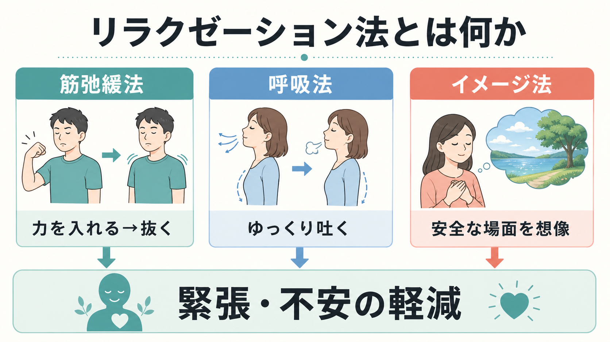
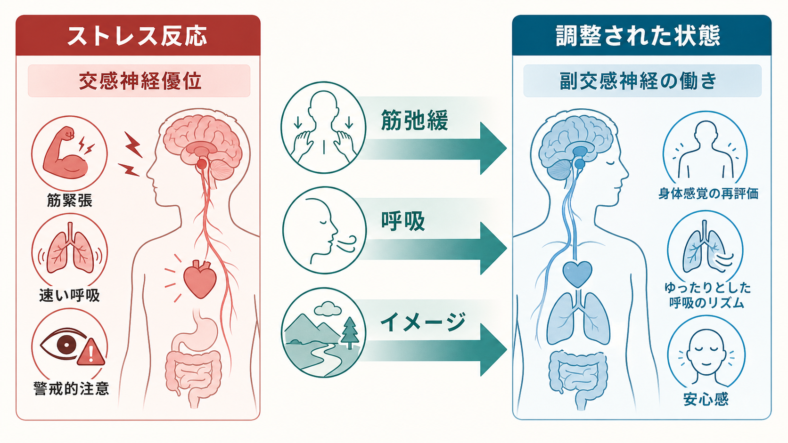
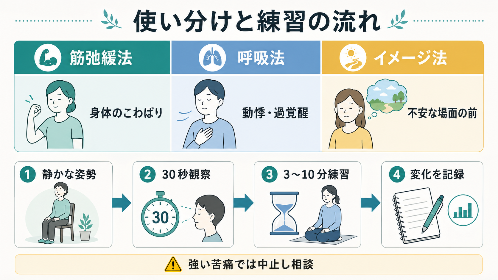

# リラクゼーション法とは何か

## 要点

- リラクゼーション法は、筋弛緩法・呼吸法・イメージ法などを通じて、身体の緊張、呼吸、注意、情動反応を調整しやすくする技法群である。
- 目的は「完全に不安を消す」ことではなく、過覚醒や筋緊張を下げ、身体感覚を観察し、回復しやすい状態を作ることである。
- 全般不安症では、NICE が高強度心理的介入の選択肢として CBT と並んで applied relaxation を位置づけている[1]。
- ただし、PTSD、強迫症、強い解離、トラウマ反応が前景にある場合は、リラクゼーションだけで主治療とみなすのではなく、評価と治療計画の中に慎重に組み込む必要がある[2][3]。

## この記事で答える問い

1. リラクゼーション法は、単なる「気休め」ではなく、どのような心理生理学的技法なのか。
2. 筋弛緩法・呼吸法・イメージ法は、それぞれ何に働きかけるのか。
3. 不安症、ストレス、身体症状、心理療法の中でどのように位置づければよいのか。

## まず結論

リラクゼーション法は、身体から心を落ち着かせる技法と、心的イメージから身体反応を変える技法を組み合わせた「状態調整」の方法である。筋弛緩法は筋肉の緊張と弛緩の差を学ぶ。呼吸法は速く浅い呼吸をゆっくりしたリズムへ戻し、迷走神経や心拍変動と関係する自律神経調整に働きかける。イメージ法は、安全な場面や落ち着いた記憶を用いて、注意と感情の焦点を変える[4][5]。

重要なのは、リラクゼーション法を「症状を消す魔法」としてではなく、[[不安とは何か|不安]]やストレス反応の強度を下げ、[[認知行動療法CBTとは何か|認知行動療法]]、曝露、睡眠改善、生活調整、薬物療法などを実行しやすくする補助技法として理解することである。

## 背景

不安や緊張は、頭の中の思考だけではなく、筋肉、呼吸、心拍、発汗、胃腸感覚、注意の向きとして現れる。たとえば、[[パニック発作とは何か|パニック発作]]では動悸や息苦しさが恐怖を増幅し、[[全般不安症とは何か|全般不安症]]では慢性的な警戒と身体緊張が続きやすい。身体反応が強いほど、「危険が起きている」という解釈も強まり、不安の循環が維持される。

リラクゼーション法は、この循環のうち「身体のこわばり」「呼吸の速さ」「警戒的注意」「安心できるイメージの不足」に介入する。NCCIH は、リラクゼーション技法をストレス、不安、医療処置前の不安、痛みなどに対して用いられる心身アプローチとして整理しているが、研究の質や対象集団にはばらつきがあるとも述べている[2]。したがって、効果の可能性と限界を同時に押さえる必要がある。

## 基本概念

### 筋弛緩法

筋弛緩法、特に progressive muscle relaxation は、筋肉に短く力を入れ、その後に力を抜くことで、緊張と弛緩の差を体感する練習である。最近のシステマティックレビューでは、成人のストレス、不安、抑うつに対する PMR の研究が整理され、全体として有用性が示唆されている[6]。ただし、対象者、実施時間、比較条件、研究品質は一定ではないため、「どの人にも同じ強さで効く」とは言えない。

臨床的には、肩、首、顎、手、腹部などに力が入りやすい人に向いている。身体のこわばりを自覚しにくい人でも、あえて少し力を入れてから抜くことで、「抜けた状態」を検出しやすくなる。

### 呼吸法

呼吸法は、吸うことよりも「吐くこと」と「リズム」を重視する。ストレス時には呼吸が浅く速くなり、息苦しさや胸部不快感が増えることがある。ゆっくりした呼吸は、心拍変動、呼吸性洞性不整脈、迷走神経活動などと関係し、情動調整や自律神経の柔軟性と結びつく可能性がある[5]。

ただし、呼吸へ注意を向けると不安が増える人もいる。[[パニック症とは何か|パニック症]]で身体感覚への恐怖が強い場合、長い息止め、過度な深呼吸、厳密すぎる呼吸コントロールはかえって苦痛を高めることがある。呼吸法は「正しい呼吸を達成する課題」ではなく、呼吸を少し整える練習として扱う。

### イメージ法

イメージ法は、安心できる場所、支えられた記憶、落ち着いた身体感覚を想像し、視覚、音、温度、匂い、身体感覚を使って心身の状態を調整する方法である。PMR、深呼吸、ガイド付きイメージを比較した研究では、いずれもリラクゼーション状態の促進に関わる可能性が示されている[4]。がん領域などでは、筋弛緩法とガイド付きイメージを組み合わせた介入のレビューも行われている[7]。

一方で、イメージは必ず安全に働くわけではない。トラウマ記憶、侵入的イメージ、解離が強い人では、目を閉じることや身体内感覚への集中が苦痛を増やすことがある。必要な場合は、目を開けたまま行う、外界の物に注意を置く、短時間で中止できるようにするなどの調整が必要である。

## 仕組み

リラクゼーション法の仕組みは、単一の神経回路で説明するより、複数の調整経路として見ると理解しやすい。

| 経路 | 何を変えるか | 例 |
|---|---|---|
| 末梢から中枢への入力 | 筋肉、呼吸、姿勢、心拍感覚 | 筋弛緩法、呼吸法 |
| 注意の焦点 | 脅威刺激から現在の身体感覚へ | 呼吸観察、接地感 |
| 解釈の修正 | 「危険な身体反応」から「調整可能な反応」へ | 身体感覚の再評価 |
| 情動イメージ | 恐怖・心配イメージから安全イメージへ | ガイド付きイメージ |
| 行動の準備 | 回避ではなく、次の行動へ移る余裕 | 面接前、検査前、就寝前 |

筋弛緩法は、身体の緊張を下げるだけでなく、「緊張していることに気づく」能力を高める。呼吸法は、呼吸の速さと心拍の揺らぎを通じて自律神経調整に関与する可能性がある[5]。イメージ法は、注意と情動記憶を利用して、危険予測に偏った認知を一時的に別の文脈へ移す。

ここで大切なのは、リラクゼーションが不安をゼロにするのではなく、「不安があっても扱える範囲まで下げる」ことである。[[曝露療法とは何か|曝露療法]]や[[社交不安症のCBTでは何を行うのか|社交不安症のCBT]]では、不安を完全に回避することが目標ではない。リラクゼーション法も、不安の回避儀式にならないよう、目的を明確にする必要がある。

## 図解

### 基本手順

1. 静かで安全な姿勢をとる。
2. 今の緊張、呼吸、心拍、注意の向きを 30 秒ほど観察する。
3. 筋弛緩法、呼吸法、イメージ法のいずれかを 3〜10 分試す。
4. 前後の変化を、0〜10 の主観評価や短いメモで記録する。
5. 強い苦痛、フラッシュバック、解離感、息苦しさの悪化があれば中止し、専門家に相談する。

### 使い分け

| 状態 | 使いやすい方法 | 注意点 |
|---|---|---|
| 肩こり、顎の力み、全身のこわばり | 筋弛緩法 | 痛みがある部位に強く力を入れない |
| 動悸、過覚醒、急ぎすぎる感覚 | 呼吸法 | 深呼吸を強制せず、吐く息を少し長くする |
| 不安な予定の前、眠る前 | イメージ法 | 侵入的イメージが強いときは短く行う |
| 面接、検査、発表前 | 短い呼吸法＋筋弛緩 | 回避ではなく行動前の調整として使う |

## 臨床・研究との接続

リラクゼーション法は、心理療法の中で単独技法としても、補助技法としても使われる。NICE の GAD ガイドラインでは、高強度心理的介入として CBT または applied relaxation を選択肢に含め、applied relaxation は訓練を受けた実践者が、臨床試験で用いられたマニュアルに基づいて行うことが推奨されている[1]。

一方で、CBT とリラクゼーション療法を比較したメタ分析では、全体としては CBT 側に小さな優位があり、PTSD や強迫症ではリラクゼーションが相対的に弱い可能性が示された。ただし、全般不安症、パニック症、社交不安症、特定の恐怖症では、リラクゼーションが明確に劣るとは言えない結果も報告されている[3]。このため、リラクゼーション法は「CBT の代用品」と一括りにするより、症状、診断、治療段階に応じて役割を分けるのがよい。

研究上は、介入の形式が多様であることが課題である。PMR、呼吸法、イメージ法、自律訓練法、マインドフルネス、HRV バイオフィードバックなどが「リラクゼーション」としてまとめられることがある。NCCIH も、ストレスや不安への有用性を示す研究がある一方、研究の質やサンプルサイズに限界があることを注意点としている[2]。[[マインドフルネスストレス低減法MBSRとは何か|MBSR]] や [[マインドフルネス認知療法MBCTとは何か|MBCT]] と重なる部分もあるが、リラクゼーション法は「落ち着く状態を作る」ことを比較的明示的な目標にしやすい点が異なる。

医療・精神医学の場面では、次のような使い方が現実的である。

- 心理教育として、ストレス反応と身体反応の関係を説明する。
- [[心理療法とは何か|心理療法]]の前後で、過覚醒を下げる準備技法として使う。
- [[不眠症の認知行動療法CBT-Iとは何か|CBT-I]] や睡眠衛生と組み合わせ、就床前の反すうを弱める。
- 薬物療法、曝露、問題解決、生活調整を妨げる身体的緊張を下げる。
- 自己記録を用いて、どの方法がどの場面で役立つかを個別化する。

## よくある誤解

### 誤解1: リラックスできないのは失敗である

リラクゼーション法の初期目標は、強いリラックス感ではなく、身体反応に気づき、少し変化を作ることである。緊張が 10 から 8 に下がるだけでも、次の行動に移りやすくなることがある。

### 誤解2: 不安を感じたら必ずリラクゼーションすべきである

リラクゼーションを毎回の不安回避に使うと、「落ち着かないと行動できない」という学習が強まることがある。特に曝露を含む治療では、不安を下げることだけでなく、不安があっても行動できる経験が重要になる。

### 誤解3: 呼吸法は深く吸えばよい

不安時に大きく吸い続けると、過換気様の不快感が増える場合がある。多くの場面では、吸う量を増やすより、吐く息を少し長くし、呼吸を観察する方が扱いやすい。

### 誤解4: 安全で副作用はない

一般には低リスクとされるが、リラクゼーションで不安、侵入思考、コントロール喪失感が増える人もいる。NCCIH は、てんかん、一部の精神疾患、虐待・トラウマ歴のある人では症状が悪化する可能性がまれに報告されていると注意している[8]。強い苦痛が出る場合は、短時間化、中止、専門家への相談を優先する。

## 関連ノート

- [[不安とは何か]]
- [[不安症群とは何か]]
- [[全般不安症とは何か]]
- [[パニック症とは何か]]
- [[パニック発作とは何か]]
- [[認知行動療法CBTとは何か]]
- [[曝露療法とは何か]]
- [[マインドフルネスストレス低減法MBSRとは何か]]
- [[不眠症の認知行動療法CBT-Iとは何か]]
- [[心理療法とは何か]]

## 理解チェック

1. 筋弛緩法が「力を入れる」段階を含むのはなぜか。
2. 呼吸法で「深く吸う」より「ゆっくり吐く」ことが重視される場面があるのはなぜか。
3. リラクゼーション法が不安の回避儀式になってしまうのはどのような場合か。
4. PTSD やトラウマ反応がある人にリラクゼーション法を用いるとき、どのような注意が必要か。
5. applied relaxation と CBT は、全般不安症の治療計画でどのように使い分けられるか。

## 参考文献

[1] National Institute for Health and Care Excellence. (2011, updated 2020). *Generalised anxiety disorder and panic disorder in adults: management: CG113*. https://www.nice.org.uk/guidance/cg113/chapter/1-guidance

[2] National Center for Complementary and Integrative Health. (2024). *Relaxation Techniques: What You Need To Know*. https://www.nccih.nih.gov/health/relaxation-techniques-what-you-need-to-know

[3] Montero-Marin, J., Garcia-Campayo, J., López-Montoyo, A., Zabaleta-Del-Olmo, E., & Cuijpers, P. (2018). Is cognitive-behavioural therapy more effective than relaxation therapy in the treatment of anxiety disorders? A meta-analysis. *Psychological Medicine, 48*(9), 1427-1436. https://doi.org/10.1017/S0033291717003099

[4] Toussaint, L., Nguyen, Q. A., Roettger, C., Dixon, K., Offenbächer, M., Kohls, N., Hirsch, J., & Sirois, F. (2021). Effectiveness of Progressive Muscle Relaxation, Deep Breathing, and Guided Imagery in Promoting Psychological and Physiological States of Relaxation. *Evidence-Based Complementary and Alternative Medicine, 2021*, 5924040. https://pmc.ncbi.nlm.nih.gov/articles/PMC8272667/

[5] Zaccaro, A., Piarulli, A., Laurino, M., Garbella, E., Menicucci, D., Neri, B., & Gemignani, A. (2018). How Breath-Control Can Change Your Life: A Systematic Review on Psycho-Physiological Correlates of Slow Breathing. *Frontiers in Human Neuroscience, 12*, 353. https://doi.org/10.3389/fnhum.2018.00353

[6] Muhammad Khir, S., Wan Mohd Yunus, W. M. A., Mahmud, N., Wang, R., Panatik, S. A., Mohd Sukor, M. S., & Nordin, N. A. (2024). Efficacy of Progressive Muscle Relaxation in Adults for Stress, Anxiety, and Depression: A Systematic Review. *Psychology Research and Behavior Management, 17*, 345-365. https://doi.org/10.2147/PRBM.S437277

[7] Sinha, M. K., Barman, A., Goyal, M., & Patra, S. (2021). Progressive Muscle Relaxation and Guided Imagery in Breast Cancer: A Systematic Review and Meta-analysis of Randomised Controlled Trials. *Indian Journal of Palliative Care, 27*(2), 336-344. https://doi.org/10.25259/IJPC_136_21

[8] National Center for Complementary and Integrative Health. (2024). *Stress*. https://www.nccih.nih.gov/health/stress

## 未解決問題

- リラクゼーション法のどの要素が、どの症状群に最も効くのかは、技法別・対象別にさらに分けた研究が必要である。
- 呼吸法やイメージ法が苦痛を増やす人を、事前にどのように見分けるかは実践上の課題である。
- デジタル教材、音声ガイド、ウェアラブル指標を使った練習が、対面の心理療法とどのように補完し合うかは今後の検討点である。

## MOC更新候補

- `content/00_MOC/` 配下の臨床実践・心理療法・不安症関連 MOC に、バッチ統合時に [[リラクゼーション法とは何か]] を追加する候補。
