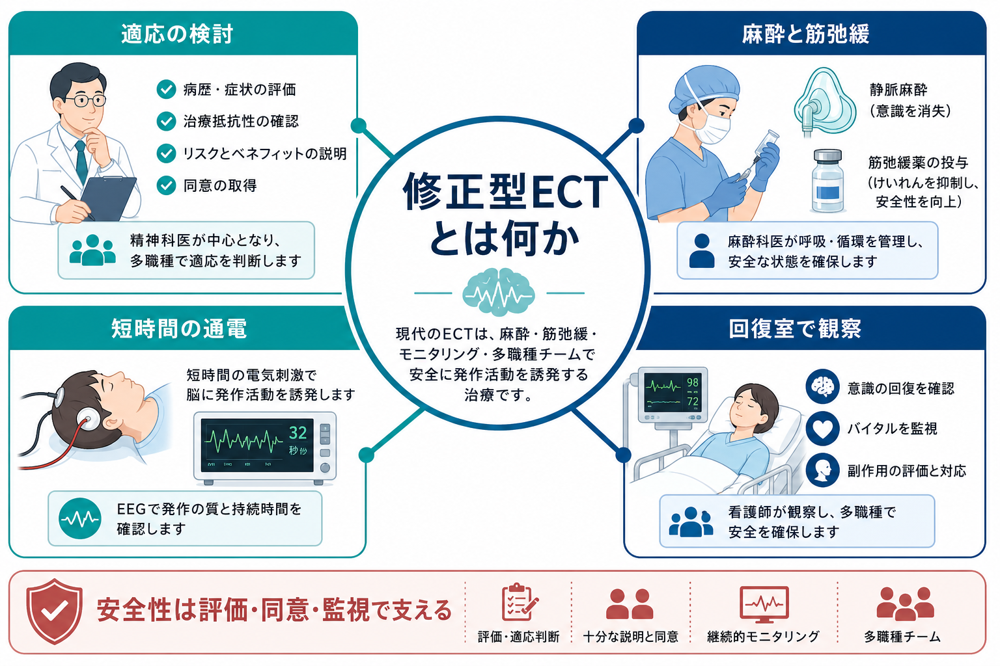
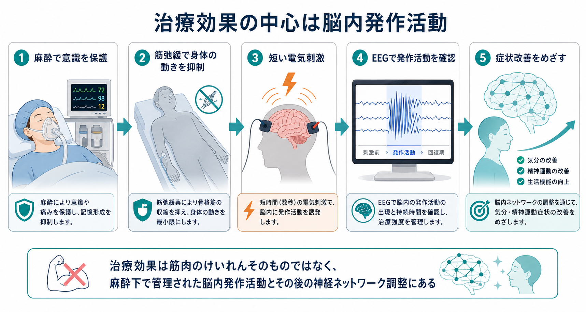
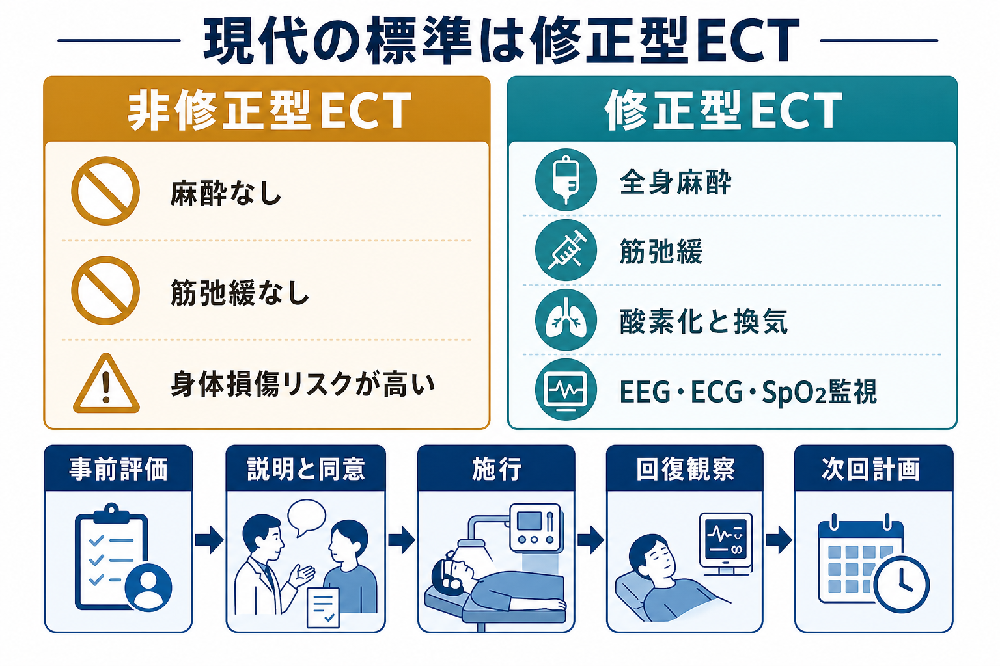

# 修正型ECTとは何か

## 要点

- 修正型ECT（modified electroconvulsive therapy: mECT）は、全身麻酔、筋弛緩、酸素化、循環・呼吸・脳波モニタリングのもとで短時間の電気刺激を行い、治療的な発作活動を誘発する現代的な電気けいれん療法である[1][2]。
- 治療効果の中心は「身体を大きくけいれんさせること」ではなく、管理された脳内発作活動と、その後に起こる神経ネットワーク・神経伝達・内分泌系の変化にあると考えられている[2][5]。
- 主な適応は、重症・治療抵抗性のうつ病、精神病性うつ病、カタトニア、重症躁病、一部の治療抵抗性統合失調症などで、特に迅速な改善が必要な場面で検討される[1][6]。
- 本稿は教育・研究目的の概説であり、個別の診断、適応判断、同意能力判断、麻酔方法、治療回数の指示ではない。

## この記事で答える問い

この記事では、次の問いに答える。

1. 修正型ECTは、古い「無麻酔の電気ショック」と何が違うのか。
2. 麻酔と筋弛緩は何のために使うのか。
3. 実際の手順では、どのような評価、モニタリング、回復観察が行われるのか。
4. どのような疾患・状況で検討され、何に注意して説明されるべきか。

## まず結論

修正型ECTは、[[抗うつ薬とは何か]]、[[気分安定薬とは何か]]、[[抗精神病薬とは何か]]、[[心理療法と薬物療法はどう組み合わせるのか]]だけでは十分な改善が得られない、または生命・栄養・自殺リスク・カタトニアなどのために迅速な改善が必要な場合に検討される身体療法である。実施は、精神科医、麻酔担当者、看護師などのチームで行われ、事前評価、同意、麻酔、筋弛緩、通電、発作評価、回復観察を一つの安全プロセスとして管理する[1][3]。

「電気刺激をする治療」という表現だけでは、現在の標準的な姿を捉え損ねる。現代の修正型ECTでは、患者は麻酔で意識を失った状態になり、筋弛緩薬で全身の大きな運動発作を抑え、酸素化と換気を補助しながら、EEG、ECG、血圧、酸素飽和度などを監視する[2][3]。そのため、臨床上の主眼は「強いけいれんを起こすこと」ではなく、「必要最小限の刺激で、治療に必要な発作活動を安全に誘発し、認知機能や身体合併症を継続評価すること」にある。

## 背景

ECTは1930年代から用いられてきたが、初期には麻酔や筋弛緩を伴わない施行があり、骨折、脱臼、強い恐怖体験、社会的スティグマと結びついて語られてきた。現在の修正型ECTは、その歴史的問題を踏まえ、全身麻酔、筋弛緩、短パルス刺激、客観的モニタリング、同意手続き、治療ごとの評価を組み合わせる方向へ発展してきた[6][7]。

日本でも、mECTは静脈麻酔薬と筋弛緩薬を用いた全身麻酔下で行われ、骨折などの副作用予防、不安軽減、全身状態評価、麻酔科・内科との連携が重要であると整理されている[7]。この点で、修正型ECTは単なる精神科手技ではなく、精神科、麻酔、身体医学、看護、倫理的同意プロセスが交差する治療である。

## 基本概念

### 修正型という言葉の意味

「修正型」とは、ECTそのものの治療原理を残しながら、患者の苦痛と身体損傷リスクを下げるために、麻酔と筋弛緩を加えた形式を指す。英語では modified ECT と呼ばれる。ここで修正されているのは、治療効果を目指す発作活動ではなく、意識下の苦痛、強い全身けいれん、筋骨格系損傷、呼吸循環リスクを減らすための実施条件である[2][4]。

### 麻酔の役割

麻酔の第一の目的は、施行中の意識と苦痛をなくし、短時間で導入・覚醒できる状態を作ることである。ECTでは発作活動を誘発する必要があるため、麻酔薬は「眠らせる力」だけでなく、発作閾値、発作持続、循環動態、覚醒の速さへの影響を考えて選ばれる[3][5]。

### 筋弛緩の役割

筋弛緩薬は、発作に伴う強い筋収縮を抑え、骨折、脱臼、筋損傷、舌・歯の損傷を減らすために使われる[2][3]。ただし筋弛緩は脳内発作活動を消すものではない。そのため、運動発作が小さく見えても、EEGなどで発作活動を確認する必要がある。

## 仕組み

修正型ECTの治療機序は一つに還元できない。臨床的には、短時間の電気刺激によって全般化した発作活動を誘発し、その後に気分、精神運動制止、妄想、緊張病症状などの改善を目指す治療と理解できる[1][2]。

研究上は、神経伝達物質、神経内分泌、神経可塑性、機能的ネットワーク、炎症・ストレス応答など複数のレベルで変化が検討されている。たとえば[[神経可塑性低下はうつ病をどう説明するのか]]、[[報酬系の異常はうつ病をどう説明するのか]]、[[セロトニン仮説はうつ病をどこまで説明できるのか]]のような個別仮説と接続しうるが、ECTの効果は単一の神経伝達物質仮説だけでは説明しきれない[5]。

## 標準的な流れ

実際の流れは施設、法制度、患者の身体状態によって異なるが、概念的には次の段階に分けられる。

1. **適応の検討**: 診断、重症度、緊急性、これまでの薬物療法・心理社会的治療、身体合併症、認知機能、患者の希望を確認する[1][6]。
2. **説明と同意**: 期待される利益、短期・長期の記憶障害を含む認知副作用、麻酔リスク、代替治療、治療しない場合のリスクを説明する[6]。
3. **施行前評価**: 既往歴、内服薬、麻酔リスク、気道評価、循環器・呼吸器リスク、妊娠可能性、禁食状況などを確認する[2][3]。
4. **麻酔導入と酸素化**: 静脈路を確保し、酸素投与、血圧・心電図・酸素飽和度などの監視下で麻酔を導入する[3]。
5. **筋弛緩と保護**: 筋弛緩薬を投与し、必要に応じて神経刺激装置やカフ法で運動発作を評価し、バイトブロックで口腔損傷を防ぐ[2][3]。
6. **通電と発作評価**: 電極配置、刺激量、パルス幅などを設定し、EEGと臨床所見で発作の質と持続を評価する[1][3]。
7. **回復観察**: 呼吸、循環、意識、見当識、せん妄、頭痛、筋痛、悪心、記憶障害などを観察し、次回方針を調整する[1][3]。

## 臨床・研究との接続

### どのような場面で検討されるか

ECTは、[[大うつ病性障害とは何か]]、[[精神病性うつ病とは何か]]、[[治療抵抗性うつ病とは何か]]、[[双極性障害とは何か]]、[[躁病エピソードとは何か]]、[[カタトニアとは何か]]、[[統合失調症とは何か]]などの文脈で検討される。NICEは、ECTを重症症状の迅速かつ短期的改善を目的とする治療として位置づけ、利益とリスクの文書化、麻酔リスクや認知障害の評価、同意、治療ごとの臨床状態と認知機能評価を求めている[6]。

特に臨床的に重要なのは、治療抵抗性だけでなく「待てない状況」である。自殺リスク、拒食・脱水、昏迷、悪性カタトニア、重症躁病、精神病性うつ病などでは、薬物療法の効果発現を待つこと自体が危険になる場合がある。このような場面でECTが選択肢に上がることがある[1][8]。

### 薬物療法との関係

ECTは薬物療法の単純な代替ではなく、しばしば薬物療法と組み合わせて治療計画に組み込まれる。たとえば[[ベンゾジアゼピン系薬とは何か]]、リチウム、抗けいれん薬、抗精神病薬などは、発作閾値、せん妄、循環動態、認知副作用に関係しうるため、施行前にリスクベネフィットを点検する[4]。これは[[薬物療法のリスクベネフィットをどう考えるか]]と同じく、効果だけでなく有害事象と治療しないリスクを同時に扱う判断である。

### 研究上の評価

研究では、電極配置、刺激用量、発作閾値、発作持続、EEG指標、麻酔薬の種類、認知副作用、再発予防、維持ECTなどが検討される。短期的な改善効果が示されてきた一方で、どの患者にどのパラメータが最も適しているか、認知副作用をどう最小化するか、維持療法をどう設計するかは継続的な課題である[5][8]。

## よくある誤解

### 「電気ショックで罰する治療」ではない

歴史的に不適切な施行があったため、この連想は軽視できない。しかし現代の修正型ECTは、同意、麻酔、筋弛緩、モニタリング、発作評価、回復観察を含む医療手技であり、懲罰や行動制御のために用いられるものではない[6][7]。

### 「けいれんが大きいほど効く」わけではない

筋弛緩によって身体の動きは小さくなる。評価すべきなのは、身体の激しさではなく、EEGで確認される発作活動、臨床反応、副作用、認知機能である[2][3]。

### 「薬が効かない人に最後に何となく行う治療」ではない

ECTは重症度、緊急性、既治療、身体状態、患者の価値観を踏まえて検討される。治療抵抗性うつ病だけでなく、カタトニアや重症躁病など、迅速な改善が重要な病態でも選択肢になる[1][6]。

### 「安全だからリスク説明は簡略でよい」わけではない

修正型ECTは過去の非修正型より安全性を高めた手技だが、麻酔リスク、循環器イベント、頭痛、筋痛、悪心、せん妄、記憶障害などのリスクは残る。したがって、利益とリスク、代替案、治療しない場合のリスクを説明し、治療ごとに状態を評価する必要がある[3][6]。

## 関連ノート

既存ノートとして、次のノートと接続しやすい。

- [[大うつ病性障害とは何か]]
- [[精神病性うつ病とは何か]]
- [[治療抵抗性うつ病とは何か]]
- [[双極性障害とは何か]]
- [[躁病エピソードとは何か]]
- [[カタトニアとは何か]]
- [[統合失調症とは何か]]
- [[抗うつ薬とは何か]]
- [[気分安定薬とは何か]]
- [[抗精神病薬とは何か]]
- [[TMSはうつ病治療でどの神経回路を狙っているのか]]

MOC更新候補: `MOC：臨床実践・治療`, `MOC：精神医学`, `MOC：神経調節・身体療法`

## 理解チェック

1. 修正型ECTで麻酔と筋弛緩を使う主な目的は何か。
2. 身体のけいれんが小さく見えるとき、なぜEEGなどの発作評価が必要なのか。
3. ECTの適応判断で、治療抵抗性以外に「迅速性」が問題になるのはどのような状況か。
4. 説明と同意で、利益だけでなく認知副作用や麻酔リスクを扱うべき理由は何か。

## 未解決問題

- どの電極配置、刺激量、麻酔薬、治療間隔が、個々の患者の効果と認知副作用のバランスを最適化するのか。
- ECT後の再発予防として、薬物療法、心理社会的支援、維持ECTをどう組み合わせるべきか。
- 患者の主観的体験、記憶障害、同意プロセスの質を、臨床研究と日常診療でどう測定・改善するか。

## 参考文献

[1] Thirthalli J, Sinha P, Sreeraj VS. Clinical Practice Guidelines for the Use of Electroconvulsive Therapy. *Indian Journal of Psychiatry*. 2023;65(2):258-269. https://doi.org/10.4103/indianjpsychiatry.indianjpsychiatry_491_22

[2] Singh A, Kar SK. Electroconvulsive Therapy. *StatPearls*. NCBI Bookshelf. https://www.ncbi.nlm.nih.gov/books/NBK538266/

[3] Reasoner J, Rondeau B. Anesthetic Considerations in Electroconvulsive Therapy. *StatPearls*. NCBI Bookshelf. https://www.ncbi.nlm.nih.gov/books/NBK576431/

[4] Zolezzi M. Medication management during electroconvulsant therapy. *Neuropsychiatric Disease and Treatment*. 2016;12:931-939. https://pmc.ncbi.nlm.nih.gov/articles/PMC4844444/

[5] Dai X, Zhang R, Deng N, et al. Anesthetic Influence on Electroconvulsive Therapy: A Comprehensive Review. *Neuropsychiatric Disease and Treatment*. 2024;20:1491-1502. https://doi.org/10.2147/NDT.S467695

[6] National Institute for Health and Care Excellence. Guidance on the use of electroconvulsive therapy. Technology appraisal guidance TA59. Published 2003, updated 2009. https://www.nice.org.uk/guidance/ta59/chapter/1-Guidance

[7] 鮫島達夫, 一瀬邦弘, 奥村正紀, 中村満, 平山貴敏, 朝長章子, 村木健郎, 大久保善朗. 修正型電気けいれん療法（m-ECT）の麻酔法の現況と今後のあり方. *総合病院精神医学*. 2012;24(2):110-117. https://doi.org/10.11258/jjghp.24.110

[8] Greenhalgh J, Knight C, Hind D, Beverley C, Walters S. Clinical and cost-effectiveness of electroconvulsive therapy for depressive illness, schizophrenia, catatonia and mania: systematic reviews and economic modelling studies. *Health Technology Assessment*. 2005. https://www.ncbi.nlm.nih.gov/books/NBK62274/
