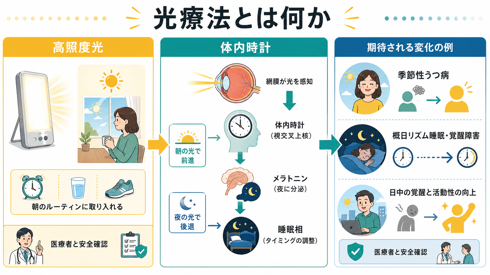
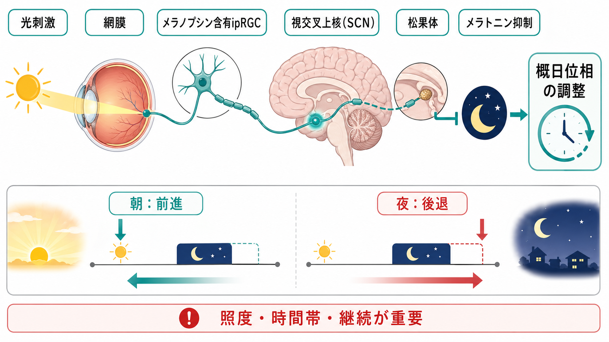
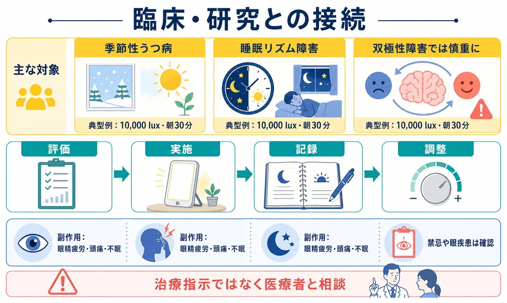

# 光療法とは何か

## 要点

- 光療法は、高照度の人工光を決まった時刻に浴びることで、[[睡眠覚醒障害群とは何か|睡眠・覚醒リズム]]、メラトニン分泌、日中の覚醒度、気分症状を調整しようとする非薬物的介入である。
- 中心的な標的は、網膜から視交叉上核（suprachiasmatic nucleus; SCN）へ入る光入力である。メラノプシンをもつ内因性光感受性網膜神経節細胞（ipRGC）は、昼夜情報をSCNへ伝え、概日リズムの同調に関与する[1][2]。
- 臨床では、冬季型の[[季節性うつ病とは何か|季節性うつ病]]、概日リズム睡眠・覚醒障害、認知症高齢者の不規則な睡眠・覚醒リズムなどで検討される。ただし、適応と推奨度は対象疾患・年齢・併存症によって異なる[3][4]。
- 典型的には、紫外線を除いた白色光を10,000 lux程度で朝に20-60分浴びる設計がよく使われるが、照度、距離、時刻、期間は装置と目的によって変わる[5][6]。
- [[双極性障害とは何か|双極性障害]]、眼疾患、光感受性を高める薬剤、強い不眠・焦燥がある場合は、自己判断で強く長く照射するのではなく、医療者と安全確認を行う。

## この記事で答える問い

1. 光療法は、単に「明るい光を浴びる」ことと何が違うのか。
2. なぜ光が睡眠相や気分に影響するのか。
3. 季節性うつ病や睡眠リズム障害では、どのように研究・臨床へ接続されているのか。
4. どのような誤解と注意点があるのか。

## まず結論

光療法は、光を「気分転換」として使うのではなく、体内時計への入力として使う介入である。網膜のipRGCは、明暗情報をSCNへ送り、メラトニン分泌や睡眠・覚醒タイミングを調整する。朝の光は概して体内時計を前進させ、夜の光は後退させやすい。この性質を利用して、季節性の抑うつ、睡眠相の遅れ、昼夜リズムの乱れなどに対して、照度・時刻・継続期間を設計する[1][3]。

ただし、光療法は「誰にでも同じ条件で効く万能な治療」ではない。季節性うつ病では標準的治療として広く使われてきた一方、予防目的のエビデンスは限られる[4]。また、双極性障害では躁転・軽躁化への配慮が必要であり、眼疾患や光感受性薬剤がある場合も確認が必要である[7][8]。本記事は教育・研究目的の整理であり、個別の診断や治療指示ではない。

## 背景

ヒトの睡眠、体温、ホルモン分泌、覚醒度、気分は、約24時間周期の概日リズムに支えられている。中心的な時計は視床下部のSCNにあり、外界の明暗サイクルによって毎日微調整される。日中の自然光が乏しい、夜間に強い光を浴びる、睡眠時刻が社会生活とずれる、といった条件では、内的なリズムと外的な生活時刻がずれやすい。

光療法は、この「ずれ」を光入力で補正するという発想から発展した。精神医学では、秋冬に反復する抑うつ症状への介入として研究され、睡眠医学では睡眠相後退、睡眠相前進、不規則睡眠・覚醒リズムなどの時間生物学的治療として位置づけられてきた[3][5]。関連する概念は、[[睡眠障害とは何か]]、[[精神疾患と睡眠障害はどう関係するのか]]、[[メラトニン受容体作動薬とは何か]]とも接続する。

## 基本概念

### 光療法

光療法とは、治療・研究目的で、照度、波長、照射時刻、照射時間、距離、頻度を設定して光を浴びる介入である。季節性うつ病でよく説明される標準例は、紫外線を除いた10,000 lux程度の白色光を、起床後の朝に30分前後使用する方法である[5][6]。ただし、これは代表的なプロトコルであって、すべての疾患・年齢・状況にそのまま当てはめる設定ではない。

通常の室内照明は数十から数百lux程度で、曇天の屋外や日中屋外光とは大きく異なる。光療法で使うライトボックスは、目に直接光源を凝視するためのものではなく、一定距離から視野に明るい光が入るように設計される。距離が離れると照度は下がるため、装置ごとの推奨距離と時間を確認する必要がある。

### 概日リズム

概日リズムとは、睡眠・覚醒、体温、メラトニン、コルチゾール、注意、食欲などにみられる約24時間周期の変動である。SCNはこのリズムの中枢時計として働くが、外界の24時間周期と完全に同じ周期で自走しているわけではない。そのため、光、食事、活動、社会的スケジュールなどの手がかりによって同調される。

光は最も強い同調因子であり、浴びる時刻によって位相を前進させたり後退させたりする。一般に、主観的な朝から午前の光は睡眠・覚醒リズムを早める方向に、夕方から夜間の光は遅らせる方向に働きやすい[3]。この「時刻依存性」が、光療法を単なる照明改善ではなく、時間を設計する介入にしている。

## 仕組み

光療法の機序は、少なくとも三つの層で考えると整理しやすい。

第一に、網膜からSCNへの経路である。メラノプシンを発現するipRGCは、桿体・錐体からの入力も統合しながら、環境の明るさ情報をSCNへ伝える。SCNはこの入力を使って、内的時計を外界の明暗サイクルへ合わせる[1][2]。

第二に、メラトニンと睡眠相の調整である。夜間に強い光が入るとメラトニン分泌は抑制され、夜が「生物学的な夜」として維持されにくくなる。反対に、朝に十分な光が入ると、体内時計が早い時刻へ寄り、夜間の眠気が早まりやすい。睡眠相後退型の問題では、この性質を使って朝の光を治療要素にすることがある[3]。

第三に、気分・覚醒・活動リズムへの波及である。季節性うつ病では、日照時間の短縮、睡眠過多、活動量低下、炭水化物欲求、気分の落ち込みなどが組み合わさることが多い。光療法は、睡眠相と日中覚醒を整えることで、気分症状に間接的・直接的に作用すると考えられている[5][6]。

## 図解

上の図1は、光療法を「高照度光」「体内時計」「臨床症状」の三者関係として整理した概念地図である。図2は、光刺激が網膜、ipRGC、SCN、松果体、メラトニンを介して概日位相に影響する流れを示している。

図3は、臨床で確認すべき視点をまとめたものである。光療法を読むときは、対象疾患だけでなく、照度、時刻、継続期間、併用治療、躁転評価、眼科的リスク、睡眠日誌やアクチグラフィなどのアウトカムを分けて見ると誤解が減る。

## 臨床・研究との接続

### 季節性うつ病

季節性うつ病では、光療法は古くから研究されてきた介入である。初期の多施設データ解析では、2,500 luxを1日2時間、1週間実施した場合、朝の照射が夕方や昼より高い寛解率を示したと報告された[6]。その後、10,000 luxをより短時間使う方法が広がり、現在の臨床解説では「10,000 lux、朝30分前後」が代表的な開始設定として説明されることが多い[5]。

一方で、エビデンスを読むときには、治療と予防を分ける必要がある。冬季うつ病の発症を予防する目的で秋から光療法を始める効果について、Cochraneレビューは、利用可能なランダム化比較試験が1件46名に限られ、証拠の質が非常に低いため結論を出せないと評価している[4]。つまり、「治療として使われる」ことと「予防効果が確立している」ことは同じではない。

### 概日リズム睡眠・覚醒障害

AASMの2015年ガイドラインは、内因性の概日リズム睡眠・覚醒障害に対して、対象を絞って光療法を推奨している。たとえば、成人の睡眠相前進型、児童青年の睡眠相後退型、認知症高齢者の不規則睡眠・覚醒リズムでは、光療法単独または行動的介入との併用が肯定的に扱われる。一方、十分なデータがない対象では推奨が示されていない[3]。

この点は臨床上重要である。睡眠リズムの問題があるからといって、すべて朝の光でよいわけではない。遅れたリズムを早めたいのか、早まりすぎたリズムを遅らせたいのか、夜間の光曝露を減らす必要があるのかによって、介入の方向は変わる。

### うつ病・双極性障害への拡張

光療法は非季節性うつ病や双極性うつ病にも研究が広がっている。2005年のメタ解析では、季節性うつ病に対する高照度光療法、夜明けシミュレーション、非季節性うつ病に対する高照度光療法で抑うつ症状の軽減が示されたが、研究の質や盲検化の難しさには注意が必要である[7]。

双極性うつ病では、補助療法として有効性を示す研究がある一方、躁転・軽躁化を見逃さないことが重要である。近年のレビューでは、ランダム化比較試験の数が限られ、効果推定には不確実性が残るとされる[8]。したがって、双極性障害では、気分安定薬の有無、急速交代、過去の躁転、照射時刻、用量漸増、症状モニタリングを確認しながら慎重に扱う。

## よくある誤解

### 誤解1：明るければ明るいほどよい

光療法は、照度を上げれば上げるほどよい介入ではない。効果と副作用は、照度、距離、時刻、時間、個人の概日位相に依存する。過度な照射は、頭痛、眼精疲労、不眠、焦燥、気分の高揚を招くことがある。

### 誤解2：夜に使っても睡眠に悪影響はない

夜間の強い光は、メラトニンを抑制し、睡眠相を遅らせる可能性がある。睡眠相後退が問題の人にとって、夜の光は症状を悪化させる方向に働きうる。ライトボックスだけでなく、夜間の室内照明、スマートフォン、タブレット、コンビニや職場の強い照明も考慮する。

### 誤解3：季節性うつ病なら自己判断で始めればよい

光療法用機器は入手しやすいが、抑うつ症状の背景には、[[うつ病とは何か|うつ病]]、双極性障害、薬剤性うつ症状、身体疾患、睡眠障害など複数の可能性がある。特に双極性障害、眼疾患、光感受性薬剤、重い自殺念慮、急な不眠・活動性増加がある場合は、自己判断で強い光を長時間使うことは避ける。

### 誤解4：光療法は薬物療法や心理療法と競合する

光療法は、薬物療法、心理療法、睡眠衛生、活動リズム調整と競合するものではなく、しばしば併用の候補になる。季節性うつ病では、[[抗うつ薬とは何か|抗うつ薬]]や認知行動療法との比較・併用が論点になる。睡眠リズム障害では、メラトニンや行動的スケジュール調整と組み合わせて考えることがある。

## 関連ノート

- [[季節性うつ病とは何か]]
- [[睡眠覚醒障害群とは何か]]
- [[睡眠障害とは何か]]
- [[精神疾患と睡眠障害はどう関係するのか]]
- [[メラトニン受容体作動薬とは何か]]
- [[うつ病とは何か]]
- [[双極性障害とは何か]]
- [[抗うつ薬とは何か]]

MOC更新候補:

- `content/00_MOC/` 配下の臨床実践、精神医学、睡眠医学、神経調節・身体療法関連MOCに追加候補。
- 並列ジョブとの衝突を避けるため、本記事ではMOC本文は更新しない。

## 理解チェック

1. 光療法が「ただ明るい場所にいること」と異なる点は何か。
2. 朝の光と夜の光では、概日位相への影響がなぜ異なりうるのか。
3. 季節性うつ病に対する治療研究と、予防研究のエビデンスはどのように違うか。
4. 双極性障害で光療法を検討するとき、何をモニタリングすべきか。
5. 光療法の研究論文を読むとき、照度以外に確認すべき条件は何か。

## 未解決問題

- 個人の概日位相、クロノタイプ、睡眠負債、生活スケジュールに合わせた最適な照射時刻を、臨床で簡便に決める方法はまだ発展途上である。
- 季節性うつ病の予防目的では、ランダム化比較試験が少なく、他の予防法との直接比較も不足している[4]。
- 双極性うつ病、児童青年、高齢者、神経認知障害、シフトワークなどでは、対象ごとの安全性と実装方法を分けて検討する必要がある。
- 光の波長、照度、照射面積、網膜照度、日中活動量、自然光曝露を統合した「実生活での光処方」は、研究と臨床実装の接続が課題である。

## 参考文献

[1] Schmidt TM, Do MTH, Dacey D, Lucas R, Hattar S, Matynia A. Melanopsin-positive intrinsically photosensitive retinal ganglion cells: from form to function. *Journal of Neuroscience*. 2011;31(45):16094-16101. https://doi.org/10.1523/JNEUROSCI.4132-11.2011

[2] Berson DM, Dunn FA, Takao M. Phototransduction by retinal ganglion cells that set the circadian clock. *Science*. 2002;295(5557):1070-1073. https://doi.org/10.1126/science.1067262

[3] Auger RR, Burgess HJ, Emens JS, Deriy LV, Thomas SM, Sharkey KM. Clinical practice guideline for the treatment of intrinsic circadian rhythm sleep-wake disorders: an update for 2015. *Journal of Clinical Sleep Medicine*. 2015;11(10):1199-1236. https://doi.org/10.5664/jcsm.5100

[4] Nussbaumer-Streit B, Forneris CA, Morgan LC, et al. Light therapy for preventing seasonal affective disorder. *Cochrane Database of Systematic Reviews*. 2019;3:CD011269. https://doi.org/10.1002/14651858.CD011269.pub3

[5] Pail G, Huf W, Pjrek E, et al. Bright-light therapy in the treatment of mood disorders. *Neuropsychobiology*. 2011;64(3):152-162. https://doi.org/10.1159/000328950

[6] Terman M, Terman JS, Quitkin FM, McGrath PJ, Stewart JW, Rafferty B. Light therapy for seasonal affective disorder: a review of efficacy. *Neuropsychopharmacology*. 1989;2(1):1-22. https://doi.org/10.1016/0893-133X(89)90002-X

[7] Golden RN, Gaynes BN, Ekstrom RD, et al. The efficacy of light therapy in the treatment of mood disorders: a review and meta-analysis of the evidence. *American Journal of Psychiatry*. 2005;162(4):656-662. https://doi.org/10.1176/appi.ajp.162.4.656

[8] Takeshima M, Utsumi T, Aoki Y, et al. Efficacy and safety of bright light therapy for manic and depressive symptoms in patients with bipolar disorder: a systematic review and meta-analysis. *Psychiatry and Clinical Neurosciences*. 2020;74(4):247-256. https://doi.org/10.1111/pcn.12976
