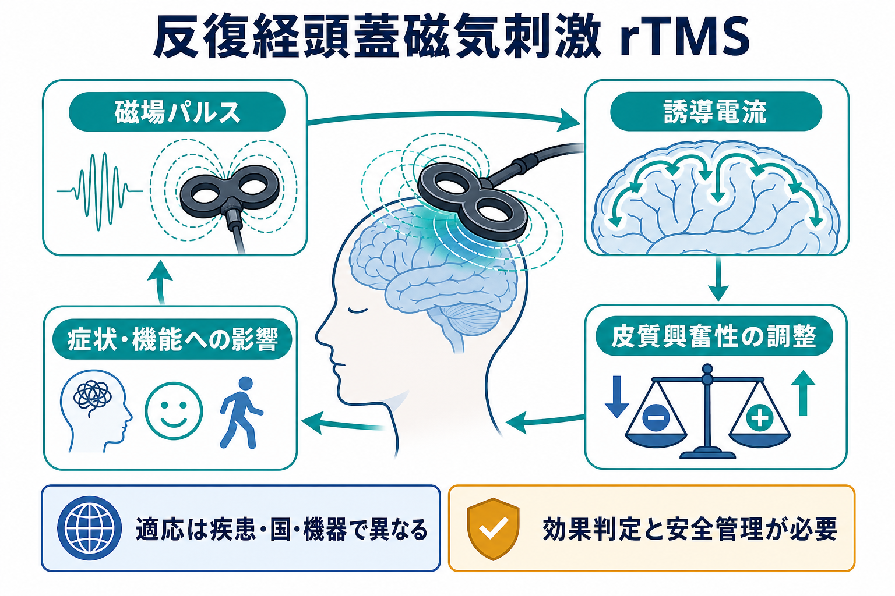
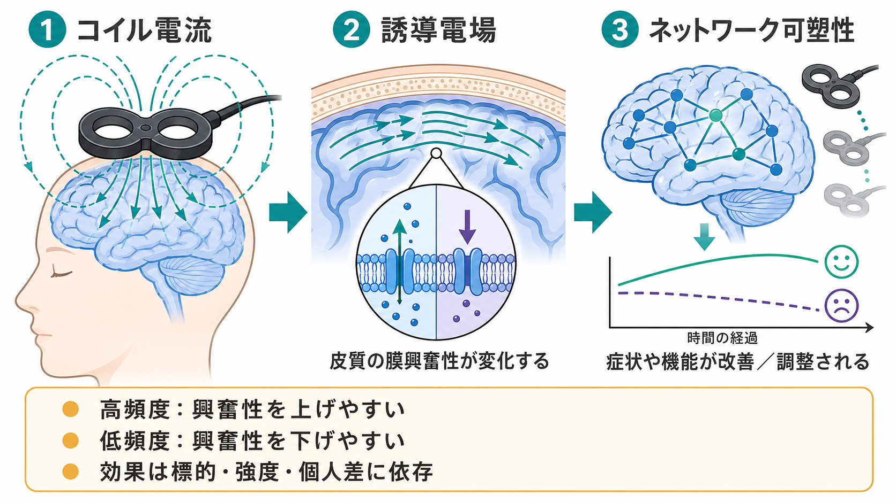
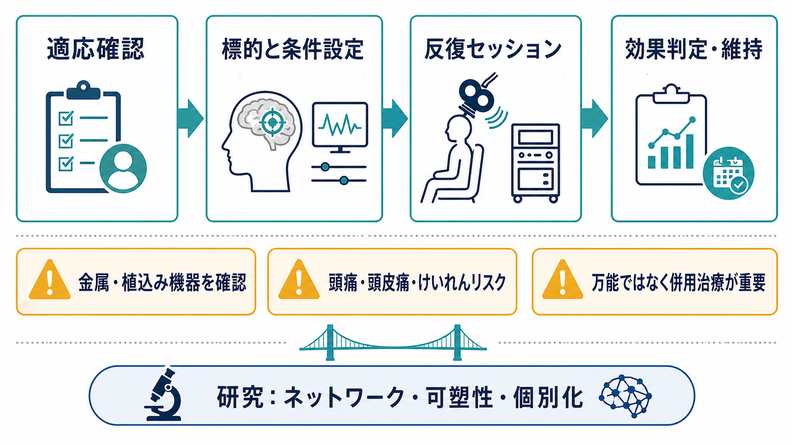

# 反復経頭蓋磁気刺激rTMSとは何か

## 要点

- 反復経頭蓋磁気刺激（repetitive transcranial magnetic stimulation: rTMS）は、頭皮上のコイルから短い磁場パルスを反復して与え、大脳皮質に誘導電流を生じさせる非侵襲的な神経調節法である [1], [2]。
- うつ病では、左背外側前頭前野などを標的に、週日連続で複数回行う治療プロトコルが代表的である [1], [4], [5]。
- 日本では、既存の抗うつ薬による十分な薬物療法で効果が不十分な成人のうつ病に対する医療機器として位置づけられており、適正使用指針に沿った実施が重視される [1]。
- 主要な副作用は頭痛、頭皮痛、不快感などが多い。けいれんは理論上もっとも重大なリスクだが、標準的条件と適切なスクリーニング下では低頻度とされる [3]。
- rTMSは「脳を直接よくする万能治療」ではなく、標的、刺激条件、疾患、併用治療、個人差に左右される治療選択肢である [2], [6], [8]。

## この記事で答える問い

1. rTMSはどのような物理原理で脳活動に影響するのか。
2. うつ病を中心に、どのような臨床的位置づけがあるのか。
3. 何が期待でき、何がまだ限界なのか。
4. 安全性と適正使用では何に注意するのか。

## まず結論

rTMSは、コイルに流れる急速な電流変化によって磁場を作り、その磁場が頭蓋骨を通過して皮質近傍に電場を誘導する技術である。薬剤のように全身へ作用するのではなく、標的皮質とそのネットワークに時間的に反復した刺激を与え、興奮性や可塑性を変化させることを狙う [2], [8]。

臨床では、治療抵抗性うつ病に対する選択肢としてもっとも定着している。特に左背外側前頭前野への高頻度刺激、右背外側前頭前野への低頻度刺激、シータバースト刺激など複数の方式が研究・実装されている。ただし、適応、保険上の扱い、承認機器、刺激プロトコルは国や機器によって異なる [1], [2], [4]。

## 背景

精神科・神経科の治療は、[[精神科薬物療法とは何か|薬物療法]]、[[認知行動療法CBTとは何か|認知行動療法]]などの[[心理療法とは何か|心理療法]]、生活支援、身体療法を組み合わせて考える。rTMSはこのうち「神経調節・身体療法」に属し、薬物を追加するのではなく、脳活動のパターンに外から働きかける治療法である。

うつ病では、前頭前野、帯状皮質、扁桃体、線条体などを含む気分調整ネットワークの機能異常が研究されてきた。rTMSはその一部、特に背外側前頭前野を入口として、局所皮質だけでなく遠隔ネットワークの活動変化を期待する。ただし、うつ病の原因を単一の脳部位に還元するものではない [8]。

## 基本概念

### TMSとrTMS

TMSは、単発または短いパルスで大脳皮質を刺激する方法である。運動野に単発TMSを与えると、手指筋の運動誘発電位を測定できるため、神経生理検査や研究にも使われる。これに対しrTMSは、同じ刺激を一定の頻度と強度で反復し、刺激後にも続く興奮性変化を狙う [2], [3]。

### 高頻度と低頻度

一般に、運動皮質研究では高頻度rTMSは皮質興奮性を上げやすく、1Hz前後の低頻度rTMSは下げやすいと整理されることが多い。ただし、この対応は単純なスイッチではない。標的部位、刺激強度、列車時間、総パルス数、脳状態、薬剤、睡眠、個人差によって変わる [2], [8]。

### 標的と強度

うつ病治療では、左背外側前頭前野を標的とする高頻度刺激が代表的である。刺激強度は多くの場合、運動野で親指などの反応を誘発する運動閾値を基準に設定される。日本の適正使用指針でも、機器ごとの添付文書と指針に基づき、標的、刺激強度、施設・実施者基準、安全確認を整えることが重視される [1]。

## 仕組み

rTMSの仕組みは、物理、神経生理、ネットワーク、臨床反応の4層で考えると整理しやすい。

| 層 | 何が起きるか | 注意点 |
|---|---|---|
| 物理 | コイル電流が変動磁場を作る | 頭蓋骨を切開しないが、磁場・電場の分布はコイル形状や位置に依存する |
| 神経生理 | 皮質に誘導電場が生じ、軸索や介在ニューロンの活動が変化する | 「脳全体を均一に刺激する」わけではない |
| 可塑性 | 反復刺激により、興奮性やシナプス効率に持続的変化が生じうる | LTP/LTD様変化として説明されるが、臨床効果の機序は完全には確定していない |
| ネットワーク | 標的皮質を介して気分・認知・疼痛などの回路へ影響する | 症状改善は局所刺激だけでなくネットワーク状態に左右される |

このため、rTMSの説明では「磁気で脳を活性化する」とだけ言うと不正確である。実際には、磁場が電場を誘導し、その電場が皮質回路の興奮性を変え、反復によって可塑性を生じさせ、臨床的には症状評価尺度や機能評価で効果を判定する、という段階的な理解が必要である [2], [3], [8]。

## 図解

臨床運用としては、次の流れを押さえるとよい。

1. 適応を確認する。
2. 金属、植込み機器、けいれん既往、薬剤、身体疾患などを確認する。
3. 標的部位、刺激条件、治療回数を設定する。
4. 複数回のセッションを実施する。
5. 症状評価、副作用、機能改善、再燃予防を継続的に評価する。

## 臨床・研究との接続

### うつ病における位置づけ

うつ病に対するrTMSは、薬物療法で十分な改善が得られない場合の選択肢として研究されてきた。NIMHが支援した多施設ランダム化試験では、左前頭前野への日々のrTMSが偽刺激より高い寛解率を示した [5]。Clinical TMS Societyのコンセンサスレビューも、成人の大うつ病性障害に対する急性期治療として、反復的な左前頭前野TMSの有効性と安全性を支持している [4]。

日本では、成人のうつ病に対するrTMSは、既存の抗うつ薬による十分な薬物療法で効果が不十分な場合を中心に扱われる。したがって、[[抗うつ薬とは何か|抗うつ薬]]や[[心理療法と薬物療法はどう組み合わせるのか|心理療法と薬物療法の組み合わせ]]を置き換える単独万能治療ではなく、治療歴、重症度、緊急性、本人の希望、安全性をふまえて位置づける [1]。

### うつ病以外の応用

国際的には、強迫症、片頭痛、疼痛、幻聴、脳卒中後リハビリテーションなど、多様な領域で研究・承認・臨床利用が進んでいる。ただし、エビデンスの強さは疾患ごとに大きく異なる。Lefaucheurらのエビデンスベースド・ガイドラインは、疾患、標的、刺激条件ごとに推奨度を分けており、rTMSという技術名だけで一括して有効と判断しないことを促している [2]。

米国FDAは、2008年に大うつ病、2013年に一部の片頭痛関連疼痛、2018年に強迫症に対するTMS機器のマーケティングを認めたと説明している [7]。これは「すべてのrTMSがすべての症状に承認されている」という意味ではなく、特定の機器、適応、使用条件に紐づいた規制上の判断である。

### 研究上の焦点

研究では、どの標的がどの症状ネットワークに効くのか、どの刺激条件がどの患者に合うのか、構造MRI・機能結合・脳波・行動指標を使って個別化できるのかが重要な論点である。rTMSの効果は「局所を刺激すれば終わり」ではなく、脳ネットワークの状態依存的な変化として理解する必要がある [8]。

## 安全性と限界

### 主な副作用

よく報告される副作用は、頭痛、頭皮痛、刺激部位の不快感、顔面や顎の違和感、音刺激による不快感などである。安全性ガイドラインでは、植込み機器、頭頸部周辺の金属、けいれんリスク、薬剤、妊娠、研究プロトコルの逸脱などを系統的に確認することが推奨される [3]。

けいれんはTMSの重大な有害事象として扱われるが、標準的プロトコル、焦点性コイル、適切なスクリーニングを用いる場合にはリスクは低いとされる [3]。ただし、低頻度だから常に安全、高頻度だから常に危険、という単純な判断はできない。

### ECTとの違い

rTMSは、[[MOC｜臨床実践・治療|臨床実践・治療]]のなかでは身体療法に含まれるが、電気けいれん療法（ECT）とは異なる。rTMSは通常、麻酔や人工的な全般発作を必要としない。一方で、重症・精神病性・緊急性の高いうつ病ではECTのほうが適切に検討される場面もある。日本の適正使用指針でも、rTMSの抗うつ効果はECTに劣ることが示されていると整理されている [1]。

## よくある誤解

### 「磁気なので副作用はない」

副作用が比較的軽いことが多いとしても、医療機器による脳刺激である。金属・植込み機器・けいれんリスク・聴覚保護・薬剤・実施体制の確認が必要である [3]。

### 「一度受ければすぐ治る」

うつ病治療では、日々のセッションを数週間反復するプロトコルが一般的である。反応には個人差があり、反応しない人もいる。NICEは短期有効性の根拠は一定ある一方、臨床反応は可変的であり、利益が得られない可能性も説明すべきだとしている [6]。

### 「刺激部位だけがよくなる」

rTMSは局所皮質を入口にするが、臨床症状はネットワーク単位で変化する。したがって、背外側前頭前野、帯状皮質、辺縁系、認知制御、報酬、情動調整の関係を含めて考える必要がある [8]。

### 「薬物療法や心理療法は不要になる」

rTMSは、[[精神科薬物療法とは何か|薬物療法]]や心理療法を必ず不要にするものではない。むしろ治療抵抗性、忍容性、併存症、再発予防、生活機能を含め、複数の治療をどう組み合わせるかが重要である [1], [4]。

## 関連ノート

- [[MOC｜臨床実践・治療]]
- [[MOC｜脳・神経科学]]
- [[精神科薬物療法とは何か]]
- [[抗うつ薬とは何か]]
- [[認知行動療法CBTとは何か]]
- [[心理療法と薬物療法はどう組み合わせるのか]]

### 関連ノート候補

- 電気けいれん療法ECTとは何か
- 治療抵抗性うつ病とは何か
- 背外側前頭前野とは何か
- 神経調節療法とは何か
- 強迫症に対するニューロモデュレーション

### MOC更新候補

- `content/00_MOC/MOC｜臨床実践・治療.md` の「神経調節・身体療法」項目に本記事を追加する。
- `content/00_MOC/MOC｜脳・神経科学.md` から非侵襲的脳刺激の入口として参照する。

## 理解チェック

1. rTMSで頭蓋内に直接流しているのは、コイル電流そのものか、誘導された電場か。
2. 高頻度刺激と低頻度刺激の効果を、なぜ単純な「上げる／下げる」だけで説明できないのか。
3. 日本でうつ病にrTMSを考えるとき、薬物療法歴と適正使用指針が重要になるのはなぜか。
4. rTMSがECTを完全に置き換える治療ではない理由は何か。
5. 研究で個別化が課題になるのは、どのような個人差があるためか。

## 未解決問題

- どの患者が反応しやすいかを、治療前の脳画像、脳波、症状プロファイルからどこまで予測できるか。
- 最適な標的部位を、標準位置ではなく個人のネットワーク結合に基づいて設定できるか。
- 急性期治療後の維持療法、再燃時再導入、薬物療法・心理療法との組み合わせをどう標準化するか。
- 加速プロトコルやシータバースト刺激を、通常プロトコルとどのように比較・選択するか。

## 参考文献

[1] 日本精神神経学会. 反復経頭蓋磁気刺激（rTMS）適正使用指針. 令和6年4月（改訂）版、ページ更新 2026-01-27. https://www.jspn.or.jp/modules/advocacy/index.php?content_id=34

[2] Lefaucheur, J.-P., Aleman, A., Baeken, C., et al. (2020). Evidence-based guidelines on the therapeutic use of repetitive transcranial magnetic stimulation (rTMS): An update (2014-2018). *Clinical Neurophysiology*, 131(2), 474-528. https://doi.org/10.1016/j.clinph.2019.11.002

[3] Rossi, S., Antal, A., Bestmann, S., et al. (2021). Safety and recommendations for TMS use in healthy subjects and patient populations, with updates on training, ethical and regulatory issues: Expert Guidelines. *Clinical Neurophysiology*, 132(1), 269-306. https://doi.org/10.1016/j.clinph.2020.10.003

[4] Perera, T., George, M. S., Grammer, G., et al. (2016). The Clinical TMS Society Consensus Review and Treatment Recommendations for TMS Therapy for Major Depressive Disorder. *Brain Stimulation*, 9(3), 336-346. https://doi.org/10.1016/j.brs.2016.03.010

[5] George, M. S., Lisanby, S. H., Avery, D., et al. (2010). Daily left prefrontal transcranial magnetic stimulation therapy for major depressive disorder: A sham-controlled randomized trial. *Archives of General Psychiatry*, 67(5), 507-516. https://doi.org/10.1001/archgenpsychiatry.2010.46

[6] National Institute for Health and Care Excellence. (2015). Repetitive transcranial magnetic stimulation for depression. NICE HealthTech guidance HTG396 / IPG542. https://www.nice.org.uk/guidance/htg396

[7] U.S. Food and Drug Administration. (2018). FDA permits marketing of transcranial magnetic stimulation for treatment of obsessive compulsive disorder. https://www.fda.gov/news-events/press-announcements/fda-permits-marketing-transcranial-magnetic-stimulation-treatment-obsessive-compulsive-disorder

[8] Ridding, M. C., & Rothwell, J. C. (2007). Is there a future for therapeutic use of transcranial magnetic stimulation? *Nature Reviews Neuroscience*, 8, 559-567. https://doi.org/10.1038/nrn2169
