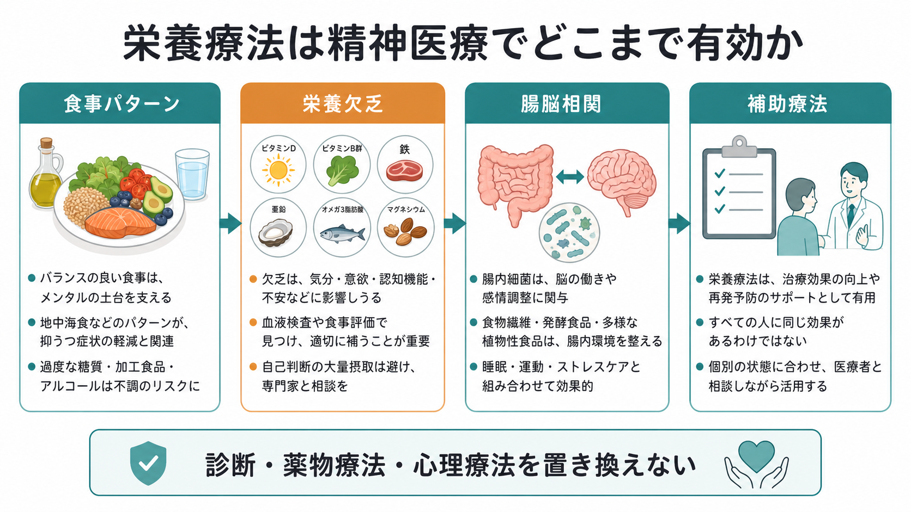
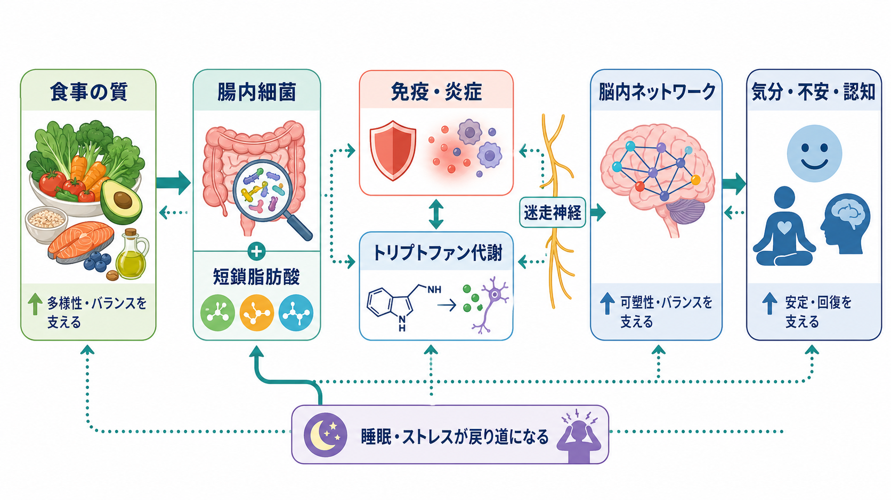
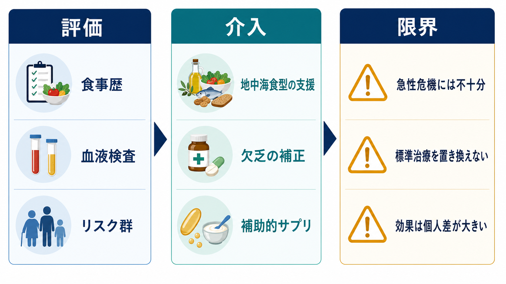

# 栄養療法は精神医療でどこまで有効か

## 要点

- 栄養療法は、[[うつ病とは何か]]や不安症状に対して一定の補助的効果が示されているが、単独で診断・薬物療法・心理療法を置き換えるものではない。
- 介入の中心は、特定サプリを大量に足すことよりも、食事パターン、欠乏の評価、睡眠・運動・身体疾患との統合的な調整である。
- 効果が比較的期待しやすいのは、食事の質が低い、栄養欠乏リスクがある、身体合併症がある、慢性炎症や代謝異常が疑われるケースである。
- 腸脳相関は重要な研究領域だが、現時点では「腸内細菌を整えれば精神疾患が治る」と単純化できない。

## この記事で答える問い

栄養療法は、精神医療の中でどこまで有効なのか。ここでは、食事パターン、ビタミン・ミネラル欠乏、脂肪酸、腸内細菌、炎症、トリプトファン代謝を整理し、臨床での使いどころと限界を分けて考える。

## まず結論

栄養療法は「治療の土台を整える介入」である。特に抑うつ症状では、食事改善介入のメタ解析で小さいが有意な改善が報告され、SMILES試験のように管理栄養士による食事支援が大うつ病エピソードの症状改善に寄与したRCTもある[1][2]。ただし、効果量は研究デザイン、対象者、ベースラインの食事状態、身体疾患、支援の密度で変わる。したがって、精神科臨床では「標準治療に足す」「欠乏を見つけて補正する」「生活習慣と身体疾患を同時に見る」という使い方が妥当である。

## 背景

精神症状は脳だけで完結しない。睡眠、活動量、慢性炎症、腸管、内分泌、代謝疾患、薬物副作用、社会的ストレスが絡み合う。これは[[精神疾患と身体合併症はどう関係するのか]]や[[身体疾患に伴う抑うつ症状とは何か]]とも接続する視点である。

栄養療法への関心が高まった理由は二つある。第一に、食事パターンが炎症、酸化ストレス、腸内細菌、血糖変動、脂質代謝を通じて脳機能に影響しうること。第二に、ビタミンB12、葉酸、鉄、ビタミンD、亜鉛、マグネシウム、必須脂肪酸などの不足が、疲労、認知機能低下、気分変調、不安、睡眠問題と重なりうることである[6][7][8]。

## 基本概念

### 食事パターン

精神医療で扱いやすいのは、単一栄養素よりも食事パターンである。野菜、果物、豆類、全粒穀物、魚、ナッツ、オリーブ油などを多く含み、超加工食品、過剰な糖質、加工肉、過量飲酒を減らす食事は、抑うつ症状の軽減と関連しやすい[1][2]。臨床では「完璧な地中海食」よりも、本人の文化・経済状況・調理能力に合わせた持続可能な改善が重要になる。

### 栄養欠乏

欠乏の補正は、栄養療法の中で最も臨床的に筋が通る部分である。ビタミンB12は中枢神経系の発達・髄鞘化・機能、赤血球形成、DNA合成に関わり、欠乏では疲労、巨赤芽球性貧血、しびれ、認知変化などが起こりうる[6]。葉酸・B12は抑うつとの関連が研究されているが、短期投与で全員の抑うつが改善するというより、欠乏や高リスク群を評価して補正する発想が現実的である[7]。

ビタミンDについても、抑うつ患者を対象としたRCTメタ解析でプラセボより症状軽減が報告されているが、研究間のばらつきは大きい[8]。そのため「不足が疑われる人を測定し、過量投与を避けて補正する」ことが基本になる。

### 補助的サプリメント

ω3脂肪酸は、栄養精神医学の中で比較的研究が多い。ISNPRの実践ガイドラインは、大うつ病性障害に対する補助療法としてω3、特にEPA優位の製剤を検討しうると整理している[3]。ただし、製剤、用量、DHA/EPA比、併用薬、双極性障害の有無、出血リスク、消化器症状などを確認する必要がある。

## 仕組み

栄養療法が精神症状に影響しうる経路は、少なくとも五つに分けられる。

1. 神経伝達物質とメチル化: B12、葉酸、B6、鉄などは、モノアミン代謝、メチル化、ホモシステイン代謝に関わる。
2. 炎症と免疫: 食事パターンは慢性炎症、腸管バリア、脂質メディエーターに影響し、[[炎症仮説はうつ病をどう説明するのか]]と接続する。
3. 腸脳相関: 腸内細菌は短鎖脂肪酸、胆汁酸、トリプトファン代謝、迷走神経、免疫系を通じて脳機能を調節しうる[4]。
4. 代謝と血糖変動: 血糖変動、インスリン抵抗性、肥満、脂質異常は、疲労感、睡眠、炎症、自己効力感に影響する。
5. 行動活性化: 食事を整える行為そのものが、睡眠、買い物、調理、対人接触、日中活動のリズムを改善する場合がある。

## 図解

上の2枚は、栄養療法の全体像と、腸脳相関を中心にしたメカニズムを示している。臨床上は、下図のように「評価、介入、限界」を同時に扱うと過大評価を避けやすい。

## 臨床・研究との接続

臨床では、まず食事歴を短く聴く。朝食欠食、極端な糖質制限、過量飲酒、偏食、摂食障害、貧困、独居、調理困難、嚥下・消化管疾患、メトホルミンや胃酸分泌抑制薬の使用、妊娠・授乳、高齢、菜食主義などを確認する。必要に応じて血算、フェリチン、B12、葉酸、25(OH)D、甲状腺機能、HbA1c、肝腎機能を確認する。

抑うつでは、食事改善は[[抗うつ薬とは何か]]や心理療法と競合しない。むしろ、服薬、心理療法、睡眠、運動、社会的支援を続けるための基盤になる。自殺リスク、精神病症状、躁状態、重度の拒食・脱水、せん妄、急性中毒がある場合は、栄養指導よりも危機対応と標準治療が優先される。

腸内細菌への介入として、プロバイオティクス、プレバイオティクス、シンバイオティクスのRCTメタ解析では抑うつ・不安・睡眠への改善が報告されている一方、菌株、対象者、介入期間、研究品質のばらつきが大きい[5]。現時点では、発酵食品や食物繊維を含む食事の改善を土台にし、サプリは症例ごとに補助的に考えるのがよい。

## よくある誤解

**誤解1: 栄養で精神疾患は治せる。**  
一部の症状は改善しうるが、診断、薬物療法、心理療法、社会的支援を置き換える根拠はない。特に[[大うつ病性障害とは何か]]、双極性障害、精神病症状、重度の摂食障害では、標準治療の遅れが大きなリスクになる。

**誤解2: サプリを多く飲むほどよい。**  
不足の補正と過量摂取は別である。脂溶性ビタミン、鉄、亜鉛、セレンなどは過剰摂取や薬物相互作用に注意が必要で、[[精神科薬物療法とは何か]]と併せて確認する。

**誤解3: 腸内細菌がすべてを決める。**  
腸脳相関は双方向であり、睡眠、ストレス、食事、薬剤、感染、運動、社会環境が相互に影響する[4]。腸だけを標的にしても、生活全体や疾患特性を無視すれば効果は限られる。

## 関連ノート

- [[うつ病とは何か]]
- [[大うつ病性障害とは何か]]
- [[抗うつ薬とは何か]]
- [[精神科薬物療法とは何か]]
- [[炎症仮説はうつ病をどう説明するのか]]
- [[セロトニン仮説はうつ病をどこまで説明できるのか]]
- [[睡眠障害は脳機能にどのような影響を与えるのか]]
- [[精神疾患と身体合併症はどう関係するのか]]
- [[摂食障害は脳の報酬系や身体感覚とどう関わるのか]]

MOC更新候補: [[MOC｜臨床実践・治療]]、[[MOC｜精神医学]]、[[MOC｜神経科学と精神疾患]]

## 理解チェック

1. 栄養療法を標準治療の代替としてではなく、補助療法として位置づける理由は何か。
2. 抑うつ症状のある人で、B12、葉酸、鉄、ビタミンDなどを評価した方がよい状況には何があるか。
3. 腸脳相関を「腸内細菌が精神疾患を決める」と単純化してはいけない理由は何か。
4. サプリメント介入より先に確認すべき、食事歴・身体疾患・服薬・生活背景は何か。

## 未解決問題

- どの患者群が食事改善、ω3、ビタミンD、プロバイオティクスに最も反応しやすいのか。
- 腸内細菌叢の変化が、精神症状改善の原因なのか、随伴現象なのか。
- 食事介入の効果を、栄養素、生活リズム、対人支援、行動活性化からどう分解して評価するか。
- 日本の食文化、所得、独居、調理能力、摂食障害リスクを踏まえた現実的な介入モデルをどう作るか。

## 参考文献

[1] Firth, J., Marx, W., Dash, S., et al. (2019). The Effects of Dietary Improvement on Symptoms of Depression and Anxiety: A Meta-Analysis of Randomized Controlled Trials. *Psychosomatic Medicine*, 81(3), 265-280. https://doi.org/10.1097/PSY.0000000000000673

[2] Jacka, F. N., O'Neil, A., Opie, R., et al. (2017). A randomised controlled trial of dietary improvement for adults with major depression (the 'SMILES' trial). *BMC Medicine*, 15, 23. https://doi.org/10.1186/s12916-017-0791-y

[3] Guu, T.-W., Mischoulon, D., Sarris, J., et al. (2019). International Society for Nutritional Psychiatry Research Practice Guidelines for Omega-3 Fatty Acids in the Treatment of Major Depressive Disorder. *Psychotherapy and Psychosomatics*, 88(5), 263-273. https://doi.org/10.1159/000502652

[4] Morais, L. H., Schreiber, H. L. IV, & Mazmanian, S. K. (2021). The gut microbiota-brain axis in behaviour and brain disorders. *Nature Reviews Microbiology*, 19, 241-255. https://doi.org/10.1038/s41579-020-00460-0

[5] Zhang, J., Zhu, L., Meng, Q., Wang, Z., & Zhu, H. (2025). The efficacy of probiotics, prebiotics, and synbiotics on anxiety, depression, and sleep: a systematic review and meta-analysis of randomized controlled trials. *BMC Psychiatry*, 25, 1199. https://doi.org/10.1186/s12888-025-07644-z

[6] National Institutes of Health Office of Dietary Supplements. (2025). Vitamin B12: Fact Sheet for Health Professionals. https://ods.od.nih.gov/factsheets/VitaminB12-HealthProfessional/

[7] Almeida, O. P., Ford, A. H., & Flicker, L. (2015). Systematic review and meta-analysis of randomized placebo-controlled trials of folate and vitamin B12 for depression. *International Psychogeriatrics*, 27(5), 727-737. https://doi.org/10.1017/S1041610215000046

[8] Srifuengfung, M., Srifuengfung, S., Pummangura, C., Pattanaseri, K., Oon-Arom, A., & Srisurapanont, M. (2023). Efficacy and acceptability of vitamin D supplements for depressed patients: A systematic review and meta-analysis of randomized controlled trials. *Nutrition*, 108, 111968. https://doi.org/10.1016/j.nut.2022.111968
